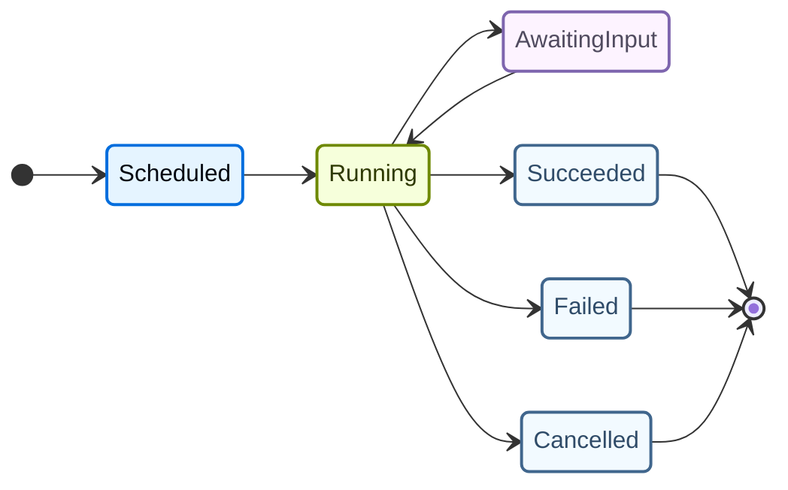

**异步子代理**在主代理继续运行时并行执行长期运行的任务。与阻塞主代理直至完成的同步子代理不同，异步子代理在后台运行。主代理可以在它们处于中间状态时检查状态、发出新指令甚至取消它们。

本页面涵盖异步子代理的配置、生命周期和最佳实践。

## 何时使用

异步子代理在以下情况下效果最好：

- **并行研究**：同时跨不同数据源并行研究。
- **监控任务**：长期运行的观察者代理不断监控状态。
- **数据处理流水线**：分阶段处理，多个代理作业并行运行。
- **与用户交互**：代理在等待长时间运行的任务时，可以立即响应用户。
- **路径探索**：用户代理提交实验性更改的补丁以便在沙箱中测试，同时继续主工作流。

```python
from deepagents import create_deep_agent

report_writer = {
    "name": "report-writer",
    "description": "复杂数据分析的异步报告生成。",
    "system_prompt": """你是一个报告撰写者。分析数据并创建一个结构良好的报告。
等待可用数据，然后综合你的发现。""",
    "tools": [read_file, save_file, web_search],
    "model": "openai:gpt-5.4",
}

agent = create_deep_agent(
    model="google_genai:gemini-3.5-flash",
    system_prompt="你是一个研究协调员。协调研究和报告撰写任务。",
    async_subagents=[report_writer],
)
```

## 关键概念

- **主代理**——顶级代理，创建和管理异步子代理。
- **异步子代理**——在主代理运行循环之外运行的专业代理。
- **任务**——主代理分配给子代理的特定作业单元。每个异步子代理可以有多个任务。

### 任务生命周期

异步子代理任务遵循可预测的生命周期：



该生命周期适用于每个任务。主代理可以为同一子代理创建多个任务——例如，`report-writer` 子代理同时处理三个独立的报告编写任务。

## 主代理工具

异步子代理向主代理暴露一组管理工具。每个工具名称以其各自的异步子代理名称为前缀。

| 工具 | 功能 | 前缀 |
| --- | --- | --- |
| `dispatch` | 创建一个在子代理中运行的新任务。 | `<name>_dispatch` |
| `cancel` | 取消正在运行的任务。 | `<name>_cancel` |
| `list_tasks` | 列出子代理的所有任务及其状态。 | `<name>_list_tasks` |
| `get_result` | 获取已完成任务的结果。 | `<name>_get_result` |
| `send_message` | 向正在运行的任务发送额外上下文。 | `<name>_send_message` |

### 主代理交互

```python
research_agent = {
    "name": "deep-researcher",
    "description": "异步深入研究。",
    "system_prompt": "你是一个出色的研究员。搜索网络，综合发现，等待指示。",
}

agent = create_deep_agent(
    model="google_genai:gemini-3.5-flash",
    system_prompt="你是一个研究协调员。并行管理多个研究任务。",
    async_subagents=[research_agent],
)
```

在此配置中，主代理可以使用以下方式管理 `deep-researcher` 子代理：

1. 使用 `deep-researcher_list_tasks` 查看正在运行的任务
2. 使用 `deep-researcher_dispatch` 开始新任务
3. 使用 `deep-researcher_send_message` 向运行中的任务发送额外上下文
4. 使用 `deep-researcher_cancel` 取消不再需要的任务
5. 使用 `deep-researcher_get_result` 获取结果

## 输入

每个异步子代理接受可选的配置参数：

| 参数 | 类型 | 默认值 | 描述 |
| --- | --- | --- | --- |
| `name` | `str` | 必填 | 子代理的唯一标识符。必须是字母数字并包含连字符或下划线（`[A-Za-z0-9_-]+`）。 |
| `description` | `str` | 必填 | 对主代理的描述。决定何时使用子代理。 |
| `system_prompt` | `str` | 必填 | 子代理的系统提示。 |
| `tools` | `list[Callable]` | `None` | 可供子代理使用的工具。 |
| `model` | `str` \| `BaseChatModel` | `None` | 如果为 `None`，使用主代理的模型。 |
| `middleware` | `list[Middleware]` | `None` | 要包含的额外中间件。 |
| `user_id` | `str` | `None` | 将子代理执行作用域限制为特定用户。 |
| `interrupt_before` | `list[str]` | `None` | 在调用这些工具前停止子代理。 |
| `interrupt_on` | `list[str]` | `None` | 在调用这些工具时停止子代理。 |
| `input_schema` | `type[BaseModel]` | `None` | 子代理任务的输入类型。当指定时，`dispatch` 工具会提示主代理提供与模式匹配的结构化输入。 |

## 输出

当异步子代理启动时，`dispatch` 工具返回一个包含 `task_id` 的对象。然后主代理可以使用 `get_result` 工具来轮询结果。

## 取消

可以使用 `cancel` 工具取消正在运行的任务。取消是友好处理的——子代理收到一个中断并有机会进行清理，而不是被强行终止。

```python
# 主代理可以通过调用取消工具来取消运行中的任务
deep-researcher_cancel(
    task_id="task_abc123",
    reason="不再需要",
)
```

取消任务会将任务状态转换为 `Cancelled`。已取消的任务无法恢复。

## 错误处理

异步子代理可能出于多种原因失败：

- **工具调用失败**：子代理的工具调用出错。
- **速率限制**：API 限流。
- **超时**：任务超过最大持续时间。
- **LLM 提供商错误**：模型提供商的服务问题。

当发生故障时，任务转换为 `Failed` 状态，主代理可以通过检查任务结果来访问错误详情。

## 与同步子代理的比较

| 方面 | 同步子代理 | 异步子代理 |
| --- | --- | --- |
| **执行** | 阻塞直到完成 | 在后台运行 |
| **并行性** | 一次一个 | 多个同时运行 |
| **主代理响应性** | 等待 | 在后台任务进行时继续 |
| **任务管理** | 单一调用（调用并忘记） | 多个工具：列出、分派、发送消息、取消、获取 |
| **用例** | 快速、顺序的任务 | 长时间运行、并行的任务 |
| **取消** | N/A（阻塞调用） | 支持（取消正在运行的任务） |
| **流式传输** | 通过父事件流 | 通过 `subagent_generations` |