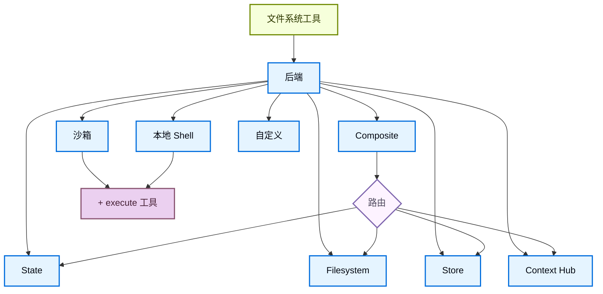

import BackendStatePy from '/snippets/code-samples/backend-state-py.mdx';
import BackendStateJs from '/snippets/code-samples/backend-state-js.mdx';
import BackendFilesystemPy from '/snippets/code-samples/backend-filesystem-py.mdx';
import BackendFilesystemJs from '/snippets/code-samples/backend-filesystem-js.mdx';
import BackendLocalShellPy from '/snippets/code-samples/backend-local-shell-py.mdx';
import BackendLocalShellJs from '/snippets/code-samples/backend-local-shell-js.mdx';
import BackendStorePy from '/snippets/code-samples/backend-store-py.mdx';
import BackendStoreJs from '/snippets/code-samples/backend-store-js.mdx';
import BackendContextHubPy from '/snippets/code-samples/backend-context-hub-py.mdx';
import BackendCompositePy from '/snippets/code-samples/backend-composite-py.mdx';
import BackendCompositeJs from '/snippets/code-samples/backend-composite-js.mdx';

Deep Agents 通过 `ls`、`read_file`、`write_file`、`edit_file`、`glob` 和 `grep` 等工具向代理暴露文件系统接口。这些工具通过可插拔的后端运行。`read_file` 工具在所有后端原生支持图片文件（`.png`、`.jpg`、`.jpeg`、`.gif`、`.webp`），以多模态内容块的形式返回。

:::js
`read_file` 工具在所有后端原生支持二进制文件（图片、PDF、音频、视频），返回带有类型化 `content` 和 `mimeType` 的 `ReadResult`。
:::

沙箱和 @[`LocalShellBackend`] 还提供 `execute` 工具。
本页说明如何：

- [选择后端](#指定后端)、
- [将不同路径路由到不同后端](#路由到不同后端)、
- [实现自己的虚拟文件系统](#使用虚拟文件系统)（例如 S3 或 Postgres）、
- [设置文件系统访问的权限](#权限)、
:::js
- [添加策略钩子](#添加策略钩子)、
[处理多模态和二进制文件](#多模态和二进制文件)、
:::
- [遵守后端协议](#协议参考)、
:::js
- 以及[将现有后端更新到 V2](#将现有后端更新到-v2)。
:::

## 快速入门

以下是一些预置的文件系统后端，你可以快速用于深度代理：

| 内置后端 | 描述 |
|---|---|
| [默认](#statebackend) | `agent = create_deep_agent(model="google_genai:gemini-3.5-flash")` <br></br>线程作用域。代理的默认文件系统后端存储在 `langgraph` 状态中。文件在线程内的多次轮次之间持久化（通过检查点），不在线程之间共享。 |
| [本地文件系统持久化](#filesystembackend-本地磁盘) | `agent = create_deep_agent(model="google_genai:gemini-3.5-flash", backend=FilesystemBackend(root_dir="/Users/nh/Desktop/"))` <br></br>这使深度代理可以访问你本地机器的文件系统。你可以指定代理可以访问的根目录。请注意，任何提供的 `root_dir` 必须是绝对路径。通常，将其包装在 [CompositeBackend](#compositebackend-路由器) 中，以将内部代理数据（卸载的工具结果、对话历史）与你的项目文件分开。 |
| [持久存储（LangGraph store）](#storebackend-langgraph-存储) | `agent = create_deep_agent(model="google_genai:gemini-3.5-flash", backend=StoreBackend())` <br></br>这使代理可以访问跨线程持久化的长期存储。非常适合存储适用于代理多次执行的长期记忆或指令。 |
| [Context Hub](#contexthubbackend) | `agent = create_deep_agent(model="google_genai:gemini-3.5-flash", backend=ContextHubBackend("my-agent"))` <br></br>将文件持久存储在 LangSmith Hub 仓库中，无需单独配置 LangGraph 存储。 |
| [沙箱](/zh/oss/deepagents/sandboxes) | `agent = create_deep_agent(model="google_genai:gemini-3.5-flash", backend=sandbox)` <br></br>在隔离环境中执行代码。沙箱提供文件系统工具以及用于运行 shell 命令的 `execute` 工具。可从 Modal、Daytona、Deno 或本地 VFS 中选择。 |
| [本地 shell](#localshellbackend-本地-shell) | `agent = create_deep_agent(model="google_genai:gemini-3.5-flash", backend=LocalShellBackend(root_dir=".", env={"PATH": "/usr/bin:/bin"}))` <br></br>直接在宿主机上执行文件系统和 shell 操作。无隔离——仅限受控开发环境使用。请参阅下面的[安全考量](#localshellbackend-本地-shell)。 |
| [Composite](#compositebackend-路由器) | 默认线程作用域，`/memories/` 跨线程持久化。Composite 后端具有最大的灵活性。你可以指定文件系统中的不同路由指向不同的后端。请参阅下面的 Composite 路由以获取可直接粘贴的示例。 |



## 内置后端

### StateBackend

:::python
<BackendStatePy />
:::

:::js
<BackendStateJs />
:::

**工作原理：**
- 将文件存储在当前线程的 LangGraph 代理状态中，通过 @[`StateBackend`] 实现。
- 通过检查点在同一线程的多次代理轮次之间持久化。文件不跨线程共享。

<Warning>
设计为在图内使用。在图运行之外调用后端方法（例如 `state_backend.upload_files(...)`）在图执行之前不会生效。
</Warning>

**最佳用途：**
- 代理写入中间结果的暂存区。
- 大型工具输出的自动逐出，代理可以随后分块读回。

请注意，此后端在监督代理和子代理之间共享，子代理写入的任何文件在子代理执行完成后仍将保留在 LangGraph 代理状态中，并且仍然对监督代理和其他子代理可用。

### FilesystemBackend（本地磁盘）

@[`FilesystemBackend`] 在可配置的根目录下读写真实文件。

<Warning>
此后端赋予代理直接的文件系统读写权限。请谨慎使用，仅在适当的环境中使用。

**适当的使用场景：**
- 本地开发 CLI（编码助手、开发工具）
- CI/CD 流水线（请参阅下面的安全考量）

**不适用的使用场景：**
- Web 服务器或 HTTP API——请改用 `StateBackend`、`StoreBackend` 或[沙箱后端](/zh/oss/deepagents/sandboxes)

**安全风险：**
- 代理可以读取任何可访问的文件，包括密钥（API 密钥、凭据、`.env` 文件）
- 结合网络工具，密钥可能通过 SSRF 攻击被窃取
- 文件修改是永久且不可逆的

**推荐的防护措施：**
1. 启用[人在环（HITL）中间件](/zh/oss/deepagents/human-in-the-loop)以审查敏感操作。
1. 将密钥排除在可访问的文件系统路径之外（尤其是在 CI/CD 中）。
1. 对于需要文件系统交互的生产环境，使用[沙箱后端](/zh/oss/deepagents/sandboxes)。
1. **始终**使用 `virtual_mode=True` 和 `root_dir` 以启用基于路径的访问限制（阻止根目录外部的 `..`、`~` 和绝对路径）。
   注意默认值（`virtual_mode=False`）即使设置了 `root_dir` 也不提供任何安全性。
</Warning>

:::python
<BackendFilesystemPy />
:::

:::js
<BackendFilesystemJs />
:::

**工作原理：**
- 在可配置的 `root_dir` 下读写真实文件。
- 可选择设置 `virtual_mode=True` 以将路径限定在 `root_dir` 下并进行规范化。
- 使用安全的路径解析，尽可能防止不安全的符号链接遍历，可使用 ripgrep 进行快速 `grep`。

**最佳用途：**
- 本地机器上的项目
- CI 沙箱
- 挂载的持久卷

<Tip>
**在大多数使用场景中，将 `FilesystemBackend` 包装在 `CompositeBackend` 中。** Deep Agents 会自动将内部数据写入后端，包括卸载的大型工具结果（在 `/large_tool_results/` 下）和对话历史（在 `/conversation_history/` 下）。当你单独使用 `FilesystemBackend` 时，这些内部文件会被写入 `root_dir` 下的真实磁盘，将代理产物与你的项目文件混在一起。

使用 `CompositeBackend` 将项目目录路由到 `FilesystemBackend`，同时将内部路径保持在临时的 `StateBackend` 存储中：

:::python
```python
from deepagents import create_deep_agent
from deepagents.backends import CompositeBackend, StateBackend, FilesystemBackend

agent = create_deep_agent(
    backend=CompositeBackend(
        default=StateBackend(),
        routes={
            "/workspace/": FilesystemBackend(root_dir="/path/to/project", virtual_mode=True),
        },
    )
)
```
:::

:::js
```typescript
import { createDeepAgent, CompositeBackend, FilesystemBackend, StateBackend } from "deepagents";

const agent = createDeepAgent({
  backend: new CompositeBackend(
    new StateBackend(),
    {
      "/workspace/": new FilesystemBackend({ rootDir: "/path/to/project", virtualMode: true }),
    },
  ),
});
```
:::

这样，代理在 `/workspace/` 下的读写操作会进入真实磁盘，而卸载的工具结果和其他内部数据则保留在临时状态中。更多路由模式请参阅[路由到不同后端](#路由到不同后端)。
</Tip>

### LocalShellBackend（本地 shell）

<Warning>
此后端赋予代理直接的文件系统读写权限**以及**在宿主机上不受限制的 shell 执行权限。请极其谨慎地使用，仅在适当的环境中使用。

**适当的使用场景：**
- 本地开发 CLI（编码助手、开发工具）
- 你信任代理代码的个人开发环境
- 具有适当密钥管理的 CI/CD 流水线

**不适用的使用场景：**
- 生产环境（如 Web 服务器、API、多租户系统）
- 处理不受信任的用户输入或执行不受信任的代码

**安全风险：**
- 代理可以以你的用户权限执行**任意 shell 命令**
- 代理可以读取任何可访问的文件，包括密钥（API 密钥、凭据、`.env` 文件）
- 密钥可能被泄露
- 文件修改和命令执行是**永久且不可逆的**
- 命令直接在宿主机系统上运行
- 命令可以消耗无限的 CPU、内存、磁盘

**推荐的防护措施：**
1. 启用[人在环（HITL）中间件](/zh/oss/deepagents/human-in-the-loop)以在执行前审查和批准操作。这是**强烈推荐的**。
2. 仅在专用开发环境中运行。切勿在共享或生产系统上使用。
3. 对于需要 shell 执行的生产环境，使用[沙箱后端](/zh/oss/deepagents/sandboxes)。

**注意：** 在启用 shell 访问的情况下，`virtual_mode=True` 不提供安全性，因为命令可以访问系统上的任何路径。
</Warning>

:::python
<BackendLocalShellPy />
:::

:::js
<BackendLocalShellJs />
:::

**工作原理：**
- 扩展了 `FilesystemBackend`，增加了用于在宿主机上运行 shell 命令的 `execute` 工具。
- 命令使用 `subprocess.run(shell=True)` 直接在机器上运行，无沙箱隔离。
- 支持 `timeout`（默认 120s）、`max_output_bytes`（默认 100,000）、`env` 和 `inherit_env` 用于环境变量。
- Shell 命令使用 `root_dir` 作为工作目录，但可以访问系统上的任何路径。

**最佳用途：**
- 本地编码助手和开发工具
- 在开发过程中快速迭代，当你信任代理时

### StoreBackend（LangGraph 存储）

:::python
<BackendStorePy />
:::

:::js
<BackendStoreJs />
:::

<Note>
    部署到 [LangSmith Deployment](/zh/langsmith/deployment) 时，省略 `store` 参数。平台会自动为你的代理配置存储。
</Note>

<Tip>
    `namespace` 参数控制数据隔离。对于多用户部署，始终设置[命名空间工厂](/zh/oss/deepagents/backends#命名空间工厂)以按用户或租户隔离数据。
</Tip>

**工作原理：**
- @[`StoreBackend`] 将文件存储在运行时提供的 LangGraph @[`BaseStore`] 中，实现跨线程的持久存储。

**最佳用途：**
- 当你已经使用已配置的 LangGraph 存储运行时（例如，Redis、Postgres 或 @[`BaseStore`] 背后的云实现）。
- 当你通过 [LangSmith Deployment](/zh/langsmith/deployment) 部署代理时（平台会自动为你的代理配置存储）。

#### 命名空间工厂

命名空间工厂控制 `StoreBackend` 读写数据的位置。它接收一个 LangGraph @[`Runtime`] 并返回一个用作存储命名空间的字符串元组。使用命名空间工厂可以在用户、租户或助手之间隔离数据。

在构造 `StoreBackend` 时将命名空间工厂传递给 `namespace` 参数：

```python
NamespaceFactory = Callable[[Runtime], tuple[str, ...]]
```

`Runtime` 提供：
- `rt.context` — 用户通过 LangGraph 的[上下文模式](https://langchain-ai.github.io/langgraph/concepts/runtime/)提供的上下文（例如 `user_id`）
:::python
- `rt.server_info` — 在 LangGraph Server 上运行时的服务器特定元数据（助手 ID、图 ID、认证用户）
- `rt.execution_info` — 执行身份信息（线程 ID、运行 ID、检查点 ID）
:::
:::js
- `rt.serverInfo` — 在 LangGraph Server 上运行时的服务器特定元数据（助手 ID、图 ID、认证用户）
- `rt.executionInfo` — 执行身份信息（线程 ID、运行 ID、检查点 ID）
:::

:::python
<Note>
`Runtime` 参数在 `deepagents>=0.5.2` 中可用。更早的 0.5.x 版本传递的是 `BackendContext`——请参阅下面的[从 `BackendContext` 迁移](#从-backendcontext-迁移)。`rt.server_info` 和 `rt.execution_info` 需要 `deepagents>=0.5.0`。
</Note>
:::

:::js
<Note>
`Runtime` 参数在 `deepagents>=1.9.1` 中可用。更早的 1.9.x 版本传递的是 `BackendContext`——请参阅下面的[从 `BackendContext` 迁移](#从-backendcontext-迁移)。`rt.serverInfo` 和 `rt.executionInfo` 需要 `deepagents>=1.9.0`。
</Note>
:::

**常见的命名空间模式：**

:::python
```python
from deepagents.backends import StoreBackend

# 每个用户：每个用户获得独立的隔离存储
backend = StoreBackend(
    namespace=lambda rt: (rt.server_info.user.identity,),  # [!code highlight]
)

# 每个助手：同一助手的所有用户共享存储
backend = StoreBackend(
    namespace=lambda rt: (
        rt.server_info.assistant_id,  # [!code highlight]
    ),
)

# 每个线程：存储限定在单个对话范围内
backend = StoreBackend(
    namespace=lambda rt: (
        rt.execution_info.thread_id,  # [!code highlight]
    ),
)
```
:::

:::js
```typescript
import { StoreBackend } from "deepagents";

// 每个用户：每个用户获得独立的隔离存储
const backend = new StoreBackend({
  namespace: (rt) => [rt.serverInfo.user.identity],  // [!code highlight]
});

// 每个助手：同一助手的所有用户共享存储
const backend = new StoreBackend({
  namespace: (rt) => [rt.serverInfo.assistantId],  // [!code highlight]
});

// 每个线程：存储限定在单个对话范围内
const backend = new StoreBackend({
  namespace: (rt) => [rt.executionInfo.threadId],  // [!code highlight]
});
```
:::

你可以组合多个组件以创建更具体的作用域——例如，`(user_id, thread_id)` 实现每个用户每次对话的隔离，或添加后缀如 `"filesystem"` 以在相同作用域使用多个存储命名空间时消除歧义。

命名空间组件只能包含字母数字字符、连字符、下划线、点、`@`、加号、冒号和波浪号。通配符（`*`、`?`）将被拒绝，以防止 glob 注入。

:::python
<Warning>
    `namespace` 参数在 v0.5.0 中将是**必需的**。在新代码中始终显式设置它。
</Warning>
:::
:::js
<Warning>
    `namespace` 参数在 v1.9.0 中将是**必需的**。在新代码中始终显式设置它。
</Warning>
:::

<Note>
    当未提供命名空间工厂时，旧版默认使用 LangGraph 配置元数据中的 `assistant_id`。这意味着同一[助手](/zh/langsmith/assistants)的所有用户共享相同的存储。对于多用户的[生产部署](/zh/oss/deepagents/going-to-production)，始终提供命名空间工厂。
</Note>

### ContextHubBackend

:::python
<BackendContextHubPy />
:::

`ContextHubBackend` 将文件存储在 LangSmith Hub 仓库中。使用 `owner/name` 或 `name` 格式的仓库标识符构造。

<Note>
使用 `ContextHubBackend` 前请设置 `LANGSMITH_API_KEY`。
</Note>

**工作原理：**
- 首次使用时延迟拉取 Hub 仓库树，然后从内存缓存中提供读取。
- 将写入和编辑持久化为 Hub 提交，并在成功提交后更新缓存。
- 使用乐观父提交写入（`parent_commit`）：每次推送都针对最新的已知提交哈希。

**行为和限制：**
- 如果仓库不存在，首次拉取视为空；第一次成功写入可以创建仓库。
- 如果其他写入者先推进了仓库，你的陈旧父提交写入可能会失败。冲突时重新拉取并重试。
- `upload_files()` 接受 UTF-8 文本。非 UTF-8 文件会按路径被拒绝，标记为 `invalid_path`。

**最佳用途：**
- LangSmith 原生的持久文件系统持久化，无需单独连接 LangGraph `BaseStore`。
- 受益于文件系统更改的 Hub 提交历史的工作流。

### CompositeBackend（路由器）

:::python
<BackendCompositePy />
:::

:::js
<BackendCompositeJs />
:::

**工作原理：**
- @[`CompositeBackend`] 根据路径前缀将文件操作路由到不同的后端。
- 在列表和搜索结果中保留原始路径前缀。

**最佳用途：**
- 当你希望为代理同时提供线程作用域和跨线程存储时，`CompositeBackend` 允许你同时提供 `StateBackend` 和 `StoreBackend`。
- 当你拥有多个信息来源，希望作为单一文件系统提供给代理时。
    - 例如，你在一个存储中的 `/memories/` 下有长期记忆，并且你还有一个自定义后端，在 `/docs/` 下提供文档访问。

## 指定后端

:::python
- 将后端实例传递给 `create_deep_agent(model=..., backend=...)`。文件系统中间件将其用于所有工具。
- 后端必须实现 `BackendProtocol`（例如 `StateBackend()`、`FilesystemBackend(root_dir=".")`、`StoreBackend()`、`ContextHubBackend("my-agent")`）。
- 如果省略，默认值为 `StateBackend()`。
:::

:::js
- 将后端实例传递给 `createDeepAgent({ backend: ... })`。文件系统中间件将其用于所有工具。
- 后端必须实现 `AnyBackendProtocol`（`BackendProtocolV1` 或 `BackendProtocolV2`）——例如 `new StateBackend()`、`new FilesystemBackend({ rootDir: "." })`、`new StoreBackend()`。
- 如果省略，默认值为 `new StateBackend()`。

<Note>
在 1.9.0 版本之前，只支持 `BackendProtocol`，现在称为 `BackendProtocolV1`。V1 后端在运行时通过 `adaptBackendProtocol()` 自动适配为 V2。无需更改代码即可继续使用现有的 V1 后端。要更新到 V2，请参阅[将现有后端更新到 V2](#将现有后端更新到-v2)。
</Note>
:::


## 路由到不同后端

将命名空间的不同部分路由到不同的后端。通常用于跨线程持久化 `/memories/*` 并保持其他所有内容为线程作用域。

:::python
```python
from deepagents import create_deep_agent
from deepagents.backends import CompositeBackend, StateBackend, FilesystemBackend

agent = create_deep_agent(
    model="google_genai:gemini-3.5-flash",
    backend=CompositeBackend(
        default=StateBackend(),
        routes={
            "/memories/": FilesystemBackend(root_dir="/deepagents/myagent", virtual_mode=True),
        },
    )
)
```
:::

:::js
```typescript
import { createDeepAgent, CompositeBackend, FilesystemBackend, StateBackend } from "deepagents";

const agent = createDeepAgent({
  backend: new CompositeBackend(
    new StateBackend(),
    {
      "/memories/": new FilesystemBackend({ rootDir: "/deepagents/myagent", virtualMode: true }),
    },
  ),
});
```
:::

行为：
- `/workspace/plan.md` → `StateBackend`（线程作用域）
- `/memories/agent.md` → `FilesystemBackend` 在 `/deepagents/myagent` 下
- `ls`、`glob`、`grep` 聚合结果并显示原始路径前缀。

注意：
- 较长的前缀优先（例如，路由 `"/memories/projects/"` 可以覆盖 `"/memories/"`）。
- 对于 StoreBackend 路由，确保通过 `create_deep_agent(model=..., store=...)` 提供了存储，或由平台配置。
- Deep Agents 将内部数据（卸载的工具结果、对话历史）写入默认后端。使用 `StateBackend` 作为默认值可使这些产物保持临时性，避免写入磁盘或持久存储。请参阅 [FilesystemBackend 提示](#filesystembackend-本地磁盘)获取完整示例。

## 使用虚拟文件系统

构建自定义后端，将远程或数据库文件系统（例如 S3 或 Postgres）投射到工具命名空间中。

设计指导原则：

- 路径是绝对路径（`/x/y.txt`）。决定如何将它们映射到你的存储键/行。
- 高效实现 `ls` 和 `glob`（尽可能使用服务器端过滤，否则使用本地过滤）。
- 对于外部持久化（S3、Postgres 等），在写入/编辑结果中返回 `files_update=None`（Python）或省略 `filesUpdate`（JS）——只有内存状态后端需要返回文件更新字典。

:::python
- 使用 `ls` 和 `glob` 作为方法名称。
- 返回带有 `error` 字段的结构化结果类型，用于处理缺失文件或无效模式（不要抛出异常）。
:::

:::js
- 使用 `ls` 和 `glob` 作为方法名称。
- 所有查询方法（`ls`、`read`、`readRaw`、`grep`、`glob`）必须返回带有可选 `error` 字段的结构化 Result 对象（例如 `LsResult`、`ReadResult`）。
- 在 `read()` 中通过返回带有相应 `mimeType` 的 `Uint8Array` 内容来支持二进制文件。
:::

S3 样式大纲：

:::python
```python
from deepagents.backends.protocol import (
    BackendProtocol, WriteResult, EditResult, LsResult, ReadResult, GrepResult, GlobResult,
)

class S3Backend(BackendProtocol):
    def __init__(self, bucket: str, prefix: str = ""):
        self.bucket = bucket
        self.prefix = prefix.rstrip("/")

    def _key(self, path: str) -> str:
        return f"{self.prefix}{path}"

    def ls(self, path: str) -> LsResult:
        # 列出 _key(path) 下的对象；构建 FileInfo 条目 (path, size, modified_at)
        ...

    def read(self, file_path: str, offset: int = 0, limit: int = 2000) -> ReadResult:
        # 获取对象；返回 ReadResult(file_data=...) 或 ReadResult(error=...)
        ...

    def grep(self, pattern: str, path: str | None = None, glob: str | None = None) -> GrepResult:
        # 可选地在服务器端过滤；否则列出并扫描内容
        ...

    def glob(self, pattern: str, path: str = "/") -> GlobResult:
        # 相对于路径应用 glob 匹配键
        ...

    def write(self, file_path: str, content: str) -> WriteResult:
        # 强制执行仅创建语义；返回 WriteResult(path=file_path, files_update=None)
        ...

    def edit(self, file_path: str, old_string: str, new_string: str, replace_all: bool = False) -> EditResult:
        # 读取 → 替换（遵循唯一性 vs replace_all）→ 写入 → 返回出现次数
        ...
```
:::

:::js
```typescript
import {
  type BackendProtocolV2,
  type LsResult,
  type ReadResult,
  type ReadRawResult,
  type GrepResult,
  type GlobResult,
  type WriteResult,
  type EditResult,
} from "deepagents";

class S3Backend implements BackendProtocolV2 {
  constructor(private bucket: string, private prefix: string = "") {
    this.prefix = prefix.replace(/\/$/, "");
  }

  private key(path: string): string {
    return `${this.prefix}${path}`;
  }

  async ls(path: string): Promise<LsResult> {
    // 列出 key(path) 下的对象；返回 { files: [...] }
    ...
  }

  async read(filePath: string, offset?: number, limit?: number): Promise<ReadResult> {
    // 获取对象；返回 { content, mimeType }
    // 对于二进制文件，返回 Uint8Array 内容
    ...
  }

  async readRaw(filePath: string): Promise<ReadRawResult> {
    // 返回 { data: FileData }
    ...
  }

  async grep(pattern: string, path?: string | null, glob?: string | null): Promise<GrepResult> {
    // 搜索文本文件；跳过二进制文件；返回 { matches: [...] }
    ...
  }

  async glob(pattern: string, path = "/"): Promise<GlobResult> {
    // 相对于路径应用 glob；返回 { files: [...] }
    ...
  }

  async write(filePath: string, content: string): Promise<WriteResult> {
    // 强制执行仅创建语义；返回 { path: filePath, filesUpdate: null }
    ...
  }

  async edit(filePath: string, oldString: string, newString: string, replaceAll?: boolean): Promise<EditResult> {
    // 读取 → 替换 → 写入 → 返回 { path, occurrences }
    ...
  }
}
```
:::

Postgres 样式大纲：

:::python
- 表 `files(path text primary key, content text, created_at timestamptz, modified_at timestamptz)`
- 将工具操作映射到 SQL：
  - `ls` 使用 `WHERE path LIKE $1 || '%'`
  - `glob` 在 SQL 中过滤或获取后在 Python 中应用 glob
  - `grep` 可以按扩展名或最后修改时间获取候选行，然后扫描行内容
:::

:::js
- 表 `files(path text primary key, content text, mime_type text, created_at timestamptz, modified_at timestamptz)`
- 将工具操作映射到 SQL：
  - `ls` 使用 `WHERE path LIKE $1 || '%'` → 返回 `LsResult`
  - `glob` 在 SQL 中过滤或获取后本地应用 glob → 返回 `GlobResult`
  - `grep` 可以按扩展名或最后修改时间获取候选行，然后扫描行内容（跳过 `mime_type` 为二进制的行）→ 返回 `GrepResult`
:::

## 权限

使用[权限](/zh/oss/deepagents/permissions)以声明方式控制代理可以读取或写入哪些文件和目录。权限适用于内置文件系统工具，并在调用后端之前进行评估。

:::python
```python
from deepagents import create_deep_agent, FilesystemPermission

agent = create_deep_agent(
    model="google_genai:gemini-3.5-flash",
    backend=CompositeBackend(
        default=StateBackend(),
        routes={
            "/memories/": StoreBackend(
                namespace=lambda rt: (rt.server_info.user.identity,),
            ),
            "/policies/": StoreBackend(
                namespace=lambda rt: (rt.context.org_id,),
            ),
        },
    ),
    permissions=[
        FilesystemPermission(
            operations=["write"],
            paths=["/policies/**"],
            mode="deny",
        ),
    ],
)
```
:::

有关包括规则排序、子代理权限和 Composite 后端交互在内的完整选项集，请参阅[权限指南](/zh/oss/deepagents/permissions)。

## 添加策略钩子

对于超出基于路径的允许/拒绝规则的自定义验证逻辑（速率限制、审计日志、内容检查），可以通过继承或包装后端来实施企业规则。

在选定前缀下阻止写入/编辑（继承方式）：

:::python
```python
from deepagents.backends.filesystem import FilesystemBackend
from deepagents.backends.protocol import WriteResult, EditResult

class GuardedBackend(FilesystemBackend):
    def __init__(self, *, deny_prefixes: list[str], **kwargs):
        super().__init__(**kwargs)
        self.deny_prefixes = [p if p.endswith("/") else p + "/" for p in deny_prefixes]

    def write(self, file_path: str, content: str) -> WriteResult:
        if any(file_path.startswith(p) for p in self.deny_prefixes):
            return WriteResult(error=f"不允许在 {file_path} 下写入")
        return super().write(file_path, content)

    def edit(self, file_path: str, old_string: str, new_string: str, replace_all: bool = False) -> EditResult:
        if any(file_path.startswith(p) for p in self.deny_prefixes):
            return EditResult(error=f"不允许在 {file_path} 下编辑")
        return super().edit(file_path, old_string, new_string, replace_all)
```
:::

:::js
```typescript
import { FilesystemBackend, type WriteResult, type EditResult } from "deepagents";

class GuardedBackend extends FilesystemBackend {
  private denyPrefixes: string[];

  constructor({ denyPrefixes, ...options }: { denyPrefixes: string[]; rootDir?: string }) {
    super(options);
    this.denyPrefixes = denyPrefixes.map(p => p.endsWith("/") ? p : p + "/");
  }

  async write(filePath: string, content: string): Promise<WriteResult> {
    if (this.denyPrefixes.some(p => filePath.startsWith(p))) {
      return { error: `不允许在 ${filePath} 下写入` };
    }
    return super.write(filePath, content);
  }

  async edit(filePath: string, oldString: string, newString: string, replaceAll = false): Promise<EditResult> {
    if (this.denyPrefixes.some(p => filePath.startsWith(p))) {
      return { error: `不允许在 ${filePath} 下编辑` };
    }
    return super.edit(filePath, oldString, newString, replaceAll);
  }
}
```
:::

通用包装器（适用于任何后端）：

:::python
```python
from deepagents.backends.protocol import (
    BackendProtocol, WriteResult, EditResult, LsResult, ReadResult, GrepResult, GlobResult,
)

class PolicyWrapper(BackendProtocol):
    def __init__(self, inner: BackendProtocol, deny_prefixes: list[str] | None = None):
        self.inner = inner
        self.deny_prefixes = [p if p.endswith("/") else p + "/" for p in (deny_prefixes or [])]

    def _deny(self, path: str) -> bool:
        return any(path.startswith(p) for p in self.deny_prefixes)

    def ls(self, path: str) -> LsResult:
        return self.inner.ls(path)

    def read(self, file_path: str, offset: int = 0, limit: int = 2000) -> ReadResult:
        return self.inner.read(file_path, offset=offset, limit=limit)
    def grep(self, pattern: str, path: str | None = None, glob: str | None = None) -> GrepResult:
        return self.inner.grep(pattern, path, glob)
    def glob(self, pattern: str, path: str = "/") -> GlobResult:
        return self.inner.glob(pattern, path)
    def write(self, file_path: str, content: str) -> WriteResult:
        if self._deny(file_path):
            return WriteResult(error=f"不允许在 {file_path} 下写入")
        return self.inner.write(file_path, content)
    def edit(self, file_path: str, old_string: str, new_string: str, replace_all: bool = False) -> EditResult:
        if self._deny(file_path):
            return EditResult(error=f"不允许在 {file_path} 下编辑")
        return self.inner.edit(file_path, old_string, new_string, replace_all)
```
:::

:::js
```typescript
import {
  type BackendProtocolV2,
  type LsResult,
  type ReadResult,
  type ReadRawResult,
  type GrepResult,
  type GlobResult,
  type WriteResult,
  type EditResult,
} from "deepagents";

class PolicyWrapper implements BackendProtocolV2 {
  private denyPrefixes: string[];

  constructor(private inner: BackendProtocolV2, denyPrefixes: string[] = []) {
    this.denyPrefixes = denyPrefixes.map(p => p.endsWith("/") ? p : p + "/");
  }

  private isDenied(path: string): boolean {
    return this.denyPrefixes.some(p => path.startsWith(p));
  }

  ls(path: string): Promise<LsResult> { return this.inner.ls(path); }
  read(filePath: string, offset?: number, limit?: number): Promise<ReadResult> { return this.inner.read(filePath, offset, limit); }
  readRaw(filePath: string): Promise<ReadRawResult> { return this.inner.readRaw(filePath); }
  grep(pattern: string, path?: string | null, glob?: string | null): Promise<GrepResult> { return this.inner.grep(pattern, path, glob); }
  glob(pattern: string, path?: string): Promise<GlobResult> { return this.inner.glob(pattern, path); }

  async write(filePath: string, content: string): Promise<WriteResult> {
    if (this.isDenied(filePath)) return { error: `不允许在 ${filePath} 下写入` };
    return this.inner.write(filePath, content);
  }

  async edit(filePath: string, oldString: string, newString: string, replaceAll = false): Promise<EditResult> {
    if (this.isDenied(filePath)) return { error: `不允许在 ${filePath} 下编辑` };
    return this.inner.edit(filePath, oldString, newString, replaceAll);
  }
}
```
:::

:::js
## 多模态和二进制文件

<Note>
多模态文件支持（PDF、音频、视频）需要 `deepagents>=1.9.0`。
</Note>

V2 后端原生支持二进制文件。当 `read()` 遇到二进制文件（通过文件扩展名的 MIME 类型确定）时，它会返回包含 `Uint8Array` 内容和相应 `mimeType` 的 `ReadResult`。文本文件返回 `string` 内容。

### 支持的 MIME 类型

| 类别 | 扩展名 | MIME 类型 |
|----------|-----------|------------|
| 图片 | `.png`, `.jpg`/`.jpeg`, `.gif`, `.webp`, `.svg`, `.heic`, `.heif` | `image/png`, `image/jpeg`, `image/gif`, `image/webp`, `image/svg+xml`, `image/heic`, `image/heif` |
| 音频 | `.mp3`, `.wav`, `.aiff`, `.aac`, `.ogg`, `.flac` | `audio/mpeg`, `audio/wav`, `audio/aiff`, `audio/aac`, `audio/ogg`, `audio/flac` |
| 视频 | `.mp4`, `.webm`, `.mpeg`/`.mpg`, `.mov`, `.avi`, `.flv`, `.wmv`, `.3gpp` | `video/mp4`, `video/webm`, `video/mpeg`, `video/quicktime`, `video/x-msvideo`, `video/x-flv`, `video/x-ms-wmv`, `video/3gpp` |
| 文档 | `.pdf`, `.ppt`, `.pptx` | `application/pdf`, `application/vnd.ms-powerpoint`, `application/vnd.openxmlformats-officedocument.presentationml.presentation` |
| 文本 | `.txt`, `.html`, `.json`, `.js`, `.ts`, `.py` 等 | `text/plain`, `text/html`, `application/json` 等 |

### 读取二进制文件

```typescript
const result = await backend.read("/workspace/screenshot.png");

if (result.error) {
  console.error(result.error);
} else if (result.content instanceof Uint8Array) {
  // 二进制文件 — content 是 Uint8Array，mimeType 已设置
  console.log(`二进制文件: ${result.mimeType}`); // "image/png"
} else {
  // 文本文件 — content 是字符串
  console.log(`文本文件: ${result.mimeType}`); // "text/plain"
}
```

### FileData 格式

`FileData` 是用于在状态和后端中存储文件内容的类型。

```typescript
type FileData =
  // 当前格式 (v2)
  | {
      content: string | Uint8Array; // 文本为 string，二进制为 Uint8Array
      mimeType: string;             // 例如 "text/plain", "image/png"
      created_at: string;           // ISO 8601 时间戳
      modified_at: string;          // ISO 8601 时间戳
    }
  // 旧版格式 (v1)
  | {
      content: string[];            // 行数组
      created_at: string;           // ISO 8601 时间戳
      modified_at: string;          // ISO 8601 时间戳
    };
```

后端在从状态或存储读取时可能遇到任一格式。框架会透明地处理两者。新写入默认使用 v2 格式。在滚动部署期间，当旧版读取器需要传统格式时，将 `fileFormat: "v1"` 传递给后端构造函数（例如 `new StoreBackend({ fileFormat: "v1" })`）。
:::

## 从后端工厂迁移

<Warning>
:::python
后端工厂模式在 `deepagents` 0.5.0 中已**弃用**。直接传递预先构建的后端实例，而不是工厂函数。
:::
:::js
后端工厂模式在 `deepagents` 1.9.0 中已**弃用**。直接传递预先构建的后端实例，而不是工厂函数。
:::
</Warning>

以前，像 `StateBackend` 和 `StoreBackend` 这样的后端需要接收运行时对象的工厂函数，因为它们需要运行时上下文（状态、存储）才能运行。后端现在通过 LangGraph 的 `get_config()`、`get_store()` 和 `get_runtime()` 辅助函数在内部解析此上下文，因此你可以直接传递实例。

### 变化内容

| 之前（已弃用） | 之后 |
|---|---|
| `backend=lambda rt: StateBackend(rt)` | `backend=StateBackend()` |
| `backend=lambda rt: StoreBackend(rt)` | `backend=StoreBackend()` |
| `backend=lambda rt: CompositeBackend(default=StateBackend(rt), ...)` | `backend=CompositeBackend(default=StateBackend(), ...)` |
| `backend: (config) => new StateBackend(config)` | `backend: new StateBackend()` |
| `backend: (config) => new StoreBackend(config)` | `backend: new StoreBackend()` |

### 已弃用的 API

:::python

| 已弃用 | 替代方案 |
|---|---|
| 在 `create_deep_agent` 中将可调用对象传递给 `backend=` | 直接传递后端实例 |
| `StateBackend(runtime)` 构造函数参数中的 `runtime` | `StateBackend()`（无需参数） |
| `StoreBackend(runtime)` 构造函数参数中的 `runtime` | `StoreBackend()` 或 `StoreBackend(namespace=..., store=...)` |
| `WriteResult` 和 `EditResult` 上的 `files_update` 字段 | 状态写入现在由后端内部处理 |
| 中间件写入/编辑工具中的 `Command` 包装 | 工具返回纯字符串；无需 `Command(update=...)` |

:::

:::js

| 已弃用 | 替代方案 |
|---|---|
| `BackendFactory` 类型 | 直接传递后端实例 |
| `BackendRuntime` 接口 | 后端在内部解析上下文 |
| `StateBackend(runtime, options?)` 构造函数重载 | `new StateBackend(options?)` |
| `StoreBackend(stateAndStore, options?)` 构造函数重载 | `new StoreBackend(options?)` |
| `WriteResult` 和 `EditResult` 上的 `filesUpdate` 字段 | 状态写入现在由后端内部处理 |

:::

<Note>
工厂模式在运行时仍然有效，但会发出弃用警告。请在下个主要版本之前更新代码，使用直接实例。
</Note>

### 迁移示例

:::python
```python
# 之前（已弃用）
from deepagents import create_deep_agent
from deepagents.backends import CompositeBackend, StateBackend, StoreBackend

agent = create_deep_agent(
    model="google_genai:gemini-3.5-flash",
    backend=lambda rt: CompositeBackend(
        default=StateBackend(rt),
        routes={"/memories/": StoreBackend(rt, namespace=lambda rt: (rt.server_info.user.identity,))},
    ),
)

# 之后
agent = create_deep_agent(
    model="google_genai:gemini-3.5-flash",
    backend=CompositeBackend(
        default=StateBackend(),
        routes={"/memories/": StoreBackend(namespace=lambda rt: (rt.server_info.user.identity,))},
    ),
)
```
:::

:::js
```typescript
// 之前（已弃用）
import { createDeepAgent, CompositeBackend, StateBackend, StoreBackend } from "deepagents";

const agent = createDeepAgent({
  backend: (config) => new CompositeBackend(
    new StateBackend(config),
    { "/memories/": new StoreBackend(config, {
      namespace: (rt) => [rt.serverInfo.user.identity],
    }) },
  ),
});

// 之后
const agent = createDeepAgent({
  backend: new CompositeBackend(
    new StateBackend(),
    { "/memories/": new StoreBackend({
      namespace: (rt) => [rt.serverInfo.user.identity],
    }) },
  ),
});
```
:::

### 从 `BackendContext` 迁移

在 `deepagents>=0.5.2`（Python）和 `deepagents>=1.9.1`（TypeScript）中，命名空间工厂直接接收 LangGraph @[`Runtime`] 而不是 `BackendContext` 包装器。旧的 `BackendContext` 形式通过向后兼容的 `.runtime` 和 `.state` 访问器仍然有效，但这些访问器会发出弃用警告，并将在 `deepagents>=0.7` 中移除。

**变化内容：**

- 工厂参数现在是 `Runtime`，而不是 `BackendContext`。
- 去掉 `.runtime` 访问器——例如 `ctx.runtime.context.user_id` 变为 `rt.server_info.user.identity`。
- 没有 `ctx.state` 的直接替代。命名空间信息应当在一次运行的整个生命周期内保持只读和稳定，而状态是可变的并且会逐步变化——从状态推导命名空间可能导致数据最终出现在不一致的键下。如果你有需要读取代理状态的使用场景，请[提交问题](https://github.com/langchain-ai/deepagents/issues)。

:::python
```python
# 之前（已弃用，v0.7 中移除）
StoreBackend(
    namespace=lambda ctx: (ctx.runtime.context.user_id,),  # [!code --]
)

# 之后
StoreBackend(
    namespace=lambda rt: (rt.server_info.user.identity,),  # [!code ++]
)
```
:::

:::js
```typescript
// 之前（已弃用，v0.7 中移除）
new StoreBackend({
  namespace: (ctx) => [ctx.runtime.context.userId],  // [!code --]
});

// 之后
new StoreBackend({
  namespace: (rt) => [rt.serverInfo.user.identity],  // [!code ++]
});
```
:::

## 协议参考

后端必须实现 @[`BackendProtocol`]。

必需的方法：
- `ls(path: str) -> LsResult`
  - 返回至少包含 `path` 的条目。尽可能包含 `is_dir`、`size`、`modified_at`。按 `path` 排序以获得确定性输出。
- `read(file_path: str, offset: int = 0, limit: int = 2000) -> ReadResult`
  - 成功后返回文件数据。如果文件不存在，返回 `ReadResult(error="Error: File '/x' not found")`。
- `grep(pattern: str, path: Optional[str] = None, glob: Optional[str] = None) -> GrepResult`
  - 返回结构化的匹配结果。出错时返回 `GrepResult(error="...")`（不要抛出异常）。
- `glob(pattern: str, path: str = "/") -> GlobResult`
  - 返回匹配的文件作为 `FileInfo` 条目（无匹配时返回空列表）。
- `write(file_path: str, content: str) -> WriteResult`
  - 仅创建。冲突时返回 `WriteResult(error=...)`。成功时设置 `path`，对于状态后端设置 `files_update={...}`；外部后端应使用 `files_update=None`。
- `edit(file_path: str, old_string: str, new_string: str, replace_all: bool = False) -> EditResult`
  - 除非 `replace_all=True`，否则强制 `old_string` 唯一。如果未找到，返回错误。成功时包含 `occurrences`。

支持的类型：
- `LsResult(error, entries)` — 成功后 `entries` 为 `list[FileInfo]`，失败时为 `None`。
- `ReadResult(error, file_data)` — 成功后 `file_data` 为 `FileData` 字典，失败时为 `None`。
- `GrepResult(error, matches)` — 成功后 `matches` 为 `list[GrepMatch]`，失败时为 `None`。
- `GlobResult(error, matches)` — 成功后 `matches` 为 `list[FileInfo]`，失败时为 `None`。
- `WriteResult(error, path, files_update)`
- `EditResult(error, path, files_update, occurrences)`
- `FileInfo` 字段：`path`（必需），可选 `is_dir`、`size`、`modified_at`。
- `GrepMatch` 字段：`path`、`line`、`text`。
- `FileData` 字段：`content`（字符串）、`encoding`（`"utf-8"` 或 `"base64"`）、`created_at`、`modified_at`。
:::

:::js
后端实现 `BackendProtocolV2`。所有查询方法返回带有 `{ error?: string, ...data }` 的结构化 Result 对象。

### 必需的方法

- **`ls(path: string) → LsResult`**
  - 列出指定目录中的文件和目录（非递归）。目录路径以尾部 `/` 结尾，`is_dir=true`。尽可能包含 `is_dir`、`size`、`modified_at`。

- **`read(filePath: string, offset?: number, limit?: number) → ReadResult`**
  - 读取文件内容。对于文本文件，内容按行偏移/限制分页（默认偏移 0，限制 500）。对于二进制文件，返回完整的原始 `Uint8Array` 内容，并设置 `mimeType` 字段。文件不存在时返回 `{ error: "File '/x' not found" }`。

- **`readRaw(filePath: string) → ReadRawResult`**
  - 以原始 `FileData` 格式读取文件内容。返回包括时间戳在内的完整文件数据。

- **`grep(pattern: string, path?: string | null, glob?: string | null) → GrepResult`**
  - 搜索文件内容中的文字文本模式。二进制文件（由 MIME 类型确定）会被跳过。失败时返回 `{ error: "..." }`。

- **`glob(pattern: string, path?: string) → GlobResult`**
  - 返回匹配 glob 模式的文件作为 `FileInfo` 条目。

- **`write(filePath: string, content: string) → WriteResult`**
  - 仅创建语义。冲突时返回 `{ error: "..." }`。成功时设置 `path`，对于状态后端设置 `filesUpdate={...}`；外部后端应使用 `filesUpdate=null`。

- **`edit(filePath: string, oldString: string, newString: string, replaceAll?: boolean) → EditResult`**
  - 除非 `replaceAll=true`，否则强制 `oldString` 唯一。如果未找到，返回错误。成功时包含 `occurrences`。

### 可选方法

- **`uploadFiles(files: Array<[string, Uint8Array]>) → FileUploadResponse[]`** — 上传多个文件（用于沙箱后端）。
- **`downloadFiles(paths: string[]) → FileDownloadResponse[]`** — 下载多个文件（用于沙箱后端）。

### 结果类型

| 类型 | 成功字段 | 错误字段 |
|------|----------------|-------------|
| `ReadResult` | `content?: string \| Uint8Array`, `mimeType?: string` | `error` |
| `ReadRawResult` | `data?: FileData` | `error` |
| `LsResult` | `files?: FileInfo[]` | `error` |
| `GlobResult` | `files?: FileInfo[]` | `error` |
| `GrepResult` | `matches?: GrepMatch[]` | `error` |
| `WriteResult` | `path?: string` | `error` |
| `EditResult` | `path?: string`, `occurrences?: number` | `error` |

### 支持的类型

- **`FileInfo`** — `path`（必需），可选 `is_dir`、`size`、`modified_at`。
- **`GrepMatch`** — `path`、`line`（从 1 开始）、`text`。
- **`FileData`** — 带时间戳的文件内容。参见 [FileData 格式](#filedata-格式)。

### 沙箱扩展

`SandboxBackendProtocolV2` 扩展了 `BackendProtocolV2`，增加了：

- **`execute(command: string) → ExecuteResponse`** — 在沙箱中运行 shell 命令。
- **`readonly id: string`** — 沙箱实例的唯一标识符。
:::

:::js
## 将现有后端更新到 V2

<Accordion title="迁移指南">

### 方法重命名

| V1 方法 | V2 方法 | 返回类型变化 |
|-----------|-----------|-------------------|
| `lsInfo(path)` | `ls(path)` | `FileInfo[]` → `LsResult` |
| `read(filePath, offset, limit)` | `read(filePath, offset, limit)` | `string` → `ReadResult` |
| `readRaw(filePath)` | `readRaw(filePath)` | `FileData` → `ReadRawResult` |
| `grepRaw(pattern, path, glob)` | `grep(pattern, path, glob)` | `GrepMatch[] \| string` → `GrepResult` |
| `globInfo(pattern, path)` | `glob(pattern, path)` | `FileInfo[]` → `GlobResult` |
| `write(...)` | `write(...)` | 不变（`WriteResult`） |
| `edit(...)` | `edit(...)` | 不变（`EditResult`） |

### 类型重命名

| V1 类型 | V2 类型 |
|---------|---------|
| `BackendProtocol` | `BackendProtocolV2` |
| `SandboxBackendProtocol` | `SandboxBackendProtocolV2` |

### 适配工具

如果你有需要与仅 V2 代码一起使用的现有 V1 后端，请使用适配函数：

```typescript
import { adaptBackendProtocol, adaptSandboxProtocol } from "deepagents";

// 将 V1 后端适配为 V2
const v2Backend = adaptBackendProtocol(v1Backend);

// 将 V1 沙箱适配为 V2
const v2Sandbox = adaptSandboxProtocol(v1Sandbox);
```

<Note>
框架会自动适配传递给 `createDeepAgent()` 的 V1 后端。仅在直接调用协议方法时才需要手动适配。
</Note>

</Accordion>
:::