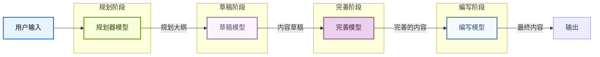

## 概述

内容构建器模式展示了一个多步骤、多模型的内容生成流水线。此设置将内容创建过程分解为专门的阶段，每个阶段由针对特定任务优化的不同模型驱动。

内容构建器模式通过以下方式提高了内容质量：

- **分阶段处理**：每个阶段专注于内容创建的不同方面。
- **模型专业化**：使用最适合特定任务的模型。
- **上下文隔离**：防止上下文从一个阶段渗入下一个阶段。
- **迭代完善**：在返回给用户之前，内容通过多个模型。

## 架构



## 配置

### 基本设置

```python
from deepagents import create_deep_agent
from langchain.tools import tool

@tool
def stage_feedback() -> str:
    """获取有关当前内容迭代的信号。"""
    ...

@tool
def write_content(content: str) -> str:
    """将内容写入输出。"""
    ...
```

### 子代理流水线

每个阶段由一个专门的子代理表示：

```python
from deepagents import create_deep_agent

content_planner = {
    "name": "content-planner",
    "description": "生成结构化内容大纲",
    "system_prompt": "你是一个内容策略专家。基于用户输入生成结构化大纲。",
    "model": "openai:gpt-5.4",
}

content_outliner = {
    "name": "content-outliner",
    "description": "将大纲扩展为详细的章节",
    "system_prompt": "你是一个内容架构师。将大纲扩展为详细的章节。",
    "model": "google_genai:gemini-3.5-flash",
}

content_writer = {
    "name": "content-writer",
    "description": "基于研究和大纲进行写作",
    "system_prompt": "你是一个内容撰写者。创建清晰的、有论据支持的草稿。",
    "model": "claude-sonnet-4-6",
}

content_refiner = {
    "name": "content-refiner",
    "description": "润色和完善现有内容",
    "system_prompt": "你是一个内容编辑。润色内容以使其清晰、一致并符合品牌风格。",
    "model": "openai:gpt-5.4",
}

agent = create_deep_agent(
    model="openai:gpt-5.4",
    subagents=[content_planner, content_outliner, content_writer, content_refiner],
)
```

## 最佳实践

### 模型选择

为内容构建器的每个阶段选择最佳模型：

- **规划**：使用具有强大指令跟随能力的模型。
- **研究和验证**：使用具有搜索能力的模型来验证事实准确性。
- **初始草稿**：使用具有强大写作能力的模型生成连贯的初始内容。
- **风格完善**：使用润色能力强的模型进行最终编辑。

### 提示设计

每个子代理都有高度特定的系统提示：

- **规划器提示**：关注组织结构、目标受众和关键主题。
- **研究员提示**：强调事实准确性、来源引用和全面覆盖。
- **草稿作者提示**：关注清晰度、流程和论证结构。
- **完善者提示**：关注风格一致性、语法和语气对齐。