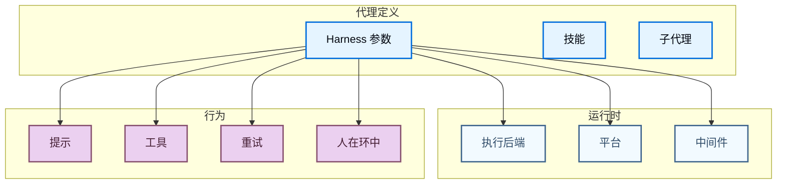

## 概要

你可以自定义深度代理的几乎所有方面，从执行后端到中间件处理程序。



## Harness 自定义

`create_deep_agent` 函数接受多个参数。有关 API 和所有参数的完整参考，请参见 [`create_deep_agent`](/oss/deepagents/create_deep_agent)。

### 提示组装

最终系统提示按此顺序组装：

1. **`CUSTOM`**：显式的 `system_prompt` 参数（如果提供）。
2. **`DEFAULT`**：Deep Agents 提供的默认系统提示（如果 `system_prompt` 未提供）。
3. **`SUBAGENT`**：活动子代理的系统提示。
4. **`SUFFIX`**：可选的 `system_prompt_suffix` 参数（如果提供）。

如果调用者和活动的配置档案都提供了 `system_prompt`，则调用者的值胜出。如果配置档案和调用者都提供了 `system_prompt_suffix`，则配置档案的值优先。

### 通用子代理提示

如果你在配置档案的 `general_purpose_subagent` 中同时设置了 `base_system_prompt` 和 `system_prompt`，则子代理变体胜出：

| 配置档案设置 | 结果 |
| --- | --- |
| 仅 `base_system_prompt` | 子代理使用基础提示。 |
| 仅 `system_prompt` | 子代理使用此提示。 |
| 两者都设置 | 子代理使用 `system_prompt`。 |
| 都不设置 | 子代理回退到主代理的完全组装提示。 |

### 子代理提示

声明式子代理在使用 `"system_prompt"` 键配置时拥有自己的专用系统提示。如果你未提供显式的系统提示，子代理使用自己组装的基础提示（模型特定，如果活动的配置档案有该模型的 `base_system_prompt`，则包括在内）。

## 工具

```python
from langchain.tools import tool
from deepagents import create_deep_agent

@tool
def get_weather(location: str) -> str:
    """获取某地的天气。"""
    return f"{location} 的天气是晴天。"

agent = create_deep_agent(
    model="openai:gpt-5.4",
    tools=[get_weather],
)
```

一些框架会添加默认工具。要排除它们，使用 `excluded_tools`：

```python
agent = create_deep_agent(
    model="openai:gpt-5.4",
    excluded_tools=["AgentWriteFileTool", "AgentReadFileTool"],
)
```

## 后端

后端在代理运行时和文件系统之间提供执行层。请参见[后端](/oss/deepagents/backends)文档。

## 人在环中

代理支持在工具调用之前或之时进行人为验证。请参见[人在环中](/oss/deepagents/human-in-the-loop)。

## 重试

```python
agent = create_deep_agent(
    model="openai:gpt-5.4",
    max_retries=3,
    tool_call_retry_attempts=3,
    tool_call_max_wait_time_seconds=30,
)
```

所有重试参数都是可选的，如果省略，使用合理的默认值。

## 中间件

```python
from deepagents import create_deep_agent

agent = create_deep_agent(
    model="openai:gpt-5.4",
    middleware=[MyCustomMiddleware()],
)
```

你也可以通过 `excluded_middleware` 排除默认中间件。请参见[中间件](/oss/deepagents/middleware)页面。