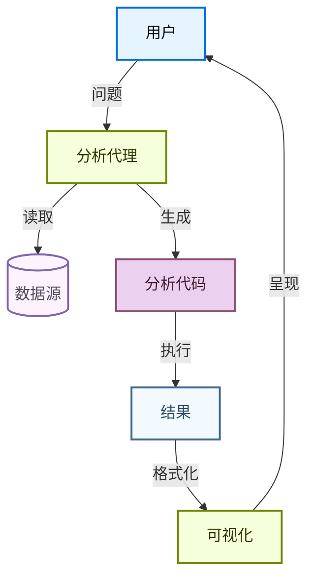

## 概述

数据分析模式演示了如何使用 Deep Agents 与数据交互。代理可以连接到数据集、生成可视化并总结统计发现。

## 配置

### 先决条件

- Python 3.12+
- 数据源（例如 CSV 文件、数据库、API）
- 用于数据探索的可视化库

### 工作流



### 基本设置

```python
from deepagents import create_deep_agent

agent = create_deep_agent(
    model="openai:gpt-5.4",
    system_prompt="你是一个数据分析专家。分析数据、生成可视化并总结发现。",
)
```

### 配置后端

数据分析通常涉及代码执行。使用远程沙箱或本地后端让代理执行数据操作和生成图表。

```python
from deepagents import create_deep_agent
from deepagents.backends import RemoteSandboxBackend

agent = create_deep_agent(
    model="claude-sonnet-4-6",
    system_prompt="你是一个数据分析专家。分析数据并生成可视化。",
    backend=RemoteSandboxBackend(),
)
```

## 工具和集成

### 数据源工具

代理可以使用工具连接到各种数据源：

```python
from langchain.tools import tool
import pandas as pd

@tool
def load_dataset(file_path: str) -> dict:
    """将 CSV 或 Excel 文件加载到数据分析环境中。

    参数：
        file_path：数据文件的路径。
    """
    if file_path.endswith(".csv"):
        df = pd.read_csv(file_path)
    elif file_path.endswith((".xlsx", ".xls")):
        df = pd.read_excel(file_path)
    else:
        raise ValueError("不支持的文件格式")

    return {
        "columns": list(df.columns),
        "dtypes": df.dtypes.astype(str).to_dict(),
        "row_count": len(df),
        "head": df.head(5).to_dict(orient="records"),
        "summary": df.describe().to_dict(),
    }
```

### 可视化工具

```python
@tool
def create_visualization(plot_code: str) -> str:
    """从 matplotlib/seaborn 代码创建可视化。

    将代码保存到临时文件并执行，返回图像路径。

    参数：
        plot_code：包含 matplotlib/seaborn 代码的字符串。
    """
    ...
```

### 导出工具

```python
@tool
def export_report(content: str, format: str = "markdown") -> str:
    """将分析结果导出为指定格式。

    参数：
        content：要导出的内容。
        format：导出格式（markdown、html、pdf）。
    """
    ...
```

## 分析模式

### 探索性数据分析

代理通过以下方式对数据集进行探索性分析：
1. 加载和理解数据结构
2. 计算汇总统计
3. 识别缺失值和异常值
4. 生成分布可视化

### 比较分析

代理可以通过以下方式比较数据集或组：
1. 识别要比较的关键指标
2. 并排生成可视化
3. 计算组间差异
4. 总结统计显著差异

### 时间序列分析

对于时间序列数据，代理可以：
1. 识别趋势和季节性模式
2. 计算移动平均值
3. 检测异常值或变化点
4. 投影未来趋势

## 与深度研究集成

数据分析代理可以与深度研究代理配对，进行全面的数据驱动研究：

```python
from deepagents import create_deep_agent

subagents = [
    {
        "name": "data-analyst",
        "description": "对提供的数据集进行定量分析",
        "system_prompt": "你是一个数据分析专家。分析数据并提供数值见解。",
        "tools": [load_dataset, create_visualization, export_report],
    },
    {
        "name": "research-agent",
        "description": "收集和综合外部背景信息",
        "system_prompt": "你是一个研究专家。收集背景信息并综合发现。",
        "tools": [search_web, extract_content],
    },
]

agent = create_deep_agent(
    model="claude-sonnet-4-6",
    subagents=subagents,
)
```

## 最佳实践

### 数据验证

处理代理生成的分析代码时，实施验证：
- 代码语法检查
- 最大执行时间
- 允许的包白名单
- 输出大小限制

### 可视化指南

为了获得最佳可视化效果：
- 为数据选择适当的图表类型
- 包含清晰的标签和图例
- 正确设置颜色和样式
- 如果适用，添加注释

### 性能

对于大型数据集：
- 使用采样进行初始探索
- 通过聚合减少数据量
- 设置数据查询内存限制
- 在适用时缓存结果