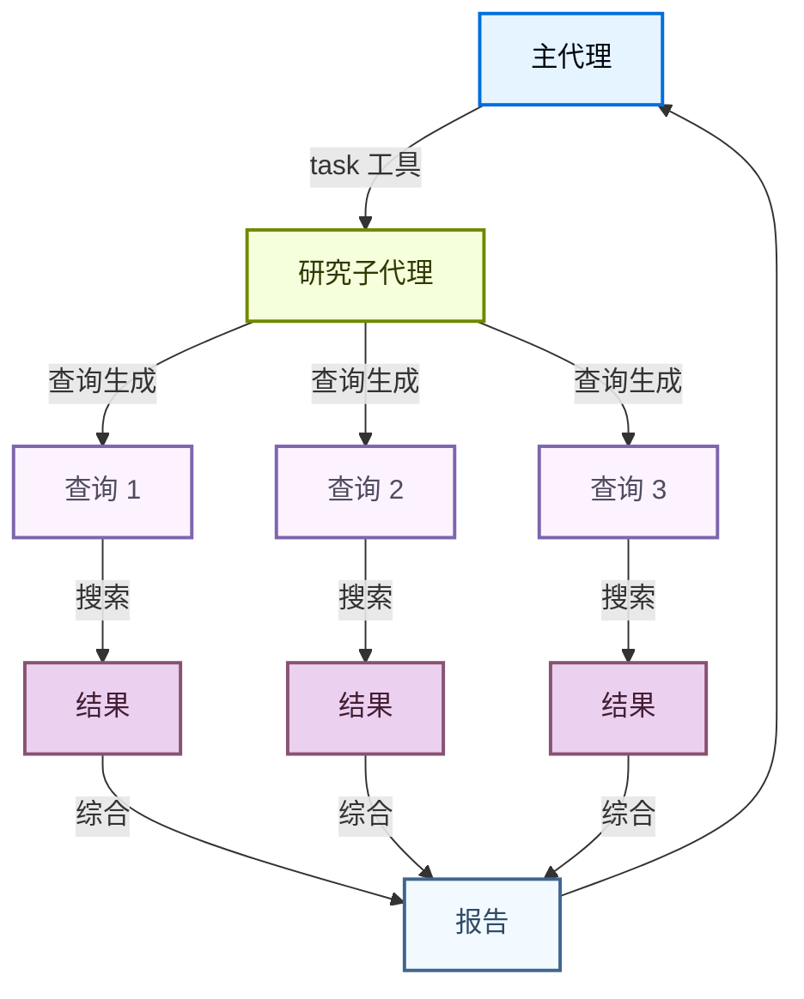

## 概述

深度研究模式展示了如何构建一个执行全面网络研究的代理。它演示了以下功能：

- 自动查询生成以实现多步骤研究
- 搜索生成和结果提取
- 来源综合和报告生成

当代理需要从多个非结构化来源收集信息并生成连贯的综合报告时，此模式最有用。

## 工作流

研究代理通常会执行以下操作：

1. 接收研究主题或问题
2. 生成多个搜索查询以全面覆盖该主题
3. 并行或顺序执行每个查询
4. 提取和综合结果
5. 生成带有引用来源的连贯报告

```python
from deepagents import create_deep_agent
from langchain.tools import tool

@tool
def search_web(query: str, max_results: int = 5) -> list[dict]:
    """使用搜索查询搜索网络。

    参数：
        query：搜索查询。
        max_results：要返回的最大结果数。
    """
    ...

@tool
def extract_content(url: str) -> str:
    """从 URL 提取主要内容。

    参数：
        url：要从中提取的网页完整 URL。
    """
    ...

```

## 结构化输出

代理可以使用 Pydantic 模型进行结构化输出，确保报告具有一致的格式：

```python
from pydantic import BaseModel, Field

class ResearchReport(BaseModel):
    summary: str = Field(description="关键发现的执行摘要（2-3 句话）")
    key_findings: list[str] = Field(description="3-5 个关键发现，每个都引用来源 URL")
    sources: list[str] = Field(description="引用的来源 URL 列表")
    confidence_score: float = Field(description="置信度分数（0.0 到 1.0）")
```

## 多步研究

代理通过以下方式深入挖掘：
- 从研究问题生成相关查询
- 跟进有趣的发现
- 交叉引用多个来源
- 通过额外搜索验证事实

## 使用子代理

研究方向可能是资源密集型的，包含了许多在父代理的活跃上下文中不需要的中间步骤。Deep Agents 中的子代理模式允许你将研究任务委派给专门清理上下文的代理，同时保持主代理专注于更广泛的推理目标。



## 最佳实践

### 查询生成

- 生成多个搜索查询以覆盖主题的不同方面。
- 使用特定领域术语以获得更好的结果。
- 包括用于验证的事实检查查询。

### 结果处理

- 提取结构化数据，而不仅仅是抓取原始 HTML。
- 去重类似的结果。
- 优先考虑权威来源。

### 综合

- 跨来源识别共同主题。
- 记录冲突信息。
- 对每个发现保持置信度指标。

## 更强大的研究替代方案

Deep Agents 提供一个[研究子代理](https://github.com/langchain-ai/deepagents/tree/main/libs/deepagents/deepagents/agents/research_agent)用于大规模研究任务。如果你想研究大量网页甚至整个文档，可以考虑自定义实现：批量搜索、分块、单独提取每个块、批量综合。

AI 辅助研究有许多变体，每种都有不同的质量/延迟/令牌成本权衡。Deep Agents 的可组合子代理让你可以在适合你任务粒度的层面进行抽象。