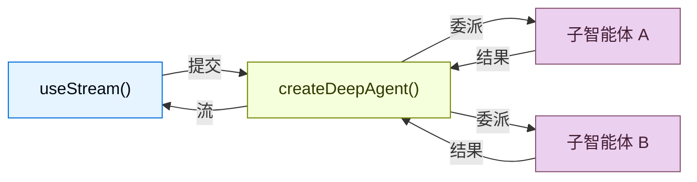

构建能够实时可视化深度智能体工作流程的前端。这些模式展示了如何从使用 `createDeepAgent` 创建的智能体渲染子智能体进度、任务规划、流式内容和类 IDE 沙箱体验。

## 架构

深度智能体使用协调器-工作器架构。主子智能体规划任务并将其委派给专门的子智能体，每个子智能体独立运行。在前端，`useStream` 同时展示协调器的消息和每个子智能体的流式状态。



:::python

```python
from deepagents import create_deep_agent

agent = create_deep_agent(
    model="google_genai:gemini-3.5-flash",
    tools=[get_weather],
    system_prompt="你是一个有用的助手",
    subagents=[
        {
            "name": "researcher",
            "description": "研究助手",
        }
    ],
)
```

:::

:::js

```ts
import { createDeepAgent } from "deepagents";

const agent = createDeepAgent({
  tools: [getWeather],
  system: "你是一个有用的助手",
  subagents: [
    {
      name: "researcher",
      description: "研究助手",
    },
  ],
});
```

:::

在前端，使用 `useStream` 连接，与 `createAgent` 的方式相同。深度智能体模式使用 `useStream` 的额外功能，如 `stream.subagents`、`stream.values.todos` 和 `filterSubagentMessages` 来渲染子智能体特定的 UI。

```ts
import { useStream } from "@langchain/react";

function App() {
  const stream = useStream<typeof agent>({
    apiUrl: "http://localhost:2024",
    assistantId: "agent",
  });

  // 消息之外深度智能体状态
  const todos = stream.values?.todos;
  const subagents = stream.subagents;
}
```

## 模式

<CardGroup cols={3}>
  <Card title="子智能体流式" icon="arrows-split" href="/zh/oss/deepagents/frontend/subagent-streaming">
    展示专业子智能体，包含流式内容、进度跟踪和可折叠卡片。
  </Card>
  <Card title="待办事项列表" icon="list-check" href="/zh/oss/deepagents/frontend/todo-list">
    使用从智能体状态同步的实时待办事项列表跟踪智能体进度。
  </Card>
  <Card title="沙箱" icon="code" href="/zh/oss/deepagents/frontend/sandbox">
    构建具有文件浏览器、代码查看器和差异面板的类 IDE UI，由沙箱支持。
  </Card>
</CardGroup>

## 相关模式

[LangChain 前端模式](/zh/oss/langchain/frontend/overview)，包括 markdown 消息、工具调用和人在回路，都适用于深度智能体。深度智能体基于相同的 LangGraph 运行时构建，因此 `useStream` 提供相同的核心 API。