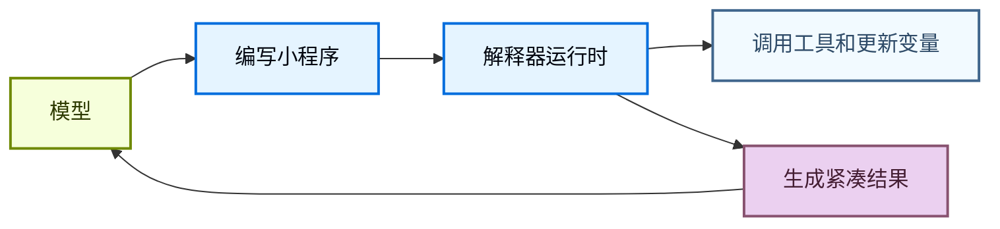
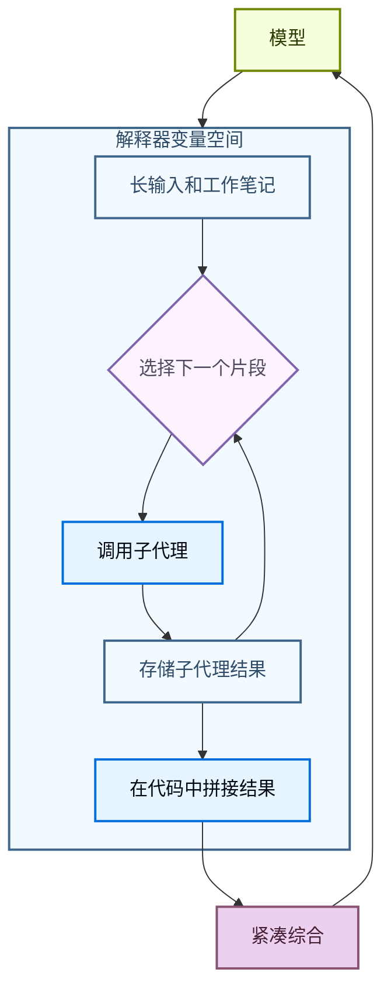

解释器为代理提供了一个可编程的工作空间，在那里他们可以探索数据、协调工具调用，并将中间工作保持在模型上下文之外。代理编写代码来表达其意图，然后一个**内存中**的运行时执行该代码并返回相关结果。

[沙箱](/oss/deepagents/sandboxes)是一种以代码优先的方式对环境进行操作（如运行命令、安装依赖和编辑文件），而解释器是一种在代理循环内部以代码优先的方式进行操作：组合工具、保持状态，以及决定哪些信息应返回给模型。

<Warning>
    解释器是实验性的。API 和生命周期行为可能在版本之间发生变化。
</Warning>

:::python
<Note>
    解释器需要 `langchain-quickjs>=0.1.0` 和 Python `>=3.11`。
</Note>
:::

## 何时使用解释器

大多数代理的工作在模型推理和工具执行之间交替。这对简单操作有效，但当代理需要组合多个步骤、对结构化数据进行推理或管理中间状态时，就会变得尴尬。

解释器为代理提供了一个运行时来处理这些工作。代理不必要求模型每次选择一个下一步的工具调用，而是可以编写一个小程序，运行控制流、调用允许列表中的工具、存储变量，并将紧凑的结果返回给模型。

当代理需要以下功能时使用解释器：

- 使用代码组合多个工具调用，包括循环、分支、重试和并发。
- 从代码中协调子代理，将工作拆分为专注的调用，存储它们的结果，并将这些结果拼接为最终综合。
- 将中间值保留在运行时状态中，而不是将每个临时结果都发送回模型上下文。
- 确定性地转换结构化数据，例如排序、分组、解析、验证、评分或聚合。
- 探索一个大的变量空间，只向模型返回选定的证据、摘要或输出。



这是通过针对 [**QuickJS**](https://github.com/quickjs-ng/quickjs) 运行代码实现的，QuickJS 是一个专为嵌入式执行设计的轻量级 JavaScript 运行时。该运行时为代理提供了一个评估代码的地方，而默认不暴露主机文件系统、网络、shell、包或时钟 API。

QuickJS 是解释器代码的执行边界。显式的桥接（如程序化工具调用）决定代码可以访问哪些能力。

## 选择正确的执行路径

| 需求 | 使用 |
| --- | --- |
| 一两个简单的外部调用 | 常规工具调用 |
| 需要循环、分支、重试或聚合结果的小程序 | 解释器 |
| 应从代码中运行的许多选择性工具调用 | 带程序化工具调用的解释器 |
| 跨线程使用的可重用辅助工具 | 带[解释器技能](/oss/deepagents/skills#use-interpreter-skills)的解释器 |
| Shell 命令、包安装、测试或完整的操作系统文件系统访问 | [沙箱](/oss/deepagents/sandboxes) |

## 向代理添加解释器

安装 QuickJS 中间件包，然后在创建代理时添加中间件。

:::python
<CodeGroup>
```bash pip
pip install -U "deepagents[quickjs]"
```

```bash uv
uv add "deepagents[quickjs]"
```
</CodeGroup>

```python
from deepagents import create_deep_agent
from langchain_quickjs import CodeInterpreterMiddleware

agent = create_deep_agent(
    model="openai:gpt-5.4",
    middleware=[CodeInterpreterMiddleware()],
)
```
:::

:::js
<CodeGroup>
```bash npm
npm install deepagents @langchain/quickjs
```

```bash pnpm
pnpm add deepagents @langchain/quickjs
```

```bash yarn
yarn add deepagents @langchain/quickjs
```
</CodeGroup>

```typescript
import { createDeepAgent } from "deepagents";
import { createCodeInterpreterMiddleware } from "@langchain/quickjs";

const agent = createDeepAgent({
  model: "openai:gpt-5.4",
  middleware: [createCodeInterpreterMiddleware()],
});
```
:::

## 在解释器中运行代码

中间件向代理添加了一个 `eval` 工具。该工具在持久化上下文中运行 TypeScript，捕获 `console.log`，并返回最后一个表达式的结果。

代理可以编写如下代码：

```javascript
const rows = [
  { team: "alpha", score: 8 },
  { team: "beta", score: 13 },
  { team: "alpha", score: 21 },
];

const totals = rows.reduce((acc, row) => {
  acc[row.team] = (acc[row.team] ?? 0) + row.score;
  console.log(`${row.team} score: ${acc[row.team]}`)
  return acc;
}, {});

totals;
```

:::python
默认情况下，解释器状态也会在同一个线程中的轮次之间持久化，方法是在每次代理运行后快照工作状态，并在下一次运行前恢复它。
:::

## 程序化工具调用

程序化工具调用（PTC）在解释器内部以全局 `tools` 命名空间暴露选定的代理工具。代理不必要求模型发出一个工具调用、等待结果，然后决定下一个调用，而是可以编写在循环、分支、重试或并行批处理中调用工具的代码。

当中间工具结果只是下一步的输入时，这非常有用。解释器可以在任何结果返回模型上下文之前处理、过滤或聚合这些结果，这可以使多工具/多步骤工作流更节省令牌。

PTC 在 Deep Agents 中是模型无关的。它由中间件实现，而不是由提供商特定的代码执行或工具调用 API 实现。

### 工作原理

1. 你选择解释器可以使用 `ptc` 允许列表调用哪些工具。
2. 中间件将这些工具暴露为 `tools` 下的异步 JavaScript 函数。
3. 代理编写调用那些带 `await` 的函数的解释器代码。
4. 解释器运行工具桥接，接收工具结果，并继续执行代码。
5. 模型接收最终的解释器输出，而不是每个中间值。

每个允许列表中的工具都成为一个异步函数。工具名称转换为驼峰式大小写，但输入对象仍然遵循工具的模式。例如，一个名为 `web_search` 的工具变成 `tools.webSearch(...)`：

```typescript
const result: string = await tools.webSearch({
  query: "deepagents interpreters",
});
```

### 有用的模式

| **模式** | **解释器可以做什么** |
| --- | --- |
| 批处理 | 循环处理多个输入，为每个输入调用一个工具。 |
| 并行工作 | 对独立调用使用 `Promise.all`。 |
| 条件逻辑 | 根据早期结果选择下一个工具调用。 |
| 提前终止 | 一旦满足成功条件就停止调用工具。 |
| 数据过滤 | 只向模型返回相关的行、片段、错误或摘要。 |
| 递归编排 | 重复调用 `task`，然后在代码中组合子代理结果。 |

### 启用 PTC

用显式的允许列表启用 PTC：

:::python
```python
from deepagents import create_deep_agent
from langchain_quickjs import CodeInterpreterMiddleware

agent = create_deep_agent(
    model="openai:gpt-5.4",
    middleware=[CodeInterpreterMiddleware(ptc=["task"])],
)
```
:::

:::js
```typescript
import { createDeepAgent } from "deepagents";
import { createCodeInterpreterMiddleware } from "@langchain/quickjs";

const agent = createDeepAgent({
  model: "openai:gpt-5.4",
  middleware: [createCodeInterpreterMiddleware({ ptc: ["task"] })],
});
```
:::

启用 PTC 后，代理可以从解释器代码中调用允许列表中的工具。此示例并行启动几个子代理，并在返回模型之前组合它们的最终报告：

```javascript
const topics = ["retrieval", "memory", "evaluation"];

const reports = await Promise.all(
  topics.map((topic) =>
    tools.task({
      description: `Research ${topic} in Deep Agents and return three concise findings.`,
      subagent_type: "general-purpose",
    }),
  ),
);

reports.join("\n\n");
```

因为这是代码，代理也可以本地处理失败：

```javascript
try {
  const report = await tools.task({
    description: "Check the migration notes and return breaking changes.",
    subagent_type: "general-purpose",
  });
  console.log(report);
} catch (error) {
  console.log(`Subagent failed: ${error.message}`);
}
```

<Warning>
    PTC 调用当前通过解释器桥接执行，不经过常规的工具调用路径。因此，每次 PTC 调用的工具调用不强制执行 `interrupt_on` 审批工作流。
</Warning>

## 递归语言模型

递归语言模型使用解释器作为分解的工作空间。模型将大型输入或工作集保留在运行时变量中，编写代码来检查和拆分它，在较小的片段上调用子代理或其他模型工具，然后在代码中将返回的结果拼接在一起。

这将变量空间与代理的上下文分离开来。变量空间是存储在解释器中的信息，而代理的上下文是模型在下一次模型调用中实际处理的内容。模型可以决定哪些片段成为子代理任务，哪些结果需要再次处理，以及哪些最终综合应返回给主对话。



有关此模式的背景，请参阅[递归语言模型论文](https://arxiv.org/abs/2512.24601)。

在 Deep Agents 中，递归调用通常是 `task` 工具，通过程序化工具调用暴露。解释器可以在多个片段上调用子代理，组合它们的答案，并返回一个单一的综合结果：

```javascript
const candidates = notes
  .filter((note) => note.includes("migration"))
  .slice(0, 5);

const riskReports = await Promise.all(
  candidates.map((note) =>
    tools.task({
      description: `Analyze this migration note for release risk. Return risks, affected users, and recommended follow-up:\n\n${note}`,
      subagent_type: "general-purpose",
    }),
  ),
);

const releaseSummary = riskReports
  .map((report, index) => `## Candidate ${index + 1}\n${report}`)
  .join("\n\n");

releaseSummary;
```

## 解释器技能

解释器技能是向解释器暴露代码模块的[技能](/oss/deepagents/skills)。当配置了解释器中间件时，代理可以从代码中导入这些模块，并将其用于确定性辅助逻辑。

当代理需要结构化数据工作流的可重用辅助工具时，解释器技能非常有用，例如排序、分组、评分、解析、验证或聚合数据。有关设置详情，请参阅[解释器技能](/oss/deepagents/skills#use-interpreter-skills)。

:::python
## 快照和时间旅行

`CodeInterpreterMiddleware` 默认在每次代理运行后快照解释器状态，并在下一次运行前恢复它。快照是解释器内存中 JavaScript 状态的序列化副本，包括代理完成运行代码时存在的全局变量、变量、函数和导入的模块。

跨对话轮次，生命周期如下：

1. 一轮开始，`CodeInterpreterMiddleware` 恢复该线程的最新解释器快照。
2. 代理调用 `eval`，代码可以读取或修改解释器变量。
3. 代理运行完成，中间件将更新后的解释器状态快照到图状态中。
4. 下一轮从恢复的解释器状态开始，而不是从空运行时开始。

在单个代理运行中，重复的 `eval` 调用使用活动的解释器上下文对象。中间件不会在这些调用之间进行快照和恢复；它在运行完成时快照上下文，以便在后续轮次或检查点重放时恢复。

<Note>
    在对话轮次之间，快照仅保留可以合理序列化的值。将其用于数据，而不是用于活的运行时对象。函数、类和其他不可序列化的值将作为不可访问的工件被恢复。如果解释器代码在恢复后访问它们，eval 工具会抛出如 `Value for 'fn' was not restored because it is not serializable (type: function).` 的错误。
</Note>

快照保留解释器内存，而不是外部世界的影响。如果解释器代码通过 PTC 调用了一个工具，恢复先前的解释器快照不会撤销该工具调用的副作用。它只恢复记录或处理了结果的解释器变量。

当图使用检查点器时，这与 [LangGraph 时间旅行](/oss/langgraph/use-time-travel)配对。恢复图检查点可以恢复存储在图状态中的解释器快照，因此你可以在调试或重放时返回到更早的代理上下文和解释器状态。

```python
from deepagents import create_deep_agent
from langchain_quickjs import CodeInterpreterMiddleware
from langgraph.checkpoint.memory import MemorySaver

checkpointer = MemorySaver()

agent = create_deep_agent(
    model="openai:gpt-5.4",
    checkpointer=checkpointer,
    middleware=[
        CodeInterpreterMiddleware(
            snapshot_between_turns=True,  # 默认
        )
    ],
)
```

你可以使用 `snapshot_between_turns=False` 禁用跨轮次快照。
:::

## 安全性和限制

解释器使用 QuickJS 以严格的默认隔离运行不受信任的 JavaScript。将其视为一个作用域内的解释器运行时，而不是一个完整的生产沙箱后端。

你通过 PTC 暴露的每个工具都是解释器代码可以使用的外部能力。将 PTC 允许列表视为权限边界：只暴露代理需要的工具，并避免桥接可以访问敏感系统、花钱、修改数据或调用无限制网络的宽泛工具，除非这是有意为之。

:::python
| 能力 | 默认可用 | 如何暴露 |
| --- | --- | --- |
| JavaScript 执行 | 是 | 添加解释器中间件 |
| 顶级 `await` | 是 | 在解释器代码中使用 Promise |
| `console.log` 捕获 | 是 | 使用 `capture_console=False` 禁用 |
| 代理工具 | 否 | 添加 PTC 允许列表 |
| 解释器技能模块 | 否 | 添加 `module` 条目并配置 `skills_backend` |
| 文件系统访问 | 否 | 通过 PTC 允许列表添加[内置文件系统工具](/oss/deepagents/harness#virtual-filesystem-access) |
| 网络访问 | 否 | 通过 PTC 暴露特定的网络工具 |
| 时钟或日期时间访问 | 否 | 如果需要，暴露显式的时间工具 |
| Shell 命令、包安装、测试、OS 级别执行 | 否 | 使用[沙箱后端](/oss/deepagents/sandboxes) |
:::
:::js
| 能力 | 默认可用 | 如何暴露 |
| --- | --- | --- |
| JavaScript 执行 | 是 | 添加解释器中间件 |
| 顶级 `await` | 是 | 在解释器代码中使用 Promise |
| `console.log` 捕获 | 是 | 使用 `captureConsole: false` 禁用 |
| 代理工具 | 否 | 添加 PTC 允许列表 |
| 解释器技能模块 | 否 | 添加 `module` 条目并配置 `skillsBackend` |
| 文件系统访问 | 否 | 通过 PTC 允许列表添加[内置文件系统工具](/oss/deepagents/harness#virtual-filesystem-access) |
| 网络访问 | 否 | 通过 PTC 暴露特定的网络工具 |
| 时钟或日期时间访问 | 否 | 如果需要，暴露显式的时间工具 |
| Shell 命令、包安装、测试、OS 级别执行 | 否 | 使用[沙箱后端](/oss/deepagents/sandboxes) |
:::

:::python
<Note>
    **代码执行的工作原理**

    解释器代码在嵌入的 QuickJS 上下文中运行，而不是在单独的 VM 或进程中。在 Python 中，这个运行时由 [`quickjs-rs`](https://github.com/langchain-ai/quickjs-rs) 提供，其[安全指南](https://github.com/langchain-ai/quickjs-rs#security)中记录了同进程执行边界。

    将解释器视为一个能力作用域的执行层，而不是主机内存隔离边界。对于不受信任或半受信任的代码，在隔离的工作进程或容器中运行代理，并保持 PTC 允许列表狭窄。
</Note>
:::

## 中间件选项

:::python
`CodeInterpreterMiddleware` 接受以下选项：

| Kwarg | 默认值 | 用途 |
| --- | --- | --- |
| `memory_limit` | `64 * 1024 * 1024` <br/>(64 MB) | QuickJS 堆内存限制（字节）。 |
| `timeout` | `5.0` | 每次 eval 超时（秒）。 |
| `max_ptc_calls` | `256` | 每次 eval 的最大 `tools.*` 调用次数。仅在可信环境中使用 `None`。 |
| `tool_name` | `"eval"` | 暴露给模型的解释器工具名称。 |
| `max_result_chars` | `4000` | 从结果和 stdout 块返回的最大字符数。 |
| `capture_console` | `True` | 是否捕获 `console.log`、`console.warn` 和 `console.error` 输出。 |
| `ptc` | `None` | PTC 允许列表：工具名称或 `BaseTool` 实例的列表。 |
| `skills_backend` | `None` | 用于解析解释器技能模块的后端。 |
| `snapshot_between_turns` | `True` | 解释器状态快照是否在代理轮次之间持久化。 |
| `max_snapshot_bytes` | `None` | 最大序列化快照大小。默认为 `memory_limit`。 |
:::

:::js
`createCodeInterpreterMiddleware` 接受以下选项：

| 选项 | 默认值 | 用途 |
| --- | --- | --- |
| `ptc` | 省略 | PTC 允许列表：工具名称或 `StructuredToolInterface` 实例的数组。 |
| `memoryLimitBytes` | `64 * 1024 * 1024` <br/>(64 MB) | QuickJS 内存限制（字节）。 |
| `maxStackSizeBytes` | `320 * 1024` | QuickJS 堆栈大小限制（字节）。 |
| `executionTimeoutMs` | `5000` | 每次 eval 超时（毫秒）。负值禁用超时。 |
| `systemPrompt` | `null` | 覆盖内置的解释器系统提示。 |
| `skillsBackend` | 省略 | 用于解析解释器技能模块的后端。 |
| `maxPtcCalls` | `256` | 每次 eval 的最大 `tools.*` 调用次数。仅在可信环境中使用 `null`。 |
| `maxResultChars` | `4000` | 从控制台输出、结果和错误字符串中保留的最大字符数。 |
| `toolName` | `"eval"` | 暴露给模型的解释器工具名称。 |
| `captureConsole` | `true` | 是否捕获 `console.log`、`console.warn` 和 `console.error` 输出。 |
:::