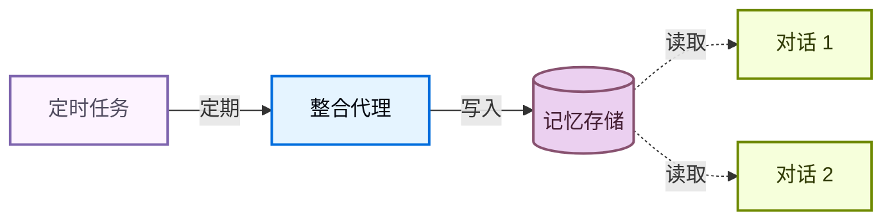

记忆让你的代理能够在对话中学习和改进。Deep Agents 将记忆作为一等公民，提供基于文件系统的记忆：代理以文件形式读写记忆，你可以使用[后端](/zh/oss/deepagents/backends)控制这些文件的存储位置。

<Note>
本页涵盖**长期记忆**：跨对话持久化的记忆。有关短期记忆（单次会话内的对话历史和临时文件），请参阅[上下文工程](/zh/oss/deepagents/context-engineering)指南。短期记忆作为代理[状态](/zh/oss/langgraph/graph-api#状态)的一部分自动管理。


</Note>

## 记忆的工作原理

1. **将代理指向记忆文件。** 在创建代理时将文件路径传入 `memory=` 参数。你还可以通过 `skills=` 传入[技能](/zh/oss/deepagents/skills)作为过程性记忆（可复用的指令，告诉代理*如何*执行任务）。[后端](/zh/oss/deepagents/backends)控制文件的存储位置以及谁可以访问它们。
2. **代理读取记忆。** 代理可以在启动时将记忆文件加载到系统提示中，也可以在对话过程中按需读取。例如，[技能](/zh/oss/deepagents/skills)使用按需加载：代理在启动时只读取技能描述，仅当任务匹配时才读取完整的技能文件。这使上下文保持精简，直到需要某项能力时才加载。
3. **代理更新记忆（可选）。** 当代理学到新信息时，可以使用内置的 `edit_file` 工具更新记忆文件。更新可以在对话过程中进行（默认），也可以在对话之间通过[后台整合](#后台整合)在后台进行。更改会被持久化，并在下一次对话中可用。并非所有记忆都是可写的：开发者定义的[技能](/zh/oss/deepagents/skills)和[组织策略](#组织级记忆)通常是只读的。详情参见[只读与可写记忆](#只读与可写记忆)。

两种最常见的模式是[代理级记忆](#代理级记忆)（所有用户共享）和[用户级记忆](#用户级记忆)（每个用户隔离）。

## 作用域记忆

代理记忆可以有作用域，使相同的记忆文件对使用代理的所有用户可访问，或者每个用户拥有独立的记忆文件。

### 代理级记忆

赋予代理随时间演进的持久身份。代理级记忆在所有用户之间共享，因此代理通过每次对话建立自己的个性、积累知识和学习偏好。在与用户交互时，它会发展专业知识、完善方法并记住有效的方法。当具有写权限时，它还可以学习和更新[技能](/zh/oss/deepagents/skills)。

关键在于后端命名空间：将其设置为 `(assistant_id,)` 意味着该代理的每次对话都读写同一个记忆文件。

:::python
<Note>
访问 `rt.server_info` 需要 `deepagents>=0.5.0`。在旧版本中，请改用 `get_config()["metadata"]["assistant_id"]` 读取助手 ID。
</Note>
:::

:::js
<Note>
访问 `rt.serverInfo` 需要 `deepagents>=1.9.0`。在旧版本中，请改用 `getConfig().metadata.assistantId` 读取助手 ID。
</Note>
:::

:::python
```python
from deepagents import create_deep_agent
from deepagents.backends import CompositeBackend, StateBackend, StoreBackend

agent = create_deep_agent(
    model="google_genai:gemini-3.5-flash",
    memory=["/memories/AGENTS.md"],
    skills=["/skills/"],
    backend=CompositeBackend(
        default=StateBackend(),
        routes={
            "/memories/": StoreBackend(
                namespace=lambda rt: (
                    rt.server_info.assistant_id,  # [!code highlight]
                ),
            ),
            "/skills/": StoreBackend(
                namespace=lambda rt: (
                    rt.server_info.assistant_id,  # [!code highlight]
                ),
            ),
        },
    ),
)
```
:::

:::js
```typescript
import { createDeepAgent, CompositeBackend, StateBackend, StoreBackend } from "deepagents";

const agent = createDeepAgent({
  memory: ["/memories/AGENTS.md"],
  skills: ["/skills/"],
  backend: new CompositeBackend(
    new StateBackend(),
    {
      "/memories/": new StoreBackend({
        namespace: (rt) => [rt.serverInfo.assistantId],  // [!code highlight]
      }),
      "/skills/": new StoreBackend({
        namespace: (rt) => [rt.serverInfo.assistantId],  // [!code highlight]
      }),
    },
  ),
});
```
:::

<Accordion title="完整示例：初始化记忆并调用">

向存储中填充初始记忆，然后跨两个线程调用代理，观察它记住和更新所学的内容。

:::python
```python
from langchain_core.utils.uuid import uuid7

from deepagents import create_deep_agent
from deepagents.backends import CompositeBackend, StateBackend, StoreBackend
from deepagents.backends.utils import create_file_data
from langgraph.store.memory import InMemoryStore

store = InMemoryStore()  # 部署到 LangSmith 时使用平台存储

# 初始化记忆文件
store.put(
    ("my-agent",),
    "/memories/AGENTS.md",
    create_file_data("""## 回复风格
- 保持回复简洁
- 尽可能使用代码示例
"""),
)

# 初始化技能
store.put(
    ("my-agent",),
    "/skills/langgraph-docs/SKILL.md",
    create_file_data("""---
name: langgraph-docs
description: 获取相关的 LangGraph 文档以提供准确的指导。
---

# langgraph-docs

使用 fetch_url 工具读取 https://docs.langchain.com/llms.txt，然后获取相关页面。
"""),
)

agent = create_deep_agent(
    model="google_genai:gemini-3.5-flash",
    memory=["/memories/AGENTS.md"],
    skills=["/skills/"],
    backend=lambda rt: CompositeBackend(
        default=StateBackend(rt),
        routes={
            "/memories/": StoreBackend(
                rt, namespace=lambda rt: ("my-agent",)
            ),
            "/skills/": StoreBackend(
                rt, namespace=lambda rt: ("my-agent",)
            ),
        },
    ),
    store=store,
)

# 线程 1：代理学习新偏好并将其保存到记忆
config1 = {"configurable": {"thread_id": str(uuid7())}}
agent.invoke(
    {"messages": [{"role": "user", "content": "我喜欢详细的解释。记住这一点。"}]},
    config=config1,
)

# 线程 2：代理读取记忆并应用偏好
config2 = {"configurable": {"thread_id": str(uuid7())}}
agent.invoke(
    {"messages": [{"role": "user", "content": "解释一下 transformer 是如何工作的。"}]},
    config=config2,
)
```
:::

:::js
```typescript
import { createDeepAgent, CompositeBackend, StateBackend, StoreBackend, createFileData } from "deepagents";
import { InMemoryStore } from "@langchain/langgraph";

const store = new InMemoryStore();  // 部署到 LangSmith 时使用平台存储

// 初始化记忆文件
await store.put(
  ["my-agent"],
  "/memories/AGENTS.md",
  createFileData(`## 回复风格
- 保持回复简洁
- 尽可能使用代码示例
`),
);

// 初始化技能
await store.put(
  ["my-agent"],
  "/skills/langgraph-docs/SKILL.md",
  createFileData(`---
name: langgraph-docs
description: 获取相关的 LangGraph 文档以提供准确的指导。
---

# langgraph-docs

使用 fetch_url 工具读取 https://docs.langchain.com/llms.txt，然后获取相关页面。
`),
);

const agent = createDeepAgent({
  memory: ["/memories/AGENTS.md"],
  skills: ["/skills/"],
  backend: (rt) => new CompositeBackend(
    new StateBackend(rt),
    {
      "/memories/": new StoreBackend(rt, {
        namespace: (rt) => ["my-agent"],
      }),
      "/skills/": new StoreBackend(rt, {
        namespace: (rt) => ["my-agent"],
      }),
    },
  ),
  store,
});

// 线程 1：代理学习新偏好并将其保存到记忆
const config1 = { configurable: { thread_id: crypto.randomUUID() } };
await agent.invoke({
  messages: [{ role: "user", content: "我喜欢详细的解释。记住这一点。" }],
}, config1);

// 线程 2：代理读取记忆并应用偏好
const config2 = { configurable: { thread_id: crypto.randomUUID() } };
await agent.invoke({
  messages: [{ role: "user", content: "解释一下 transformer 是如何工作的。" }],
}, config2);
```
:::

</Accordion>

### 用户级记忆

为每个用户提供单独的记忆文件。代理会记住每个用户的偏好、上下文和历史，而核心代理指令保持不变。如果存储在用户作用域的后端中，用户也可以拥有每个用户的[技能](/zh/oss/deepagents/skills)。

命名空间使用 `(user_id,)`，这样每个用户都能获得记忆文件的隔离副本。用户 A 的偏好永远不会泄露到用户 B 的对话中。

:::python
```python
from deepagents import create_deep_agent
from deepagents.backends import CompositeBackend, StateBackend, StoreBackend

agent = create_deep_agent(
    model="google_genai:gemini-3.5-flash",
    memory=["/memories/preferences.md"],
    skills=["/skills/"],
    backend=CompositeBackend(
        default=StateBackend(),
        routes={
            "/memories/": StoreBackend(
                namespace=lambda rt: (rt.server_info.user.identity,),
            ),
            "/skills/": StoreBackend(
                namespace=lambda rt: (rt.server_info.user.identity,),
            ),
        },
    ),
)
```
:::

:::js
```typescript
import { createDeepAgent, CompositeBackend, StateBackend, StoreBackend } from "deepagents";

const agent = createDeepAgent({
  memory: ["/memories/preferences.md"],
  skills: ["/skills/"],
  backend: new CompositeBackend(
    new StateBackend(),
    {
      "/memories/": new StoreBackend({
        namespace: (rt) => [rt.serverInfo.user.identity],
      }),
      "/skills/": new StoreBackend({
        namespace: (rt) => [rt.serverInfo.user.identity],
      }),
    },
  ),
});
```
:::

<Accordion title="完整示例：跨用户的隔离记忆">

为每个用户初始化记忆，并以两个不同用户的身份调用代理。每个用户只能看到自己的偏好。

:::python
```python
from langchain_core.utils.uuid import uuid7

from deepagents import create_deep_agent
from deepagents.backends import CompositeBackend, StateBackend, StoreBackend
from deepagents.backends.utils import create_file_data
from langgraph.store.memory import InMemoryStore


store = InMemoryStore()  # 部署到 LangSmith 时使用平台存储

# 为两个用户初始化偏好
store.put(
    ("user-alice",),
    "/memories/preferences.md",
    create_file_data("""## 偏好
- 喜欢简洁的要点
- 偏好 Python 示例
"""),
)
store.put(
    ("user-bob",),
    "/memories/preferences.md",
    create_file_data("""## 偏好
- 喜欢详细的解释
- 偏好 TypeScript 示例
"""),
)

# 为 Alice 初始化技能
store.put(
    ("user-alice",),
    "/skills/langgraph-docs/SKILL.md",
    create_file_data("""---
name: langgraph-docs
description: 获取相关的 LangGraph 文档以提供准确的指导。
---

# langgraph-docs

使用 fetch_url 工具读取 https://docs.langchain.com/llms.txt，然后获取相关页面。
"""),
)

agent = create_deep_agent(
    model="google_genai:gemini-3.5-flash",
    memory=["/memories/preferences.md"],
    skills=["/skills/"],
    backend=lambda rt: CompositeBackend(
        default=StateBackend(rt),
        routes={
            "/memories/": StoreBackend(
                rt,
                namespace=lambda rt: (rt.server_info.user.identity,),
            ),
            "/skills/": StoreBackend(
                rt,
                namespace=lambda rt: (rt.server_info.user.identity,),
            ),
        },
    ),
    store=store,
)

# 部署后，每个经过身份验证的请求会将
# `rt.server_info.user.identity` 解析为调用用户，因此 Alice 和 Bob
# 会自动看到他们自己的偏好。
agent.invoke(
    {"messages": [{"role": "user", "content": "如何读取 CSV 文件？"}]},
    config={"configurable": {"thread_id": str(uuid7())}},
)
```
:::

:::js
```typescript
import { createDeepAgent, CompositeBackend, StateBackend, StoreBackend, createFileData } from "deepagents";
import { InMemoryStore } from "@langchain/langgraph";

const store = new InMemoryStore();  // 部署到 LangSmith 时使用平台存储

// 为两个用户初始化偏好
await store.put(
  ["user-alice"],
  "/memories/preferences.md",
  createFileData(`## 偏好
- 喜欢简洁的要点
- 偏好 Python 示例
`),
);
await store.put(
  ["user-bob"],
  "/memories/preferences.md",
  createFileData(`## 偏好
- 喜欢详细的解释
- 偏好 TypeScript 示例
`),
);

// 为 Alice 初始化技能
await store.put(
  ["user-alice"],
  "/skills/langgraph-docs/SKILL.md",
  createFileData(`---
name: langgraph-docs
description: 获取相关的 LangGraph 文档以提供准确的指导。
---

# langgraph-docs

使用 fetch_url 工具读取 https://docs.langchain.com/llms.txt，然后获取相关页面。
`),
);

const agent = createDeepAgent({
  memory: ["/memories/preferences.md"],
  skills: ["/skills/"],
  backend: (rt) => new CompositeBackend(
    new StateBackend(rt),
    {
      "/memories/": new StoreBackend(rt, {
        namespace: (rt) => [rt.serverInfo.user.identity],
      }),
      "/skills/": new StoreBackend(rt, {
        namespace: (rt) => [rt.serverInfo.user.identity],
      }),
    },
  ),
  store,
});

// 部署后，每个经过身份验证的请求会将
// `rt.serverInfo.user.identity` 解析为调用用户，因此 Alice 和 Bob
// 会自动看到他们自己的偏好。
await agent.invoke(
  { messages: [{ role: "user", content: "如何读取 CSV 文件？" }] },
  { configurable: { thread_id: crypto.randomUUID() } },
);
```
:::

</Accordion>

## 高级用法

除了记忆路径和作用域的基本配置选项外，你还可以配置更高级的记忆参数：

| 维度 | 解决的问题 | 选项 |
|---|---|---|
| **持续时间** | 记忆持续多久？ | [短期](/zh/oss/deepagents/context-engineering)（单次对话）或[长期](#作用域记忆)（跨对话） |
| **信息类型** | 属于哪种类型的信息？ | [情节记忆](#情节记忆)（过往经历）、[过程性记忆](/zh/oss/deepagents/skills)（指令和技能）或[语义记忆](/zh/oss/concepts/memory#语义记忆)（事实） |
| **作用域** | 谁可以查看和修改？ | [用户](#用户级记忆)、[代理](#代理级记忆)或[组织](#组织级记忆) |
| **更新策略** | 何时写入记忆？ | 对话期间（默认）或[对话之间](#后台整合) |
| **检索方式** | 如何读取记忆？ | 加载到提示中（默认）或按需加载（例如[技能](/zh/oss/deepagents/skills)） |
| **代理权限** | 代理可以写入记忆吗？ | [读写](#只读与可写记忆)（默认）或[只读](#只读与可写记忆)（用于共享策略） |

### 情节记忆

情节记忆存储过往经历的记录：发生了什么、顺序如何以及结果是什么。与语义记忆（存储在 `AGENTS.md` 等文件中的事实和偏好）不同，情节记忆保留完整的对话上下文，以便代理可以回忆起问题*是如何*解决的，而不仅仅是*学到了什么*。

Deep Agents 已经使用[检查点](/zh/oss/langgraph/persistence#检查点)机制来支持情节记忆：每次对话都会作为检查点的线程持久化。

要使过去的对话可搜索，可以封装一个线程搜索工具。`user_id` 从运行时上下文中获取，而不是作为参数传递：

:::python
```python
from langgraph_sdk import get_client
from langchain.tools import tool, ToolRuntime

client = get_client(url="<DEPLOYMENT_URL>")


@tool
async def search_past_conversations(query: str, runtime: ToolRuntime) -> str:
    """搜索过去的对话以获取相关上下文。"""
    user_id = runtime.server_info.user.identity  # [!code highlight]
    threads = await client.threads.search(
        metadata={"user_id": user_id},
        limit=5,
    )
    results = []
    for thread in threads:
        history = await client.threads.get_history(thread_id=thread["thread_id"])
        results.append(history)
    return str(results)
```
:::

:::js
```typescript
import { Client } from "@langchain/langgraph-sdk";
import { tool } from "@langchain/core/tools";

const client = new Client({ apiUrl: "<DEPLOYMENT_URL>" });

const searchPastConversations = tool(
  async ({ query }, runtime) => {
    const userId = runtime.serverInfo.user.identity;  // [!code highlight]
    const threads = await client.threads.search({
      metadata: { userId },
      limit: 5,
    });
    const results = [];
    for (const thread of threads) {
      const history = await client.threads.getHistory(thread.threadId);
      results.push(history);
    }
    return JSON.stringify(results);
  },
  {
    name: "search_past_conversations",
    description: "搜索过去的对话以获取相关上下文。",
  }
);
```
:::

你可以通过调整元数据过滤器，按用户或组织限定线程搜索范围：

:::python
```python
# 搜索特定用户的对话
threads = await client.threads.search(
    metadata={"user_id": user_id},
    limit=5,
)

# 搜索整个组织的对话
threads = await client.threads.search(
    metadata={"org_id": org_id},
    limit=5,
)
```
:::

:::js
```typescript
// 搜索特定用户的对话
const userThreads = await client.threads.search({
  metadata: { userId },
  limit: 5,
});

// 搜索整个组织的对话
const orgThreads = await client.threads.search({
  metadata: { orgId },
  limit: 5,
});
```
:::

这对于执行复杂、多步骤任务的代理非常有用。例如，编码代理可以回顾过去的调试会话，直接跳转到可能根本原因。

### 组织级记忆

组织级记忆遵循与用户级记忆相同的模式，但使用组织级命名空间而不是每个用户的命名空间。用于应适用于组织中所有用户和代理的策略或知识。

组织记忆通常为**只读**，以防止通过共享状态进行提示注入。详情参见[只读与可写记忆](#只读与可写记忆)。

:::python
```python
from deepagents import create_deep_agent
from deepagents.backends import CompositeBackend, StateBackend, StoreBackend

agent = create_deep_agent(
    model="google_genai:gemini-3.5-flash",
    memory=[
        "/memories/preferences.md",
        "/policies/compliance.md",
    ],
    backend=CompositeBackend(
        default=StateBackend(),
        routes={
            "/memories/": StoreBackend(
                namespace=lambda rt: (rt.server_info.user.identity,),
            ),
            "/policies/": StoreBackend(
                namespace=lambda rt: (rt.context.org_id,),
            ),
        },
    ),
)
```
:::

:::js
```typescript
import { createDeepAgent, CompositeBackend, StateBackend, StoreBackend } from "deepagents";

const agent = createDeepAgent({
  memory: [
    "/memories/preferences.md",
    "/policies/compliance.md",
  ],
  backend: new CompositeBackend(
    new StateBackend(),
    {
      "/memories/": new StoreBackend({
        namespace: (rt) => [rt.serverInfo.user.identity],
      }),
      "/policies/": new StoreBackend({
        namespace: (rt) => [rt.context.orgId],
      }),
    },
  ),
});
```
:::

从应用程序代码填充组织记忆：

:::python
```python
from langgraph_sdk import get_client
from deepagents.backends.utils import create_file_data

client = get_client(url="<DEPLOYMENT_URL>")

await client.store.put_item(
    (org_id,),
    "/compliance.md",
    create_file_data("""## 合规策略
- 不得泄露内部定价信息
- 在提供财务建议时必须包含免责声明
"""),
)
```
:::

:::js
```typescript
import { Client } from "@langchain/langgraph-sdk";
import { createFileData } from "deepagents";

const client = new Client({ apiUrl: "<DEPLOYMENT_URL>" });

await client.store.putItem(
  [orgId],
  "/compliance.md",
  createFileData(`## 合规策略
- 不得泄露内部定价信息
- 在提供财务建议时必须包含免责声明
`),
);
```
:::

使用[权限](/zh/oss/deepagents/permissions)来强制执行组织级记忆为只读，或使用[策略钩子](/zh/oss/deepagents/backends#添加策略钩子)实现自定义验证逻辑。

### 后台整合

默认情况下，代理在对话期间（热路径）写入记忆。另一种方法是在**对话之间**作为后台任务处理记忆，有时称为**睡眠时间计算**。一个单独的深度代理会审查最近的对话，提取关键事实，并将其与现有记忆合并。

| 方法 | 优点 | 缺点 |
|---|---|---|
| **热路径**（对话期间） | 记忆立即可用，对用户透明 | 增加延迟，代理必须多任务处理 |
| **后台**（对话之间） | 无用户可见的延迟，可以综合多个对话的信息 | 记忆直到下一次对话才可用，需要第二个代理 |

对于大多数应用，热路径已经足够。当需要减少延迟或跨多个对话提高记忆质量时，可以考虑添加后台整合。

推荐的模式是部署一个**整合代理**与主代理并行——这是一个深度代理，负责读取最近的对话历史、提取关键事实并将其合并到记忆存储中——并通过[定时任务](#定时任务)触发。选择一个能反映用户实际与代理交互频率的节奏：每天有稳定流量的聊天产品可能每几小时整合一次，而每周只使用几次的工具则只需每日或每周运行一次。整合频率远高于用户对话频率只会浪费 token 做无用的运行。

#### 整合代理

整合代理读取最近的对话历史并将关键事实合并到记忆存储中。在 `langgraph.json` 中与主代理一起注册：

:::python
```python consolidation_agent.py
from datetime import datetime, timedelta, timezone

from deepagents import create_deep_agent
from langchain.tools import tool, ToolRuntime
from langgraph_sdk import get_client

sdk_client = get_client(url="<DEPLOYMENT_URL>")


@tool
async def search_recent_conversations(query: str, runtime: ToolRuntime) -> str:
    """搜索此用户过去 6 小时内更新的对话。"""
    user_id = runtime.server_info.user.identity  # [!code highlight]

    since = datetime.now(timezone.utc) - timedelta(hours=6)
    threads = await sdk_client.threads.search(
        metadata={"user_id": user_id},
        updated_after=since.isoformat(),
        limit=20,
    )
    conversations = []
    for thread in threads:
        history = await sdk_client.threads.get_history(
            thread_id=thread["thread_id"]
        )
        conversations.append(history["values"]["messages"])
    return str(conversations)


agent = create_deep_agent(
    model="google_genai:gemini-3.5-flash",
    system_prompt="""审查最近的对话并更新用户的记忆文件。
合并新的事实，删除过时的信息，保持简洁。""",
    tools=[search_recent_conversations],
)
```
:::

:::js
```typescript src/consolidation-agent.ts
import { createDeepAgent } from "deepagents";
import { Client } from "@langchain/langgraph-sdk";
import { tool } from "@langchain/core/tools";

const sdkClient = new Client({ apiUrl: "<DEPLOYMENT_URL>" });

const searchRecentConversations = tool(
  async ({ query }, runtime) => {
    const userId = runtime.serverInfo.user.identity;  // [!code highlight]

    const since = new Date(Date.now() - 6 * 60 * 60 * 1000).toISOString();
    const threads = await sdkClient.threads.search({
      metadata: { userId },
      updatedAfter: since,
      limit: 20,
    });
    const conversations = [];
    for (const thread of threads) {
      const history = await sdkClient.threads.getHistory(thread.threadId);
      conversations.push(history.values.messages);
    }
    return JSON.stringify(conversations);
  },
  {
    name: "search_recent_conversations",
    description: "搜索此用户过去 6 小时内更新的对话。",
  }
);

const agent = createDeepAgent({
  model: "google_genai:gemini-3.5-flash",
  systemPrompt: `审查最近的对话并更新用户的记忆文件。
合并新的事实，删除过时的信息，保持简洁。`,
  tools: [searchRecentConversations],
});

export { agent };
```
:::

:::python
```json langgraph.json
{
  "dependencies": ["."],
  "graphs": {
    "agent": "./agent.py:agent",
    "consolidation_agent": "./consolidation_agent.py:agent"
  },
  "env": ".env"
}
```
:::

:::js
```json langgraph.json
{
  "dependencies": ["."],
  "graphs": {
    "agent": "./src/agent.ts:agent",
    "consolidation_agent": "./src/consolidation-agent.ts:agent"
  },
  "env": ".env"
}
```
:::

#### 定时任务

[定时任务](/zh/langsmith/cron-jobs)按固定时间表运行整合代理。代理搜索最近的对话并将其综合到记忆中。将时间表与实际使用模式相匹配，以便整合大致跟踪实际活动。



使用定时任务调度整合代理：

:::python
```python
from langgraph_sdk import get_client

client = get_client(url="<DEPLOYMENT_URL>")

cron_job = await client.crons.create(
    assistant_id="consolidation_agent",
    schedule="0 */6 * * *",
    input={"messages": [{"role": "user", "content": "整合最近的记忆。"}]},
)
```
:::

:::js
```typescript
import { Client } from "@langchain/langgraph-sdk";

const client = new Client({ apiUrl: "<DEPLOYMENT_URL>" });

const cronJob = await client.crons.create(
  "consolidation_agent",
  {
    schedule: "0 */6 * * *",
    input: { messages: [{ role: "user", content: "整合最近的记忆。" }] },
  },
);
```
:::

<Note>
所有定时任务时间表均以 **UTC** 解释。有关管理和删除定时任务的详细信息，请参阅[定时任务](/zh/langsmith/cron-jobs)。
</Note>

<Warning>
定时任务的间隔必须与整合代理内部的回溯窗口匹配。上面的示例每 6 小时运行一次（`0 */6 * * *`），代理的 `search_recent_conversations` 工具回溯 `timedelta(hours=6)`——请保持它们同步。如果定时任务运行频率高于回溯窗口，你会重新处理相同的对话；如果运行频率低于回溯窗口，你会丢失落在窗口之外的记忆。
</Warning>

有关部署带后台处理的代理的更多信息，请参阅[生产部署](/zh/oss/deepagents/going-to-production)。

### 只读与可写记忆

默认情况下，代理可以读取和写入记忆文件。对于组织策略或合规规则等共享状态，你可能希望将记忆设为**只读**，以便代理可以引用但不能修改。这可以防止通过共享记忆进行提示注入，并确保只有你的应用程序代码控制文件中的内容。

| 权限 | 使用场景 | 工作原理 |
|---|---|---|
| **读写**（默认） | 用户偏好、代理自我改进、学到的[技能](/zh/oss/deepagents/skills) | 代理通过 `edit_file` 工具更新文件 |
| **只读** | 组织策略、合规规则、共享知识库、开发者定义的[技能](/zh/oss/deepagents/skills) | 通过应用程序代码或[存储 API](/zh/langsmith/custom-store) 填充。使用[权限](/zh/oss/deepagents/permissions)拒绝写入特定路径，或使用[策略钩子](/zh/oss/deepagents/backends#添加策略钩子)实现自定义验证逻辑。 |

**安全考量：** 如果一个用户可以写入另一个用户读取的记忆，恶意用户可能会向共享状态注入指令。为缓解此问题：

- **默认使用用户作用域** `(user_id)`，除非你有特定的共享理由
- 对共享策略使用**只读记忆**（通过应用程序代码而不是代理填充）
- 在代理写入共享记忆之前添加**人在环**验证。使用[中断](/zh/oss/langgraph/interrupts)要求人工批准对敏感路径的写入。

要强制执行只读记忆，使用[权限](/zh/oss/deepagents/permissions)以声明方式拒绝写入特定路径。对于自定义验证逻辑（速率限制、审计日志、内容检查），使用[后端策略钩子](/zh/oss/deepagents/backends#添加策略钩子)。

### 并发写入

多个线程可以并行写入记忆，但并发写入**同一文件**可能导致最后写入者胜出的冲突。对于用户级记忆，这很少见，因为用户通常一次只有一个活跃对话。对于代理级或组织级记忆，考虑使用[后台整合](#后台整合)来序列化写入，或将记忆结构化为每个主题的不同文件以减少争用。

在实践中，如果写入因冲突而失败，LLM 通常足够聪明地重试或优雅恢复，因此单次写入丢失并不是灾难性的。

### 同一部署中的多个代理

要在共享部署中为每个代理提供自己的记忆，在命名空间中添加 `assistant_id`：

:::python
```python
StoreBackend(
    namespace=lambda rt: (
        rt.server_info.assistant_id,  # [!code highlight]
        rt.server_info.user.identity,
    ),
)
```
:::

:::js
```typescript
new StoreBackend({
  namespace: (rt) => [
    rt.serverInfo.assistantId,  // [!code highlight]
    rt.serverInfo.user.identity,
  ],
})
```
:::

如果只需要代理级隔离而不需要用户级作用域，可以单独使用 `assistant_id`。

<Tip>
使用 [LangSmith 追踪](/zh/langsmith/trace-with-langgraph)审计代理写入记忆的内容。每次文件写入都会以工具调用的形式出现在追踪中。
</Tip>