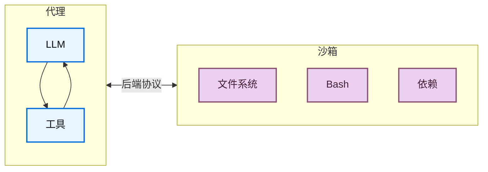
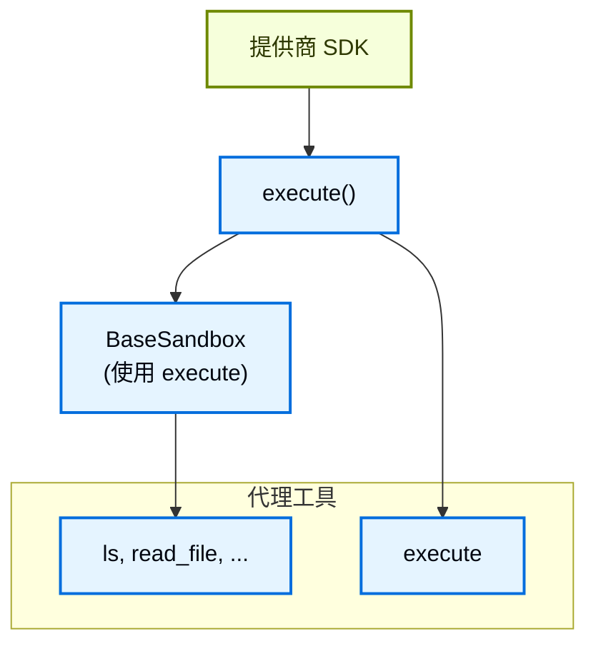
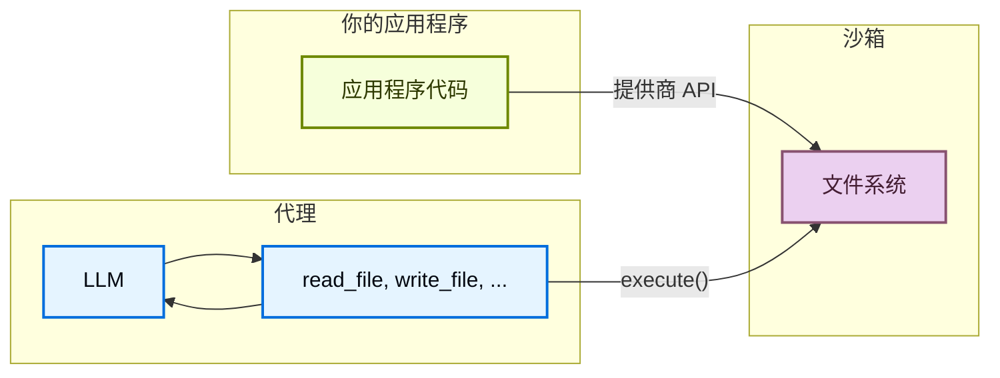

import SandboxBasicJs from '/snippets/deepagents-sandbox-basic-js.mdx';
import SandboxBasicPy from '/snippets/deepagents-sandbox-basic-py.mdx';
import SandboxLifecycleFactoryAssistantPy from '/snippets/deepagents-sandbox-lifecycle-factory-assistant-py.mdx';
import SandboxLifecycleFactoryAssistantTs from '/snippets/deepagents-sandbox-lifecycle-factory-assistant-ts.mdx';
import SandboxLifecycleFactoryThreadPy from '/snippets/deepagents-sandbox-lifecycle-factory-thread-py.mdx';
import SandboxLifecycleFactoryThreadTs from '/snippets/deepagents-sandbox-lifecycle-factory-thread-ts.mdx';

代理生成代码、与文件系统交互并运行 shell 命令。由于我们无法预测代理会做什么，因此确保其环境是隔离的非常重要，这样它就无法访问凭据、文件或网络。沙箱通过创建代理执行环境与宿主机系统之间的边界来提供这种隔离。

在 Deep Agents 中，**沙箱是[后端](/zh/oss/deepagents/backends)**，定义了代理运行的环境。与其他仅暴露文件操作的后端（State、Filesystem、Store）不同，沙箱后端还为代理提供了一个用于运行 shell 命令的 `execute` 工具。当你配置沙箱后端时，代理可以获得：

- 所有标准文件系统工具（`ls`、`read_file`、`write_file`、`edit_file`、`glob`、`grep`）
- 用于在沙箱中运行任意 shell 命令的 `execute` 工具
- 保护宿主机系统的安全边界



## 为什么使用沙箱？

使用沙箱是为了安全。
它们允许代理执行任意代码、访问文件和使用网络，而不会泄露你的凭据、本地文件或宿主机系统。
当代理自主运行时，这种隔离至关重要。

沙箱特别适用于以下场景：

- **编码代理**：自主运行的代理可以使用 shell、git、克隆仓库（许多提供商提供原生 git API，例如 [Daytona 的 git 操作](https://www.daytona.io/docs/en/git-operations/)），并运行 Docker-in-Docker 用于构建和测试流水线。
- **数据分析代理**——在安全、隔离的环境中加载文件、安装数据分析库（pandas、numpy 等）、运行统计计算以及创建 PowerPoint 演示文稿等输出。

<Tip>
    **使用 Deep Agents Code？** Deep Agents Code 通过 `--sandbox` 标志内置了沙箱支持。请参阅[使用远程沙箱](/zh/oss/deepagents/code/remote-sandboxes)了解 Deep Agents Code 特定的设置、标志（`--sandbox-id`、`--sandbox-setup`）和示例。
</Tip>

## 基本用法

这些示例假设你已经使用提供商的 SDK 创建了沙箱/devbox 并已设置好凭据。有关注册、认证和提供商特定的生命周期详细信息，请参阅[可用提供商](#可用提供商)。

:::js
<SandboxBasicJs />
:::

:::python
<SandboxBasicPy />
:::

## 可用提供商

:::python
有关提供商特定的设置、认证和生命周期详细信息，请参阅[沙箱集成](/zh/oss/integrations/sandboxes)。
:::

:::js
<Note>
技能需要 `deepagents>=1.7.0`。
</Note>

<div className="grid grid-cols-1 md:grid-cols-2 gap-3">
    <a href="/oss/integrations/providers/modal" className="flex items-center justify-center gap-1.5 p-2 rounded-lg border border-gray-200 dark:border-gray-700 hover:border-gray-300 dark:hover:border-gray-600 no-underline">
        
        
        <span className="font-semibold">Modal</span>
    </a>

    <a href="/oss/integrations/providers/daytona" className="flex items-center justify-center gap-1.5 p-2 rounded-lg border border-gray-200 dark:border-gray-700 hover:border-gray-300 dark:hover:border-gray-600 no-underline">
        
        
        <span className="font-semibold">Daytona</span>
    </a>

    <a href="/oss/integrations/providers/deno" className="flex items-center justify-center gap-1.5 p-2 rounded-lg border border-gray-200 dark:border-gray-700 hover:border-gray-300 dark:hover:border-gray-600 no-underline">
        
        
        <span className="font-semibold">Deno</span>
    </a>

    <a href="/oss/integrations/providers/node-vfs" className="flex items-center justify-center gap-1.5 p-2 rounded-lg border border-gray-200 dark:border-gray-700 hover:border-gray-300 dark:hover:border-gray-600 no-underline">
        
        
        <span className="font-semibold">Node VFS</span>
    </a>

    <a href="/langsmith/sandboxes" className="flex items-center justify-center gap-1.5 p-2 rounded-lg border border-gray-200 dark:border-gray-700 hover:border-gray-300 dark:hover:border-gray-600 no-underline">
        
        <span className="font-semibold">LangSmith</span>
    </a>
</div>
:::

没有找到你的提供商？你可以实现自己的沙箱后端。请参阅[贡献沙箱集成](/zh/oss/contributing/integrations-langchain)。

## 生命周期和作用域

大多数应用选择每个[线程](/zh/langsmith/use-threads)一个沙箱（线程作用域），或每个[助手](/zh/langsmith/assistants)的所有线程共享一个沙箱（助手作用域）。

沙箱会消耗资源并产生费用，直到被关闭。确保在不使用沙箱后将其关闭。

有关完整的生命周期表、异步[图工厂](/zh/langsmith/graph-rebuild)说明、TTL 行为、LangGraph Deployment 连接和客户端示例，请参阅生产部署中的[沙箱生命周期](/zh/oss/deepagents/going-to-production#生命周期)。

### 线程作用域（默认）

每个对话获得自己的沙箱。第一次运行时创建；同一线程上的后续轮次重用它。当线程结束或沙箱 TTL 过期时，环境消失。如下面的示例所示，使用提供商标签或元数据存储映射，以便每次运行解析到同一个沙箱。

<Tip>
当用户可能在空闲后返回时，在沙箱上配置 TTL，以便提供商自动删除或归档空闲环境。
</Tip>

<Tabs>
    <Tab title="Python">

<SandboxLifecycleFactoryThreadPy />

    </Tab>
    <Tab title="TypeScript">

<SandboxLifecycleFactoryThreadTs />

    </Tab>
</Tabs>

### 助手作用域

同一助手上的每个线程都重用同一个沙箱。文件、已安装的包和克隆的仓库在对话之间持久化。

<Warning>
助手作用域的沙箱会随时间累积沙箱内状态。使用沙箱提供商配置 TTL，使用快照定期重置，或实现清理逻辑，以使磁盘和内存不会无限增长。
</Warning>

<Tabs>
    <Tab title="Python">

<SandboxLifecycleFactoryAssistantPy />

    </Tab>
    <Tab title="TypeScript">

<SandboxLifecycleFactoryAssistantTs />

    </Tab>
</Tabs>

有关在图工厂之外进行手动创建、执行和拆除的详细信息，请参阅[基本用法](#基本用法)和[沙箱集成](/zh/oss/integrations/sandboxes)了解提供商特定的 API。

## 集成模式

根据代理运行的位置，有两种集成沙箱的架构模式。

### 代理在沙箱中模式

代理运行在沙箱内部，你通过网络与其通信。你构建一个预装了代理框架的 Docker 或 VM 镜像，在沙箱中运行它，并从外部连接以发送消息。

优点：

- ✅ 与本地开发高度一致。
- ✅ 代理与环境紧密耦合。

权衡：

- 🔴 API 密钥必须存在于沙箱内部（安全风险）。
- 🔴 更新需要重建镜像。
- 🔴 需要通信基础设施（WebSocket 或 HTTP 层）。

要在沙箱中运行代理，构建一个镜像并在其上安装 deepagents。

```dockerfile
FROM python:3.11
RUN pip install deepagents-code
```

然后在沙箱内部运行代理。
要使用沙箱内部的代理，你需要添加额外的基础设施来处理应用程序与沙箱内代理之间的通信。

### 沙箱作为工具模式

代理在你的机器或服务器上运行。当它需要执行代码时，它会调用沙箱工具（如 `execute`、`read_file` 或 `write_file`），这些工具调用提供商的 API 在远程沙箱中执行操作。

优点：

- ✅ 无需重建镜像即可即时更新代理代码。
- ✅ 代理状态与执行之间更清晰的分离。
    - API 密钥保留在沙箱外部。
    - 沙箱故障不会丢失代理状态。
    - 可以选择在多个沙箱中并行运行任务。
- ✅ 仅按执行时间付费。

权衡：

- 🔴 每次执行调用都有网络延迟。

:::python

```python Example
from daytona import Daytona
from deepagents import create_deep_agent
from dotenv import load_dotenv
from langchain_daytona import DaytonaSandbox


load_dotenv()

# 也可以使用 AgentCore、E2B、Runloop、Modal 实现
sandbox = Daytona().create()
backend = DaytonaSandbox(sandbox=sandbox)

agent = create_deep_agent(
    model="google_genai:gemini-3.5-flash",
    backend=backend,
    system_prompt="你是一个具有沙箱访问权限的编码助手。你可以在沙箱中创建和运行代码。",
)

try:
    result = agent.invoke(
        {
            "messages": [
                {
                    "role": "user",
                    "content": "创建一个 Hello World Python 脚本并运行它",
                }
            ]
        }
    )
    print(result["messages"][-1].content)
except Exception:
    # 可选：在异常时主动删除沙箱
    sandbox.stop()
    raise
```

:::

:::js

```typescript Example
import "dotenv/config";
import { DaytonaSandbox } from "@langchain/daytona";
import { createDeepAgent } from "deepagents";

// 也可以使用 E2B、Runloop、Modal 实现
const sandbox = await DaytonaSandbox.create();

const agent = createDeepAgent({
  backend: sandbox,
  systemPrompt:
    "你是一个具有沙箱访问权限的编码助手。你可以在沙箱中创建和运行代码。",
});

try {
  const result = await agent.invoke({
    messages: [
      {
        role: "user",
        content: "创建一个 Hello World Python 脚本并运行它",
      },
    ],
  });
  const lastMessage = result.messages[result.messages.length - 1];
  console.log(
    typeof lastMessage.content === "string"
      ? lastMessage.content
      : String(lastMessage.content),
  );
} catch (err) {
  // 可选：在异常时主动关闭沙箱
  await sandbox.close();
  throw err;
}
```

:::

本文档中的示例使用沙箱作为工具模式。
当你的提供商 SDK 处理通信层并且你希望生产环境与本地开发一致时，选择代理在沙箱中模式。
当你需要快速迭代代理逻辑、将 API 密钥保留在沙箱外部或更倾向于分离关注点时，选择沙箱作为工具模式。

## 沙箱的工作原理

### 隔离边界

所有沙箱提供商都保护宿主机系统免受代理的文件系统和 shell 操作的影响。代理无法读取你的本地文件、访问你机器上的环境变量或干扰其他进程。然而，沙箱本身并**不能**防止：

- **上下文注入**：控制代理部分输入的攻击者可以指示它在沙箱内运行任意命令。沙箱是隔离的，但代理在其中拥有完全控制权。
- **网络泄露**：除非网络访问被阻止，否则上下文注入的代理可以通过 HTTP 或 DNS 将数据发送出沙箱。某些提供商支持阻止网络访问（例如 Modal 上的 `blockNetwork: true`）。

请参阅[安全考量](#安全考量)了解如何处理密钥和缓解这些风险。

### `execute` 方法

沙箱后端具有简单的架构：提供商必须实现的唯一方法是 `execute()`，它运行一个 shell 命令并返回其输出。所有其他文件系统操作（`read`、`write`、`edit`、`ls`、`glob`、`grep`）都由 @[`BaseSandbox`] 基类在 `execute()` 之上构建，该基类构建脚本并通过 `execute()` 在沙箱内运行它们。



这种设计意味着：
- **添加新提供商很简单。** 实现 `execute()`——基类处理其余所有内容。
- **`execute` 工具有条件可用。** 在每次模型调用时，引擎会检查后端是否实现了 @[`SandboxBackendProtocol`]。如果没有，该工具会被过滤掉，代理永远不会看到它。

当代理调用 `execute` 工具时，它提供一个 `command` 字符串，并收到合并的 stdout/stderr、退出码，以及如果输出过大时的截断通知。

你也可以在应用程序代码中直接调用后端的 `execute()` 方法。

:::python
<Tabs>
    <Tab title="Daytona">
        <CodeGroup>
            ```bash pip
            pip install langchain-daytona
            ```

            ```bash uv
            uv add langchain-daytona
            ```
        </CodeGroup>

        ```python
        from daytona import Daytona

        from langchain_daytona import DaytonaSandbox

        sandbox = Daytona().create()
        backend = DaytonaSandbox(sandbox=sandbox)

        result = backend.execute("python --version")
        print(result.output)
        ```
    </Tab>
    <Tab title="Modal">
        ```python
        import modal

        from langchain_modal import ModalSandbox

        app = modal.App.lookup("your-app")
        modal_sandbox = modal.Sandbox.create(app=app)
        backend = ModalSandbox(sandbox=modal_sandbox)

        result = backend.execute("python --version")
        print(result.output)
        ```
    </Tab>
    <Tab title="Runloop">
        <CodeGroup>
            ```bash pip
            pip install langchain-runloop
            ```

            ```bash uv
            uv add langchain-runloop
            ```
        </CodeGroup>

        ```python
        from runloop_api_client import RunloopSDK

        from langchain_runloop import RunloopSandbox

        api_key = "..."
        client = RunloopSDK(bearer_token=api_key)

        devbox = client.devbox.create()
        backend = RunloopSandbox(devbox=devbox)

        try:
            result = backend.execute("python --version")
            print(result.output)
        finally:
            devbox.shutdown()
        ```
    </Tab>
    <Tab title="AgentCore">
        <CodeGroup>
            ```bash pip
            pip install langchain-agentcore-codeinterpreter
            ```

            ```bash uv
            uv add langchain-agentcore-codeinterpreter
            ```
        </CodeGroup>

        ```python
        from bedrock_agentcore.tools.code_interpreter_client import CodeInterpreter

        from langchain_agentcore_codeinterpreter import AgentCoreSandbox

        interpreter = CodeInterpreter(region="us-west-2")
        interpreter.start()

        backend = AgentCoreSandbox(interpreter=interpreter)

        try:
            result = backend.execute("python3 --version")
            print(result.output)
        finally:
            interpreter.stop()
        ```
    </Tab>
    <Tab title="LangSmith">
        ```python
        from langsmith.sandbox import SandboxClient

        from deepagents.backends.langsmith import LangSmithSandbox

        client = SandboxClient()
        ls_sandbox = client.create_sandbox(template_name="deepagents-deploy")
        backend = LangSmithSandbox(sandbox=ls_sandbox)

        result = backend.execute("python --version")
        print(result.output)
        ```
    </Tab>
</Tabs>
:::

例如：

```
4
[命令成功执行，退出码 0]
```

```
bash: foobar: command not found
[命令执行失败，退出码 127]
```

如果命令产生非常大的输出，结果会自动保存到文件中，并指示代理使用 `read_file` 来增量访问它。这可以防止上下文窗口溢出。

### 文件访问的两个层面

文件进出沙箱有两种不同的方式，理解何时使用哪种方式非常重要：

**代理文件系统工具**：`read_file`、`write_file`、`edit_file`、`ls`、`glob`、`grep` 和 `execute` 是 LLM 在执行期间调用的工具。它们通过 `execute()` 在沙箱内部执行。代理使用它们来读取代码、写入文件以及作为任务的一部分运行命令。

**文件传输 API**：`uploadFiles()` 和 `downloadFiles()` 方法由你的应用程序代码调用。它们使用提供商的原生文件传输 API（而不是 shell 命令），旨在在宿主机环境和沙箱之间移动文件。使用它们来：
- **初始化沙箱**——在代理运行前植入源代码、配置或数据
- **检索产物**——在代理完成后获取（生成的代码、构建输出、报告）
- **预填充依赖**——代理将需要的依赖



:::js
## 处理文件

### 初始化沙箱

使用 `uploadFiles()` 在代理运行前填充沙箱。文件内容以 `Uint8Array` 形式提供：

```typescript
const encoder = new TextEncoder();
const responses = await sandbox.uploadFiles([
  ["src/index.js", encoder.encode("console.log('Hello')")],
  ["package.json", encoder.encode('{"name": "my-app"}')],
]);

// 每个响应指示成功或失败
for (const res of responses) {
  if (res.error) {
    console.error(`上传 ${res.path} 失败: ${res.error}`);
  }
}
```

### 检索产物

代理完成后，使用 `downloadFiles()` 从沙箱检索文件：

```typescript
const results = await sandbox.downloadFiles(["src/index.js", "output.txt"]);

const decoder = new TextDecoder();
for (const result of results) {
  if (result.content) {
    console.log(`${result.path}: ${decoder.decode(result.content)}`);
  } else {
    console.error(`下载 ${result.path} 失败: ${result.error}`);
  }
}
```

<Note>
在沙箱内部，代理使用自己的文件系统工具（`read_file`、`write_file`），而不是 `uploadFiles` 或 `downloadFiles`。这些方法是为你的应用程序代码在宿主和沙箱之间移动文件而设计的。
</Note>
:::

:::python
## 处理文件

deepagents 沙箱后端支持用于在应用程序和沙箱之间移动文件的文件传输 API。

### 初始化沙箱

使用 `upload_files()` 在代理运行前填充沙箱。路径必须是绝对路径，内容为 `bytes`：

<Tabs>
    <Tab title="Daytona">
        <CodeGroup>
            ```bash pip
            pip install langchain-daytona
            ```

            ```bash uv
            uv add langchain-daytona
            ```
        </CodeGroup>

        ```python
        from daytona import Daytona

        from langchain_daytona import DaytonaSandbox

        sandbox = Daytona().create()
        backend = DaytonaSandbox(sandbox=sandbox)

        backend.upload_files(
            [
                ("/src/index.py", b"print('Hello')\n"),
                ("/pyproject.toml", b"[project]\nname = 'my-app'\n"),
            ]
        )
        ```
    </Tab>
    <Tab title="Modal">
        ```python
        import modal

        from langchain_modal import ModalSandbox

        app = modal.App.lookup("your-app")
        modal_sandbox = modal.Sandbox.create(app=app)
        backend = ModalSandbox(sandbox=modal_sandbox)

        backend.upload_files(
            [
                ("/src/index.py", b"print('Hello')\n"),
                ("/pyproject.toml", b"[project]\nname = 'my-app'\n"),
            ]
        )
        ```
    </Tab>
    <Tab title="Runloop">
        <CodeGroup>
            ```bash pip
            pip install langchain-runloop
            ```

            ```bash uv
            uv add langchain-runloop
            ```
        </CodeGroup>

        ```python
        from runloop_api_client import RunloopSDK

        from langchain_runloop import RunloopSandbox

        api_key = "..."
        client = RunloopSDK(bearer_token=api_key)

        devbox = client.devbox.create()
        backend = RunloopSandbox(devbox=devbox)

        backend.upload_files(
            [
                ("/src/index.py", b"print('Hello')\n"),
                ("/pyproject.toml", b"[project]\nname = 'my-app'\n"),
            ]
        )
        ```
    </Tab>
    <Tab title="AgentCore">
        <CodeGroup>
            ```bash pip
            pip install langchain-agentcore-codeinterpreter
            ```

            ```bash uv
            uv add langchain-agentcore-codeinterpreter
            ```
        </CodeGroup>

        ```python
        from bedrock_agentcore.tools.code_interpreter_client import CodeInterpreter

        from langchain_agentcore_codeinterpreter import AgentCoreSandbox

        interpreter = CodeInterpreter(region="us-west-2")
        interpreter.start()

        backend = AgentCoreSandbox(interpreter=interpreter)

        backend.upload_files(
            [
                ("hello.py", b"print('Hello')\n"),
                ("data.csv", b"name,value\na,1\nb,2\n"),
            ]
        )
        ```
    </Tab>
    <Tab title="LangSmith">

        ```python
        from langsmith.sandbox import SandboxClient

        from deepagents.backends.langsmith import LangSmithSandbox

        client = SandboxClient()
        ls_sandbox = client.create_sandbox(template_name="deepagents-deploy")
        backend = LangSmithSandbox(sandbox=ls_sandbox)

        backend.upload_files(
            [
                ("/src/index.py", b"print('Hello')\n"),
                ("/pyproject.toml", b"[project]\nname = 'my-app'\n"),
            ]
        )
        ```
    </Tab>
</Tabs>

### 检索产物

代理完成后，使用 `download_files()` 从沙箱检索文件：

<Tabs>
    <Tab title="Daytona">
        <CodeGroup>
            ```bash pip
            pip install langchain-daytona
            ```

            ```bash uv
            uv add langchain-daytona
            ```
        </CodeGroup>

        ```python
        from daytona import Daytona

        from langchain_daytona import DaytonaSandbox

        sandbox = Daytona().create()
        backend = DaytonaSandbox(sandbox=sandbox)

        results = backend.download_files(["/src/index.py", "/output.txt"])
        for result in results:
            if result.content is not None:
                print(f"{result.path}: {result.content.decode()}")
            else:
                print(f"下载 {result.path} 失败: {result.error}")
        ```
    </Tab>
    <Tab title="Modal">
        ```python
        import modal

        from langchain_modal import ModalSandbox

        app = modal.App.lookup("your-app")
        modal_sandbox = modal.Sandbox.create(app=app)
        backend = ModalSandbox(sandbox=modal_sandbox)

        results = backend.download_files(["/src/index.py", "/output.txt"])
        for result in results:
            if result.content is not None:
                print(f"{result.path}: {result.content.decode()}")
            else:
                print(f"下载 {result.path} 失败: {result.error}")
        ```
    </Tab>
    <Tab title="Runloop">
        <CodeGroup>
            ```bash pip
            pip install langchain-runloop
            ```

            ```bash uv
            uv add langchain-runloop
            ```
        </CodeGroup>

        ```python
        from runloop_api_client import RunloopSDK

        from langchain_runloop import RunloopSandbox

        api_key = "..."
        client = RunloopSDK(bearer_token=api_key)

        devbox = client.devbox.create()
        backend = RunloopSandbox(devbox=devbox)

        results = backend.download_files(["/src/index.py", "/output.txt"])
        for result in results:
            if result.content is not None:
                print(f"{result.path}: {result.content.decode()}")
            else:
                print(f"下载 {result.path} 失败: {result.error}")
        ```
    </Tab>
    <Tab title="AgentCore">
        <CodeGroup>
            ```bash pip
            pip install langchain-agentcore-codeinterpreter
            ```

            ```bash uv
            uv add langchain-agentcore-codeinterpreter
            ```
        </CodeGroup>

        ```python
        from bedrock_agentcore.tools.code_interpreter_client import CodeInterpreter

        from langchain_agentcore_codeinterpreter import AgentCoreSandbox

        interpreter = CodeInterpreter(region="us-west-2")
        interpreter.start()

        backend = AgentCoreSandbox(interpreter=interpreter)

        results = backend.download_files(["hello.py"])
        for result in results:
            if result.content is not None:
                print(f"{result.path}: {result.content.decode()}")
            else:
                print(f"下载 {result.path} 失败: {result.error}")

        interpreter.stop()
        ```
    </Tab>
    <Tab title="LangSmith">
        ```python
        from langsmith.sandbox import SandboxClient

        from deepagents.backends.langsmith import LangSmithSandbox

        client = SandboxClient()
        ls_sandbox = client.create_sandbox(template_name="deepagents-deploy")
        backend = LangSmithSandbox(sandbox=ls_sandbox)

        results = backend.download_files(["/src/index.py", "/output.txt"])
        for result in results:
            if result.content is not None:
                print(f"{result.path}: {result.content.decode()}")
            else:
                print(f"下载 {result.path} 失败: {result.error}")
        ```
    </Tab>
</Tabs>

<Note>
在沙箱内部，代理使用文件系统工具（`read_file`、`write_file`）。`upload_files` 和 `download_files` 方法是给你的应用程序代码在宿主和沙箱之间移动文件用的。
</Note>
:::

## 安全考量

沙箱将代码执行与宿主机系统隔离，但它们不能防止**上下文注入**。控制代理部分输入的攻击者可以指示它从沙箱内读取文件、运行命令或窃取数据。这使得沙箱内的凭据尤其危险。

<Warning>
**切勿将密钥放入沙箱内部。** 注入到沙箱中的 API 密钥、令牌、数据库凭据和其他密钥（通过环境变量、挂载的文件或 `secrets` 选项）可以被上下文注入的代理读取和窃取。这甚至适用于短期或限定范围的凭据——如果代理可以访问它们，攻击者也可以。
</Warning>

### 安全地处理密钥

如果你的代理需要调用经过身份验证的 API 或访问受保护资源，你有两个选择：

1. **将密钥保留在沙箱外部的工具中。** 定义在宿主机环境（而不是沙箱内部）运行的工具，并在那里处理身份验证。代理按名称调用这些工具，但永远不会看到凭据。这是推荐的方法。

2. **使用注入凭据的网络代理。** 某些沙箱提供商支持拦截来自沙箱的出站 HTTP 请求并在转发前附加凭据（例如 `Authorization` 标头）的代理。代理永远不会看到密钥——它只需向 URL 发出普通请求。这种方法目前还没有在各提供商间广泛可用。

<Warning>
如果你必须将密钥注入沙箱（不推荐），请采取以下预防措施：

- 启用[人在环](/zh/oss/deepagents/human-in-the-loop)批准**所有**工具调用，而不仅仅是敏感调用
- 阻止或限制沙箱的网络访问以限制泄露路径
- 使用尽可能窄的凭据范围和尽可能短的生命周期
- 监控沙箱网络流量以发现意外的出站请求

即使采取了这些保护措施，这仍然是不安全的变通方法。足够有创意的上下文注入攻击可以绕过输出过滤和 HITL 审查。
</Warning>

### 通用最佳实践

- 在应用程序中采取行动之前审查沙箱输出
- 不需要时阻止沙箱网络访问
- 使用[中间件](/zh/oss/langchain/middleware)过滤或编辑工具输出中的敏感模式
- 将沙箱内部产生的所有内容视为不受信任的输入