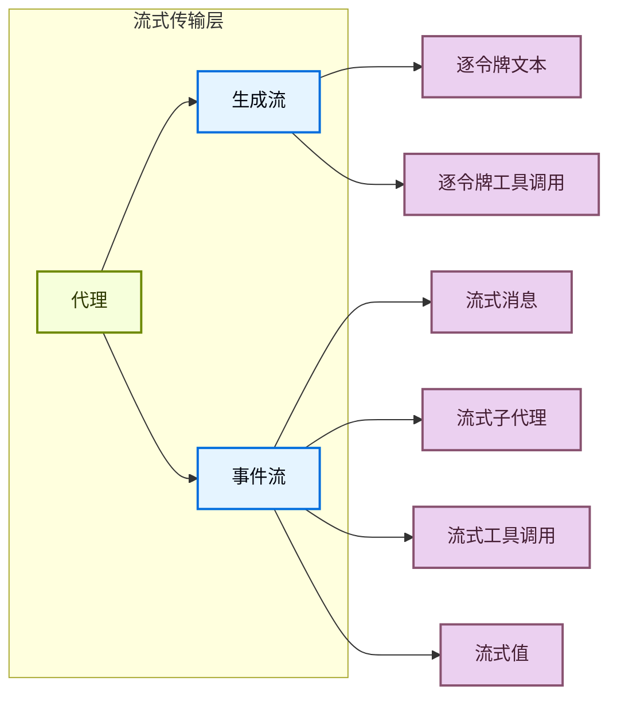

Deep Agents 支持两种流式传输模式：

1. **令牌流式传输**——`generation` 流提供逐令牌的模型输出以进行实时渲染。
2. **事件流式传输**——`events` 流是令牌之上的结构化投影，提供如 `stream.subagents` 和 `stream.tool_calls` 这样的投影。参见[事件流式传输](/oss/deepagents/event-streaming)页面。



## 事件流式传输

Deep Agents 暴露了 `stream_events` / `streamEvents`——LangGraph 流式传输 API 的一个浅层包装器，添加了 `subagents` 投影。关于 `messages`、`values`、`tool_calls` 和自定义事件的完整参考，请参见[事件流式传输](/oss/deepagents/event-streaming)。

## 生成流

`stream_generations` / `streamGenerations` 流式传输原始生成块，提供模型输出的实时逐块渲染。工作方式如下：

- 每个块包含与单个提供商的[生成块](/oss/langchain/concepts#generation)匹配的 `generations`。
- 块还包括添加的委托的子代理的 `subagent_generations`。
- 块包括元数据，如延迟、令牌计数、模型名称和流类型。

```python
from deepagents import create_deep_agent

agent = create_deep_agent(
    model="openai:gpt-5.4",
)

for chunk in agent.stream_generations(
    {"messages": [{"role": "user", "content": "你好！"}]},
):
    for gen in chunk.generations:
        print(gen.content, end="", flush=True)

    for subagent_gen in chunk.subagent_generations:
        print(f"[{subagent_gen.name}]")
        for gen in subagent_gen.generations:
            print(gen.content, end="", flush=True)
```

输出：

```
你好！我是深度代理。我能帮你什么吗？
```

### 子代理生成

当代理调用子代理时，子代理的生成通过 `subagent_generations` 字段在父流的块中流回。每个条目包含：

- `name`——子代理的名称。
- `generations`——子代理的生成块。
- `metadata`——时间戳和标识信息。

```python
for chunk in agent.stream_generations(
    {"messages": [{"role": "user", "content": "你好！"}]},
):
    for gen in chunk.generations:
        print(gen.content, end="", flush=True)

    for subagent in chunk.subagent_generations:
        for gen in subagent.generations:
            print(gen.content, end="", flush=True)
```

### 生成块字段

每个生成块包含：

| 字段 | 类型 | 描述 |
| --- | --- | --- |
| `generations` | `list[GenerationChunk]` | 提供商的原生生成块。 |
| `subagent_generations` | `list[SubagentGenerationChunk]` | 子代理的生成块。 |
| `latency` | `float` | 生成的总延迟（秒）。 |
| `model_name` | `str` | 使用的模型名称。 |
| `token_count` | `int` | 生成的令牌数量。 |
| `stream_type` | `str` | 流类型（例如 `text`、`tool_use`）。 |

### 限制

生成流不会分叉出子代理的子图结构——它提供原子的子代理生成块。有关子代理结构，请参见[事件流式传输](#事件流式传输)页面。

## 使用思考模型流式传输

某些模型（如 DeepSeek R1 和 Claude 3.7 Sonnet）在最终输出之前生成**思考令牌**。对于这些模型，`generation_chunk` 在块上包含一个 `reasoning` 字段，以及来自推理链中模型的原始文本。

```python
for chunk in agent.stream_generations(
    {"messages": [{"role": "user", "content": "你好！"}]},
):
    for gen in chunk.generations:
        # 推理令牌出现在最终输出之前
        text = gen.reasoning if gen.reasoning else gen.content
        print(text, end="", flush=True)
```

## 选择流式传输模式

| 模式 | 方法 | 适用场景 |
| --- | --- | --- |
| **生成流** | `stream_generations` | 需要原子生成块的逐令牌渲染。 |
| **事件流** | `stream_events` | 需要结构化的运行生命周期。 |

## FastAPI 集成

以下是一个使用生成块的 FastAPI 端点：

```python
from fastapi import FastAPI
from fastapi.responses import StreamingResponse
from deepagents import create_deep_agent

app = FastAPI()
agent = create_deep_agent(model="openai:gpt-5.4")


@app.post("/chat")
async def chat(message: str):
    async def generate():
        async for chunk in agent.astream_generations(
            {"messages": [{"role": "user", "content": message}]},
        ):
            for gen in chunk.generations:
                if gen.content:
                    yield f"data: {gen.content}\n\n"
            for subagent in chunk.subagent_generations:
                for gen in subagent.generations:
                    if gen.content:
                        yield f"data: [{subagent.name}] {gen.content}\n\n"

    return StreamingResponse(generate(), media_type="text/event-stream")
```

## 相关

- [事件流式传输](/oss/deepagents/event-streaming)：结构化流并发的子代理投影。
- [子代理](/oss/deepagents/subagents)：配置同步子代理。
- [异步子代理](/oss/deepagents/async-subagents)：在后台运行任务。