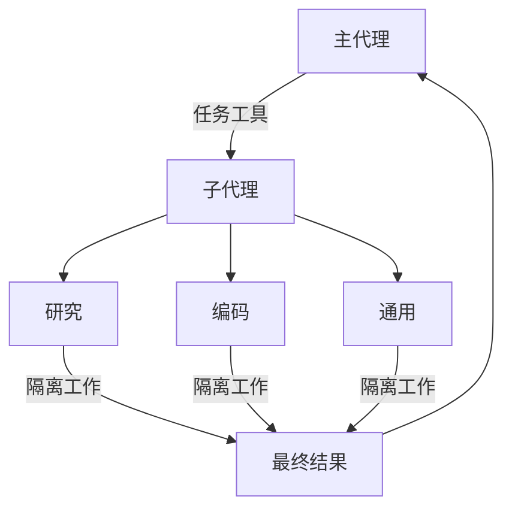

import SubagentBasicPy from '/snippets/code-samples/subagent-basic-py.mdx';
import SubagentBasicJs from '/snippets/code-samples/subagent-basic-js.mdx';

深度代理可以创建子代理来委派工作。你可以在 `subagents` 参数中指定自定义子代理。子代理对于[上下文隔离](https://www.dbreunig.com/2025/06/26/how-to-fix-your-context.html#context-quarantine)（保持主代理上下文清洁）以及提供专业化指令非常有用。

本页面涵盖**同步**子代理，即监督者会阻塞直到子代理完成。对于长时间运行的任务、并行工作流或需要中途引导和取消的场景，请参阅[异步子代理](/zh/oss/deepagents/async-subagents)。



## 为什么要使用子代理？

子代理解决了**上下文膨胀问题**。当代理使用产生大量输出的工具（网络搜索、文件读取、数据库查询）时，上下文窗口会迅速被中间结果填满。子代理将这些详细工作隔离——主代理只接收最终结果，而不是产生结果所需的数十次工具调用。

**何时使用子代理：**
- ✅ 会杂乱主代理上下文的多步骤任务
- ✅ 需要自定义指令或工具的专业领域
- ✅ 需要不同模型能力的任务
- ✅ 当你想让主代理专注于高层协调时

**何时不应使用子代理：**
- ❌ 简单的单步任务
- ❌ 当需要维护中间上下文时
- ❌ 当开销超过收益时

## 配置

`subagents` 应为字典列表或 @[`CompiledSubAgent`] 对象。有两种类型：

### 默认子代理

Deep Agents 会自动添加一个同步的 `general-purpose` 子代理，除非你已经提供了一个同名的同步子代理。

`general-purpose` 子代理默认具有文件系统工具，并且可以通过额外的工具/中间件进行自定义。

- 要替换它，传入一个名为 `general-purpose` 的自定义子代理。
- 要重命名或修改自动添加版本的提示，在活动的[配置档案](/zh/oss/deepagents/profiles#harness-profiles)上设置 `general_purpose_subagent=GeneralPurposeSubagentProfile(...)`。
- 要禁用它，请参阅下面的[无子代理运行](#无子代理运行)。

### 无子代理运行

要在没有 `task` 工具的情况下运行代理，需要做两件事：

1. 在活动的[配置档案](/zh/oss/deepagents/profiles#harness-profiles)上设置 `general_purpose_subagent=GeneralPurposeSubagentProfile(enabled=False)`。
2. 不要通过 `subagents=` 向 `create_deep_agent` 传递任何同步子代理。

Deep Agents 仅在存在至少一个同步子代理时才会附加 `SubAgentMiddleware`（以及 `task` 工具）。当既没有默认子代理也没有调用者提供的子代理时，代理将在没有委派的情况下运行。

异步子代理不受影响——它们通过自己的中间件和工具流动，详见[异步子代理](/zh/oss/deepagents/async-subagents)。

<Tip>
    不要在这里使用 `excluded_middleware`——`SubAgentMiddleware` 是必需的脚手架，列出它会引发 `ValueError`。`general_purpose_subagent.enabled = False` 是受支持的配置方式。
</Tip>

## 自定义子代理

你可以通过 `subagents` 参数定义具有特定工具的专业化子代理。例如，作为代码审查员、网络研究员或测试运行器。

对于大多数用例，将子代理定义为字典形式，详见[子代理字典](#子代理字典)。对于复杂工作流，使用 [`CompiledSubAgent`](#compiledsubagent)：

### 子代理（字典方式）

定义匹配 @[`SubAgent`] 规范的字典，包含以下字段：

:::python

| 字段 | 类型 | 描述 |
|-------|------|-------------|
| `name` | `str` | 必填。子代理的唯一标识符。主代理在调用 `task()` 工具时使用此名称。子代理名称会成为 `AIMessage` 和流式传输的元数据，有助于区分不同的代理。 |
| `description` | `str` | 必填。描述此子代理的功能。需要具体且面向操作。主代理使用此描述来决定何时委派。 |
| `system_prompt` | `str` | 必填。子代理的指令。自定义子代理必须定义自己的提示。包括工具使用指导和输出格式要求。<br></br>不从主代理继承。 |
| `tools` | `list[Callable]` | 可选。子代理可以使用的工具。保持最小化，只包含需要的工具。<br></br>默认从主代理继承。当指定时，完全覆盖继承的工具。 |
| `model` | `str` \| `BaseChatModel` | 可选。覆盖主代理的模型。省略则使用主代理的模型。<br></br>默认从主代理继承。你可以传入模型标识符字符串如 `'openai:gpt-5.4'`（使用 `'provider:model'` 格式）或 LangChain 聊天模型对象（`init_chat_model("gpt-5.4")` 或 `ChatOpenAI(model="gpt-5.4")`）。 |
| `middleware` | `list[Middleware]` | 可选。用于自定义行为、日志记录或速率限制的额外中间件。<br></br>不从主代理继承。 |
| `interrupt_on` | `dict[str, bool]` | 可选。为特定工具配置[人在环中](/zh/oss/deepagents/human-in-the-loop)。子代理值覆盖主代理。需要检查点器。<br></br>默认从主代理继承。子代理值覆盖默认值。 |
| `skills` | `list[str]` | 可选。[技能](/zh/oss/deepagents/skills)源路径。当指定时，子代理将从此目录加载技能（例如 `["/skills/research/", "/skills/web-search/"]`）。这允许子代理拥有与主代理不同的技能集。<br></br>不从主代理继承。只有通用子代理继承主代理的技能。当子代理拥有技能时，它会运行自己独立的 @[`SkillsMiddleware`] 实例。技能状态完全隔离——子代理加载的技能对父代理不可见，反之亦然。 |
| `response_format` | `ResponseFormat` | 可选。子代理的[结构化输出](/zh/oss/langchain/structured-output)模式。设置后，父代理接收子代理的结果为 JSON 而非自由文本。接受 Pydantic 模型、`ToolStrategy(...)`、`ProviderStrategy(...)` 或原始模式类型。详见[结构化输出](#结构化输出)。 |
| `permissions` | `list[FilesystemPermission]` | 可选。子代理的[文件系统权限规则](/zh/oss/deepagents/permissions)。设置后，**替换**父代理的权限。<br></br>默认从主代理继承。 |

:::

:::js

| 字段 | 类型 | 描述 |
|-------|------|-------------|
| `name` | `str` | 必填。子代理的唯一标识符。主代理在调用 `task()` 工具时使用此名称。子代理名称会成为 `AIMessage` 和流式传输的元数据，有助于区分不同的代理。 |
| `description` | `str` | 必填。描述此子代理的功能。需要具体且面向操作。主代理使用此描述来决定何时委派。 |
| `system_prompt` | `str` | 必填。子代理的指令。自定义子代理必须定义自己的提示。包括工具使用指导和输出格式要求。<br></br>不从主代理继承。 |
| `tools` | `list[Callable]` | 可选。子代理可以使用的工具。保持最小化，只包含需要的工具。<br></br>默认从主代理继承。当指定时，完全覆盖继承的工具。 |
| `model` | `str` \| `BaseChatModel` | 可选。覆盖主代理的模型。省略则使用主代理的模型。<br></br>默认从主代理继承。你可以传入模型标识符字符串如 `'openai:gpt-5.4'`（使用 `'provider:model'` 格式）或 LangChain 聊天模型对象（`await initChatModel("gpt-5.4")` 或 `new ChatOpenAI({ model: "gpt-5.4" })`）。 |
| `middleware` | `list[Middleware]` | 可选。用于自定义行为、日志记录或速率限制的额外中间件。<br></br>不从主代理继承。 |
| `interrupt_on` | `dict[str, bool]` | 可选。为特定工具配置[人在环中](/zh/oss/deepagents/human-in-the-loop)。子代理值覆盖主代理。需要检查点器。<br></br>默认从主代理继承。子代理值覆盖默认值。 |
| `skills` | `list[str]` | 可选。[技能](/zh/oss/deepagents/skills)源路径。当指定时，子代理将从此目录加载技能（例如 `["/skills/research/", "/skills/web-search/"]`）。这允许子代理拥有与主代理不同的技能集。<br></br>不从主代理继承。只有通用子代理继承主代理的技能。当子代理拥有技能时，它会运行自己独立的 @[`SkillsMiddleware`] 实例。技能状态完全隔离——子代理加载的技能对父代理不可见，反之亦然。 |
| `responseFormat` | `ResponseFormat` | 可选。子代理的[结构化输出](/zh/oss/langchain/structured-output)模式。设置后，父代理接收子代理的结果为 JSON 而非自由文本。接受 Zod 模式、JSON schema 对象、`toolStrategy(...)` 或 `providerStrategy(...)`。详见[结构化输出](#结构化输出)。 |

:::

### CompiledSubAgent

对于复杂工作流，使用预构建的 LangGraph 图作为 @[`CompiledSubAgent`]：

| 字段 | 类型 | 描述 |
|-------|------|-------------|
| `name` | `str` | 必填。子代理的唯一标识符。子代理名称会成为 `AIMessage` 和流式传输的元数据，有助于区分不同的代理。 |
| `description` | `str` | 必填。此子代理的功能。 |
| `runnable` | `Runnable` | 必填。已编译的 LangGraph 图（必须先调用 `.compile()`）。 |

## 使用 SubAgent

:::python
<SubagentBasicPy />
:::

:::js
<SubagentBasicJs />
:::

## 使用 CompiledSubAgent

对于更复杂的用例，你可以通过 @[`CompiledSubAgent`] 提供自定义子代理。
你可以使用 LangChain 的 @[`create_agent`] 或通过[图 API](/zh/oss/langgraph/graph-api) 创建自定义 LangGraph 图来创建自定义子代理。

如果你正在创建自定义 LangGraph 图，请确保图具有名为 `"messages"` 的[状态键](/zh/oss/langgraph/quickstart#2-define-state)：

:::python
```python
from deepagents import create_deep_agent, CompiledSubAgent
from langchain.agents import create_agent

# 创建自定义代理图
custom_graph = create_agent(
    model=your_model,
    tools=specialized_tools,
    prompt="你是一个专门用于数据分析的代理..."
)

# 将其用作自定义子代理
custom_subagent = CompiledSubAgent(
    name="data-analyzer",
    description="专门用于复杂数据分析任务的代理",
    runnable=custom_graph
)

subagents = [custom_subagent]

agent = create_deep_agent(
    model="google_genai:gemini-3.5-flash",
    tools=[internet_search],
    system_prompt=research_instructions,
    subagents=subagents
)
```
:::

:::js
```typescript
import { createDeepAgent, CompiledSubAgent } from "deepagents";
import { createAgent } from "langchain";

// 创建自定义代理图
const customGraph = createAgent({
  model: yourModel,
  tools: specializedTools,
  prompt: "你是一个专门用于数据分析的代理...",
});

// 将其用作自定义子代理
const customSubagent: CompiledSubAgent = {
  name: "data-analyzer",
  description: "专门用于复杂数据分析任务的代理",
  runnable: customGraph,
};

const subagents = [customSubagent];

const agent = createDeepAgent({
  model: "google_genai:gemini-3.5-flash",
  tools: [internetSearch],
  systemPrompt: researchInstructions,
  subagents: subagents,
});
```
:::

## 流式传输

当流式传输追踪信息时，代理名称可在元数据中作为 `lc_agent_name` 使用。
在查看追踪信息时，你可以使用此元数据来区分数据来自哪个代理。

以下示例创建了一个名为 `main-agent` 的深度代理和一个名为 `research-agent` 的子代理：

```python
import os
from typing import Literal
from tavily import TavilyClient
from deepagents import create_deep_agent

tavily_client = TavilyClient(api_key=os.environ["TAVILY_API_KEY"])

def internet_search(
    query: str,
    max_results: int = 5,
    topic: Literal["general", "news", "finance"] = "general",
    include_raw_content: bool = False,
):
    """运行网络搜索"""
    return tavily_client.search(
        query,
        max_results=max_results,
        include_raw_content=include_raw_content,
        topic=topic,
    )

research_subagent = {
    "name": "research-agent",
    "description": "用于研究更深入的问题",
    "system_prompt": "你是一个优秀的研究员",
    "tools": [internet_search],
    "model": "google_genai:gemini-3.5-flash",  # 可选覆盖，默认为主代理模型
}
subagents = [research_subagent]

agent = create_deep_agent(
    model="google_genai:gemini-3.5-flash",
    subagents=subagents,
    name="main-agent"
)
```

当你向深度代理发送提示时，由子代理或深度代理执行的所有代理运行都会在元数据中包含代理名称。
在本例中，名为 `"research-agent"` 的子代理将在任何关联的代理运行元数据中包含 `{'lc_agent_name': 'research-agent'}`：


## 结构化输出

子代理支持[结构化输出](/zh/oss/langchain/structured-output)，因此父代理可以接收可预测、可解析的 JSON，而非自由文本。

:::python
<Note>
    子代理的结构化输出需要 `deepagents>=0.5.3`。
</Note>

在子代理配置上传递 `response_format`。当子代理完成时，其结构化响应会被 JSON 序列化并作为 `ToolMessage` 内容返回给父代理。该模式接受 @[`create_agent`] 支持的任何内容：Pydantic 模型、`ToolStrategy(...)`、`ProviderStrategy(...)` 或原始模式类型。

```python
from pydantic import BaseModel, Field

from deepagents import create_deep_agent


class ResearchFindings(BaseModel):
    """研究任务的结构化发现。"""
    summary: str = Field(description="发现摘要")
    confidence: float = Field(description="置信度分数，0 到 1")
    sources: list[str] = Field(description="来源 URL 列表")

research_subagent = {
    "name": "researcher",
    "description": "研究主题并返回结构化发现",
    "system_prompt": "彻底研究给定主题。返回你的发现。",
    "tools": [web_search],
    "response_format": ResearchFindings,
}

agent = create_deep_agent(
    model="claude-sonnet-4-6",
    subagents=[research_subagent],
)

result = await agent.ainvoke(
    {"messages": [{"role": "user", "content": "研究量子计算的最新进展"}]}
)

# 父代理的 ToolMessage 包含 JSON 序列化的结构化数据：
# '{"summary": "...", "confidence": 0.87, "sources": ["https://..."]}'
```
:::

:::js
<Note>
    子代理的结构化输出需要 `deepagents>=1.8.4`。
</Note>

在子代理配置上传递 `responseFormat`。当子代理完成时，其结构化响应会被 JSON 序列化并作为 `ToolMessage` 内容返回给父代理。该模式接受 `createAgent` 支持的任何内容：Zod 模式、JSON schema 对象、`toolStrategy(...)` 或 `providerStrategy(...)`。

```typescript
import { z } from "zod";
import { createDeepAgent } from "deepagents";

const ResearchFindings = z.object({
  summary: z.string().describe("发现摘要"),
  confidence: z.number().describe("置信度分数，0 到 1"),
  sources: z.array(z.string()).describe("来源 URL 列表"),
});

const researchSubagent = {
  name: "researcher",
  description: "研究主题并返回结构化发现",
  systemPrompt: "彻底研究给定主题。返回你的发现。",
  tools: [webSearch],
  responseFormat: ResearchFindings,
};

const agent = createDeepAgent({
  model: "claude-sonnet-4-6",
  subagents: [researchSubagent],
});

const result = await agent.invoke({
  messages: [{ role: "user", content: "研究量子计算的最新进展" }],
});

// 父代理的 ToolMessage 包含 JSON 序列化的结构化数据：
// '{"summary": "...", "confidence": 0.87, "sources": ["https://..."]}'
```
:::

如果不设置 `response_format`，父代理会按原样接收子代理的最后一条消息文本。设置了它之后，父代理始终会获得与模式匹配的有效 JSON，这在父代理需要以编程方式处理结果或将其传递给下游工具时非常有用。

有关模式类型和策略（工具调用 vs 提供商原生）的完整详细信息，请参阅[结构化输出](/zh/oss/langchain/structured-output)。

## 通用子代理

除了任何用户定义的子代理之外，每个深度代理始终可以使用 `general-purpose` 子代理。该子代理：

- 拥有与主代理相同的系统提示
- 可以访问所有相同的工具
- 使用相同的模型（除非被覆盖）
- 继承主代理的技能（当配置了技能时）

### 覆盖通用子代理

:::python
在你的 `subagents` 列表中包含一个 `name="general-purpose"` 的子代理来替换默认设置。使用此方法为通用子代理配置不同的模型、工具或系统提示：

```python
from deepagents import create_deep_agent

# 主代理使用 Gemini；通用子代理使用 GPT
agent = create_deep_agent(
    model="google_genai:gemini-3.5-flash",
    tools=[internet_search],
    subagents=[
        {
            "name": "general-purpose",
            "description": "用于研究和多步骤任务的通用代理",
            "system_prompt": "你是一个通用助手。",
            "tools": [internet_search],
            "model": "openai:gpt-5.4",  # 委派任务使用不同的模型
        },
    ],
)
```
:::

:::js
在你的 `subagents` 列表中包含一个 `name: "general-purpose"` 的子代理来替换默认设置。使用此方法为通用子代理配置不同的模型、工具或系统提示：

```typescript
import { createDeepAgent } from "deepagents";

// 主代理使用 Gemini；通用子代理使用 GPT
const agent = await createDeepAgent({
  model: "google_genai:gemini-3.5-flash",
  tools: [internetSearch],
  subagents: [
    {
      name: "general-purpose",
      description: "用于研究和多步骤任务的通用代理",
      systemPrompt: "你是一个通用助手。",
      tools: [internetSearch],
      model: "openai:gpt-5.4",  // 委派任务使用不同的模型
    },
  ],
});
```
:::

当你提供名为 general-purpose 的子代理时，默认的通用子代理不会被添加。你的规范完全替换了它。

要完全移除内置的通用子代理而不是替换它，将活动 harness 配置档案的通用子代理 `enabled` 标志设置为 `False`。

### 何时使用

通用子代理非常适合上下文隔离而不需要专业行为的场景。主代理可以将复杂的多步骤任务委派给此子代理，并接收简洁的结果，而不会因中间工具调用导致上下文膨胀。

<Card title="示例">
    主代理不需要进行 10 次网络搜索并将结果填满上下文，而是委派给通用子代理：`task(name="general-purpose", task="研究量子计算趋势")`。子代理在内部执行所有搜索，只返回一个摘要。
</Card>

### 技能继承

当使用 `create_deep_agent` 配置[技能](/zh/oss/deepagents/skills)时：

- **通用子代理**：自动继承主代理的技能
- **自定义子代理**：默认不继承技能——使用 `skills` 参数为它们提供自己的技能

<Note>
    只有配置了技能的子代理才会获得 `SkillsMiddleware` 实例——没有 `skills` 参数的自定义子代理不会获得。当存在时，技能状态在两个方向上完全隔离：父代理的技能对子代理不可见，子代理的技能也不会传播回父代理。
</Note>

:::python
```python
from deepagents import create_deep_agent

# 具有自己技能的研究子代理
research_subagent = {
    "name": "researcher",
    "description": "具有专业技能的研究助手",
    "system_prompt": "你是一个研究员。",
    "tools": [web_search],
    "skills": ["/skills/research/", "/skills/web-search/"],  # 子代理特定的技能
}

agent = create_deep_agent(
    model="google_genai:gemini-3.5-flash",
    skills=["/skills/main/"],  # 主代理和通用子代理获得这些
    subagents=[research_subagent],  # 只获得 /skills/research/ 和 /skills/web-search/
)
```
:::

:::js
```typescript
import { createDeepAgent, SubAgent } from "deepagents";

// 具有自己技能的研究子代理
const researchSubagent: SubAgent = {
  name: "researcher",
  description: "具有专业技能的研究助手",
  systemPrompt: "你是一个研究员。",
  tools: [webSearch],
  skills: ["/skills/research/", "/skills/web-search/"],  // 子代理特定的技能
};

const agent = createDeepAgent({
  model: "google_genai:gemini-3.5-flash",
  skills: ["/skills/main/"],  // 主代理和通用子代理获得这些
  subagents: [researchSubagent],  // 只获得 /skills/research/ 和 /skills/web-search/
});
```
:::

## 最佳实践

### 编写清晰的描述

主代理使用描述来决定调用哪个子代理。要具体：

✅ **好：** `"分析财务数据并生成带有置信度分数的投资见解"`

❌ **差：** `"做金融相关的事情"`

### 保持系统提示详细

包括如何使用工具和格式化输出的具体指导：

:::python
```python
research_subagent = {
    "name": "research-agent",
    "description": "使用网络搜索进行深入研究并综合发现",
    "system_prompt": """你是一个彻底的研究员。你的工作是：

    1. 将研究问题分解为可搜索的查询
    2. 使用 internet_search 查找相关信息
    3. 将发现综合为全面但简洁的摘要
    4. 做出声明时引用来源

    输出格式：
    - 摘要（2-3 段落）
    - 关键发现（要点）
    - 来源（含 URL）

    保持回答在 500 字以内以维持干净的上下文。""",
    "tools": [internet_search],
}
```
:::

:::js
```typescript
const researchSubagent = {
  name: "research-agent",
  description: "使用网络搜索进行深入研究并综合发现",
  systemPrompt: `你是一个彻底的研究员。你的工作是：

  1. 将研究问题分解为可搜索的查询
  2. 使用 internet_search 查找相关信息
  3. 将发现综合为全面但简洁的摘要
  4. 做出声明时引用来源

  输出格式：
  - 摘要（2-3 段落）
  - 关键发现（要点）
  - 来源（含 URL）

  保持回答在 500 字以内以维持干净的上下文。`,
  tools: [internetSearch],
};
```
:::

### 最小化工具集

只给子代理它们需要的工具。这有助于提高专注度和安全性：

:::python
```python
# ✅ 好：专注的工具集
email_agent = {
    "name": "email-sender",
    "tools": [send_email, validate_email],  # 只与邮件相关
}

# ❌ 差：工具太多
email_agent = {
    "name": "email-sender",
    "tools": [send_email, web_search, database_query, file_upload],  # 不聚焦
}
```
:::

:::js
```typescript
// ✅ 好：专注的工具集
const emailAgent = {
  name: "email-sender",
  tools: [sendEmail, validateEmail],  // 只与邮件相关
};

// ❌ 差：工具太多
const emailAgentBad = {
  name: "email-sender",
  tools: [sendEmail, webSearch, databaseQuery, fileUpload],  // 不聚焦
};
```
:::

### 按任务选择模型

不同模型擅长不同的任务：

:::python
```python
subagents = [
    {
        "name": "contract-reviewer",
        "description": "审查法律文件和合同",
        "system_prompt": "你是一个法律审查专家...",
        "tools": [read_document, analyze_contract],
        "model": "google_genai:gemini-3.5-flash",  # 大上下文用于长文档
    },
    {
        "name": "financial-analyst",
        "description": "分析财务数据和市场趋势",
        "system_prompt": "你是一个财务分析专家...",
        "tools": [get_stock_price, analyze_fundamentals],
        "model": "openai:gpt-5.4",  # 更适合数值分析
    },
]
```
:::

:::js
```typescript
const subagents = [
  {
    name: "contract-reviewer",
    description: "审查法律文件和合同",
    systemPrompt: "你是一个法律审查专家...",
    tools: [readDocument, analyzeContract],
    model: "google_genai:gemini-3.5-flash",  // 大上下文用于长文档
  },
  {
    name: "financial-analyst",
    description: "分析财务数据和市场趋势",
    systemPrompt: "你是一个财务分析专家...",
    tools: [getStockPrice, analyzeFundamentals],
    model: "gpt-5.4",  // 更适合数值分析
  },
];
```
:::

### 返回简洁的结果

指示子代理返回摘要而不是原始数据：

:::python
```python
data_analyst = {
    "system_prompt": """分析数据并返回：
    1. 关键见解（3-5 个要点）
    2. 整体置信度分数
    3. 推荐的下一步操作

    不要包含：
    - 原始数据
    - 中间计算
    - 详细的工具输出

    保持回答在 300 字以内。"""
}
```
:::

:::js
```typescript
const dataAnalyst = {
  systemPrompt: `分析数据并返回：
  1. 关键见解（3-5 个要点）
  2. 整体置信度分数
  3. 推荐的下一步操作

  不要包含：
  - 原始数据
  - 中间计算
  - 详细的工具输出

  保持回答在 300 字以内。`,
};
```
:::

## 常见模式

### 多个专业子代理

为不同领域创建专业子代理：

:::python
```python
from deepagents import create_deep_agent

subagents = [
    {
        "name": "data-collector",
        "description": "从各种来源收集原始数据",
        "system_prompt": "收集关于该主题的全面数据",
        "tools": [web_search, api_call, database_query],
    },
    {
        "name": "data-analyzer",
        "description": "分析收集的数据以获取见解",
        "system_prompt": "分析数据并提取关键见解",
        "tools": [statistical_analysis],
    },
    {
        "name": "report-writer",
        "description": "从分析结果撰写润色的报告",
        "system_prompt": "从见解创建专业报告",
        "tools": [format_document],
    },
]

agent = create_deep_agent(
    model="google_genai:gemini-3.5-flash",
    system_prompt="你协调数据分析和报告。使用子代理处理专业化任务。",
    subagents=subagents
)
```
:::

:::js
```typescript
import { createDeepAgent } from "deepagents";

const subagents = [
  {
    name: "data-collector",
    description: "从各种来源收集原始数据",
    systemPrompt: "收集关于该主题的全面数据",
    tools: [webSearch, apiCall, databaseQuery],
  },
  {
    name: "data-analyzer",
    description: "分析收集的数据以获取见解",
    systemPrompt: "分析数据并提取关键见解",
    tools: [statisticalAnalysis],
  },
  {
    name: "report-writer",
    description: "从分析结果撰写润色的报告",
    systemPrompt: "从见解创建专业报告",
    tools: [formatDocument],
  },
];

const agent = createDeepAgent({
  model: "google_genai:gemini-3.5-flash",
  systemPrompt: "你协调数据分析和报告。使用子代理处理专业化任务。",
  subagents: subagents,
});
```
:::

**工作流：**
1. 主代理创建高层计划
2. 将数据收集委派给 data-collector
3. 将结果传递给 data-analyzer
4. 将见解发送给 report-writer
5. 编译最终输出

每个子代理都使用干净的上下文工作，只专注于自己的任务。

## 上下文管理

当你使用[运行时上下文](/zh/oss/langchain/runtime)调用父代理时，该上下文会自动传播到所有子代理。每个子代理运行接收与你传递给父代理的 `invoke` / `ainvoke` 调用相同的运行时上下文。

这意味着在任何子代理内部运行的工具都可以访问你提供给父代理的相同上下文值：

:::python
```python
from dataclasses import dataclass

from deepagents import create_deep_agent
from langchain.messages import HumanMessage
from langchain.tools import tool, ToolRuntime

@dataclass
class Context:
    user_id: str
    session_id: str

@tool
def get_user_data(query: str, runtime: ToolRuntime[Context]) -> str:
    """获取当前用户的数据。"""
    user_id = runtime.context.user_id
    return f"用户 {user_id} 的数据：{query}"

research_subagent = {
    "name": "researcher",
    "description": "为当前用户进行研究",
    "system_prompt": "你是一个研究助手。",
    "tools": [get_user_data],
}

agent = create_deep_agent(
    model="google_genai:gemini-3.5-flash",
    subagents=[research_subagent],
    context_schema=Context,
)

# 上下文自动流向研究员子代理及其工具
result = await agent.invoke(
    {"messages": [HumanMessage("查看我的最近活动")]},
    context=Context(user_id="user-123", session_id="abc"),
)
```
:::

:::js
```typescript
import { createDeepAgent } from "deepagents";
import { tool } from "langchain";
import type { ToolRuntime } from "@langchain/core/tools";
import { z } from "zod";

const contextSchema = z.object({
  userId: z.string(),
  sessionId: z.string(),
});

const getUserData = tool(
  async (input, runtime: ToolRuntime<unknown, typeof contextSchema>) => {
    const userId = runtime.context?.userId;
    return `用户 ${userId} 的数据：${input.query}`;
  },
  {
    name: "get_user_data",
    description: "获取当前用户的数据",
    schema: z.object({ query: z.string() }),
  }
);

const researchSubagent = {
  name: "researcher",
  description: "为当前用户进行研究",
  systemPrompt: "你是一个研究助手。",
  tools: [getUserData],
};

const agent = createDeepAgent({
  model: "google_genai:gemini-3.5-flash",
  subagents: [researchSubagent],
  contextSchema,
});

// 上下文自动流向研究员子代理及其工具
const result = await agent.invoke(
  { messages: [new HumanMessage("查看我的最近活动")] },
  { context: { userId: "user-123", sessionId: "abc" } },
);
```
:::

### 为子代理设置特定上下文

所有子代理接收相同的父代理上下文。要将特定于某个子代理的配置传递给它，在扁平化的 `context` 映射中使用**带命名空间的键**（用子代理名称作为键的前缀，例如 `researcher:max_depth`），**或者**将这些设置建模为上下文类型上的单独字段：

:::python
```python
from dataclasses import dataclass

from langchain.messages import HumanMessage
from langchain.tools import tool, ToolRuntime

@dataclass
class Context:
    user_id: str
    researcher_max_depth: int | None = None
    fact_checker_strict_mode: bool | None = None

result = await agent.invoke(
    {"messages": [HumanMessage("研究这个并验证声明")]},
    context=Context(
        user_id="user-123",
        researcher_max_depth=3,
        fact_checker_strict_mode=True,
    ),
)

@tool
def verify_claim(claim: str, runtime: ToolRuntime[Context]) -> str:
    """验证事实声明。"""
    strict_mode = runtime.context.fact_checker_strict_mode or False
    if strict_mode:
        return strict_verification(claim)
    return basic_verification(claim)
```
:::

:::js
```typescript
import { tool } from "langchain";
import type { ToolRuntime } from "@langchain/core/tools";
import { z } from "zod";

const contextSchema = z.object({
  userId: z.string(),
  researcherMaxDepth: z.number().optional(),
  factCheckerStrictMode: z.boolean().optional(),
});

const result = await agent.invoke(
  { messages: [new HumanMessage("研究这个并验证声明")] },
  {
    context: {
      userId: "user-123",                        // 所有代理共享
      "researcher:maxDepth": 3,                  // 仅适用于 researcher
      "fact-checker:strictMode": true,           // 仅适用于 fact-checker
    },
  },
);

const verifyClaim = tool(
  async (input, runtime: ToolRuntime<unknown, typeof contextSchema>) => {
    const strictMode = runtime.context?.factCheckerStrictMode ?? false;
    if (strictMode) {
      return strictVerification(input.claim);
    }
    return basicVerification(input.claim);
  },
  {
    name: "verify_claim",
    description: "验证事实声明",
    schema: z.object({ claim: z.string() }),
  }
);
```
:::

### 识别哪个子代理调用了工具

当同一工具在父代理和多个子代理之间共享时，你可以使用 `lc_agent_name` 元数据（与[流式传输](#流式传输)中使用的值相同）来确定哪个代理发起了调用：

:::python
```python
from langchain.tools import tool, ToolRuntime

@tool
def shared_lookup(query: str, runtime: ToolRuntime) -> str:
    """查找信息。"""
    agent_name = runtime.config.get("metadata", {}).get("lc_agent_name")
    if agent_name == "fact-checker":
        return strict_lookup(query)
    return general_lookup(query)
```
:::

:::js
```typescript
import { tool } from "langchain";
import type { ToolRuntime } from "@langchain/core/tools";

const sharedLookup = tool(
  async (input, runtime: ToolRuntime) => {
    const agentName = runtime.config?.metadata?.lc_agent_name;
    if (agentName === "fact-checker") {
      return strictLookup(input.query);
    }
    return generalLookup(input.query);
  },
  {
    name: "shared_lookup",
    description: "从各种来源查找信息",
    schema: z.object({ query: z.string() }),
  }
);
```
:::

你可以组合两种模式——从 `runtime.context` 读取代理特定设置，以及在分支工具行为时从 `runtime.config` 元数据中读取 `lc_agent_name`。

:::python
```python
from langchain.tools import tool, ToolRuntime

@tool
def flexible_search(query: str, runtime: ToolRuntime[Context]) -> str:
    """使用代理特定设置进行搜索。"""
    agent_name = runtime.config.get("metadata", {}).get("lc_agent_name", "unknown")
    ctx = runtime.context
    if agent_name == "researcher":
        max_results = ctx.researcher_max_depth or 5
    else:
        max_results = 5
    include_raw = False

    return perform_search(query, max_results=max_results, include_raw=include_raw)
```
:::

:::js
```typescript
const flexibleSearch = tool(
  async (input, runtime: ToolRuntime<unknown, typeof contextSchema>) => {
    const agentName = runtime.config?.metadata?.lc_agent_name ?? "unknown";
    const ctx = runtime.context;
    const maxResults =
      agentName === "researcher" ? ctx?.researcherMaxDepth ?? 5 : 5;
    const includeRaw = false;

    return performSearch(input.query, { maxResults, includeRaw });
  },
  {
    name: "flexible_search",
    description: "使用代理特定设置进行搜索",
    schema: z.object({ query: z.string() }),
  }
);
```
:::

## 故障排除

### 子代理未被调用

**问题**：主代理尝试自己完成工作而不是委派。

**解决方案**：

1. **使描述更具体：**

   :::python
   ```python
   # ✅ 好
   {"name": "research-specialist", "description": "使用网络搜索对特定主题进行深入研究。当你需要需要多次搜索的详细信息时使用。"}

   # ❌ 差
   {"name": "helper", "description": "帮忙做事情"}
   ```
   :::

   :::js
   ```typescript
   // ✅ 好
   { name: "research-specialist", description: "使用网络搜索对特定主题进行深入研究。当你需要需要多次搜索的详细信息时使用。" }

   // ❌ 差
   { name: "helper", description: "帮忙做事情" }
   ```
   :::

2. **指示主代理进行委派：**

   :::python
   ```python
   agent = create_deep_agent(
       model="google_genai:gemini-3.5-flash",
       system_prompt="""...你的指令...

       重要：对于复杂任务，使用 task() 工具委派给你的子代理。
       这可以保持上下文清洁并改善结果。""",
       subagents=[...]
   )
   ```
   :::

   :::js
   ```typescript
   const agent = createDeepAgent({
     systemPrompt: `...你的指令...

     重要：对于复杂任务，使用 task() 工具委派给你的子代理。
     这可以保持上下文清洁并改善结果。`,
     subagents: [...]
   });
   ```
   :::

### 上下文仍然膨胀

**问题**：尽管使用了子代理，上下文仍然填满。

**解决方案**：

1. **指示子代理返回简洁结果：**

   :::python
   ```python
   system_prompt="""...

   重要：只返回必要的摘要。
   不要包含原始数据、中间搜索结果或详细的工具输出。
   你的回答应在 500 字以内。"""
   ```
   :::

   :::js
   ```typescript
   systemPrompt: `...

   重要：只返回必要的摘要。
   不要包含原始数据、中间搜索结果或详细的工具输出。
   你的回答应在 500 字以内。`
   ```
   :::

2. **对大数据使用文件系统：**

   :::python
   ```python
   system_prompt="""当你收集大量数据时：
   1. 将原始数据保存到 /data/raw_results.txt
   2. 处理和分析数据
   3. 只返回分析摘要

   这样可以保持上下文清洁。"""
   ```
   :::

   :::js
   ```typescript
   systemPrompt: `当你收集大量数据时：
   1. 将原始数据保存到 /data/raw_results.txt
   2. 处理和分析数据
   3. 只返回分析摘要

   这样可以保持上下文清洁。`
   ```
   :::

### 选择了错误的子代理

**问题**：主代理为任务调用了不合适的子代理。

**解决方案**：在描述中明确区分子代理：

:::python
```python
subagents = [
    {
        "name": "quick-researcher",
        "description": "用于简单、快速的研究问题，需要 1-2 次搜索。当你需要基本事实或定义时使用。",
    },
    {
        "name": "deep-researcher",
        "description": "用于需要多次搜索、综合和分析的复杂、深入研究。用于综合报告。",
    }
]
```
:::

:::js
```typescript
const subagents = [
  {
    name: "quick-researcher",
    description: "用于简单、快速的研究问题，需要 1-2 次搜索。当你需要基本事实或定义时使用。",
  },
  {
    name: "deep-researcher",
    description: "用于需要多次搜索、综合和分析的复杂、深入研究。用于综合报告。",
  }
];
```
:::