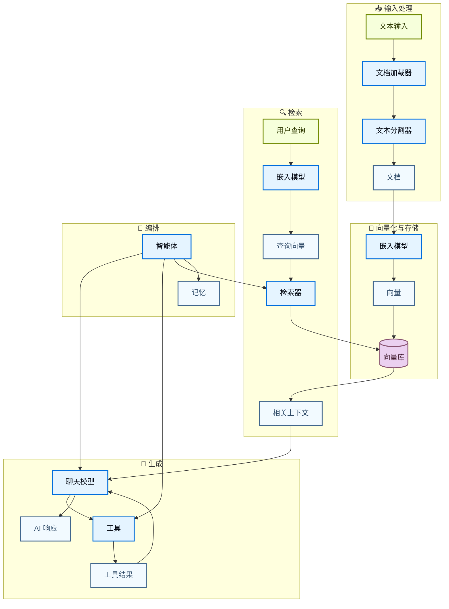
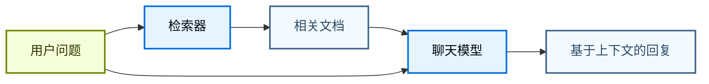
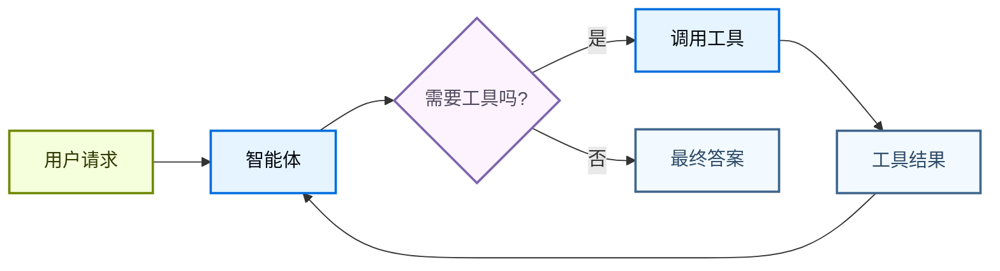
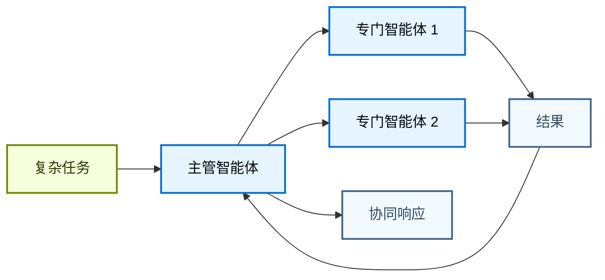

LangChain 的能力来自其组件之间的协作方式。该页面展示关键组件之间关系的图示，帮助你快速理解如何组织复杂应用。

## 核心组件生态

下图展示了 LangChain 的核心组件如何连接，形成完整的 AI 应用：

### 组件如何连接

每一层组件都在前一层基础上构建：

1. **输入处理**：将原始数据转换为结构化文档
2. **向量化与存储**：将文本转换为可检索的向量表示
3. **检索**：基于用户问题查找相关信息
4. **生成**：使用 AI 模型生成响应，可选地结合工具结果
5. **编排**：通过智能体和记忆系统协调上述流程

## 组件分类

LangChain 将组件按以下类别组织：

| 分类 | 用途 | 关键组件 | 使用场景 |
|----------|---------|---------------|-----------|
| **[模型](/oss/langchain/models)** | 推理与生成 AI 响应 | 聊天模型、LLM、嵌入模型 | 文本生成、推理、语义理解 |
| **[工具](/oss/langchain/tools)** | 提供外部能力 | API、数据库等 | 网络搜索、数据访问、计算 |
| **[智能体](/oss/langchain/agents)** | 进行编排和推理 | ReAct 智能体、工具调用智能体 | 非确定性工作流、决策 |
| **[记忆](/oss/langchain/short-term-memory)** | 保持上下文 | 消息历史、状态 | 对话和有状态交互 |
| **[检索器](/oss/integrations/retrievers)** | 提供信息访问 | 向量检索器、Web 检索器 | RAG、知识库搜索 |
| **[文档处理](/oss/integrations/document_loaders)** | 数据引入 | 加载器、分割器、转换器 | PDF 处理、网页抓取 |
| **[向量库](/oss/integrations/vectorstores)** | 语义检索 | Chroma、Pinecone、FAISS | 相似度检索、向量存储 |

## 常见模式

### RAG（检索增强生成）

### 使用工具的智能体

### 多智能体系统

## 延伸阅读

- [创建智能体](/oss/langchain/agents)
- [使用工具](/oss/langchain/tools)
- [浏览集成项](/oss/integrations/providers/overview)
