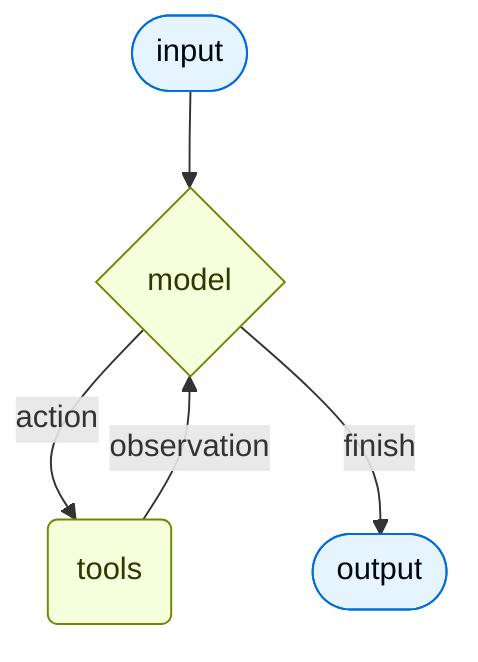

import AgentInvocationThreadAndContextJs from '/snippets/code-samples/agent-invocation-thread-and-context-js.mdx';
import AgentInvocationThreadAndContextPy from '/snippets/code-samples/agent-invocation-thread-and-context-py.mdx';
import AgentInvocationThreadIdJs from '/snippets/code-samples/agent-invocation-thread-id-js.mdx';
import AgentInvocationThreadIdPy from '/snippets/code-samples/agent-invocation-thread-id-py.mdx';

智能体（Agent）将语言模型与 [工具](/oss/langchain/tools) 相结合，构建能够推理任务、决定使用哪些工具，并迭代地朝着解决方案前进的系统。

:::python
@[`create_agent`] 提供了一个生产就绪的 agent 实现。
:::
:::js
`createAgent()` 提供了一个生产就绪的 agent 实现。
:::

[一个 LLM Agent 在循环中调用工具以实现目标](https://simonwillison.net/2025/Sep/18/agents/)。
一个 agent 会持续运行，直到满足停止条件——即模型发出最终输出或达到迭代限制。



<Info>

:::python
@[`create_agent`] 使用 [LangGraph](/oss/langgraph/overview) 构建了一个基于**图**的 agent 运行时。图由节点（步骤）和边（连接）组成，定义了 agent 如何处理信息。agent 在此图中移动，执行模型节点（调用模型）、工具节点（执行工具）或中间件等节点。
:::
:::js
`createAgent()` 使用 [LangGraph](/oss/langgraph/overview) 构建了一个基于**图**的 agent 运行时。图由节点（步骤）和边（连接）组成，定义了 agent 如何处理信息。agent 在此图中移动，执行模型节点（调用模型）、工具节点（执行工具）或中间件等节点。
:::

了解更多关于 [Graph API](/oss/langgraph/graph-api) 的信息。

</Info>

<Tip>
使用 [LangSmith](https://smith.langchain.com) 追踪此循环的每一步、调试工具调用并评估 agent 输出。按照 [追踪快速入门](/langsmith/trace-with-langchain) 进行设置。
</Tip>

## 核心组件

### 模型

[模型](/oss/langchain/models) 是 agent 的推理引擎。可以通过多种方式指定模型，支持静态和动态模型选择。

#### 静态模型

静态模型在创建 agent 时配置一次，并在整个执行过程中保持不变。这是最常见且最直接的方式。

通过 <Tooltip tip="一种遵循 `provider:model` 格式的字符串（例如 openai:gpt-5）" cta="查看映射" href="https://reference.langchain.com/python/langchain/models/#langchain.chat_models.init_chat_model(model)">模型标识字符串</Tooltip> 初始化静态模型：

:::python
```python wrap
from langchain.agents import create_agent

agent = create_agent("openai:gpt-5.4", tools=tools)
```
:::
:::js
```ts wrap
import { createAgent } from "langchain";

const agent = createAgent({
  model: "openai:gpt-5.4",
  tools: []
});
```
:::

:::python
<Tip>
    模型标识字符串支持自动推断（例如，`"gpt-5.4"` 将被推断为 `"openai:gpt-5.4"`）。请参考 @[reference][init_chat_model(model)] 查看模型标识字符串映射的完整列表。
</Tip>

如需对模型配置进行更精细的控制，可以直接使用 provider 包初始化模型实例。在此示例中，我们使用 @[`ChatOpenAI`]。查看 [Chat models](/oss/integrations/chat) 了解其他可用的 chat model 类。

```python wrap
from langchain.agents import create_agent
from langchain_openai import ChatOpenAI

model = ChatOpenAI(
    model="gpt-5.4",
    temperature=0.1,
    max_tokens=1000,
    timeout=30
    # ... (其他参数)
)
agent = create_agent(model, tools=tools)
```

模型实例让您完全控制配置。当需要设置特定 [参数](/oss/langchain/models#parameters)（如 `temperature`、`max_tokens`、`timeouts`、`base_url` 和其他 provider 特定设置）时使用它们。请参考 [参考文档](/oss/integrations/providers/all_providers) 查看模型上可用的参数和方法。
:::
:::js
模型标识字符串使用 `provider:model` 格式（例如 `"openai:gpt-5.4"`）。您可能希望对模型配置有更多控制，此时可以直接使用 provider 包初始化模型实例：

```ts wrap
import { createAgent } from "langchain";
import { ChatOpenAI } from "@langchain/openai";

const model = new ChatOpenAI({
  model: "gpt-5.4",
  temperature: 0.1,
  maxTokens: 1000,
  timeout: 30
});

const agent = createAgent({
  model,
  tools: []
});
```

模型实例让您完全控制配置。当需要设置特定参数（如 `temperature`、`max_tokens`、`timeouts`）或配置 API 密钥、`base_url` 和其他 provider 特定设置时使用它们。请参考 [API 参考](/oss/integrations/providers/) 查看模型上可用的参数和方法。
:::

#### 动态模型

动态模型在 <Tooltip tip="agent 的执行环境，包含不可变配置和贯穿 agent 执行过程的上下文数据（例如用户 ID、会话详情或应用程序特定配置）。">运行时</Tooltip> 根据当前的 <Tooltip tip="在 agent 执行过程中流动的数据，包括消息、自定义字段以及在处理过程中需要追踪和可能修改的任何信息（例如用户偏好或工具使用统计）。">状态</Tooltip> 和上下文进行选择。这实现了复杂的路由逻辑和成本优化。

:::python

要使用动态模型，创建使用 @[`@wrap_model_call`] 装饰器的中间件来修改请求中的模型：

```python
from langchain_openai import ChatOpenAI
from langchain.agents import create_agent
from langchain.agents.middleware import wrap_model_call, ModelRequest, ModelResponse


basic_model = ChatOpenAI(model="gpt-5.4-mini")
advanced_model = ChatOpenAI(model="gpt-5.4")

@wrap_model_call
def dynamic_model_selection(request: ModelRequest, handler) -> ModelResponse:
    """根据对话复杂度选择模型。"""
    message_count = len(request.state["messages"])

    if message_count > 10:
        # 对于较长的对话使用高级模型
        model = advanced_model
    else:
        model = basic_model

    return handler(request.override(model=model))

agent = create_agent(
    model=basic_model,  # 默认模型
    tools=tools,
    middleware=[dynamic_model_selection]
)
```

<Warning>
预绑定的模型（已经调用过 @[`bind_tools`][BaseChatModel.bind_tools] 的模型）在使用结构化输出时不支持。如果需要在结构化输出中动态选择模型，请确保传递给中间件的模型未预绑定。
</Warning>

:::
:::js

要使用动态模型，使用 `wrapModelCall` 创建中间件来修改请求中的模型：

```ts
import { ChatOpenAI } from "@langchain/openai";
import { createAgent, createMiddleware } from "langchain";

const basicModel = new ChatOpenAI({ model: "gpt-5.4-mini" });
const advancedModel = new ChatOpenAI({ model: "gpt-5.4" });

const dynamicModelSelection = createMiddleware({
  name: "DynamicModelSelection",
  wrapModelCall: (request, handler) => {
    // 根据对话复杂度选择模型
    const messageCount = request.messages.length;

    return handler({
        ...request,
        model: messageCount > 10 ? advancedModel : basicModel,
    });
  },
});

const agent = createAgent({
  model: "gpt-5.4-mini", // 基础模型（当 messageCount ≤ 10 时使用）
  tools,
  middleware: [dynamicModelSelection],
});
```

有关中间件和高级模式的更多详细信息，请参阅 [中间件文档](/oss/langchain/middleware)。
:::

<Tip>
有关模型配置的详细信息，请参阅 [Models](/oss/langchain/models)。有关动态模型选择模式，请参阅 [中间件中的动态模型](/oss/langchain/middleware#dynamic-model)。
</Tip>

### 工具

工具赋予 agent 采取行动的能力。Agent 超越了单纯的模型工具绑定，实现了以下功能：

- 按顺序多次调用工具（由单个提示触发）
- 适当时并行调用工具
- 基于先前结果进行动态工具选择
- 工具重试逻辑和错误处理
- 跨工具调用的状态持久化

更多信息请参阅 [Tools](/oss/langchain/tools)。

#### 静态工具

静态工具在创建 agent 时定义，并在整个执行过程中保持不变。这是最常见且最直接的方式。

要定义一个带有静态工具的 agent，将工具列表传递给 agent。

:::python

<Tip>
工具可以指定为普通 Python 函数或 <Tooltip tip="可以暂停执行并在以后恢复的方法">协程</Tooltip>。

[tool 装饰器](/oss/langchain/tools#create-tools) 可用于自定义工具名称、描述、参数模式和其他属性。
</Tip>

```python wrap
from langchain.tools import tool
from langchain.agents import create_agent


@tool
def search(query: str) -> str:
    """搜索信息。"""
    return f"Results for: {query}"

@tool
def get_weather(location: str) -> str:
    """获取某个位置的天气信息。"""
    return f"Weather in {location}: Sunny, 72°F"

agent = create_agent(model, tools=[search, get_weather])
```
:::
:::js
```ts wrap
import * as z from "zod";
import { createAgent, tool } from "langchain";

const search = tool(
  ({ query }) => `Results for: ${query}`,
  {
    name: "search",
    description: "搜索信息",
    schema: z.object({
      query: z.string().describe("要搜索的查询"),
    }),
  }
);

const getWeather = tool(
  ({ location }) => `Weather in ${location}: Sunny, 72°F`,
  {
    name: "get_weather",
    description: "获取某个位置的天气信息",
    schema: z.object({
      location: z.string().describe("要获取天气的位置"),
    }),
  }
);

const agent = createAgent({
  model: "gpt-5.4",
  tools: [search, getWeather],
});
```
:::

如果提供了空的工具列表，agent 将只包含一个没有工具调用能力的 LLM 节点。

#### 动态工具

使用动态工具，agent 可用的工具集在运行时修改，而不是一开始就全部定义。并非每个工具都适合每种情况。工具太多可能会使模型不堪重负（过载上下文）并增加错误；工具太少则会限制能力。动态工具选择允许根据认证状态、用户权限、功能标志或对话阶段来调整可用的工具集。

有两种方法，取决于工具是否预先已知：

<Tabs>
  <Tab title="过滤预注册工具">

    当所有可能的工具在 agent 创建时已知时，您可以预先注册它们，并根据状态、权限或上下文动态过滤暴露给模型的工具。

    <Tabs>
      <Tab title="状态">
        仅在达到某些对话里程碑后启用高级工具：

        :::python

        ```python
        from langchain.agents import create_agent
        from langchain.agents.middleware import wrap_model_call, ModelRequest, ModelResponse
        from typing import Callable

        @wrap_model_call
        def state_based_tools(
            request: ModelRequest,
            handler: Callable[[ModelRequest], ModelResponse]
        ) -> ModelResponse:
            """基于对话状态过滤工具。"""
            # 从状态中读取：检查用户是否已认证
            state = request.state
            is_authenticated = state.get("authenticated", False)
            message_count = len(state["messages"])

            # 仅在认证后启用敏感工具
            if not is_authenticated:
                tools = [t for t in request.tools if t.name.startswith("public_")]
                request = request.override(tools=tools)
            elif message_count < 5:
                # 对话早期限制工具
                tools = [t for t in request.tools if t.name != "advanced_search"]
                request = request.override(tools=tools)

            return handler(request)

        agent = create_agent(
            model="gpt-5.4",
            tools=[public_search, private_search, advanced_search],
            middleware=[state_based_tools]
        )
        ```

        :::

        :::js

        ```typescript
        import { createMiddleware, tool } from "langchain";
        import { createDeepAgent } from "deepagents";

        const stateBasedTools = createMiddleware({
            name: "StateBasedTools",
            wrapModelCall: (request, handler) => {
                // 从状态中读取：检查认证和对话长度
                const state = request.state as typeof request.state & {
                    authenticated?: boolean;
                };
                const isAuthenticated = state.authenticated ?? false;
                const messageCount = state.messages.length;

                let filteredTools = request.tools;

                // 仅在认证后启用敏感工具
                if (!isAuthenticated) {
                    filteredTools = request.tools.filter(
                        (t: any) => typeof t.name === "string" && t.name.startsWith("public_"),
                    );
                } else if (messageCount < 5) {
                    filteredTools = request.tools.filter(
                        (t: any) => typeof t.name === "string" && t.name !== "advanced_search",
                    );
                }

                return handler({ ...request, tools: filteredTools });
            },
        });

        const agent = await createDeepAgent({
            model: "claude-sonnet-4-20250514",
            tools: tools,
            middleware: [stateBasedTools] as any,
        });
        ```

        :::
      </Tab>

      <Tab title="存储">
        基于 Store 中的用户偏好或功能标志过滤工具：

        :::python

        ```python
        from dataclasses import dataclass
        from langchain.agents import create_agent
        from langchain.agents.middleware import wrap_model_call, ModelRequest, ModelResponse
        from typing import Callable
        from langgraph.store.memory import InMemoryStore

        @dataclass
        class Context:
            user_id: str

        @wrap_model_call
        def store_based_tools(
            request: ModelRequest,
            handler: Callable[[ModelRequest], ModelResponse]
        ) -> ModelResponse:
            """基于 Store 偏好过滤工具。"""
            user_id = request.runtime.context.user_id

            # 从 Store 中读取：获取用户启用的功能
            store = request.runtime.store
            feature_flags = store.get(("features",), user_id)

            if feature_flags:
                enabled_features = feature_flags.value.get("enabled_tools", [])
                # 只包含该用户启用的工具
                tools = [t for t in request.tools if t.name in enabled_features]
                request = request.override(tools=tools)

            return handler(request)

        agent = create_agent(
            model="gpt-5.4",
            tools=[search_tool, analysis_tool, export_tool],
            middleware=[store_based_tools],
            context_schema=Context,
            store=InMemoryStore()
        )
        ```

        :::

        :::js

        ```typescript
        import { createMiddleware } from "langchain";
        import { createDeepAgent, StoreBackend } from "deepagents";
        import * as z from "zod";
        import { InMemoryStore } from "@langchain/langgraph";

        const contextSchema = z.object({
          userId: z.string(),
        });

        const storeBasedTools = createMiddleware({
          name: "StoreBasedTools",
          contextSchema,
          wrapModelCall: async (request, handler) => {
            const userId =
              (request.runtime?.context as { userId?: string } | undefined)?.userId ??
                "user-123";

            // 从 Store 中读取：获取用户启用的功能
            const runtimeStore = request.runtime?.store as InMemoryStore | undefined;
            const rawFlags = (await runtimeStore?.get(
              ["features"],
              userId as string,
            )) as unknown;
            const featureFlags = rawFlags as FeatureFlags | undefined;

            let filteredTools = request.tools;

            if (featureFlags) {
              const enabledFeatures = featureFlags.enabledTools || [];
              filteredTools = request.tools.filter((t) =>
                enabledFeatures.includes(t.name as string)
              );
            }

            return handler({ ...request, tools: filteredTools });
          },
        });

        const agent = await createDeepAgent({
          model: "claude-sonnet-4-20250514",
          backend: new StoreBackend(),
          store,
          checkpointer,
          tools,
          middleware: [storeBasedTools] as any,
        });
        ```

        :::
      </Tab>

      <Tab title="运行时上下文">
        基于 Runtime Context 中的用户权限过滤工具：

        :::python

        ```python
        from dataclasses import dataclass
        from langchain.agents import create_agent
        from langchain.agents.middleware import wrap_model_call, ModelRequest, ModelResponse
        from typing import Callable

        @dataclass
        class Context:
            user_role: str

        @wrap_model_call
        def context_based_tools(
            request: ModelRequest,
            handler: Callable[[ModelRequest], ModelResponse]
        ) -> ModelResponse:
            """基于 Runtime Context 权限过滤工具。"""
            # 从 Runtime Context 中读取：获取用户角色
            if request.runtime is None or request.runtime.context is None:
                # 如果没有提供上下文，默认为 viewer（最严格的）
                user_role = "viewer"
            else:
                user_role = request.runtime.context.user_role

            if user_role == "admin":
                # 管理员获得所有工具
                pass
            elif user_role == "editor":
                # 编辑者不能删除
                tools = [t for t in request.tools if t.name != "delete_data"]
                request = request.override(tools=tools)
            else:
                # 查看者只获得只读工具
                tools = [t for t in request.tools if t.name.startswith("read_")]
                request = request.override(tools=tools)

            return handler(request)

        agent = create_agent(
            model="gpt-5.4",
            tools=[read_data, write_data, delete_data],
            middleware=[context_based_tools],
            context_schema=Context
        )
        ```

        :::

        :::js

        ```typescript
        import * as z from "zod";
        import { createMiddleware } from "langchain";
        import { createDeepAgent } from "deepagents";

        const contextSchema = z.object({
          userRole: z.string(),
        });

        const contextBasedTools = createMiddleware({
          name: "ContextBasedTools",
          contextSchema,
          wrapModelCall: (request, handler) => {
            // 从 Runtime Context 中读取：获取用户角色
            const userRole = request.runtime.context.userRole;

            let filteredTools = request.tools;

            if (userRole === "admin") {
              // 管理员获得所有工具
            } else if (userRole === "editor") {
              filteredTools = request.tools.filter((t) => t.name !== "delete_data");
            } else {
              filteredTools = request.tools.filter(
                (t) => (t.name as string).startsWith("read_"),
              );
            }

            return handler({ ...request, tools: filteredTools });
          },
        });

        const agent = await createDeepAgent({
          model: "claude-sonnet-4-20250514",
          store,
          checkpointer,
          tools,
          middleware: [contextBasedTools] as any,
        });
        ```

        :::
      </Tab>
    </Tabs>

    此方法最适合以下情况：
    - 所有可能的工具在编译/启动时已知
    - 需要基于权限、功能标志或对话状态进行过滤
    - 工具是静态的，但其可用性是动态的

    查看更多示例：[动态选择工具](/oss/langchain/middleware/custom#dynamically-selecting-tools)

  </Tab>

  <Tab title="运行时工具注册">

    当工具在运行时被发现或创建时（例如，从 MCP 服务器加载、基于用户数据生成或从远程注册中心获取），您需要同时注册工具并动态处理它们的执行。

    这需要两个 middleware 钩子：
    1. `wrap_model_call` - 将动态工具添加到请求中
    2. `wrap_tool_call` - 处理动态添加的工具的执行

    :::python

    ```python
    from langchain.tools import tool
    from langchain.agents import create_agent
    from langchain.agents.middleware import AgentMiddleware, ModelRequest, ToolCallRequest

    # 一个将在运行时动态添加的工具
    @tool
    def calculate_tip(bill_amount: float, tip_percentage: float = 20.0) -> str:
        """计算账单的小费金额。"""
        tip = bill_amount * (tip_percentage / 100)
        return f"Tip: ${tip:.2f}, Total: ${bill_amount + tip:.2f}"

    class DynamicToolMiddleware(AgentMiddleware):
        """注册和处理动态工具的中间件。"""

        def wrap_model_call(self, request: ModelRequest, handler):
            # 将动态工具添加到请求中
            # 这可以从 MCP 服务器、数据库等加载
            updated = request.override(tools=[*request.tools, calculate_tip])
            return handler(updated)

        def wrap_tool_call(self, request: ToolCallRequest, handler):
            # 处理动态工具的执行
            if request.tool_call["name"] == "calculate_tip":
                return handler(request.override(tool=calculate_tip))
            return handler(request)

    agent = create_agent(
        model="gpt-4o",
        tools=[get_weather],  # 这里只注册了静态工具
        middleware=[DynamicToolMiddleware()],
    )

    # agent 现在可以使用 get_weather 和 calculate_tip 两个工具
    result = agent.invoke({
        "messages": [{"role": "user", "content": "Calculate a 20% tip on $85"}]
    })
    ```

    :::

    :::js

    ```typescript
    import { createAgent, createMiddleware, tool } from "langchain";
    import * as z from "zod";

    // 一个将在运行时动态添加的工具
    const calculateTip = tool(
      ({ billAmount, tipPercentage = 20 }) => {
        const tip = billAmount * (tipPercentage / 100);
        return `Tip: $${tip.toFixed(2)}, Total: $${(billAmount + tip).toFixed(2)}`;
      },
      {
        name: "calculate_tip",
        description: "计算账单的小费金额",
        schema: z.object({
          billAmount: z.number().describe("账单金额"),
          tipPercentage: z.number().default(20).describe("小费百分比"),
        }),
      }
    );

    const dynamicToolMiddleware = createMiddleware({
      name: "DynamicToolMiddleware",
      wrapModelCall: (request, handler) => {
        // 将动态工具添加到请求中
        // 这可以从 MCP 服务器、数据库等加载
        return handler({
          ...request,
          tools: [...request.tools, calculateTip],
        });
      },
      wrapToolCall: (request, handler) => {
        // 处理动态工具的执行
        if (request.toolCall.name === "calculate_tip") {
          return handler({ ...request, tool: calculateTip });
        }
        return handler(request);
      },
    });

    const agent = createAgent({
      model: "gpt-4o",
      tools: [getWeather], // 这里只注册了静态工具
      middleware: [dynamicToolMiddleware],
    });

    // agent 现在可以使用 getWeather 和 calculateTip 两个工具
    const result = await agent.invoke({
      messages: [{ role: "user", content: "Calculate a 20% tip on $85" }],
    });
    ```

    :::

    此方法最适合以下情况：
    - 工具在运行时被发现（例如，从 MCP 服务器）
    - 工具基于用户数据或配置动态生成
    - 正在集成外部工具注册中心

    <Note>
    运行时注册的工具需要 `wrap_tool_call` 钩子，因为 agent 需要知道如何执行原始工具列表中没有的工具。没有它，agent 将不知道如何调用动态添加的工具。
    </Note>

  </Tab>
</Tabs>

<Tip>
要了解更多关于工具的信息，请参阅 [Tools](/oss/langchain/tools)。
</Tip>

#### 工具错误处理

:::python

要自定义工具错误的处理方式，使用 @[`@wrap_tool_call`] 装饰器创建中间件：

```python wrap
from langchain.agents import create_agent
from langchain.agents.middleware import wrap_tool_call
from langchain.messages import ToolMessage


@wrap_tool_call
def handle_tool_errors(request, handler):
    """使用自定义消息处理工具执行错误。"""
    try:
        return handler(request)
    except Exception as e:
        # 向模型返回自定义错误消息
        return ToolMessage(
            content=f"Tool error: Please check your input and try again. ({str(e)})",
            tool_call_id=request.tool_call["id"]
        )

agent = create_agent(
    model="gpt-5.4",
    tools=[search, get_weather],
    middleware=[handle_tool_errors]
)
```

当工具失败时，agent 将返回带有自定义错误消息的 @[`ToolMessage`]：

```python
[
    ...
    ToolMessage(
        content="Tool error: Please check your input and try again. (division by zero)",
        tool_call_id="..."
    ),
    ...
]
```

:::
:::js

要自定义工具错误的处理方式，在自定义中间件中使用 `wrapToolCall` 钩子：

```ts wrap
import { createAgent, createMiddleware, ToolMessage } from "langchain";

const handleToolErrors = createMiddleware({
  name: "HandleToolErrors",
  wrapToolCall: async (request, handler) => {
    try {
      return await handler(request);
    } catch (error) {
      // 向模型返回自定义错误消息
      return new ToolMessage({
        content: `Tool error: Please check your input and try again. (${error})`,
        tool_call_id: request.toolCall.id!,
      });
    }
  },
});

const agent = createAgent({
  model: "gpt-5.4",
  tools: [
    /* ... */
  ],
  middleware: [handleToolErrors],
});
```

当工具失败时，agent 将返回带有自定义错误消息的 @[`ToolMessage`]。
:::

#### ReAct 循环中的工具使用

Agent 遵循 ReAct（"Reasoning + Acting"）模式，在简短的推理步骤和有针对性的工具调用之间交替，并将观察结果反馈到后续决策中，直到能够给出最终答案。

<Accordion title="ReAct 循环示例">
**提示：** 找出当前最受欢迎的无线耳机并验证可用性。

```
================================ Human Message =================================

Find the most popular wireless headphones right now and check if they're in stock
```

* **推理**："流行度是时间敏感的，我需要使用提供的搜索工具。"
* **行动**：调用 `search_products("wireless headphones")`

```
================================== Ai Message ==================================
Tool Calls:
  search_products (call_abc123)
 Call ID: call_abc123
  Args:
    query: wireless headphones
```
```
================================= Tool Message =================================

Found 5 products matching "wireless headphones". Top 5 results: WH-1000XM5, ...
```

* **推理**："我需要在回答之前确认排名第一的产品的可用性。"
* **行动**：调用 `check_inventory("WH-1000XM5")`

```
================================== Ai Message ==================================
Tool Calls:
  check_inventory (call_def456)
 Call ID: call_def456
  Args:
    product_id: WH-1000XM5
```
```
================================= Tool Message =================================

Product WH-1000XM5: 10 units in stock
```

* **推理**："我已经获得了最受欢迎的型号及其库存状态。现在可以回答用户的问题了。"
* **行动**：生成最终答案

```
================================== Ai Message =================================

I found wireless headphones (model WH-1000XM5) with 10 units in stock...
```
</Accordion>

### 系统提示词

:::python
您可以通过提供提示词来塑造 agent 处理任务的方式。@[`system_prompt`] 参数可以作为字符串提供：
:::

:::js
您可以通过提供提示词来塑造 agent 处理任务的方式。`systemPrompt` 参数可以作为字符串提供：
:::

:::python
```python wrap
agent = create_agent(
    model,
    tools,
    system_prompt="You are a helpful assistant. Be concise and accurate."
)
```
:::
:::js
```ts wrap
const agent = createAgent({
  model,
  tools,
  systemPrompt: "You are a helpful assistant. Be concise and accurate.",
});
```
:::

:::python
当未提供 @[`system_prompt`] 时，agent 将直接从消息中推断其任务。

@[`system_prompt`] 参数接受 `str` 或 @[`SystemMessage`]。使用 `SystemMessage` 可以让您更精细地控制提示词结构，这对于 provider 特定功能（如 [Anthropic 的 prompt caching](/oss/integrations/chat/anthropic#prompt-caching)）非常有用：

```python wrap
from langchain.agents import create_agent
from langchain.messages import SystemMessage, HumanMessage

literary_agent = create_agent(
    model="google_genai:gemini-3.5-flash",
    system_prompt=SystemMessage(
        content=[
            {
                "type": "text",
                "text": "You are an AI assistant tasked with analyzing literary works.",
            },
            {
                "type": "text",
                "text": "<the entire contents of 'Pride and Prejudice'>",
                "cache_control": {"type": "ephemeral"}
            }
        ]
    )
)

result = literary_agent.invoke(
    {"messages": [HumanMessage("Analyze the major themes in 'Pride and Prejudice'.")]}
)
```

`cache_control` 字段配合 `{"type": "ephemeral"}` 告诉 Anthropic 缓存该内容块，从而减少使用相同 system prompt 的重复请求的延迟和成本。
:::

:::js
当未提供 `systemPrompt` 时，agent 将直接从消息中推断其任务。

`systemPrompt` 参数接受 `string` 或 `SystemMessage`。使用 `SystemMessage` 可以让您更精细地控制提示词结构，这对于 provider 特定功能（如 [Anthropic 的 prompt caching](/oss/integrations/chat/anthropic#prompt-caching)）非常有用：

```ts wrap
import { createAgent } from "langchain";
import { SystemMessage, HumanMessage } from "@langchain/core/messages";

const literaryAgent = createAgent({
  model: "google_genai:gemini-3.5-flash",
  systemPrompt: new SystemMessage({
    content: [
      {
        type: "text",
        text: "You are an AI assistant tasked with analyzing literary works.",
      },
      {
        type: "text",
        text: "<the entire contents of 'Pride and Prejudice'>",
        cache_control: { type: "ephemeral" }
      }
    ]
  })
});

const result = await literaryAgent.invoke({
  messages: [new HumanMessage("Analyze the major themes in 'Pride and Prejudice'.")]
});
```

`cache_control` 字段配合 `{ type: "ephemeral" }` 告诉 Anthropic 缓存该内容块，从而减少使用相同 system prompt 的重复请求的延迟和成本。
:::

#### 动态系统提示词

对于更高级的用例，当需要根据运行时上下文或 agent 状态修改系统提示词时，可以使用 [middleware](/oss/langchain/middleware)。

:::python

@[`@dynamic_prompt`] 装饰器创建基于模型请求生成系统提示词的中间件：

```python wrap
from typing import TypedDict

from langchain.agents import create_agent
from langchain.agents.middleware import dynamic_prompt, ModelRequest


class Context(TypedDict):
    user_role: str

@dynamic_prompt
def user_role_prompt(request: ModelRequest) -> str:
    """基于用户角色生成系统提示词。"""
    user_role = request.runtime.context.get("user_role", "user")
    base_prompt = "You are a helpful assistant."

    if user_role == "expert":
        return f"{base_prompt} Provide detailed technical responses."
    elif user_role == "beginner":
        return f"{base_prompt} Explain concepts simply and avoid jargon."

    return base_prompt

agent = create_agent(
    model="gpt-5.4",
    tools=[web_search],
    middleware=[user_role_prompt],
    context_schema=Context
)

# 系统提示词将根据上下文动态设置
result = agent.invoke(
    {"messages": [{"role": "user", "content": "Explain machine learning"}]},
    context={"user_role": "expert"}
)
```
:::

:::js
```typescript wrap
import * as z from "zod";
import { createAgent, dynamicSystemPromptMiddleware } from "langchain";

const contextSchema = z.object({
  userRole: z.enum(["expert", "beginner"]),
});

const agent = createAgent({
  model: "gpt-5.4",
  tools: [/* ... */],
  contextSchema,
  middleware: [
    dynamicSystemPromptMiddleware<z.infer<typeof contextSchema>>((state, runtime) => {
      const userRole = runtime.context.userRole || "user";
      const basePrompt = "You are a helpful assistant.";

      if (userRole === "expert") {
        return `${basePrompt} Provide detailed technical responses.`;
      } else if (userRole === "beginner") {
        return `${basePrompt} Explain concepts simply and avoid jargon.`;
      }
      return basePrompt;
    }),
  ],
});

// 系统提示词将根据上下文动态设置
const result = await agent.invoke(
  { messages: [{ role: "user", content: "Explain machine learning" }] },
  { context: { userRole: "expert" } }
);
```
:::

<Tip>
有关消息类型和格式化的更多详细信息，请参阅 [Messages](/oss/langchain/messages)。有关全面的 middleware 文档，请参阅 [Middleware](/oss/langchain/middleware)。
</Tip>

### 名称

:::python
为 agent 设置可选的 @[`name`][create_agent(name)]。当将 agent 作为子图添加到 [多 agent 系统](/oss/langchain/multi-agent) 中时，这用作节点标识符：

```python
agent = create_agent(
    model,
    tools,
    name="research_assistant"
)
```
:::
:::js
为 agent 设置可选的 `name`。当将 agent 作为子图添加到 [multi-agent systems](/oss/langchain/multi-agent) 中时，这用作节点标识符：

```ts
const agent = createAgent({
  model,
  tools,
  name: "research_assistant",
});
```
:::

<Warning>
    建议为 agent 名称使用 `snake_case`（例如，`research_assistant` 而不是 `Research Assistant`）。某些模型提供商会拒绝包含空格或特殊字符的名称并报错。仅使用字母数字字符、下划线和连字符可以确保在所有 provider 中的兼容性。这同样适用于 [工具名称](/oss/langchain/tools)。
</Warning>

## 调用

:::python
您可以通过向其 [`State`](/oss/langgraph/graph-api#state) 传递更新来调用 agent。所有 agent 的状态中都包含一个 [消息序列](/oss/langgraph/use-graph-api#messagesstate)；要调用 agent，传递一条新消息以及一个 `thread_id`，以便 agent 可以持久化和恢复对话历史：
:::
:::js
您可以通过向其 [`State`](/oss/langgraph/graph-api#state) 传递更新来调用 agent。所有 agent 的状态中都包含一个 [消息序列](/oss/langgraph/use-graph-api#messagesvalue)；要调用 agent，传递一条新消息以及一个 `thread_id`，以便 agent 可以持久化和恢复对话历史：
:::

:::python

<AgentInvocationThreadIdPy />

:::
:::js

<AgentInvocationThreadIdJs />

:::

<Note>
使用 `thread_id` 持久化对话历史需要 agent 配置了 [checkpointer](/oss/langchain/long-term-memory)。当部署在 [LangSmith](/langsmith/deployment) 上时，checkpointer 会自动配置。在本地使用，请显式传递一个，例如 `create_agent(..., checkpointer=InMemorySaver())`。
</Note>

:::python
如果您还需要将每次运行的配置（如用户 ID、API 密钥或功能标志）传递给工具和中间件，可以将其作为 `context` 与 `config` 一起传递。使用 `context_schema` 定义该数据的形状，并通过 `runtime.context` 访问它：

<AgentInvocationThreadAndContextPy />

`thread_id` 限定*对话*范围（消息历史、检查点），而 `context` 携带工具和中间件在调用时读取的*每次运行*的数据。两者通常一起传递。更多信息请参阅 [tool context](/oss/langchain/tools#context) 和 [Runtime](/oss/langchain/runtime)。
:::
:::js
如果您还需要将每次运行的配置（如用户 ID、API 密钥或功能标志）传递给工具和中间件，可以将其作为 `context` 与 config 一起传递。使用 `contextSchema` 定义该数据的形状，并通过 `runtime.context` 访问它：

<AgentInvocationThreadAndContextJs />

`thread_id` 限定*对话*范围（消息历史、检查点），而 `context` 携带工具和中间件在调用时读取的*每次运行*的数据。两者通常一起传递。更多信息请参阅 [tool context](/oss/langchain/tools#context) 和 [Runtime](/oss/langchain/runtime)。
:::

有关从 agent 流式传输步骤和/或令牌的信息，请参考 [streaming](/oss/langchain/streaming) 指南。

否则，agent 遵循 LangGraph [Graph API](/oss/langgraph/use-graph-api) 并支持所有相关方法，如 `stream` 和 `invoke`。

## 高级概念

### 结构化输出

:::python

在某些情况下，您可能希望 agent 以特定格式返回输出。LangChain 通过 @[`response_format`][create_agent(response_format)] 参数提供结构化输出的策略。

#### ToolStrategy

`ToolStrategy` 使用人工工具调用来生成结构化输出。这适用于任何支持工具调用的模型。当 provider 原生的结构化输出（通过 [`ProviderStrategy`](#providerstrategy)）不可用或不可靠时，应使用 `ToolStrategy`。

```python wrap
from pydantic import BaseModel
from langchain.agents import create_agent
from langchain.agents.structured_output import ToolStrategy


class ContactInfo(BaseModel):
    name: str
    email: str
    phone: str

agent = create_agent(
    model="gpt-5.4-mini",
    tools=[search_tool],
    response_format=ToolStrategy(ContactInfo)
)

result = agent.invoke({
    "messages": [{"role": "user", "content": "Extract contact info from: John Doe, john@example.com, (555) 123-4567"}]
})

result["structured_response"]
# ContactInfo(name='John Doe', email='john@example.com', phone='(555) 123-4567')
```

#### ProviderStrategy

`ProviderStrategy` 使用模型提供商的本地结构化输出生成。这更可靠，但仅适用于支持本地结构化输出的提供商：

```python wrap
from langchain.agents.structured_output import ProviderStrategy

agent = create_agent(
    model="gpt-5.4",
    response_format=ProviderStrategy(ContactInfo)
)
```

<Note>
从 `langchain 1.0` 开始，直接传递 schema（例如 `response_format=ContactInfo`）将默认为 `ProviderStrategy`（如果模型支持本地结构化输出），否则将回退为 `ToolStrategy`。
</Note>

:::
:::js
在某些情况下，您可能希望 agent 以特定格式返回输出。LangChain 通过 `responseFormat` 参数提供了一种简单、通用的方式来实现这一点。

```ts wrap
import * as z from "zod";
import { createAgent } from "langchain";

const ContactInfo = z.object({
  name: z.string(),
  email: z.string(),
  phone: z.string(),
});

const agent = createAgent({
  model: "gpt-5.4",
  responseFormat: ContactInfo,
});

const result = await agent.invoke({
  messages: [
    {
      role: "user",
      content: "Extract contact info from: John Doe, john@example.com, (555) 123-4567",
    },
  ],
});

console.log(result.structuredResponse);
// {
//   name: 'John Doe',
//   email: 'john@example.com',
//   phone: '(555) 123-4567'
// }
```
:::
<Tip>
    要了解结构化输出，请参阅 [Structured output](/oss/langchain/structured-output)。
</Tip>

### 记忆

Agent 通过消息状态自动维护对话历史。您还可以配置 agent 使用自定义状态 schema 来在对话期间记住额外信息。

存储在状态中的信息可以被视为 agent 的 [短期记忆](/oss/langchain/short-term-memory)：

:::python

自定义状态 schema 必须作为 `TypedDict` 扩展 @[`AgentState`]。

有两种定义自定义状态的方式：
1. 通过 [middleware](/oss/langchain/middleware)（推荐）
2. 通过 @[`create_agent`] 上的 @[`state_schema`]

#### 通过 middleware 定义状态

当自定义状态需要被附加到该 middleware 上的特定 middleware 钩子和工具访问时，使用 middleware 定义自定义状态。

```python
from langchain.agents import AgentState
from langchain.agents.middleware import AgentMiddleware
from typing import Any


class CustomState(AgentState):
    user_preferences: dict

class CustomMiddleware(AgentMiddleware):
    state_schema = CustomState
    tools = [tool1, tool2]

    def before_model(self, state: CustomState, runtime) -> dict[str, Any] | None:
        ...

agent = create_agent(
    model,
    tools=tools,
    middleware=[CustomMiddleware()]
)

# agent 现在可以跟踪消息之外的额外状态
result = agent.invoke({
    "messages": [{"role": "user", "content": "I prefer technical explanations"}],
    "user_preferences": {"style": "technical", "verbosity": "detailed"},
})
```

#### 通过 `state_schema` 定义状态

使用 @[`state_schema`] 参数作为快捷方式，定义仅在工具中使用的自定义状态。

```python
from langchain.agents import AgentState


class CustomState(AgentState):
    user_preferences: dict

agent = create_agent(
    model,
    tools=[tool1, tool2],
    state_schema=CustomState
)
# agent 现在可以跟踪消息之外的额外状态
result = agent.invoke({
    "messages": [{"role": "user", "content": "I prefer technical explanations"}],
    "user_preferences": {"style": "technical", "verbosity": "detailed"},
})
```

<Note>
从 `langchain 1.0` 开始，自定义状态 schema **必须**是 `TypedDict` 类型。不再支持 Pydantic 模型和 dataclass。更多详情请参阅 [v1 迁移指南](/oss/migrate/langchain-v1#state-type-restrictions)。
</Note>

:::
:::js
```ts wrap
import { z } from "zod/v4";
import { StateSchema, MessagesValue } from "@langchain/langgraph";
import { createAgent } from "langchain";

const CustomAgentState = new StateSchema({
  messages: MessagesValue,
  userPreferences: z.record(z.string(), z.string()),
});

const customAgent = createAgent({
  model: "gpt-5.4",
  tools: [],
  stateSchema: CustomAgentState,
});
```
:::

:::python
<Note>
    通过 middleware 定义自定义状态优于通过 @[`create_agent`] 上的 @[`state_schema`] 定义状态，因为它允许您将状态扩展在概念上限定在相关 middleware 和工具的范围内。

    @[`create_agent`] 上的 @[`state_schema`] 仍然支持向后兼容。
</Note>
:::

<Tip>
    要了解更多关于记忆的信息，请参阅 [Memory](/oss/concepts/memory)。有关实现跨会话持久化的长期记忆的信息，请参阅 [Long-term memory](/oss/langchain/long-term-memory)。
</Tip>

### 流式传输

我们已经了解了如何通过 `invoke` 调用 agent 来获取最终响应。如果 agent 执行多个步骤，这可能需要一些时间。为了显示中间进度，我们可以在消息发生时流式传输回来。

:::python
```python
from langchain.messages import AIMessage, HumanMessage

for chunk in agent.stream({
    "messages": [{"role": "user", "content": "Search for AI news and summarize the findings"}]
}, stream_mode="values"):
    # 每个 chunk 包含该点的完整状态
    latest_message = chunk["messages"][-1]
    if latest_message.content:
        if isinstance(latest_message, HumanMessage):
            print(f"User: {latest_message.content}")
        elif isinstance(latest_message, AIMessage):
            print(f"Agent: {latest_message.content}")
    elif latest_message.tool_calls:
        print(f"Calling tools: {[tc['name'] for tc in latest_message.tool_calls]}")
```
:::
:::js
```ts
const stream = await agent.stream(
  {
    messages: [{
      role: "user",
      content: "Search for AI news and summarize the findings"
    }],
  },
  { streamMode: "values" }
);

for await (const chunk of stream) {
  // 每个 chunk 包含该点的完整状态
  const latestMessage = chunk.messages.at(-1);
  if (latestMessage?.content) {
    console.log(`Agent: ${latestMessage.content}`);
  } else if (latestMessage?.tool_calls) {
    const toolCallNames = latestMessage.tool_calls.map((tc) => tc.name);
    console.log(`Calling tools: ${toolCallNames.join(", ")}`);
  }
}
```
:::

<Tip>
有关流式传输的更多详细信息，请参阅 [Streaming](/oss/langchain/streaming)。
</Tip>

### 中间件

[Middleware](/oss/langchain/middleware) 提供了强大的可扩展性，用于在不同执行阶段自定义 agent 行为。您可以使用 middleware 来：

- 在调用模型之前处理状态（例如，消息裁剪、上下文注入）
- 修改或验证模型的响应（例如，护栏、内容过滤）
- 使用自定义逻辑处理工具执行错误
- 基于状态或上下文实现动态模型选择
- 添加自定义日志记录、监控或分析

Middleware 无缝集成到 agent 的执行流程中，允许您在关键点拦截和修改数据流，而无需更改核心 agent 逻辑。

:::python
<Tip>
有关全面的 middleware 文档，包括 @[`@before_model`]、@[`@after_model`] 和 @[`@wrap_tool_call`] 等装饰器，请参阅 [Middleware](/oss/langchain/middleware)。
</Tip>
:::

:::js
<Tip>
有关全面的 middleware 文档，包括 `beforeModel`、`afterModel` 和 `wrapToolCall` 等钩子，请参阅 [Middleware](/oss/langchain/middleware)。
</Tip>
:::