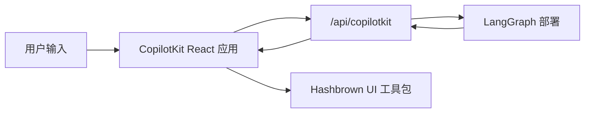

[CopilotKit](https://www.copilotkit.ai/) 提供了完整的 React 聊天运行时，当你希望代理返回**结构化 UI 负载**而不仅仅是纯文本时，它与 LangGraph 配合得特别好。在这种模式中，你的 LangGraph 部署同时提供图 API 和自定义 CopilotKit 端点，而前端将助手消息解析为动态 React 组件。

在服务端，[copilotkit](https://pypi.org/project/copilotkit/) 包提供了 [`CopilotKitMiddleware`](https://docs.copilotkit.ai)，使 LangGraph 图、LangChain 代理或 [Deep Agent](/oss/deepagents/overview) 能够使用 [Agent UI (AG-UI)](https://docs.ag-ui.com/) 线缆协议，将工具和消息事件流式传输到聊天 UI，并读取或写入共享的 **CopilotKit** 状态切片，同时提供辅助工具在你的图前挂载 CopilotKit 兼容的 HTTP 端点。

当你需要以下功能时，这种方法非常有用：

- 现成的聊天运行时，而不是自己处理 `stream.messages`
- 自定义服务器端点，可以在部署的图旁边添加特定于提供商的行为
- 从受限的组件注册表中渲染结构化生成式 UI

[CopilotKit for LangGraph](https://docs.copilotkit.ai/langgraph) 还记录了基于相同中间件和客户端的[生成式 UI](https://docs.copilotkit.ai/langgraph/generative-ui)、[人工介入](https://docs.copilotkit.ai/langgraph/human-in-the-loop) (HITL) 和[共享状态](https://docs.copilotkit.ai/langgraph/shared-state)。

<Info>
  有关 CopilotKit 特定的 API、UI 模式和运行时配置，请参阅
  [CopilotKit 文档](https://docs.copilotkit.ai/langgraph)。有关 Deep Agent 的教程，请参阅
  CopilotKit 文档中的 [Deep Agents 和 CopilotKit](https://docs.copilotkit.ai/langgraph/deep-agents)。
</Info>

import { ExampleEmbed } from "/snippets/example-embed.jsx"

<ExampleEmbed example="copilotkit" minHeight={700} />

## 工作原理

在高层面上，CopilotKit 位于你的 React 应用和 LangGraph 部署之间。前端将对话状态发送到与图 API 并排挂载的自定义 `/api/copilotkit` 路由，该路由将请求转发到 LangGraph，响应则同时返回助手消息和你的组件注册表可以渲染的任何结构化 UI 负载。

1. **像往常一样部署图**，使用 LangSmith 或 LangGraph 开发服务器。
2. **使用 HTTP 应用扩展部署**，在图 API 旁边挂载 CopilotKit 路由。
3. **将前端包装在 `CopilotKit` 中**，并将其指向该自定义运行时 URL。
4. **注册动态 UI 组件**，并在渲染时将助手响应解析为这些组件。



:::python
## Python 服务端的内容

[copilotkit](https://pypi.org/project/copilotkit/) 和相关包桥接了 LangGraph 部署和 CopilotKit 客户端。

| 组件 | 作用 |
| --------- | ---- |
| `CopilotKitMiddleware` | 将 CopilotKit 和 AG-UI 状态与请求合并到你的代理中，包括前端[工具调用](/oss/langchain/agents#tools)和上下文。将其添加到 @[create_agent] 或 @[create_deep_agent] 的 `middleware` 列表中。 |
| `CopilotKitState` (子类) | [自定义状态](/oss/langchain/agents#memory)：扩展 `CopilotKitState` 使 CopilotKit 键成为图状态的一部分。 |
| `LangGraphAGUIAgent` | 将编译后的图与运行时使用的名称和描述捆绑在一起。 |
| `add_langgraph_fastapi_endpoint` (来自 [ag-ui-langgraph](https://pypi.org/project/ag-ui-langgraph/)) | 连接 **FastAPI** 应用，使 CopilotKit 可以在同一个 [LangGraph](/oss/langgraph/overview) 进程上运行你的图。当你添加自定义 `http` 应用时使用它（如下面的[扩展 LangGraph 部署]（#extend-the-langgraph-deployment-with-a-custom-endpoint）所示），而不是单独的 HTTP 服务器。 |

`CopilotKitMiddleware` 是用于 @[create_deep_agent] 和 @[create_agent] 图的相同中间件，只需将其添加到 `middleware` 列表中。对于使用 `CopilotKitState` 和 FastAPI 桥接的 `create_agent` 图，请参考下面的 [Python `main.py` 示例](#extend-the-langgraph-deployment-with-a-custom-endpoint)。结构化生成式 UI（例如来自客户端的 `useAgentContext` 和 `output_schema`）需要额外的中间件，将 Copilot 状态映射到[结构化输出](/oss/langchain/agents#structured-output)策略，如同一节中可展开的 `src/middleware.py` 示例所示。

在 `langgraph.json` 的 `http` 键上挂载 `app` 遵循常规的 [LangGraph 或 LangSmith 部署](/oss/langgraph/deploy)，因此一个进程同时为图和同一个 FastAPI 应用服务，提供给 CopilotKit 客户端。
:::

## 安装

对于后端端点：

:::js
```bash
bun add @copilotkit/runtime hono
```
:::

:::python
```bash
uv add copilotkit ag-ui-langgraph fastapi uvicorn
```
:::

中间件包与 Deep Agents 栈并排安装。将其与你的[聊天模型](/oss/integrations/chat)包一起安装（此示例使用 OpenAI）：

:::python
<CodeGroup>
```python pip
pip install -U deepagents copilotkit langchain-openai
```

```python uv
uv add deepagents copilotkit langchain-openai
```
</CodeGroup>
:::

对于前端应用：

```bash
bun add @copilotkit/react-core @copilotkit/react-ui @hashbrownai/core @hashbrownai/react
```

:::python
## 将 CopilotKit 与 Deep Agent 一起使用

将 `CopilotKitMiddleware` 添加到传递给 @[create_deep_agent] 的 `middleware` 列表中。该中间件让 CopilotKit 路由前端工具调用并将聊天状态与你的图对齐。将你配置的任何其他[中间件](/oss/deepagents/customization#middleware)保留在同一个列表中。

然后，编译后的图可以插入到 CopilotKit 或 AG-UI 感知的进程中（例如下面的 [FastAPI 模式](#extend-the-langgraph-deployment-with-a-custom-endpoint)）或 CopilotKit 文档中的指南（如 [Deep Agents 和 CopilotKit](https://docs.copilotkit.ai/langgraph/deep-agents)）。

```python
from deepagents import create_deep_agent
from copilotkit import CopilotKitMiddleware
from langgraph.checkpoint.memory import MemorySaver


def get_weather(location: str) -> str:
    """返回某个地点的简单天气字符串。"""
    return f"{location} 的天气是晴天。"


agent = create_deep_agent(
    model="openai:gpt-5.4",
    tools=[get_weather],
    middleware=[CopilotKitMiddleware()],  # AG-UI、前端工具和上下文
    system_prompt="你是一个有帮助的研究助手。",
    checkpointer=MemorySaver(),
)
```
:::

## 使用自定义端点扩展 LangGraph 部署

关键思想是，LangGraph 部署不仅服务于图。它还可以加载 HTTP 应用，让你在部署本身旁边挂载额外的路由。

在 `langgraph.json` 中，将 `http.app` 指向你的自定义应用入口点：

:::js
```json
{
  "graphs": {
    "copilotkit_shadify": "./src/agents/copilotkit-shadify.ts:agent"
  },
  "http": {
    "app": "./src/api/app.ts:app"
  }
}
```
:::

:::python
```json
{
  "dependencies": ["."],
  "graphs": {
    "copilotkit_shadify": "./main.py:agent"
  },
  "http": {
    "app": "./main.py:app"
  }
}
```
:::

:::js
然后创建 Hono 应用并注册 CopilotKit 路由：

```ts app.ts
import { Hono } from "hono";
import { registerCopilotKit } from "./copilotkit.js";

export const app = new Hono();

registerCopilotKit(app);
```
:::

:::python
在 Python 中，创建一个 `FastAPI` 应用并通过 CopilotKit 的 AG-UI 桥接暴露 LangGraph 代理：

```python main.py
from typing import Any, TypedDict

from ag_ui_langgraph import add_langgraph_fastapi_endpoint
from copilotkit import CopilotKitMiddleware, CopilotKitState, LangGraphAGUIAgent
from fastapi import FastAPI
from langchain.agents import create_agent

from src.middleware import apply_structured_output_schema, normalize_context


class AgentState(CopilotKitState):
    pass


class AgentContext(TypedDict, total=False):
    output_schema: dict[str, Any]


agent = create_agent(
    model="openai:gpt-5.4",
    middleware=[
        normalize_context,
        CopilotKitMiddleware(),
        apply_structured_output_schema,
    ],
    context_schema=AgentContext,
    state_schema=AgentState,
    system_prompt=(
        "你是一个有帮助的 UI 助手。使用可用组件构建视觉响应。"
    ),
)

app = FastAPI()

add_langgraph_fastapi_endpoint(
    app=app,
    agent=LangGraphAGUIAgent(
        name="copilotkit_shadify",
        description="一个返回结构化组件负载的 UI 助手。",
        graph=agent,
    ),
    path="/",
)
```
:::

这个自定义应用是重要的扩展点：它在不替换底层 LangGraph 部署的情况下挂载了 CopilotKit 感知的运行时。

:::js
在该路由内部，创建一个 `CopilotRuntime` 并使用 `LangGraphAgent` 将其指向已部署的图：

```ts expandable copilotkit.ts
import { type Hono } from "hono";

import { createCopilotEndpointSingleRoute, CopilotRuntime } from "@copilotkit/runtime/v2";
import { LangGraphAgent } from "@copilotkit/runtime/langgraph";

const defaultAgentHost = process.env.LANGGRAPH_DEPLOYMENT_URL || "http://127.0.0.1:2024";
const agentUrl = defaultAgentHost.startsWith("http")
  ? defaultAgentHost
  : `http://${defaultAgentHost}`;

class BridgedLangGraphAgent extends LangGraphAgent {
  override prepareRunAgentInput(
    input: Parameters<LangGraphAgent["prepareRunAgentInput"]>[0],
  ): ReturnType<LangGraphAgent["prepareRunAgentInput"]> {
    const prepared = super.prepareRunAgentInput(input);

    return {
      ...prepared,
      context: normalizeCopilotContext(prepared.context) as ReturnType<
        LangGraphAgent["prepareRunAgentInput"]
      >["context"],
    };
  }

  override async getAssistant(): Promise<Awaited<ReturnType<LangGraphAgent["getAssistant"]>>> {
    const assistants = await this.client.assistants.search({
      graphId: this.graphId,
      limit: 100,
    });

    const assistant = assistants.find((candidate) => candidate.graph_id === this.graphId);
    if (assistant) {
      return assistant;
    }

    return super.getAssistant();
  }
}

export function registerCopilotKit(app: Hono) {
  const runtime = new CopilotRuntime({
    agents: {
      default: new BridgedLangGraphAgent({
        deploymentUrl: agentUrl,
        graphId: "copilotkit_shadify",
      }),
    },
  });

  const copilotApp = createCopilotEndpointSingleRoute({
    runtime,
    basePath: "/api/copilotkit",
  });

  app.route("/", copilotApp);
}

function normalizeCopilotContext(context: unknown): unknown {
  if (!Array.isArray(context)) {
    return context;
  }

  const normalizedEntries = context.flatMap((item) => {
    if (!item || typeof item !== "object") {
      return [];
    }

    const entry = item as { description?: unknown; value?: unknown };
    return typeof entry.description === "string" ? [[entry.description, entry.value] as const] : [];
  });

  return Object.fromEntries(normalizedEntries);
}
```

路由适配器只是 TypeScript 设置的一半。你的 LangChain 代理还需要中间件来读取转发的 `output_schema` 并将其转换为模型的结构化 `responseFormat`：

```ts expandable agent.ts
import { createAgent, createMiddleware, toolStrategy } from "langchain";
import { z } from "zod";

import { deepSearchTool, searchWebTool } from "../tools/index.js";

const contextSchema = z.object({
  output_schema: z.unknown().optional(),
});

const structuredOutputMiddleware = createMiddleware({
  name: "CopilotKitStructuredOutput",
  contextSchema,
  wrapModelCall: async (request, handler) => {
    const rawOutputSchema = getRuntimeOutputSchema(request.runtime);
    const schema = normalizeOutputSchema(rawOutputSchema);
    if (!schema) {
      return handler(request);
    }

    const responseFormat = toolStrategy(
      schema as unknown as Parameters<typeof toolStrategy>[0],
      {
        toolMessageContent: "已生成结构化 UI 响应。",
      },
    );

    return handler({
      ...request,
      responseFormat,
    });
  },
});

export const agent = createAgent({
  model: process.env.COPILOTKIT_MODEL ?? "google_genai:gemini-3.5-flash",
  contextSchema,
  middleware: [structuredOutputMiddleware],
  tools: [searchWebTool, deepSearchTool],
  systemPrompt: `你是一个受 CopilotKit Shadify 示例启发的有帮助的 UI 助手。

在有价值时使用可用的 UI 组件构建丰富的视觉响应。
只有实际的 UI 布局才包装在卡片内。纯 Markdown 答案应保持为 Markdown。
并排布局使用行，最多两列。
倾向于简洁、精美的输出，而不是密集的仪表盘。
使用图表时，确保标签和值简洁易读。
显示代码时，优先使用 code_block 组件。
研究主题时，先使用可用的搜索工具，然后清晰地呈现结果。`,
});

function normalizeOutputSchema(value: unknown): Record<string, unknown> | null {
  let schema = value;

  if (typeof schema === "string") {
    try {
      schema = JSON.parse(schema);
    } catch {
      return null;
    }
  }

  if (!schema || typeof schema !== "object" || Array.isArray(schema)) {
    return null;
  }

  const normalized = { ...(schema as Record<string, unknown>) };

  if (!normalized.title) {
    normalized.title = "CopilotKitStructuredOutput";
  }

  if (!normalized.description) {
    normalized.description = "CopilotKit 预览的结构化响应模式。";
  }

  return normalized;
}

function getRuntimeOutputSchema(runtime: {
  context?: { output_schema?: unknown };
  configurable?: Record<string, unknown>;
}): unknown {
  if (runtime.context?.output_schema !== undefined) {
    return runtime.context.output_schema;
  }

  const configurable = runtime.configurable;
  if (!configurable || typeof configurable !== "object" || Array.isArray(configurable)) {
    return undefined;
  }

  return configurable.output_schema;
}
```

这个中间件就是使前端 `useAgentContext({ description: "output_schema", ... })` 变得有用的关键。CopilotKit 运行时转发 schema，代理将其转换为模型必须遵循的结构化输出契约。
:::

:::python
在 Python 中，等效的工作在中间件中完成：规范化 CopilotKit 上下文并将 `useAgentContext(...)` 中的 `output_schema` 转发到模型的结构化输出配置中。

```python expandable src/middleware.py
import json
from collections.abc import Mapping

from langchain.agents.middleware import before_agent, wrap_model_call
from langchain.agents.structured_output import ProviderStrategy


@wrap_model_call
async def apply_structured_output_schema(request, handler):
    schema = None
    runtime = getattr(request, "runtime", None)
    runtime_context = getattr(runtime, "context", None)

    if isinstance(runtime_context, Mapping):
        schema = runtime_context.get("output_schema")

    if schema is None and isinstance(getattr(request, "state", None), dict):
        copilot_context = request.state.get("copilotkit", {}).get("context")
        if isinstance(copilot_context, list):
            for item in copilot_context:
                if isinstance(item, dict) and item.get("description") == "output_schema":
                    schema = item.get("value")
                    break

    if isinstance(schema, str):
        try:
            schema = json.loads(schema)
        except json.JSONDecodeError:
            schema = None

    if isinstance(schema, dict):
        request = request.override(
            response_format=ProviderStrategy(schema=schema, strict=True),
        )

    return await handler(request)


@before_agent
def normalize_context(state, runtime):
    copilotkit_state = state.get("copilotkit", {})
    context = copilotkit_state.get("context")

    if isinstance(context, list):
        normalized = [
            item.model_dump() if hasattr(item, "model_dump") else item
            for item in context
        ]
        return {"copilotkit": {**copilotkit_state, "context": normalized}}

    return None
```
:::

结果实现了清晰的关注点分离：

- LangGraph 仍然拥有图执行和持久化
- CopilotKit 拥有面向聊天的运行时契约
- 你的自定义端点将它们在一个部署内粘合在一起

:::python
在使用 [CopilotKit](https://docs.copilotkit.ai) 运行时适配器时，将你的 CopilotKit `runtimeUrl` 指向 FastAPI（或其他）应用暴露的路由，而不只是原始图 REST 接口。
:::
请遵循 CopilotKit 文档中关于 [LangGraphHttpAgent](https://docs.copilotkit.ai/langgraph) 或 Node **CopilotRuntime** 中的 `LangGraphAgent` 的说明；**Python** 图和中间件仍然定义工具行为和代理逻辑。
:::

## 构建前端应用

在前端，将你的应用包装在 `CopilotKit` 中，并将其指向自定义运行时 URL：

```tsx
import { CopilotKit } from "@copilotkit/react-core";
import { CopilotChat, useAgentContext } from "@copilotkit/react-core/v2";
import { s } from "@hashbrownai/core";

import { useChatKit } from "@/components/chat/chat-kit";
import { chatTheme } from "@/lib/chat-theme";

export function App() {
  return (
    <CopilotKit runtimeUrl={import.meta.env.VITE_RUNTIME_URL ?? "/api/copilotkit"}>
      <Page />
    </CopilotKit>
  );
}

function Page() {
  const chatKit = useChatKit();

  useAgentContext({
    description: "output_schema",
    value: s.toJsonSchema(chatKit.schema),
  });

  return <CopilotChat {...chatTheme} />;
}
```

这里有两个重要的部分：

- `runtimeUrl="/api/copilotkit"` 将聊天发送到你的自定义后端路由，而不是直接发送到原始 LangGraph API
- `useAgentContext(...)` 将 UI schema 发送给代理，使模型知道它应该生成什么样的结构化输出格式

## 注册动态组件

组件注册表位于 `useChatKit()` 中。这是你定义代理允许发出的组件集合的地方，例如卡片、行、列、图表、代码块和按钮。

```tsx
import { s } from "@hashbrownai/core";
import { exposeComponent, exposeMarkdown, useUiKit } from "@hashbrownai/react";

import { Button } from "@/components/ui/button";
import { Card } from "@/components/ui/card";
import { CodeBlock } from "@/components/ui/code-block";
import { Row, Column } from "@/components/ui/layout";
import { SimpleChart } from "@/components/ui/simple-chart";

export function useChatKit() {
  return useUiKit({
    components: [
      exposeMarkdown(),
      exposeComponent(Card, {
        name: "card",
        description: "包装生成式 UI 内容的卡片。",
        children: "any",
      }),
      exposeComponent(Row, {
        name: "row",
        props: {
          gap: s.string("Tailwind 间距大小") as never,
        },
        children: "any",
      }),
      exposeComponent(Column, {
        name: "column",
        children: "any",
      }),
      exposeComponent(SimpleChart, {
        name: "chart",
        props: {
          labels: s.array("类别标签", s.string("标签")),
          values: s.array("数值", s.number("值")),
        },
        children: false,
      }),
      exposeComponent(CodeBlock, {
        name: "code_block",
        props: {
          code: s.streaming.string("要显示的代码"),
          language: s.string("编程语言") as never,
        },
        children: false,
      }),
      exposeComponent(Button, {
        name: "button",
        children: "text",
      }),
    ],
  });
}
```

这个注册表成为代理和 UI 之间的契约。模型不是生成任意的 JSX，而是生成必须对你暴露的组件和属性进行验证的结构化数据。

## 将助手消息渲染为动态 UI

一旦助手响应到达，自定义消息渲染器决定如何显示它。在此示例中：

- 助手消息根据 UI kit schema 解析为结构化 JSON
- 有效的结构化输出被渲染为真实的 React 组件
- 用户消息被渲染为普通的聊天气泡

```tsx
import type { AssistantMessage } from "@ag-ui/core";
import type { RenderMessageProps } from "@copilotkit/react-ui";
import { useJsonParser } from "@hashbrownai/react";
import { memo } from "react";

import { useChatKit } from "@/components/chat/chat-kit";
import { Squircle } from "@/components/squircle";

const AssistantMessageRenderer = memo(function AssistantMessageRenderer({
  message,
}: {
  message: AssistantMessage;
}) {
  const kit = useChatKit();
  const { value } = useJsonParser(message.content ?? "", kit.schema);

  if (!value) return null;

  return (
    <div className="group/msg mt-2 flex w-full justify-start">
      <div className="magic-text-output w-full px-1 py-1">{kit.render(value)}</div>
    </div>
  );
});

export function CustomMessageRenderer({ message }: RenderMessageProps) {
  if (message.role === "assistant") {
    return <AssistantMessageRenderer message={message} />;
  }

  return (
    <div className="flex w-full justify-end">
      <Squircle className="w-full max-w-[64ch] px-4 py-3">
        <pre>{typeof message.content === "string" ? message.content : JSON.stringify(message.content, null, 2)}</pre>
      </Squircle>
    </div>
  );
}
```

这种渲染器模式使集成感觉原生：

- CopilotKit 处理聊天状态和传输
- 自定义渲染器决定助手负载如何变成 UI
- [Hashbrown](https://hashbrown.dev/) 将验证后的结构化数据转换为具体的 React 元素

## 资源

- CopilotKit 文档中的 [Deep Agents 和 CopilotKit](https://docs.copilotkit.ai/langgraph/deep-agents) — 端到端的 Next.js、开发服务器和 **Deep Agent** 路径
- [CopilotKit: LangGraph 功能](https://docs.copilotkit.ai/langgraph) — 生成式 UI、HITL、共享状态
- [LangGraph 部署](/oss/langgraph/deploy) — 生产环境和开发服务器

## 最佳实践

- **保持自定义端点精简：** 用它来适配 CopilotKit 到你的图部署，而不是重复图中已有的业务逻辑
- **显式发送 schema：** `useAgentContext` 应该在每次页面挂载时描述 UI 契约
- **注册受限的组件集：** 只暴露你真正希望模型使用的组件和属性
- **将渲染视为解析步骤：** 在渲染之前，根据你的 schema 解析助手内容
- **保持用户消息为纯文本：** 只有助手消息需要结构化渲染器；用户消息可以保持为普通的聊天气泡