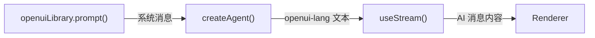

[OpenUI](https://github.com/openuidev) 是一个生成式 UI 库，它让语言模型能够以称为 **openui-lang** 的声明式格式生成完整的、交互式 UI。代理返回的不是聊天消息，而是一个包含卡片、图表、表格、选项卡和表单的组件树，`Renderer` 将其转换为真实的 React UI。

这种集成非常适合数据密集型输出，如报表、仪表盘和数据浏览器，其中模型同时扮演数据分析师和 UI 设计师的角色。

import { ExampleEmbed } from "/snippets/example-embed.jsx"

<ExampleEmbed example="openui" minHeight={700} />

## 工作原理

1. **生成系统提示：** 在启动时调用 `openuiLibrary.prompt()`；它会生成一个完整的 openui-lang 参考，模型使用该参考来编写有效的组件树
2. **在第一条消息时注入：** 当新对话开始时，将系统提示作为开场系统消息发送
3. **模型编写 openui-lang：** 模型响应一个类似 `root = Stack([header, kpis, chart])` 的程序，而不是散文
4. **使用 `Renderer` 渲染：** 将文本传递给 OpenUI 的 `Renderer` 和组件库；它会解析并渲染组件树



## 安装

```bash
npm install @langchain/react @openuidev/react-ui @openuidev/react-headless @openuidev/react-lang
```

<Tip>
OpenUI 需要 React 19+ 和 [`zustand`](https://www.npmjs.com/package/zustand)。前端代码仅限 React；LangGraph 代理后端可以用 TypeScript 或 Python 编写。
</Tip>

## 导入组件样式

在你的 CSS 入口点或根组件中导入 OpenUI 的捆绑样式：

```css
@import "@openuidev/react-ui/components.css";
@import "@openuidev/react-ui/styles/index.css";
```

## 生成系统提示

OpenUI 提供了一个 `openuiLibrary.prompt()` 函数，用于生成完整的 openui-lang 参考，包含所有组件签名、语法规则、流式传输提示和示例。在模块加载时调用它一次：

```ts
import { openuiLibrary, openuiPromptOptions } from "@openuidev/react-ui/genui-lib";

// 生成完整的 openui-lang 系统提示。在启动时调用一次，
// 不要在组件内部调用，以避免在每次渲染时重新计算。
const SYSTEM_PROMPT = openuiLibrary.prompt({
  ...openuiPromptOptions,
  preamble:
    "你是一个报表生成器。当被要求生成报表时，使用 openui-lang 生成详细、"
    "数据丰富的报表：执行摘要、KPI 卡片、图表、"
    "表格和多个部分。你的整个响应必须是原始的 openui-lang "
    "— 不能有代码围栏、不能有 markdown、不能有散文。",
});
```

`preamble` 覆盖默认的角色设定。添加 `additionalRules` 来注入任务特定的约束：

```ts
const SYSTEM_PROMPT = openuiLibrary.prompt({
  ...openuiPromptOptions,
  preamble: "你是一个报表生成器...",
  additionalRules: [
    ...(openuiPromptOptions.additionalRules ?? []),
    "始终在报表末尾添加 3–4 个后续查询按钮，使用 "
    + "Button({ type: 'continue_conversation' }, 'secondary') 包裹在 "
    + "Card([CardHeader('进一步探索'), Buttons([...])], 'sunk') 中。",
  ],
});
```

## 通过 useStream 注入系统提示

将系统提示作为每个新线程的第一条消息发送。检查 `stream.messages.length === 0` 来检测新线程并前置一条 `system` 消息：

```tsx
import { useCallback } from "react";
import { useStream } from "@langchain/react";

const SYSTEM_PROMPT = openuiLibrary.prompt({ ... });

export function App() {
  const stream = useStream({
    apiUrl: import.meta.env.VITE_LANGGRAPH_API_URL ?? "/api/langgraph",
    assistantId: "my_agent",
    reconnectOnMount: true,
    fetchStateHistory: true,
  });

  const handleSubmit = useCallback(
    (text: string) => {
      // 仅在新线程的第一条消息时注入系统提示。
      // 后续消息已在持久化历史中包含它。
      const isNewThread = stream.messages.length === 0;
      stream.submit({
        messages: [
          ...(isNewThread
            ? [{ type: "system", content: SYSTEM_PROMPT }]
            : []),
          { type: "human", content: text },
        ],
      });
    },
    [stream],
  );

  // ...
}
```

## 使用 Renderer 渲染

将 AI 消息的文本内容直接传递给 `Renderer` 和 `openuiLibrary`：

```tsx
import { Renderer } from "@openuidev/react-lang";
import { openuiLibrary } from "@openuidev/react-ui/genui-lib";
import { AIMessage } from "langchain";

function MessageList({ messages, isLoading }) {
  const lastAiIdx = messages.reduce(
    (acc, msg, i) => (AIMessage.isInstance(msg) ? i : acc),
    -1,
  );

  return messages.map((msg, i) => {
    if (AIMessage.isInstance(msg)) {
      const text = typeof msg.content === "string" ? msg.content : "";
      return (
        <Renderer
          key={msg.id ?? i}
          response={text}
          library={openuiLibrary}
          isStreaming={isLoading && i === lastAiIdx}
        />
      );
    }
    // ... 人类消息气泡
  });
}
```

在活跃流期间传递 `isStreaming={true}`，以便 Renderer 在定义到达时优雅地处理未解析的引用。

## openui-lang 格式

模型编写的是一个程序，而不是 JSON 规范。每条语句都是一个赋值；`root` 是入口点。官方提示教会模型这种格式，包括提升（hoisting）——先写 `root` 使 UI 外壳立即出现：

```
root = Stack([header, execSummary, kpis, marketSection])

header    = CardHeader("2025 年 AI 现状", "全面分析")
execSummary = MarkDownRenderer("## 执行摘要\n\nAI 市场达到...")

kpi1 = Card([CardHeader("$826B", "全球市场"), TextContent("同比增长 42%", "small")], "sunk")
kpi2 = Card([CardHeader("78%",   "采用率"),       TextContent("财富 500 强",  "small")], "sunk")
kpis = Stack([kpi1, kpi2], "row", "m", "stretch", "start", true)

col1 = Col("细分市场", "string")
col2 = Col("收入（十亿美元）", "number")
tbl  = Table([col1, col2], [["生成式 AI", 286], ["ML 基础设施", 198]])
s1   = Series("收入", [286, 198, 147])
ch1  = BarChart(["Gen AI", "ML Infra", "Vision"], [s1])
marketSection = Card([CardHeader("市场细分"), tbl, ch1])
```

启用提升（推荐）后，`root` 行首先被写入，因此页面结构立即出现，每个部分在模型定义时逐步填充。

## 渐进式渲染工具

直接将 `useStream` 连接到 `Renderer` 会导致在每个流式令牌上重新渲染，每次响应会产生数百次无操作的重解析。这会导致图表组件在其数据尚未到达时崩溃。下面的工具解决了这些问题：

| 问题 | 解决方案 |
| --- | --- |
| **部分字符串字面量** | `truncateAtOpenString` / `closeOrTruncateOpenString` — 在解析前丢弃或关闭不完整的字符串 |
| **令牌中间抖动** | `useStableText` — 仅在完整语句边界（`name = Expr(…)`）上触发 Renderer 更新，而不是每个令牌 |
| **图表空数据崩溃** | `chartDataRefsResolved` — 在将图表的 `Series` 和标签数组包含到快照前验证它们是否已定义 |
| **尚无 `root` / 回退** | `buildProgressiveRoot` — 当模型尚未编写 `root` 行时，从顶层变量合成 `root = Stack([…])` |
| **蛇形命名标识符** | `sanitizeIdentifiers` — 解析器只接受 camelCase；转换模型发出的任何 `snake_case` 名称 |

将完整块复制到你的项目中，并将 `stable` 传递给 `<Renderer>`：

```tsx expandable
import {
  useCallback,
  useEffect,
  useMemo,
  useRef,
  useState,
} from "react";
import {
  type ActionEvent,
  BuiltinActionType,
  Renderer,
} from "@openuidev/react-lang";
import { openuiLibrary } from "@openuidev/react-ui/genui-lib";

/** 去除模型可能发出的任何 markdown 代码围栏。 */
function stripCodeFence(text: string): string {
  return text
    .replace(/^```[a-z]*\r?\n?/i, "")
    .replace(/\n?```\s*$/i, "")
    .trim();
}

/**
 * openui-lang 解析器只接受 camelCase 标识符。
 * 转换模型发出的任何 snake_case 变量名；字符串内容保持不变。
 */
function sanitizeIdentifiers(text: string): string {
  const toCamel = (s: string) =>
    s.replace(/_([a-zA-Z0-9])/g, (_, c: string) => c.toUpperCase());

  const snakeVars: string[] = [];
  for (const m of text.matchAll(/^([a-zA-Z][a-zA-Z0-9]*(?:_[a-zA-Z0-9]+)+)\s*=/gm)) {
    if (!snakeVars.includes(m[1])) snakeVars.push(m[1]);
  }
  if (snakeVars.length === 0) return text;

  let result = "";
  let inStr = false;
  let i = 0;
  while (i < text.length) {
    if (text[i] === "\\" && inStr) { result += text[i] + (text[i + 1] ?? ""); i += 2; continue; }
    if (text[i] === '"') { inStr = !inStr; result += text[i++]; continue; }
    if (!inStr) {
      let replaced = false;
      for (const v of snakeVars) {
        if (text.startsWith(v, i) && !/[a-zA-Z0-9_]/.test(text[i + v.length] ?? "")) {
          result += toCamel(v); i += v.length; replaced = true; break;
        }
      }
      if (!replaced) result += text[i++];
    } else {
      result += text[i++];
    }
  }
  return result;
}

/**
 * 遍历文本跟踪打开的字符串。如果文本在字符串中间结束，
 * 截断到最后一个安全换行符——这防止部分字符串字面量消耗
 * 我们稍后合成的任何 `root = Stack(…)` 行。
 */
function truncateAtOpenString(text: string): string {
  let inStr = false;
  let lastSafeNewline = 0;
  for (let i = 0; i < text.length; i++) {
    const ch = text[i];
    if (ch === "\\" && inStr) { i++; continue; }
    if (ch === '"') { inStr = !inStr; continue; }
    if (ch === "\n" && !inStr) lastSafeNewline = i;
  }
  return inStr ? text.slice(0, lastSafeNewline) : text;
}

/**
 * 类似于 truncateAtOpenString，但当部分行是 TextContent 语句时，
 * 合成一个结束的 `")`。这使得文本可以逐令牌渲染，
 * 同时所有其他部分字符串行仍被截断。
 */
function closeOrTruncateOpenString(text: string): string {
  let inStr = false;
  let lastSafeNewline = 0;
  for (let i = 0; i < text.length; i++) {
    const ch = text[i];
    if (ch === "\\" && inStr) { i++; continue; }
    if (ch === '"') { inStr = !inStr; continue; }
    if (ch === "\n" && !inStr) lastSafeNewline = i;
  }
  if (!inStr) return text;

  const safeText = lastSafeNewline > 0 ? text.slice(0, lastSafeNewline) : "";
  const partialLine = text.slice(lastSafeNewline > 0 ? lastSafeNewline + 1 : 0);

  if (/^[a-zA-Z][a-zA-Z0-9]*\s*=\s*TextContent\(/.test(partialLine)) {
    return (lastSafeNewline > 0 ? safeText + "\n" : "") + partialLine + '")';
  }
  return safeText;
}

/** 计算形成以 `)` 或 `]` 结尾的完整赋值的行数。 */
function countCompleteStatements(text: string): number {
  let count = 0;
  for (const line of text.split("\n")) {
    const t = line.trimEnd();
    if ((t.endsWith(")") || t.endsWith("]")) && /^[a-zA-Z]/.test(t)) count++;
  }
  return count;
}

const CHART_TYPES = new Set([
  "BarChart", "LineChart", "AreaChart", "RadarChart",
  "HorizontalBarChart", "PieChart", "RadialChart",
  "SingleStackedBarChart", "ScatterChart",
]);

const OPENUI_KEYWORDS = new Set([
  "true", "false", "null", "grouped", "stacked", "linear", "natural", "step",
  "pie", "donut", "string", "number", "action", "row", "column", "card", "sunk",
  "clear", "info", "warning", "error", "success", "neutral", "danger", "start",
  "end", "center", "between", "around", "evenly", "stretch", "baseline",
  "small", "default", "large", "none", "xs", "s", "m", "l", "xl",
  "horizontal", "vertical",
]);

/**
 * 图表组件（recharts）在 labels 或 series 属性未解析时
 * 会因 `.map() on null` 而崩溃。在提交稳定快照之前，
 * 验证文本中的每个图表是否都已定义其所有数据变量。
 */
function chartDataRefsResolved(text: string): boolean {
  const lines = text.split("\n");
  const complete = new Set<string>();
  for (const line of lines) {
    const t = line.trimEnd();
    const m = t.match(/^([a-zA-Z][a-zA-Z0-9]*)\s*=/);
    if (m && (t.endsWith(")") || t.endsWith("]"))) complete.add(m[1]);
  }
  for (const line of lines) {
    const t = line.trimEnd();
    const m = t.match(/^([a-zA-Z][a-zA-Z0-9]*)\s*=\s*([A-Z][a-zA-Z0-9]*)\(/);
    if (!m || !CHART_TYPES.has(m[2]) || !t.endsWith(")")) continue;
    const rhs = t.slice(t.indexOf("=") + 1).replace(/"(?:[^"\\]|\\.)*"/g, '""');
    for (const [, name] of rhs.matchAll(/\b([a-zA-Z][a-zA-Z0-9]*)\b/g)) {
      if (/^[a-z]/.test(name) && !OPENUI_KEYWORDS.has(name) && !complete.has(name))
        return false;
    }
  }
  return true;
}

/**
 * 如果模型尚未编写 `root = Stack(…)`，则从顶层变量
 *（那些已定义但未在任何其他表达式中引用的变量）合成一个。
 * 这使即使在模型最后写 root 时也能实现渐进式渲染。
 */
function buildProgressiveRoot(text: string): string {
  if (!text) return text;
  const safe = truncateAtOpenString(text);
  if (/^root\s*=/m.test(safe)) return safe;

  const defs: string[] = [];
  const seen = new Set<string>();
  for (const m of safe.matchAll(/^([a-zA-Z_][a-zA-Z0-9_]*)\s*=/gm)) {
    if (!seen.has(m[1])) { defs.push(m[1]); seen.add(m[1]); }
  }
  if (defs.length === 0) return safe;

  const referenced = new Set<string>();
  for (const line of safe.split("\n")) {
    const thisVar = line.match(/^([a-zA-Z_][a-zA-Z0-9_]*)\s*=/)?.[1];
    const stripped = line.replace(/"(?:[^"\\]|\\.)*"/g, '""');
    for (const v of defs) {
      if (v !== thisVar && new RegExp(`\\b${v}\\b`).test(stripped)) referenced.add(v);
    }
  }

  const topLevel = defs.filter((v) => !referenced.has(v));
  const rootVars = topLevel.length > 0 ? topLevel : defs;
  return `${safe.trimEnd()}\nroot = Stack([${rootVars.join(", ")}], "column", "l")`;
}

/**
 * 将 Renderer 更新限制在至少有一个新的*完整*语句到达的时刻。
 * 这消除了流式传输期间数百次无操作的重解析。
 *
 * 特殊情况：TextContent 行逐令牌更新（通过 closeOrTruncate），
 * 因此文本可以渐进式渲染，而无需等待完整行完成。
 */
function useStableText(raw: string, isStreaming: boolean): string {
  const [stable, setStable] = useState<string>("");
  const lastCount = useRef(0);

  useEffect(() => {
    const safe = truncateAtOpenString(raw);         // 严格 — 仅用于计数
    const enhanced = closeOrTruncateOpenString(raw); // 显示 — 关闭部分 TextContent

    if (!isStreaming) { setStable(enhanced); return; }

    const count = countCompleteStatements(safe);
    const newComplete = count > lastCount.current && chartDataRefsResolved(safe);
    const partialTextContent = enhanced !== safe;

    if (newComplete || partialTextContent) {
      if (newComplete) lastCount.current = count;
      setStable(enhanced);
    }
  }, [raw, isStreaming]);

  return stable;
}

function AIMessageView({
  raw,
  isStreaming,
  onSubmit,
}: {
  raw: string;
  isStreaming: boolean;
  onSubmit: (text: string) => void;
}) {
  const stable = useStableText(raw, isStreaming);
  const processed = useMemo(() => buildProgressiveRoot(stable), [stable]);

  const handleAction = useCallback(
    (event: ActionEvent) => {
      if (event.type === BuiltinActionType.ContinueConversation) {
        onSubmit(event.humanFriendlyMessage);
      }
    },
    [onSubmit],
  );

  if (!processed) return null;

  return (
    <Renderer
      response={processed}
      library={openuiLibrary}
      isStreaming={isStreaming}
      onAction={handleAction}
    />
  );
}

export function MessageList({ messages, isLoading, onSubmit }) {
  const lastAiIdx = messages.reduce(
    (acc, msg, i) => (msg.getType() === "ai" ? i : acc),
    -1,
  );

  return messages.map((msg, i) => {
    if (msg.getType() === "human") {
      return (
        <div key={msg.id ?? i} className="flex justify-end">
          <div className="user-bubble">
            {typeof msg.content === "string" ? msg.content : ""}
          </div>
        </div>
      );
    }

    if (msg.getType() === "ai") {
      const raw = sanitizeIdentifiers(
        stripCodeFence(typeof msg.content === "string" ? msg.content : ""),
      );
      if (!raw) return null;
      return (
        <div key={msg.id ?? i}>
          <AIMessageView
            raw={raw}
            isStreaming={isLoading && i === lastAiIdx}
            onSubmit={onSubmit}
          />
        </div>
      );
    }

    return null;
  });
}
```

## 后续查询

OpenUI 的 `Button` 组件支持 `continue_conversation` 操作类型。当用户点击后续按钮时，`Renderer` 触发 `onAction`，上面的 `AIMessageView` 将按钮的标签作为下一条用户消息提交，与在输入框中输入的代码路径完全相同。

通过系统提示中的 `additionalRules` 为每个报表添加"进一步探索"部分：

```
followUp1 = Button("比较 AI 领导者 2024 vs 2025", { type: "continue_conversation" }, "secondary")
followUp2 = Button("全球 AI 投资细分",  { type: "continue_conversation" }, "secondary")
followUpBtns = Buttons([followUp1, followUp2], "row")
followUpCard  = Card([CardHeader("进一步探索"), followUpBtns], "sunk")
root = Stack([..., followUpCard])
```

## 最佳实践

- **在模块加载时生成系统提示：** 不要在 React 组件内部生成；提示有几千字节，应该只计算一次
- **仅在新线程上注入系统提示：** 检查 `stream.messages.length === 0`，在后续轮次跳过注入，避免在线程历史中重复提示
- **使用提升顺序：** 先写 `root = Stack([...])`；UI 外壳立即出现，各节在模型定义时逐步填充
- **在完整语句处守门：** 避免在每个令牌上重新渲染 Renderer；仅在完整语句（`name = ComponentCall(...)`）到达时更新
- **在渲染前验证图表数据：** 图表组件需要其 `Series` 和标签数组在包含到稳定快照之前已定义
- **保持 camelCase 变量名：** openui-lang 解析器只接受 camelCase 标识符；在系统提示的 `additionalRules` 中强调这一点