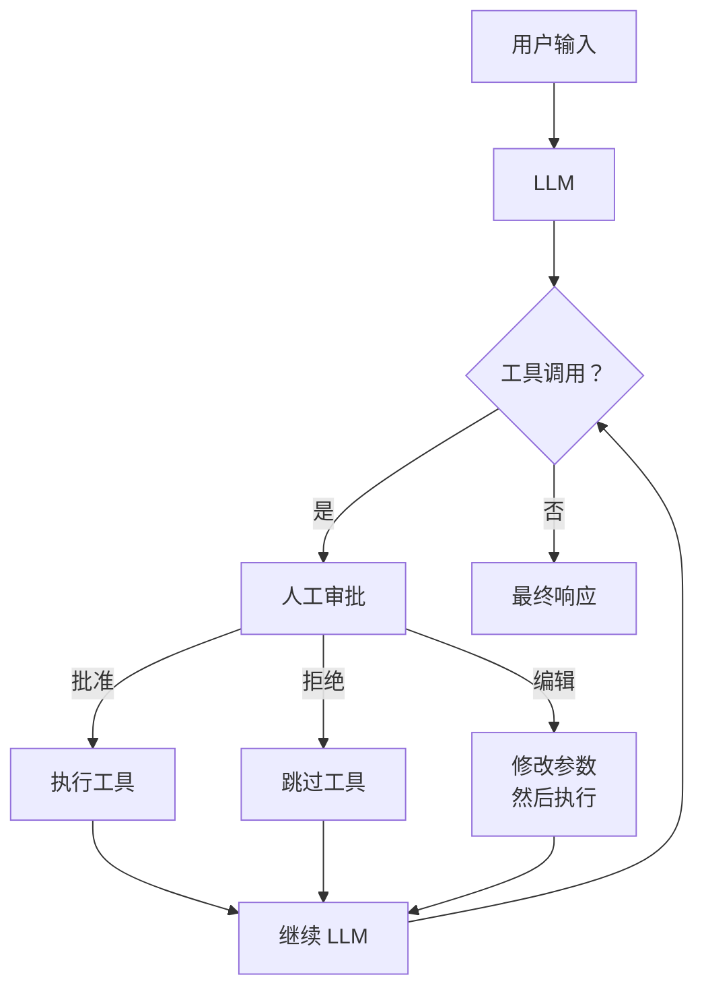

## 概述

在大多数自动化系统中，代理在无人监督的情况下执行工具调用。本指南展示了如何向工作流添加人工审批，从而防止代理在未获得人工批准的情况下执行特定工具。

<Info>
    本页面涵盖**人工介入**（HITL）工作流，重点关注在单个代理执行期间创建人工审批的**审批**模式。如果你对人的角色涉及接管和引导代理的情况感兴趣，请参阅 LangGraph 概念指南中的[人工介入](https://langchain-ai.github.io/langgraph/concepts/human_in_the_loop/)部分。
</Info>

### 人工介入的工作原理

默认情况下，LangChain 的 `create_agent` 调用配置为自动批准所有工具调用。启用 HITL 会将此行为更改为"中断"模式，要求人工在处理工具之前批准每个工具。与持久化（`checkpointer`）结合使用时，系统会停止执行并等待外部输入。



#### 先决条件

人工介入需要一个**检查点器**来持久化状态，以便代理可以在收到反馈时暂停和恢复。以下示例使用 `InMemorySaver`；有关在生产中使用实际持久化后端的设置，请参阅 LangGraph 的[检查点器文档](https://langchain-ai.github.io/langgraph/concepts/persistence/)。

## 实现

### 配置中断的工具

为了实现人工介入，请使用 `HumanInTheLoopMiddleware` 指定哪些工具需要审批：

:::python

```python
from langchain.agents import create_agent
from langchain.agents.middleware import HumanInTheLoopMiddleware
from langgraph.checkpoint.memory import InMemorySaver

agent = create_agent(
    model="gpt-5.4",
    tools=[search, send_email, delete_database],
    middleware=[
        HumanInTheLoopMiddleware(
            interrupt_on={
                "send_email": True,       # 发送邮件前请求审批
                "delete_database": True,   # 删除数据库前请求审批
                "search": False,           # 搜索始终自动批准
            }
        ),
    ],
    checkpointer=InMemorySaver(),
)
```

:::

:::js

```typescript
import { createAgent, humanInTheLoopMiddleware } from "langchain";
import { MemorySaver } from "@langchain/langgraph";

const agent = createAgent({
  model: "gpt-5.4",
  tools: [search, sendEmailTool, deleteDatabaseTool],
  middleware: [
    humanInTheLoopMiddleware({
      interruptOn: {
        send_email: { allowAccept: true, allowEdit: true, allowRespond: true },
        delete_database: { allowAccept: true, allowEdit: true, allowRespond: true },
        search: false,
      }
    }),
  ],
  checkpointer: new MemorySaver(),
});
```

:::

### 执行和审批

启用 HITL 后，代理将运行到中断点，然后暂停等待外部输入。你必须使用 `Command` 恢复执行来处理挂起的审批：

:::python

```python
from langgraph.types import Command

# 首次调用通过 thread_id 持久化
config = {"configurable": {"thread_id": "my_thread"}}

# 代理将在此处中断以等待审批
result = agent.invoke(
    {"messages": [{"role": "user", "content": "给团队发送一封邮件"}]},
    config=config,
)

# 检查中断并恢复
result = agent.invoke(
    Command(resume={"decisions": [{"type": "approve"}]}),  # 批准所有工具
    config=config,
)
```

:::

:::js

```typescript
import { Command } from "@langchain/langgraph";

// First invocation is persisted via thread_id
const config = { configurable: { thread_id: "my_thread" } };

// Agent will interrupt here to wait for approval
let result = await agent.invoke(
  { messages: [{ role: "user", content: "Send an email to the team" }] },
  config,
);

// Check for interrupts and resume
result = await agent.invoke(
  new Command({ resume: { decisions: [{ type: "approve" }] } }),  // Approve all tools
  config,
);
```

:::

## 决策类型

人工介入提供三种决策类型，用于控制如何处理挂起的工具调用：

### 批准

批准允许继续执行特定工具调用。代理将执行所述操作而无需进一步修改。当由人工审查工具参数和上下文并同意拟议的行动时使用此选项。

:::python

```python
# 批准所有待处理的工具
Command(resume={"decisions": [{"type": "approve"}]})

# 仅批准特定工具调用（按索引）
Command(resume={"decisions": [{"type": "approve", "tool_call_id": "call_123"}]})
```

:::

:::js

```typescript
// Approve all pending tools
new Command({ resume: { decisions: [{ type: "approve" }] } });

// Or approve specific tool calls
new Command({ resume: { decisions: [{ type: "approve", toolCallId: "call_123" }] } });
```

:::

### 拒绝

拒绝跳过工具调用而不执行。代理将继续执行其流程的其余部分，就像工具已被调用一样，但不会产生副作用。当人工确定不需要该操作时使用此选项。

:::python

```python
# 拒绝所有待处理的工具
Command(resume={"decisions": [{"type": "reject"}]})

# 仅拒绝特定工具调用（按索引）
Command(resume={"decisions": [{"type": "reject", "tool_call_id": "call_123"}]})
```

:::

:::js

```typescript
// Reject all pending tools
new Command({ resume: { decisions: [{ type: "reject" }] } });

// Or reject specific tool calls
new Command({ resume: { decisions: [{ type: "reject", toolCallId: "call_123" }] } });
```

:::

### 编辑

编辑允许你在执行前修改工具参数。这使人工能够纠正参数或调整输入，同时由代理执行工具。当你同意操作但需要调整其具体实现方式时使用此选项。

:::python

```python
# 编辑特定工具调用的参数
Command(resume={"decisions": [
    {
        "type": "edit",
        "tool_call_id": "call_456",
        "args": {
            "to": "correct@example.com",
            "body": "编辑后的邮件正文",
        },
    }
]})
```

:::

:::js

```typescript
// Edit the arguments for a specific tool call
new Command({ resume: { decisions: [
  {
    type: "edit",
    toolCallId: "call_456",
    args: {
      to: "correct@example.com",
      body: "Edited email body",
    },
  }
] } });
```

:::

## 自定义批准流程

### 自定义提示

你可以使用 `decision_prompt` 参数自定义审批 UI 中显示的提示：

:::python

```python
HumanInTheLoopMiddleware(
    interrupt_on={
        "send_email": True,
    },
    decision_prompt="请审核此工具调用并选择批准、拒绝或编辑：",
)
```

:::

:::js

```typescript
humanInTheLoopMiddleware({
  interruptOn: {
    send_email: { allowAccept: true, allowEdit: true, allowRespond: true },
  },
});
```

:::