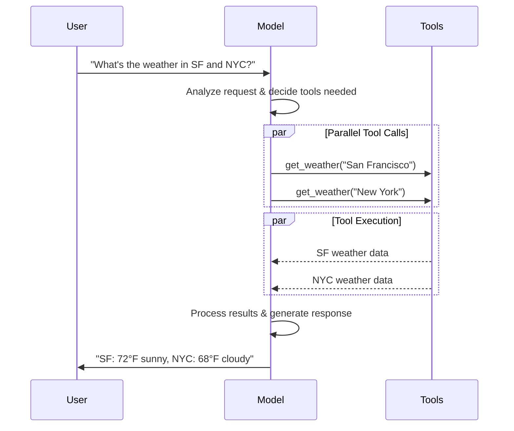
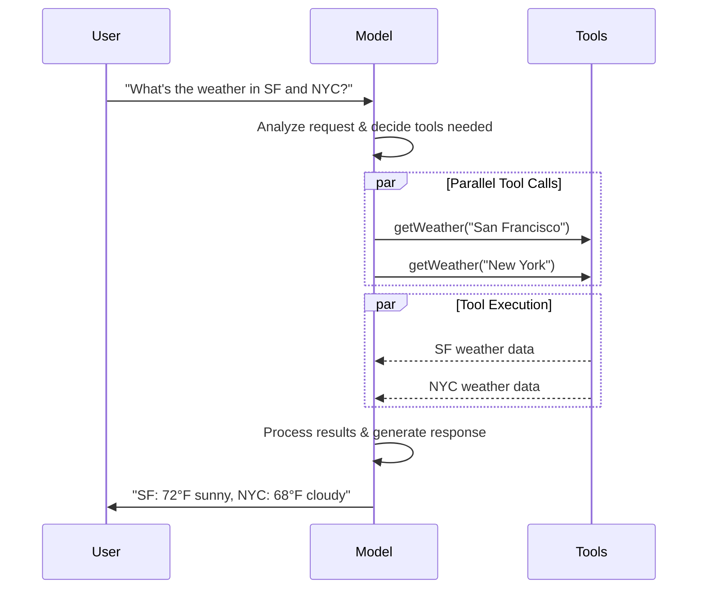

import ChatModelTabsPy from '/snippets/chat-model-tabs.mdx';
import ChatModelTabsJS from '/snippets/chat-model-tabs-js.mdx';

[LLM](https://en.wikipedia.org/wiki/Large_language_model) 是强大的 AI 工具，可以像人类一样解释和生成文本。它们用途广泛，能够编写内容、翻译语言、总结和回答问题，而无需为每个任务进行专门的训练。

除了文本生成，许多模型还支持：

* <Icon icon="hammer" size={16} /> [工具调用](#tool-calling) - 调用外部工具（如数据库查询或 API 调用）并在响应中使用结果。
* <Icon icon="layout-grid" size={16} /> [结构化输出](#structured-output) - 模型的响应被约束为遵循定义的格式。
* <Icon icon="photo" size={16} /> [多模态](#multimodal) - 处理并返回文本以外的数据，如图像、音频和视频。
* <Icon icon="brain" size={16} /> [推理](#reasoning) - 模型执行多步推理以得出结论。

模型是 [agent](/oss/langchain/agents) 的推理引擎。它们驱动 agent 的决策过程，决定调用哪些工具、如何解释结果以及何时提供最终答案。

您选择的模型质量和能力直接影响 agent 的基线和性能。不同的模型擅长不同的任务——有些更擅长遵循复杂指令，有些擅长结构化推理，还有一些支持更大的上下文窗口来处理更多信息。

LangChain 的标准模型接口让您可以访问许多不同的 provider 集成，这使得在模型之间进行实验和切换变得容易，以找到最适合您用例的模型。

<Info>
    有关 provider 特定的集成信息和能力，请参阅 provider 的 [chat model 页面](/oss/integrations/chat)。
</Info>

## 基本用法

模型可以通过两种方式使用：

1. **与 agent 一起使用** - 可以在创建 [agent](/oss/langchain/agents#model) 时动态指定模型。
2. **独立使用** - 可以直接调用模型（在 agent 循环之外）执行文本生成、分类或提取等任务，无需 agent 框架。

相同的模型接口在两种上下文中都适用，这使您可以灵活地从简单的开始，并根据需要扩展到更复杂的基于 agent 的工作流。

### 初始化模型

:::python
在 LangChain 中开始使用独立模型的最简单方法是使用 @[`init_chat_model`] 从您选择的 chat model provider 初始化一个模型（示例如下）：

<ChatModelTabsPy />
```python
response = model.invoke("Why do parrots talk?")
```

更多详情请参阅 @[`init_chat_model`][init_chat_model]，包括如何传递模型 [参数](#parameters) 的信息。
:::
:::js
在 LangChain 中开始使用独立模型的最简单方法是使用 `initChatModel` 从您选择的 [chat model provider](/oss/integrations/chat) 初始化一个模型（示例如下）：

<ChatModelTabsJS />
```typescript
const response = await model.invoke("Why do parrots talk?");
```
更多详情请参阅 @[`initChatModel`][initChatModel]，包括如何传递模型 [参数](#parameters) 的信息。
:::

### 支持的 Provider 和模型

LangChain 通过专用的集成包支持所有主要的模型提供商。每个 provider 包都实现相同的标准接口，因此您可以在不重写应用程序逻辑的情况下切换 provider。新的模型名称立即可用——无需 LangChain 更新——因为 provider 包直接将模型名称传递给 provider 的 API。

浏览 [支持的 provider 完整列表](/oss/integrations/providers/overview)，或参阅 [Providers and models](/oss/concepts/providers-and-models) 了解 provider、包和模型名称如何在 LangChain 中协同工作的概念概述。

### 关键方法

<Card title="Invoke" href="#invoke" icon="send" arrow="true" horizontal>
    模型接收消息作为输入，并在生成完整响应后输出消息。
</Card>
<Card title="Stream" href="#stream" icon="broadcast" arrow="true" horizontal>
    调用模型，但在生成时实时流式传输输出。
</Card>
<Card title="Batch" href="#batch" icon="grip-vertical" arrow="true" horizontal>
    批量发送多个请求到模型，以实现更高效的处理。
</Card>

<Info>
    除了 chat model，LangChain 还支持其他相关技术，如 embedding 模型和向量存储。详情请参阅 [集成页面](/oss/integrations/providers/overview)。
</Info>

## 参数

Chat model 包含可用于配置其行为的参数。支持的完整参数集因模型和 provider 而异，但标准参数包括：

<ParamField body="model" type="string" required>
   您要与 provider 一起使用的特定模型的名称或标识符。您还可以使用 '{model_provider}:{model}' 格式在单个参数中同时指定模型及其 provider，例如 'openai:o1'。
</ParamField>

:::python
<ParamField body="api_key" type="string">
   用于向模型 provider 进行身份验证的密钥。通常在您注册模型访问权限时颁发。通常通过设置 <Tooltip tip="其值在程序外部设置，通常通过操作系统或微服务的内置功能进行设置。">环境变量</Tooltip> 来访问。
</ParamField>
:::
:::js
<ParamField body="apiKey" type="string">
   用于向模型 provider 进行身份验证的密钥。通常在您注册模型访问权限时颁发。通常通过设置 <Tooltip tip="其值在程序外部设置，通常通过操作系统或微服务的内置功能进行设置。">环境变量</Tooltip> 来访问。
</ParamField>
:::

<ParamField body="temperature" type="number">
   控制模型输出的随机性。较高的数值使响应更具创造性；较低的数值使其更确定性。
</ParamField>

:::python
<ParamField body="max_tokens" type="number">
   限制响应中 <Tooltip tip="模型读取和生成的基本单位。不同 provider 定义可能不同，但通常可以表示单词的全部或部分。">token</Tooltip> 的总数，有效控制输出的长度。
</ParamField>
:::
:::js
<ParamField body="maxTokens" type="number">
   限制响应中 <Tooltip tip="模型读取和生成的基本单位。不同 provider 定义可能不同，但通常可以表示单词的全部或部分。">token</Tooltip> 的总数，有效控制输出的长度。
</ParamField>
:::

<ParamField body="timeout" type="number">
   等待模型响应的最长时间（以秒为单位），超过此时间将取消请求。
</ParamField>

:::python
<ParamField body="max_retries" type="number" default="6">
   系统在请求因网络超时或速率限制等问题失败时重新发送请求的最大尝试次数。重试使用带有抖动的指数退避。网络错误、速率限制（429）和服务器错误（5xx）会自动重试。客户端错误如 401（未授权）或 404 不会重试。对于在不可靠网络上的长时间运行 [agent](/oss/deepagents/overview) 任务，考虑增加到 10-15。
</ParamField>
:::
:::js
<ParamField body="maxRetries" type="number" default="6">
   系统在请求因网络超时或速率限制等问题失败时重新发送请求的最大尝试次数。重试使用带有抖动的指数退避。网络错误、速率限制（429）和服务器错误（5xx）会自动重试。客户端错误如 401（未授权）或 404 不会重试。对于在不可靠网络上的长时间运行 [agent](/oss/deepagents/overview) 任务，考虑增加到 10-15。
</ParamField>
:::

:::python
使用 @[`init_chat_model`]，将这些参数作为内联 <Tooltip tip="任意关键字参数" cta="了解更多" href="https://www.w3schools.com/python/python_args_kwargs.asp">`**kwargs`</Tooltip> 传递：

```python Initialize using model parameters
model = init_chat_model(
    "claude-sonnet-4-6",
    # Kwargs passed to the model:
    temperature=0.7,
    timeout=30,
    max_tokens=1000,
    max_retries=6,  # 默认值；对于不可靠网络可增加
)
```
:::
:::js
使用 `initChatModel`，将这些参数作为内联参数传递：

```typescript Initialize using model parameters
const model = await initChatModel(
    "claude-sonnet-4-6",
    { temperature: 0.7, timeout: 30, maxTokens: 1000, maxRetries: 6 }
)
```
:::

### 连接弹性

LangChain chat model 会自动使用指数退避重试失败的 API 请求。默认情况下，模型对网络错误、速率限制（429）和服务器错误（5xx）最多重试 **6 次**。客户端错误如 401（未授权）或 404 不会重试。

:::python
您可以在创建模型时调整 `max_retries` 和 `timeout`，然后将该实例传递给 `create_agent`、`create_deep_agent`，或独立调用：

```python
from langchain.chat_models import init_chat_model

model = init_chat_model(
    "google_genai:gemini-3.5-flash",
    max_retries=10,  # 为不可靠网络增加（默认：6）
    timeout=120,  # 秒；为慢速连接增加
)
```
:::

:::js
您可以在创建模型时调整 `maxRetries` 和 `timeout`，然后将该实例传递给 `createAgent`、`createDeepAgent`，或独立调用：

```typescript
import { ChatAnthropic } from "@langchain/anthropic";

const model = new ChatAnthropic({
  model: "google_genai:gemini-3.5-flash",
  maxRetries: 10, // 为不可靠网络增加（默认：6）
  timeout: 120_000, // 毫秒；为慢速连接增加
});
```
:::

<Tip>
    对于在不可靠网络上长时间运行的 agent graph，考虑使用更高的 `max_retries`（例如 10-15）和一个 [checkpointer](/oss/langgraph/persistence)，以便在失败时保留进度。
</Tip>

<Info>
    每个 chat model 集成可能有额外的参数用于控制 provider 特定功能。

    例如，@[`ChatOpenAI`] 有 `use_responses_api` 来决定是使用 OpenAI Responses API 还是 Completions API。

    要查找给定 chat model 支持的所有参数，请访问 [chat model 集成](/oss/integrations/chat) 页面。
</Info>

---

## 调用

必须调用 chat model 才能生成输出。有三种主要的调用方法，每种适用于不同的用例。

### Invoke

调用模型最直接的方法是使用 @[`invoke()`][BaseChatModel.invoke] 并传入单条消息或消息列表。

:::python
```python Single message
response = model.invoke("Why do parrots have colorful feathers?")
print(response)
```
:::

:::js
```typescript Single message
const response = await model.invoke("Why do parrots have colorful feathers?");
console.log(response);
```
:::

可以向 chat model 提供消息列表来表示对话历史。每条消息都有一个角色，模型使用该角色来指示谁在对话中发送了消息。

有关角色、类型和内容的更多详细信息，请参阅 [messages](/oss/langchain/messages) 指南。

:::python
```python Dictionary format
conversation = [
    {"role": "system", "content": "You are a helpful assistant that translates English to French."},
    {"role": "user", "content": "Translate: I love programming."},
    {"role": "assistant", "content": "J'adore la programmation."},
    {"role": "user", "content": "Translate: I love building applications."}
]

response = model.invoke(conversation)
print(response)  # AIMessage("J'adore créer des applications.")
```
```python Message objects
from langchain.messages import HumanMessage, AIMessage, SystemMessage

conversation = [
    SystemMessage("You are a helpful assistant that translates English to French."),
    HumanMessage("Translate: I love programming."),
    AIMessage("J'adore la programmation."),
    HumanMessage("Translate: I love building applications.")
]

response = model.invoke(conversation)
print(response)  # AIMessage("J'adore créer des applications.")
```
:::

:::js
```typescript Object format
const conversation = [
  { role: "system", content: "You are a helpful assistant that translates English to French." },
  { role: "user", content: "Translate: I love programming." },
  { role: "assistant", content: "J'adore la programmation." },
  { role: "user", content: "Translate: I love building applications." },
];

const response = await model.invoke(conversation);
console.log(response);  // AIMessage("J'adore créer des applications.")
```
```typescript Message objects
import { HumanMessage, AIMessage, SystemMessage } from "langchain";

const conversation = [
  new SystemMessage("You are a helpful assistant that translates English to French."),
  new HumanMessage("Translate: I love programming."),
  new AIMessage("J'adore la programmation."),
  new HumanMessage("Translate: I love building applications."),
];

const response = await model.invoke(conversation);
console.log(response);  // AIMessage("J'adore créer des applications.")
```
:::

<Info>
    如果调用的返回类型是字符串，请确保您使用的是 chat model 而不是 LLM。传统的文本补全 LLM 直接返回字符串。LangChain chat model 以 "Chat" 为前缀，例如 @[`ChatOpenAI`](/oss/integrations/chat/openai)。
</Info>

### Stream

大多数模型可以在生成输出内容时进行流式传输。通过逐步显示输出，流式传输显著改善了用户体验，特别是对于较长的响应。

调用 @[`stream()`][BaseChatModel.stream] 返回一个 <Tooltip tip="一个对象，按顺序逐步提供对集合中每个项目的访问。">迭代器</Tooltip>，它会在输出块生成时返回这些块。您可以使用循环实时处理每个块：

:::python
<CodeGroup>
    ```python Basic text streaming
    for chunk in model.stream("Why do parrots have colorful feathers?"):
        print(chunk.text, end="|", flush=True)
    ```

    ```python Stream tool calls, reasoning, and other content
    for chunk in model.stream("What color is the sky?"):
        for block in chunk.content_blocks:
            if block["type"] == "reasoning" and (reasoning := block.get("reasoning")):
                print(f"Reasoning: {reasoning}")
            elif block["type"] == "tool_call_chunk":
                print(f"Tool call chunk: {block}")
            elif block["type"] == "text":
                print(block["text"])
            else:
                ...
    ```
</CodeGroup>
:::
:::js
<CodeGroup>
    ```typescript Basic text streaming
    const stream = await model.stream("Why do parrots have colorful feathers?");
    for await (const chunk of stream) {
      console.log(chunk.text)
    }
    ```

    ```typescript Stream tool calls, reasoning, and other content
    const stream = await model.stream("What color is the sky?");
    for await (const chunk of stream) {
      for (const block of chunk.contentBlocks) {
        if (block.type === "reasoning") {
          console.log(`Reasoning: ${block.reasoning}`);
        } else if (block.type === "tool_call_chunk") {
          console.log(`Tool call chunk: ${block}`);
        } else if (block.type === "text") {
          console.log(block.text);
        } else {
          ...
        }
      }
    }
    ```
</CodeGroup>
:::

与 [`invoke()`](#invoke)（在模型完成生成完整响应后返回单个 @[`AIMessage`][AIMessage]）不同，`stream()` 返回多个 @[`AIMessageChunk`][AIMessageChunk] 对象，每个对象包含一部分输出文本。重要的是，流中的每个 chunk 都可以通过求和汇总为完整消息：

:::python
```python Construct an AIMessage
full = None  # None | AIMessageChunk
for chunk in model.stream("What color is the sky?"):
    full = chunk if full is None else full + chunk
    print(full.text)

# The
# The sky
# The sky is
# The sky is typically
# The sky is typically blue
# ...

print(full.content_blocks)
# [{"type": "text", "text": "The sky is typically blue..."}]
```
:::

:::js
```typescript Construct AIMessage
let full: AIMessageChunk | null = null;
for await (const chunk of stream) {
  full = full ? full.concat(chunk) : chunk;
  console.log(full.text);
}

// The
// The sky
// The sky is
// The sky is typically
// The sky is typically blue
// ...

console.log(full.contentBlocks);
// [{"type": "text", "text": "The sky is typically blue..."}]
```
:::

生成的消息可以与使用 [`invoke()`](#invoke) 生成的消息同样处理——例如，它可以汇总到消息历史中并作为对话上下文传递回模型。

<Warning>
    流式传输仅在程序中所有步骤都知道如何处理 chunk 流时才有效。例如，需要将整个输出存储在内存中才能处理的应用程序就不是流式传输适用的。
</Warning>

<Accordion title="高级流式传输主题">
    <Accordion title="流式事件">
        :::python
        LangChain chat model 还可以使用 `astream_events()` 流式传输语义事件。

        这简化了基于事件类型和其他元数据的过滤，并会在后台汇总完整消息。参见下面的示例。

        ```python
        async for event in model.astream_events("Hello"):

            if event["event"] == "on_chat_model_start":
                print(f"Input: {event['data']['input']}")

            elif event["event"] == "on_chat_model_stream":
                print(f"Token: {event['data']['chunk'].text}")

            elif event["event"] == "on_chat_model_end":
                print(f"Full message: {event['data']['output'].text}")

            else:
                pass
        ```
        ```txt
        Input: Hello
        Token: Hi
        Token:  there
        Token: !
        Token:  How
        Token:  can
        Token:  I
        ...
        Full message: Hi there! How can I help today?
        ```

        <Tip>
            有关事件类型和其他详细信息，请参阅 @[`astream_events()`][BaseChatModel.astream_events] 参考。
        </Tip>
        :::

        :::js
        LangChain chat model 还可以使用
        [`streamEvents()`][BaseChatModel.streamEvents] 流式传输语义事件。

        这简化了基于事件类型和其他元数据的过滤，并会在后台汇总完整消息。参见下面的示例。

        ```typescript
        const stream = await model.streamEvents("Hello");
        for await (const event of stream) {
            if (event.event === "on_chat_model_start") {
                console.log(`Input: ${event.data.input}`);
            }
            if (event.event === "on_chat_model_stream") {
                console.log(`Token: ${event.data.chunk.text}`);
            }
            if (event.event === "on_chat_model_end") {
                console.log(`Full message: ${event.data.output.text}`);
            }
        }
        ```
        ```txt
        Input: Hello
        Token: Hi
        Token:  there
        Token: !
        Token:  How
        Token:  can
        Token:  I
        ...
        Full message: Hi there! How can I help today?
        ```

        有关事件类型和其他详细信息，请参阅 @[`streamEvents()`][BaseChatModel.streamEvents] 参考。
        :::
    </Accordion>
    <Accordion title='"自动流式传输" Chat Model'>
        LangChain 通过在某些情况下自动启用流式模式来简化从 chat model 的流式传输，即使您没有显式调用流式方法。当您在非流式模式下使用 invoke 方法，但仍希望流式传输整个应用程序（包括 chat model 的中间结果）时，这特别有用。

        例如，在 [LangGraph agent](/oss/langchain/agents) 中，您可以在节点内调用 `model.invoke()`，但如果正在以流式模式运行，LangChain 将自动委托给流式传输。

        #### 工作原理

        当您 `invoke()` 一个 chat model 时，LangChain 会在检测到您正在尝试流式传输整个应用程序时自动切换到内部流式模式。对于使用 invoke 的代码而言，调用结果将保持不变；然而，在 chat model 流式传输时，LangChain 会在 LangChain 的回调系统中触发 @[`on_llm_new_token`] 事件。

        :::python
        回调事件允许 LangGraph `stream()` 和 `astream_events()` 实时呈现 chat model 的输出。
        :::
        :::js
        回调事件允许 LangGraph `stream()` 和 `streamEvents()` 实时呈现 chat model 的输出。
        :::
    </Accordion>
</Accordion>

### Batch

将一批独立的请求批量发送到模型可以显著提高性能并降低成本，因为处理可以并行进行：

:::python
```python Batch
responses = model.batch([
    "Why do parrots have colorful feathers?",
    "How do airplanes fly?",
    "What is quantum computing?"
])
for response in responses:
    print(response)
```

<Note>
    本节描述的是 chat model 方法 @[`batch()`][BaseChatModel.batch]，它在客户端并行化模型调用。

    这与推理提供商支持的 batch API **不同**，例如 [OpenAI](https://platform.openai.com/docs/guides/batch) 或 [Anthropic](https://platform.claude.com/docs/en/build-with-claude/batch-processing#message-batches-api)。
</Note>

默认情况下，@[`batch()`][BaseChatModel.batch] 只会返回整个批次的最终输出。如果您想在每个单独输入完成生成时接收其输出，可以使用 @[`batch_as_completed()`][BaseChatModel.batch_as_completed] 流式传输结果：

```python Yield batch responses upon completion
for response in model.batch_as_completed([
    "Why do parrots have colorful feathers?",
    "How do airplanes fly?",
    "What is quantum computing?"
]):
    print(response)
```
<Note>
    使用 @[`batch_as_completed()`][BaseChatModel.batch_as_completed] 时，结果可能无序到达。每个结果都包含输入索引，以便在需要时重建原始顺序。
</Note>

<Tip>
    使用 @[`batch()`][BaseChatModel.batch] 或 @[`batch_as_completed()`][BaseChatModel.batch_as_completed] 处理大量输入时，您可能希望控制最大并行调用数。可以通过在 @[`RunnableConfig`] 字典中设置 @[`max_concurrency`][RunnableConfig(max_concurrency)] 属性来实现。

    ```python Batch with max concurrency
    model.batch(
        list_of_inputs,
        config={
            'max_concurrency': 5,  # 限制为 5 个并行调用
        }
    )
    ```

    请参阅 @[`RunnableConfig`] 参考以获取支持的属性完整列表。
</Tip>

有关批处理的更多详细信息，请参阅 @[reference][BaseChatModel.batch]。
:::

:::js
```typescript Batch
const responses = await model.batch([
  "Why do parrots have colorful feathers?",
  "How do airplanes fly?",
  "What is quantum computing?",
  "Why do parrots have colorful feathers?",
  "How do airplanes fly?",
  "What is quantum computing?",
]);
for (const response of responses) {
  console.log(response);
}
```

<Tip>
    使用 `batch()` 处理大量输入时，您可能希望控制最大并行调用数。可以通过在 @[`RunnableConfig`] 字典中设置 `maxConcurrency` 属性来实现。

    ```typescript Batch with max concurrency
    model.batch(
      listOfInputs,
      {
        maxConcurrency: 5,  // 限制为 5 个并行调用
      }
    )
    ```

    请参阅 @[`RunnableConfig`] 参考以获取支持的属性完整列表。
</Tip>

有关批处理的更多详细信息，请参阅 @[reference][BaseChatModel.batch]。
:::

---

## 工具调用

模型可以请求调用工具来执行任务，例如从数据库获取数据、搜索网络或运行代码。工具是以下内容的配对：

1. 一个 schema，包括工具的名称、描述和/或参数定义（通常是 JSON schema）
2. 要执行的函数或 <Tooltip tip="可以暂停执行并在以后恢复的方法">协程</Tooltip>。

<Note>
    您可能会听到"function calling"这个术语。我们将其与"tool calling"互换使用。
</Note>

以下是用户和模型之间的基本工具调用流程：

:::python

:::

:::js

:::

:::python
要使您定义的工具可供模型使用，必须使用 @[`bind_tools`][BaseChatModel.bind_tools] 绑定它们。在后续的调用中，模型可以根据需要选择调用任何绑定的工具。
:::

:::js
要使您定义的工具可供模型使用，必须使用 @[`bindTools`][BaseChatModel.bindTools] 绑定它们。在后续的调用中，模型可以根据需要选择调用任何绑定的工具。
:::

一些模型提供商提供 <Tooltip tip="在服务端执行的工具，例如网络搜索和代码解释器">内置工具</Tooltip>，可以通过模型或调用参数启用（例如 [`ChatOpenAI`](/oss/integrations/chat/openai)、[`ChatAnthropic`](/oss/integrations/chat/anthropic)）。详情请查看相应的 [provider 参考](/oss/integrations/providers/overview)。

<Tip>
    有关创建工具的详细信息和选项，请参阅 [tools guide](/oss/langchain/tools)。
</Tip>

:::python
```python Binding user tools
from langchain.tools import tool

@tool
def get_weather(location: str) -> str:
    """Get the weather at a location."""
    return f"It's sunny in {location}."


model_with_tools = model.bind_tools([get_weather])  # [!code highlight]

response = model_with_tools.invoke("What's the weather like in Boston?")
for tool_call in response.tool_calls:
    # 查看模型发出的工具调用
    print(f"Tool: {tool_call['name']}")
    print(f"Args: {tool_call['args']}")
```
:::

:::js
```typescript Binding user tools
import { tool } from "langchain";
import * as z from "zod";
import { ChatOpenAI } from "@langchain/openai";

const getWeather = tool(
  (input) => `It's sunny in ${input.location}.`,
  {
    name: "get_weather",
    description: "Get the weather at a location.",
    schema: z.object({
      location: z.string().describe("The location to get the weather for"),
    }),
  },
);

const model = new ChatOpenAI({ model: "gpt-5.4" });
const modelWithTools = model.bindTools([getWeather]);  // [!code highlight]

const response = await modelWithTools.invoke("What's the weather like in Boston?");
const toolCalls = response.tool_calls || [];
for (const tool_call of toolCalls) {
  // 查看模型发出的工具调用
  console.log(`Tool: ${tool_call.name}`);
  console.log(`Args: ${tool_call.args}`);
}
```
:::

绑定用户定义的工具时，模型的响应包含执行工具的**请求**。当独立于 [agent](/oss/langchain/agents) 使用模型时，您需要自行执行请求的工具，并将结果返回给模型以供后续推理使用。当使用 [agent](/oss/langchain/agents) 时，agent 循环会为您处理工具执行循环。

下面，我们展示了一些使用工具调用的常见方式。

<AccordionGroup>
    <Accordion title="工具执行循环" icon="refresh">
        当模型返回工具调用时，您需要执行这些工具并将结果传递回模型。这创建了一个对话循环，模型可以使用工具结果生成最终响应。LangChain 包含了 [agent](/oss/langchain/agents) 抽象，为您处理这种编排。

        以下是一个简单的示例：

        :::python

        ```python Tool execution loop
        # 将（可能多个）工具绑定到模型
        model_with_tools = model.bind_tools([get_weather])

        # 步骤 1：模型生成工具调用
        messages = [{"role": "user", "content": "What's the weather in Boston?"}]
        ai_msg = model_with_tools.invoke(messages)
        messages.append(ai_msg)

        # 步骤 2：执行工具并收集结果
        for tool_call in ai_msg.tool_calls:
            # 使用生成的参数执行工具
            tool_result = get_weather.invoke(tool_call)
            messages.append(tool_result)

        # 步骤 3：将结果传回模型以获取最终响应
        final_response = model_with_tools.invoke(messages)
        print(final_response.text)
        # "The current weather in Boston is 72°F and sunny."
        ```

        :::
        :::js

        ```typescript Tool execution loop
        // 将（可能多个）工具绑定到模型
        const modelWithTools = model.bindTools([get_weather])

        // 步骤 1：模型生成工具调用
        const messages = [{"role": "user", "content": "What's the weather in Boston?"}]
        const ai_msg = await modelWithTools.invoke(messages)
        messages.push(ai_msg)

        // 步骤 2：执行工具并收集结果
        for (const tool_call of ai_msg.tool_calls) {
            // 使用生成的参数执行工具
            const tool_result = await get_weather.invoke(tool_call)
            messages.push(tool_result)
        }

        // 步骤 3：将结果传回模型以获取最终响应
        const final_response = await modelWithTools.invoke(messages)
        console.log(final_response.text)
        // "The current weather in Boston is 72°F and sunny."
        ```

        :::

        每个工具返回的 @[`ToolMessage`] 都包含一个与原始工具调用匹配的 `tool_call_id`，帮助模型关联结果和请求。
    </Accordion>
    <Accordion title="强制工具调用" icon="asterisk">
        默认情况下，模型可以自由选择使用哪个绑定的工具。但是，您可能希望强制选择一个工具，确保模型使用特定工具或**任何**工具：

        :::python

        <CodeGroup>
            ```python Force use of any tool
            model_with_tools = model.bind_tools([tool_1], tool_choice="any")
            ```
            ```python Force use of specific tools
            model_with_tools = model.bind_tools([tool_1], tool_choice="tool_1")
            ```
        </CodeGroup>

        :::
        :::js

        <CodeGroup>
            ```typescript Force use of any tool
            const modelWithTools = model.bindTools([tool_1], { toolChoice: "any" })
            ```
            ```typescript Force use of specific tools
            const modelWithTools = model.bindTools([tool_1], { toolChoice: "tool_1" })
            ```
        </CodeGroup>
        :::
    </Accordion>
    <Accordion title="并行工具调用" icon="stack-2">
        许多模型支持在适当时并行调用多个工具。这允许模型同时从不同来源收集信息。

        :::python

        ```python Parallel tool calls
        model_with_tools = model.bind_tools([get_weather])

        response = model_with_tools.invoke(
            "What's the weather in Boston and Tokyo?"
        )


        # 模型可能生成多个工具调用
        print(response.tool_calls)
        # [
        #   {'name': 'get_weather', 'args': {'location': 'Boston'}, 'id': 'call_1'},
        #   {'name': 'get_weather', 'args': {'location': 'Tokyo'}, 'id': 'call_2'},
        # ]


        # 执行所有工具（可以使用 async 并行完成）
        results = []
        for tool_call in response.tool_calls:
            if tool_call['name'] == 'get_weather':
                result = get_weather.invoke(tool_call)
            ...
            results.append(result)
        ```

        :::
        :::js

        ```typescript Parallel tool calls
        const modelWithTools = model.bind_tools([get_weather])

        const response = await modelWithTools.invoke(
            "What's the weather in Boston and Tokyo?"
        )


        // 模型可能生成多个工具调用
        console.log(response.tool_calls)
        // [
        //   { name: 'get_weather', args: { location: 'Boston' }, id: 'call_1' },
        //   { name: 'get_time', args: { location: 'Tokyo' }, id: 'call_2' }
        // ]


        // 执行所有工具（可以使用 async 并行完成）
        const results = []
        for (const tool_call of response.tool_calls || []) {
            if (tool_call.name === 'get_weather') {
                const result = await get_weather.invoke(tool_call)
                results.push(result)
            }
        }
        ```

        :::

        模型会根据所请求操作的独立性智能判断何时适合并行执行。

        <Tip>
        大多数支持工具调用的模型默认启用并行工具调用。有些（包括 [OpenAI](/oss/integrations/chat/openai) 和 [Anthropic](/oss/integrations/chat/anthropic)）允许您禁用此功能。要禁用它，设置 `parallel_tool_calls=False`：
        ```python
        model.bind_tools([get_weather], parallel_tool_calls=False)
        ```
        </Tip>
    </Accordion>
    <Accordion title="流式工具调用" icon="rss">
        在流式传输响应时，工具调用通过 @[`ToolCallChunk`] 逐步构建。这允许您在生成时就看到工具调用，而无需等待完整响应。

        :::python

        ```python Streaming tool calls
        for chunk in model_with_tools.stream(
            "What's the weather in Boston and Tokyo?"
        ):
            # 工具调用 chunk 逐步到达
            for tool_chunk in chunk.tool_call_chunks:
                if name := tool_chunk.get("name"):
                    print(f"Tool: {name}")
                if id_ := tool_chunk.get("id"):
                    print(f"ID: {id_}")
                if args := tool_chunk.get("args"):
                    print(f"Args: {args}")

        # 输出：
        # Tool: get_weather
        # ID: call_SvMlU1TVIZugrFLckFE2ceRE
        # Args: {"lo
        # Args: catio
        # Args: n": "B
        # Args: osto
        # Args: n"}
        # Tool: get_weather
        # ID: call_QMZdy6qInx13oWKE7KhuhOLR
        # Args: {"lo
        # Args: catio
        # Args: n": "T
        # Args: okyo
        # Args: "}
        ```

        您可以累积 chunk 来构建完整的工具调用：

        ```python Accumulate tool calls
        gathered = None
        for chunk in model_with_tools.stream("What's the weather in Boston?"):
            gathered = chunk if gathered is None else gathered + chunk
            print(gathered.tool_calls)
        ```

        :::
        :::js

        ```typescript Streaming tool calls
        const stream = await modelWithTools.stream(
            "What's the weather in Boston and Tokyo?"
        )
        for await (const chunk of stream) {
            // 工具调用 chunk 逐步到达
            if (chunk.tool_call_chunks) {
                for (const tool_chunk of chunk.tool_call_chunks) {
                console.log(`Tool: ${tool_chunk.get('name', '')}`)
                console.log(`Args: ${tool_chunk.get('args', '')}`)
                }
            }
        }

        // 输出：
        // Tool: get_weather
        // Args:
        // Tool:
        // Args: {"loc
        // Tool:
        // Args: ation": "BOS"}
        // Tool: get_time
        // Args:
        // Tool:
        // Args: {"timezone": "Tokyo"}
        ```

        您可以累积 chunk 来构建完整的工具调用：

        ```typescript Accumulate tool calls
        let full: AIMessageChunk | null = null
        const stream = await modelWithTools.stream("What's the weather in Boston?")
        for await (const chunk of stream) {
            full = full ? full.concat(chunk) : chunk
            console.log(full.contentBlocks)
        }
        ```

        :::
    </Accordion>
</AccordionGroup>

---

## 结构化输出

可以要求模型以与给定 schema 匹配的格式提供响应。这对于确保输出可以轻松解析并用于后续处理非常有用。LangChain 支持多种 schema 类型和强制结构化输出的方法。

<Tip>
    要了解结构化输出，请参阅 [Structured output](/oss/langchain/structured-output)。
</Tip>

:::python
<Tabs>
    <Tab title="Pydantic">
        [Pydantic models](https://docs.pydantic.dev/latest/concepts/models/#basic-model-usage) 提供了最丰富的功能集，包括字段验证、描述和嵌套结构。

        ```python
        from pydantic import BaseModel, Field

        class Movie(BaseModel):
            """A movie with details."""
            title: str = Field(description="The title of the movie")
            year: int = Field(description="The year the movie was released")
            director: str = Field(description="The director of the movie")
            rating: float = Field(description="The movie's rating out of 10")

        model_with_structure = model.with_structured_output(Movie)
        response = model_with_structure.invoke("Provide details about the movie Inception")
        print(response)  # Movie(title="Inception", year=2010, director="Christopher Nolan", rating=8.8)
        ```
    </Tab>
    <Tab title="TypedDict">
        Python 的 `TypedDict` 提供了比 Pydantic 模型更简单的替代方案，适合不需要运行时验证的场景。

        ```python
        from typing_extensions import TypedDict, Annotated

        class MovieDict(TypedDict):
            """A movie with details."""
            title: Annotated[str, ..., "The title of the movie"]
            year: Annotated[int, ..., "The year the movie was released"]
            director: Annotated[str, ..., "The director of the movie"]
            rating: Annotated[float, ..., "The movie's rating out of 10"]

        model_with_structure = model.with_structured_output(MovieDict)
        response = model_with_structure.invoke("Provide details about the movie Inception")
        print(response)  # {'title': 'Inception', 'year': 2010, 'director': 'Christopher Nolan', 'rating': 8.8}
        ```
    </Tab>
    <Tab title="JSON Schema">
        提供 [JSON Schema](https://json-schema.org/understanding-json-schema/about) 以获得最大控制和互操作性。

        ```python
        import json

        json_schema = {
            "title": "Movie",
            "description": "A movie with details",
            "type": "object",
            "properties": {
                "title": {
                    "type": "string",
                    "description": "The title of the movie"
                },
                "year": {
                    "type": "integer",
                    "description": "The year the movie was released"
                },
                "director": {
                    "type": "string",
                    "description": "The director of the movie"
                },
                "rating": {
                    "type": "number",
                    "description": "The movie's rating out of 10"
                }
            },
            "required": ["title", "year", "director", "rating"]
        }

        model_with_structure = model.with_structured_output(
            json_schema,
            method="json_schema",
        )
        response = model_with_structure.invoke("Provide details about the movie Inception")
        print(response)  # {'title': 'Inception', 'year': 2010, ...}
        ```
    </Tab>
</Tabs>
:::

:::js
<Tabs>
    <Tab title="Zod">
        [Zod schema](https://zod.dev/) 是定义输出 schema 的首选方式。注意，当提供 zod schema 时，模型输出也会使用 zod 的解析方法根据 schema 进行验证。

        ```typescript
        import * as z from "zod";

        const Movie = z.object({
          title: z.string().describe("The title of the movie"),
          year: z.number().describe("The year the movie was released"),
          director: z.string().describe("The director of the movie"),
          rating: z.number().describe("The movie's rating out of 10"),
        });

        const modelWithStructure = model.withStructuredOutput(Movie);

        const response = await modelWithStructure.invoke("Provide details about the movie Inception");
        console.log(response);
        // {
        //   title: "Inception",
        //   year: 2010,
        //   director: "Christopher Nolan",
        //   rating: 8.8,
        // }
        ```
    </Tab>
    <Tab title="JSON Schema">
        为了最大控制或互操作性，您可以提供原始 JSON Schema。

        ```typescript
        const jsonSchema = {
          "title": "Movie",
          "description": "A movie with details",
          "type": "object",
          "properties": {
            "title": {
              "type": "string",
              "description": "The title of the movie",
            },
            "year": {
              "type": "integer",
              "description": "The year the movie was released",
            },
            "director": {
              "type": "string",
              "description": "The director of the movie",
            },
            "rating": {
              "type": "number",
              "description": "The movie's rating out of 10",
            },
          },
          "required": ["title", "year", "director", "rating"],
        }

        const modelWithStructure = model.withStructuredOutput(
          jsonSchema,
          { method: "jsonSchema" },
        )

        const response = await modelWithStructure.invoke("Provide details about the movie Inception")
        console.log(response)  // {'title': 'Inception', 'year': 2010, ...}
        ```
    </Tab>
    <Tab title="Standard Schema">
        任何实现 [Standard Schema](https://standardschema.dev/) 规范的 schema 库也受支持。Standard Schema 对象在运行时通过 schema 的 `~standard.validate()` 方法进行验证。

        ```typescript
        import * as v from "valibot";
        import { toStandardJsonSchema } from "@valibot/to-json-schema";

        const Movie = toStandardJsonSchema(
          v.object({
            title: v.pipe(v.string(), v.description("The title of the movie")),
            year: v.pipe(v.number(), v.description("The year the movie was released")),
            director: v.pipe(v.string(), v.description("The director of the movie")),
            rating: v.pipe(v.number(), v.description("The movie's rating out of 10")),
          })
        );

        const modelWithStructure = model.withStructuredOutput(Movie);

        const response = await modelWithStructure.invoke("Provide details about the movie Inception");
        console.log(response);
        // {
        //   title: "Inception",
        //   year: 2010,
        //   director: "Christopher Nolan",
        //   rating: 8.8,
        // }
        ```
    </Tab>
</Tabs>
:::

:::python
<Note>
    **结构化输出的关键考虑因素**

    - **Method 参数**：一些提供商支持不同的结构化输出方法：
        - `'json_schema'`：使用提供商提供的专用结构化输出功能。
        - `'function_calling'`：通过强制遵循给定 schema 的 [tool call](#tool-calling) 来派生结构化输出。
        - `'json_mode'`：某些提供商提供的 `'json_schema'` 的前身。生成有效的 JSON，但 schema 必须在提示词中描述。
    - **包含原始输出**：设置 `include_raw=True` 以同时获取解析后的输出和原始 AI 消息。
    - **验证**：Pydantic 模型提供自动验证。`TypedDict` 和 JSON Schema 需要手动验证。

    请查看您的 [provider 集成页面](/oss/integrations/providers/overview) 了解支持的方法和配置选项。
</Note>
:::

:::js
<Note>
    **结构化输出的关键考虑因素：**

    - **Method 参数**：一些提供商支持不同的方法（`'jsonSchema'`、`'functionCalling'`、`'jsonMode'`）
    - **包含原始输出**：使用 @[`includeRaw: true`][BaseChatModel.with_structured_output(include_raw)] 来同时获取解析后的输出和原始 @[`AIMessage`]
    - **验证**：Zod 和 Standard Schema 对象提供自动验证，而 JSON Schema 需要手动验证
    - **Standard Schema**：任何实现 [Standard Schema](https://standardschema.dev/) 规范的 schema 库都受支持，并在运行时进行验证

    请查看您的 [provider 集成页面](/oss/integrations/providers/overview) 了解支持的方法和配置选项。
</Note>
:::

<Accordion title="示例：消息输出与解析结构并存">

返回原始的 @[`AIMessage`] 对象以及解析后的表示形式可能很有用，以访问响应元数据，例如 [token 计数](#token-usage)。为此，在调用 @[`with_structured_output`][BaseChatModel.with_structured_output] 时设置 @[`include_raw=True`][BaseChatModel.with_structured_output(include_raw)]：

    :::python
    ```python
    from pydantic import BaseModel, Field

    class Movie(BaseModel):
        """A movie with details."""
        title: str = Field(description="The title of the movie")
        year: int = Field(description="The year the movie was released")
        director: str = Field(description="The director of the movie")
        rating: float = Field(description="The movie's rating out of 10")

    model_with_structure = model.with_structured_output(Movie, include_raw=True)  # [!code highlight]
    response = model_with_structure.invoke("Provide details about the movie Inception")
    response
    # {
    #     "raw": AIMessage(...),
    #     "parsed": Movie(title=..., year=..., ...),
    #     "parsing_error": None,
    # }
    ```
    :::

    :::js
    ```typescript
    import * as z from "zod";

    const Movie = z.object({
      title: z.string().describe("The title of the movie"),
      year: z.number().describe("The year the movie was released"),
      director: z.string().describe("The director of the movie"),
      rating: z.number().describe("The movie's rating out of 10"),
      title: z.string().describe("The title of the movie"),
      year: z.number().describe("The year the movie was released"),
      director: z.string().describe("The director of the movie"),  // [!code highlight]
      rating: z.number().describe("The movie's rating out of 10"),
    });

    const modelWithStructure = model.withStructuredOutput(Movie, { includeRaw: true });

    const response = await modelWithStructure.invoke("Provide details about the movie Inception");
    console.log(response);
    // {
    //   raw: AIMessage { ... },
    //   parsed: { title: "Inception", ... }
    // }
    ```
    :::
</Accordion>
<Accordion title="示例：嵌套结构">
    Schema 可以嵌套：
    :::python
    <CodeGroup>
        ```python Pydantic BaseModel
        from pydantic import BaseModel, Field

        class Actor(BaseModel):
            name: str
            role: str

        class MovieDetails(BaseModel):
            title: str
            year: int
            cast: list[Actor]
            genres: list[str]
            budget: float | None = Field(None, description="Budget in millions USD")

        model_with_structure = model.with_structured_output(MovieDetails)
        ```

        ```python TypedDict
        from typing_extensions import Annotated, TypedDict

        class Actor(TypedDict):
            name: str
            role: str

        class MovieDetails(TypedDict):
            title: str
            year: int
            cast: list[Actor]
            genres: list[str]
            budget: Annotated[float | None, ..., "Budget in millions USD"]

        model_with_structure = model.with_structured_output(MovieDetails)
        ```
    </CodeGroup>
    :::

    :::js
    ```typescript
    import * as z from "zod";

    const Actor = z.object({
      name: str
      role: z.string(),
    });

    const MovieDetails = z.object({
      title: z.string(),
      year: z.number(),
      cast: z.array(Actor),
      genres: z.array(z.string()),
      budget: z.number().nullable().describe("Budget in millions USD"),
    });

    const modelWithStructure = model.withStructuredOutput(MovieDetails);
    ```
    :::
</Accordion>

---

## 高级主题

### 模型配置文件

<Info>
    模型配置文件需要 `langchain>=1.1`。
</Info>

:::python
LangChain chat model 可以通过 `profile` 属性公开一个包含支持功能和能力的字典：

```python
model.profile
# {
#   "max_input_tokens": 400000,
#   "image_inputs": True,
#   "reasoning_output": True,
#   "tool_calling": True,
#   ...
# }
```

请参阅 [API 参考](https://reference.langchain.com/python/langchain-core/language_models/model_profile/ModelProfile) 了解完整的字段集合。

大部分模型配置文件数据由 [models.dev](https://github.com/sst/models.dev) 项目提供支持，这是一个提供模型能力数据的开源项目。这些数据会与用于 LangChain 的附加字段合并。这些补充内容会随着上游项目的发展保持同步。

模型配置文件数据允许应用程序动态适配模型能力。例如：

1. [摘要中间件](/oss/langchain/middleware/built-in#summarization) 可以根据模型的上下文窗口大小触发摘要。
2. `create_agent` 中的 [结构化输出](/oss/langchain/structured-output) 策略可以自动推断（例如，通过检查是否支持原生结构化输出功能）。
3. 模型输入可以根据支持的 [模态](#multimodal) 和最大输入 token 进行门控。
4. [Deep Agents Code](/oss/deepagents/code) 将 [交互式模型切换器](/oss/deepagents/code/providers#which-models-appear-in-the-switcher) 过滤为配置文件报告支持 `tool_calling` 和文本 I/O 的模型，并在选择器详细信息视图中显示上下文窗口大小和能力标志。

<Accordion title="更新或覆盖配置文件数据">
    如果模型配置文件数据缺失、过时或不正确，可以更改。

    **选项 1（快速修复）**

    您可以使用任何有效的配置文件实例化一个 chat model：

    ```python
    custom_profile = {
        "max_input_tokens": 100_000,
        "tool_calling": True,
        "structured_output": True,
        # ...
    }
    model = init_chat_model("...", profile=custom_profile)
    ```

    `profile` 也是一个常规的 `dict`，可以原地更新。如果模型实例是共享的，考虑使用 `model_copy` 来避免修改共享状态。

    ```python
    new_profile = model.profile | {"key": "value"}
    model.model_copy(update={"profile": new_profile})
    ```

    **选项 2（修复上游数据）**

    数据的主要来源是 [models.dev](https://models.dev/) 项目。这些数据与 LangChain [集成包](/oss/integrations/providers/overview) 中的附加字段和覆盖合并，并与这些包一起发布。

    模型配置文件数据可以通过以下流程更新：

    1. （如需要）通过向 [GitHub 上的仓库](https://github.com/sst/models.dev) 提交 PR 来更新 [models.dev](https://models.dev/) 的源数据。
    2. （如需要）通过向 LangChain [集成包](/oss/integrations/providers/overview) 提交 PR 来更新 `langchain_<package>/data/profile_augmentations.toml` 中的附加字段和覆盖。
    3. 使用 [`langchain-model-profiles`](https://pypi.org/project/langchain-model-profiles/) CLI 工具拉取 [models.dev](https://models.dev/) 的最新数据，合并补充内容并更新配置文件数据：

    ```bash
    pip install langchain-model-profiles
    ```

    ```bash
    langchain-profiles refresh --provider <provider> --data-dir <data_dir>
    ```

    此命令：
    - 从 models.dev 下载 `<provider>` 的最新数据
    - 合并 `<data_dir>` 中 `profile_augmentations.toml` 的补充内容
    - 将合并后的配置文件写入 `<data_dir>` 中的 `profiles.py`

    例如：从 [LangChain monorepo](https://github.com/langchain-ai/langchain) 中的 [`libs/partners/anthropic`](https://github.com/langchain-ai/langchain/tree/master/libs/partners/anthropic)：

    ```bash
    uv run --with langchain-model-profiles --provider anthropic --data-dir langchain_anthropic/data
    ```
</Accordion>

:::

:::js
LangChain chat model 可以通过 `profile` 属性公开一个包含支持功能和能力的字典：

```typescript
model.profile;
// {
//   maxInputTokens: 400000,
//   imageInputs: true,
//   reasoningOutput: true,
//   toolCalling: true,
//   ...
// }
```

请参阅 [API 参考](https://reference.langchain.com/javascript/langchain-core/language_models/profile/ModelProfile) 了解完整的字段集合。

大部分模型配置文件数据由 [models.dev](https://github.com/sst/models.dev) 项目提供支持，这是一个提供模型能力数据的开源项目。这些数据会与用于 LangChain 的附加字段合并。这些补充内容会随着上游项目的发展保持同步。

模型配置文件数据允许应用程序动态适配模型能力。例如：

1. [摘要中间件](/oss/langchain/middleware/built-in#summarization) 可以根据模型的上下文窗口大小触发摘要。
2. `createAgent` 中的 [结构化输出](/oss/langchain/structured-output) 策略可以自动推断（例如，通过检查是否支持原生结构化输出功能）。
3. 模型输入可以根据支持的 [模态](#multimodal) 和最大输入 token 进行门控。
4. [Deep Agents Code](/oss/deepagents/code) 将 [交互式模型切换器](/oss/deepagents/code/providers#which-models-appear-in-the-switcher) 过滤为配置文件报告支持 `tool_calling` 和文本 I/O 的模型，并在选择器详细信息视图中显示上下文窗口大小和能力标志。

<Accordion title="修改配置文件数据">
    如果模型配置文件数据缺失、过时或不正确，可以更改。

    **选项 1（快速修复）**

    您可以使用任何有效的配置文件实例化一个 chat model：

    ```typescript
    const customProfile = {
    maxInputTokens: 100_000,
    toolCalling: true,
    structuredOutput: true,
    // ...
    };
    const model = initChatModel("...", { profile: customProfile });
    ```

    **选项 2（修复上游数据）**

    数据的主要来源是 [models.dev](https://models.dev/) 项目。这些数据与 LangChain [集成包](/oss/integrations/providers/overview) 中的附加字段和覆盖合并，并与这些包一起发布。

    模型配置文件数据可以通过以下流程更新：

    1. （如需要）通过向 [GitHub 上的仓库](https://github.com/sst/models.dev) 提交 PR 来更新 [models.dev](https://models.dev/) 的源数据。
    2. （如需要）通过向 LangChain [集成包](/oss/integrations/providers/overview) 提交 PR 来更新 `langchain-<package>/profiles.toml` 中的附加字段和覆盖。
</Accordion>

:::

<Warning>
    模型配置文件是 beta 功能。配置文件的格式可能会发生变化。
</Warning>

### 多模态

某些模型可以处理并返回非文本数据，如图像、音频和视频。您可以通过提供 [内容块](/oss/langchain/messages#message-content) 将非文本数据传递给模型。

<Tip>
    所有具有底层多模态能力的 LangChain chat model 都支持：

    1. 跨提供商标准格式的数据（请参阅我们的 [messages guide](/oss/langchain/messages)）
    2. OpenAI [chat completions](https://platform.openai.com/docs/api-reference/chat) 格式
    3. 特定提供商原生的任何格式（例如，Anthropic 模型接受 Anthropic 原生格式）
</Tip>

详情请参阅 messages 指南中的 [多模态部分](/oss/langchain/messages#multimodal)。

<Tooltip tip="并非所有 LLM 都一样！" cta="参见参考" href="https://models.dev/">某些模型</Tooltip> 可以在其响应中返回多模态数据。如果被调用执行此操作，生成的 @[`AIMessage`] 将包含多模态类型的内容块。

:::python
```python Multimodal output
response = model.invoke("Create a picture of a cat")
print(response.content_blocks)
# [
#     {"type": "text", "text": "Here's a picture of a cat"},
#     {"type": "image", "base64": "...", "mime_type": "image/jpeg"},
# ]
```
:::

:::js
```typescript Multimodal output
const response = await model.invoke("Create a picture of a cat");
console.log(response.contentBlocks);
// [
//   { type: "text", text: "Here's a picture of a cat" },
//   { type: "image", data: "...", mimeType: "image/jpeg" },
// ]
```
:::

有关特定提供商的详细信息，请参阅 [集成页面](/oss/integrations/providers/overview)。

### 推理

许多模型能够执行多步推理以得出结论。这涉及将复杂问题分解为更小、更易于管理的步骤。

**如果底层模型支持，** 您可以查看此推理过程，以更好地理解模型如何得出最终答案。

:::python
<CodeGroup>
    ```python Stream reasoning output
    for chunk in model.stream("Why do parrots have colorful feathers?"):
        reasoning_steps = [r for r in chunk.content_blocks if r["type"] == "reasoning"]
        print(reasoning_steps if reasoning_steps else chunk.text)
    ```

    ```python Complete reasoning output
    response = model.invoke("Why do parrots have colorful feathers?")
    reasoning_steps = [b for b in response.content_blocks if b["type"] == "reasoning"]
    print(" ".join(step["reasoning"] for step in reasoning_steps))
    ```
</CodeGroup>
:::

:::js
<CodeGroup>
    ```typescript Stream reasoning output
    const stream = model.stream("Why do parrots have colorful feathers?");
    for await (const chunk of stream) {
        const reasoningSteps = chunk.contentBlocks.filter(b => b.type === "reasoning");
        console.log(reasoningSteps.length > 0 ? reasoningSteps : chunk.text);
    }
    ```

    ```typescript Complete reasoning output
    const response = await model.invoke("Why do parrots have colorful feathers?");
    const reasoningSteps = response.contentBlocks.filter(b => b.type === "reasoning");
    console.log(reasoningSteps.map(step => step.reasoning).join(" "));
    ```
</CodeGroup>
:::

根据模型的不同，您有时可以指定其推理应该投入的努力程度。同样，您也可以要求模型完全关闭推理。这可能采取分类推理"层级"的形式（例如，`'low'` 或 `'high'`），或整数 token 预算。

有关详细信息，请参阅您的 chat model 的 [集成页面](/oss/integrations/providers/overview) 或 [参考文档](https://reference.langchain.com/python/integrations/)。


### 本地模型

LangChain 支持在您自己的硬件上本地运行模型。这对于数据隐私至关重要、您想调用自定义模型或希望避免使用基于云的模型所产生的成本时非常有用。

[Ollama](/oss/integrations/chat/ollama) 是在本地运行 chat 和 embedding 模型的最简单方法之一。

{/* TODO: whenever we have a better integrations directory, x-ref to that page with a local query filter */}

### 提示词缓存

许多提供商提供提示词缓存功能，以减少对相同 token 进行重复处理时的延迟和成本。这些功能可能是**隐式**的或**显式**的：

- **隐式提示词缓存：** 如果请求命中缓存，提供商将自动传递成本节省。示例：[OpenAI](/oss/integrations/chat/openai) 和 [Gemini](/oss/integrations/chat/google_generative_ai)。
- **显式缓存：** 提供商允许您手动指示缓存点，以获得更大的控制权或保证成本节省。示例：
    - @[`ChatOpenAI`]（通过 `prompt_cache_key`）
    - Anthropic 的 [`AnthropicPromptCachingMiddleware`](/oss/integrations/chat/anthropic#prompt-caching)
    - [Gemini](https://reference.langchain.com/python/integrations/langchain_google_genai/)
    - [AWS Bedrock](/oss/integrations/chat/bedrock)

<Warning>
    提示词缓存通常仅在超过最小输入 token 阈值时才会启用。详情请参阅 [provider 页面](/oss/integrations/chat)。
</Warning>

缓存使用情况将反映在模型响应的 [usage metadata](/oss/langchain/messages#token-usage) 中。

### 服务端工具使用

一些提供商支持服务端 [工具调用](#tool-calling) 循环：模型可以在单个对话轮次中与网络搜索、代码解释器和其他工具交互并分析结果。

如果模型在服务端调用工具，响应消息的内容将包含表示工具调用和结果的内容。访问响应的 [内容块](/oss/langchain/messages#standard-content-blocks) 将以 provider 无关的格式返回服务端工具调用和结果：

:::python
```python Invoke with server-side tool use
from langchain.chat_models import init_chat_model

model = init_chat_model("gpt-5.4-mini")

tool = {"type": "web_search"}
model_with_tools = model.bind_tools([tool])

response = model_with_tools.invoke("What was a positive news story from today?")
print(response.content_blocks)
```
```python Result expandable
[
    {
        "type": "server_tool_call",
        "name": "web_search",
        "args": {
            "query": "positive news stories today",
            "type": "search"
        },
        "id": "ws_abc123"
    },
    {
        "type": "server_tool_result",
        "tool_call_id": "ws_abc123",
        "status": "success"
    },
    {
        "type": "text",
        "text": "Here are some positive news stories from today...",
        "annotations": [
            {
                "end_index": 410,
                "start_index": 337,
                "title": "article title",
                "type": "citation",
                "url": "..."
            }
        ]
    }
]
```
:::
:::js
```typescript
import { initChatModel } from "langchain";

const model = await initChatModel("gpt-5.4-mini");
const modelWithTools = model.bindTools([{ type: "web_search" }])

const message = await modelWithTools.invoke("What was a positive news story from today?");
console.log(message.contentBlocks);
```
:::
这代表一个对话轮次；没有相关的 [ToolMessage](/oss/langchain/messages#tool-message) 对象需要像客户端 [工具调用](#tool-calling) 那样传入。

有关可用工具和使用详情，请参阅给定提供商的 [集成页面](/oss/integrations/chat)。

:::python
### 速率限制

许多 chat model 提供商对在给定时间段内可以进行的调用次数施加限制。如果您达到速率限制，通常会收到提供商的速率限制错误响应，并且需要等待才能发出更多请求。

为了帮助管理速率限制，chat model 集成接受一个 `rate_limiter` 参数，可以在初始化时提供以控制请求发出速率。

<Accordion title="初始化和使用速率限制器" icon="gauge">
    LangChain 内置了（可选的）@[`InMemoryRateLimiter`]。此限制器是线程安全的，可以在同一进程中的多个线程之间共享。

    ```python Define a rate limiter
    from langchain_core.rate_limiters import InMemoryRateLimiter

    rate_limiter = InMemoryRateLimiter(
        requests_per_second=0.1,  # 每 10 秒 1 个请求
        check_every_n_seconds=0.1,  # 每 100 毫秒检查是否允许发出请求
        max_bucket_size=10,  # 控制最大突发大小。
    )

    model = init_chat_model(
        model="gpt-5.4",
        model_provider="openai",
        rate_limiter=rate_limiter  # [!code highlight]
    )
    ```

    <Warning>
        提供的速率限制器只能限制单位时间内的请求数量。如果您还需要根据请求大小进行限制，它将不起作用。
    </Warning>
</Accordion>
:::

### 基础 URL 和代理设置

您可以为实现 OpenAI Chat Completions API 的提供商配置自定义基础 URL。

<Warning>
    `model_provider="openai"`（或直接使用 `ChatOpenAI`）目标是官方 OpenAI API 规范。来自路由器和代理的 provider 特定字段可能不会被提取或保留。

    对于 OpenRouter 和 LiteLLM，请优先使用专用集成：
    - [通过 `ChatOpenRouter` 使用 OpenRouter](/oss/integrations/chat/openrouter)（`langchain-openrouter`）
    - [通过 `ChatLiteLLM` / `ChatLiteLLMRouter` 使用 LiteLLM](/oss/integrations/chat)（`langchain-litellm`）
</Warning>

<Accordion title="自定义基础 URL" icon="link">
    :::python
    许多模型提供商提供与 OpenAI 兼容的 API（例如 [Together AI](https://www.together.ai/)、[vLLM](https://github.com/vllm-project/vllm)）。您可以通过指定相应的 `base_url` 参数，将这些提供商与 @[`init_chat_model`] 一起使用：

    ```python
    model = init_chat_model(
        model="MODEL_NAME",
        model_provider="openai",
        base_url="BASE_URL",
        api_key="YOUR_API_KEY",
    )
    ```
    :::

    :::js
    许多模型提供商提供与 OpenAI 兼容的 API（例如 [Together AI](https://www.together.ai/)、[vLLM](https://github.com/vllm-project/vllm)）。您可以通过指定相应的 `base_url` 参数，将这些提供商与 `initChatModel` 一起使用：

    ```python
    model = initChatModel(
        "MODEL_NAME",
        {
            modelProvider: "openai",
            baseUrl: "BASE_URL",
            apiKey: "YOUR_API_KEY",
        }
    )
    ```
    :::

    <Note>
        使用直接 chat model 类实例化时，参数名称可能因提供商而异。详情请查看相应的 [参考文档](/oss/integrations/providers/overview)。
    </Note>
</Accordion>

:::python
<Accordion title="HTTP 代理配置" icon="shield">
    对于需要 HTTP 代理的部署，一些模型集成支持代理配置：

    ```python
    from langchain_openai import ChatOpenAI

    model = ChatOpenAI(
        model="gpt-5.4",
        openai_proxy="http://proxy.example.com:8080"
    )
    ```

<Note>
    代理支持因集成而异。请查看特定模型提供商的 [参考文档](/oss/integrations/providers/overview) 了解代理配置选项。
</Note>

</Accordion>
:::


### 对数概率

某些模型可以通过在初始化模型时设置 `logprobs` 参数来返回 token 级别的对数概率，表示给定 token 的可能性：

:::python
```python
model = init_chat_model(
    model="gpt-5.4",
    model_provider="openai"
).bind(logprobs=True)

response = model.invoke("Why do parrots talk?")
print(response.response_metadata["logprobs"])
```
:::

:::js
```typescript
const model = new ChatOpenAI({
    model: "gpt-5.4",
    logprobs: true,
});

const responseMessage = await model.invoke("Why do parrots talk?");

responseMessage.response_metadata.logprobs.content.slice(0, 5);
```
:::

### Token 使用

许多模型提供商会在调用响应中返回 token 使用信息。当可用时，此信息将包含在相应模型生成的 @[`AIMessage`] 对象中。更多详细信息，请参阅 [messages](/oss/langchain/messages) 指南。

:::python
<Note>
    一些提供商的 API，特别是 OpenAI 和 Azure OpenAI chat completions，要求用户选择在流式上下文中接收 token 使用数据。有关详细信息，请参阅集成指南中的 [流式使用元数据](/oss/integrations/chat/openai#streaming-usage-metadata) 部分。
</Note>
:::

:::python
您可以使用回调或上下文管理器在应用程序中跨模型跟踪聚合的 token 计数，如下所示：

<Tabs>
    <Tab title="回调处理器">
        ```python
        from langchain.chat_models import init_chat_model
        from langchain_core.callbacks import UsageMetadataCallbackHandler

        model_1 = init_chat_model(model="gpt-5.4-mini")
        model_2 = init_chat_model(model="claude-haiku-4-5-20251001")

        callback = UsageMetadataCallbackHandler()
        result_1 = model_1.invoke("Hello", config={"callbacks": [callback]})
        result_2 = model_2.invoke("Hello", config={"callbacks": [callback]})
        print(callback.usage_metadata)
        ```
        ```python
        {
            'gpt-5.4-mini': {
                'input_tokens': 8,
                'output_tokens': 10,
                'total_tokens': 18,
                'input_token_details': {'audio': 0, 'cache_read': 0},
                'output_token_details': {'audio': 0, 'reasoning': 0}
            },
            'claude-haiku-4-5-20251001': {
                'input_tokens': 8,
                'output_tokens': 21,
                'total_tokens': 29,
                'input_token_details': {'cache_read': 0, 'cache_creation': 0}
            }
        }
        ```
    </Tab>
    <Tab title="上下文管理器">
        ```python
        from langchain.chat_models import init_chat_model
        from langchain_core.callbacks import get_usage_metadata_callback

        model_1 = init_chat_model(model="gpt-5.4-mini")
        model_2 = init_chat_model(model="claude-haiku-4-5-20251001")

        with get_usage_metadata_callback() as cb:
            model_1.invoke("Hello")
            model_2.invoke("Hello")
            print(cb.usage_metadata)
        ```
        ```python
        {
            'gpt-5.4-mini': {
                'input_tokens': 8,
                'output_tokens': 10,
                'total_tokens': 18,
                'input_token_details': {'audio': 0, 'cache_read': 0},
                'output_token_details': {'audio': 0, 'reasoning': 0}
            },
            'claude-haiku-4-5-20251001': {
                'input_tokens': 8,
                'output_tokens': 21,
                'total_tokens': 29,
                'input_token_details': {'cache_read': 0, 'cache_creation': 0}
            }
        }
        ```
    </Tab>
</Tabs>
:::

### 调用配置

:::python
调用模型时，您可以通过 @[`RunnableConfig`] 字典中的 `config` 参数传递额外配置。这提供了对执行行为、回调和元数据跟踪的运行时控制。
:::

:::js
调用模型时，您可以通过 @[`RunnableConfig`] 对象中的 `config` 参数传递额外配置。这提供了对执行行为、回调和元数据跟踪的运行时控制。
:::

常见的配置选项包括：

:::python
```python Invocation with config
response = model.invoke(
    "Tell me a joke",
    config={
        "run_name": "joke_generation",      # 此运行的自定义名称
        "tags": ["humor", "demo"],          # 用于分类的标签
        "metadata": {"user_id": "123"},     # 自定义元数据
        "callbacks": [my_callback_handler], # 回调处理器
    }
)
```
:::

:::js
```typescript Invocation with config
const response = await model.invoke(
    "Tell me a joke",
    {
        runName: "joke_generation",      // 此运行的自定义名称
        tags: ["humor", "demo"],          // 用于分类的标签
        metadata: {"user_id": "123"},     // 自定义元数据
        callbacks: [my_callback_handler], // 回调处理器
    }
)
```
:::

这些配置值在以下情况下特别有用：
- 使用 [LangSmith](/langsmith/home) 追踪进行调试
- 实施自定义日志记录或监控
- 在生产环境中控制资源使用
- 跨复杂管道跟踪调用

:::python
<Accordion title="关键配置属性">
    <ParamField body="run_name" type="string">
        在日志和追踪中标识此特定调用。不会被子调用继承。
    </ParamField>

    <ParamField body="tags" type="string[]">
        所有子调用继承的标签，用于在调试工具中进行过滤和组织。
    </ParamField>

    <ParamField body="metadata" type="object">
        用于跟踪额外上下文的自定义键值对，所有子调用继承。
    </ParamField>

    <ParamField body="max_concurrency" type="number">
        使用 @[`batch()`][BaseChatModel.batch] 或 @[`batch_as_completed()`][BaseChatModel.batch_as_completed] 时的最大并行调用数。
    </ParamField>

    <ParamField body="callbacks" type="array">
        用于监控和响应执行期间事件的处理器。
    </ParamField>

    <ParamField body="recursion_limit" type="number">
        链的最大递归深度，以防止复杂管道中无限循环。
    </ParamField>
</Accordion>
:::

:::js
<Accordion title="关键配置属性">
    <ParamField body="runName" type="string">
        在日志和追踪中标识此特定调用。不会被子调用继承。
    </ParamField>

    <ParamField body="tags" type="string[]">
        所有子调用继承的标签，用于在调试工具中进行过滤和组织。
    </ParamField>

    <ParamField body="metadata" type="object">
        用于跟踪额外上下文的自定义键值对，所有子调用继承。
    </ParamField>

    <ParamField body="maxConcurrency" type="number">
        使用 `batch()` 时的最大并行调用数。
    </ParamField>

    <ParamField body="callbacks" type="CallbackHandler[]">
        用于监控和响应执行期间事件的处理器。
    </ParamField>

    <ParamField body="recursion_limit" type="number">
        链的最大递归深度，以防止复杂管道中无限循环。
    </ParamField>
</Accordion>
:::

<Tip>
    查看完整的 @[`RunnableConfig`] 参考以获取所有支持的属性。
</Tip>

:::python
### 可配置模型

您还可以通过指定 @[`configurable_fields`][BaseChatModel.configurable_fields] 来创建运行时可配置的模型。如果您未指定模型值，则 `'model'` 和 `'model_provider'` 默认是可配置的。

```python
from langchain.chat_models import init_chat_model

configurable_model = init_chat_model(temperature=0)

configurable_model.invoke(
    "what's your name",
    config={"configurable": {"model": "gpt-5-nano"}},  # 使用 GPT-5-Nano 运行
)
configurable_model.invoke(
    "what's your name",
    config={"configurable": {"model": "claude-sonnet-4-6"}},  # 使用 Claude 运行
)
```

<Accordion title="带默认值的可配置模型">
    我们可以创建一个具有默认模型值的可配置模型，指定哪些参数是可配置的，并为可配置参数添加前缀：

    ```python
    first_model = init_chat_model(
            model="gpt-5.4-mini",
            temperature=0,
            configurable_fields=("model", "model_provider", "temperature", "max_tokens"),
            config_prefix="first",  # 当您有一个包含多个模型的链时很有用
    )

    first_model.invoke("what's your name")
    ```

    ```python
    first_model.invoke(
        "what's your name",
        config={
            "configurable": {
                "first_model": "claude-sonnet-4-6",
                "first_temperature": 0.5,
                "first_max_tokens": 100,
            }
        },
    )
    ```

    有关 `configurable_fields` 和 `config_prefix` 的更多详细信息，请参阅 @[`init_chat_model`] 参考。
</Accordion>

<Accordion title="声明式使用可配置模型">
    我们可以在可配置模型上调用 `bind_tools`、`with_structured_output`、`with_configurable` 等声明式操作，并以与常规实例化 chat model 对象相同的方式链式使用可配置模型。

    ```python
    from pydantic import BaseModel, Field


    class GetWeather(BaseModel):
        """Get the current weather in a given location"""

            location: str = Field(description="The city and state, e.g. San Francisco, CA")


    class GetPopulation(BaseModel):
        """Get the current population in a given location"""

            location: str = Field(description="The city and state, e.g. San Francisco, CA")


    model = init_chat_model(temperature=0)
    model_with_tools = model.bind_tools([GetWeather, GetPopulation])

    model_with_tools.invoke(
        "what's bigger in 2024 LA or NYC", config={"configurable": {"model": "gpt-5.4-mini"}}
    ).tool_calls
    ```
    ```
    [
        {
            'name': 'GetPopulation',
            'args': {'location': 'Los Angeles, CA'},
            'id': 'call_Ga9m8FAArIyEjItHmztPYA22',
            'type': 'tool_call'
        },
        {
            'name': 'GetPopulation',
            'args': {'location': 'New York, NY'},
            'id': 'call_jh2dEvBaAHRaw5JUDthOs7rt',
            'type': 'tool_call'
        }
    ]
    ```
    ```python
    model_with_tools.invoke(
        "what's bigger in 2024 LA or NYC",
        config={"configurable": {"model": "claude-sonnet-4-6"}},
    ).tool_calls
    ```
    ```
    [
        {
            'name': 'GetPopulation',
            'args': {'location': 'Los Angeles, CA'},
            'id': 'toolu_01JMufPf4F4t2zLj7miFeqXp',
            'type': 'tool_call'
        },
        {
            'name': 'GetPopulation',
            'args': {'location': 'New York City, NY'},
            'id': 'toolu_01RQBHcE8kEEbYTuuS8WqY1u',
            'type': 'tool_call'
        }
    ]
    ```
</Accordion>
:::