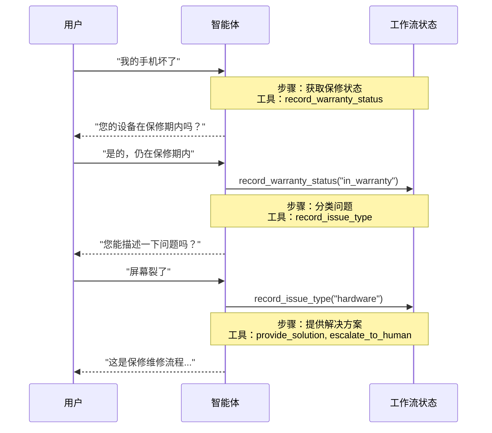

在**交接**架构中，行为根据状态动态变化。核心机制：[工具](/oss/langchain/tools)更新状态变量（例如，`current_step` 或 `active_agent`），该变量在多个对话轮次之间持续存在，系统读取此变量以调整行为——要么应用不同的配置（系统提示、工具），要么路由到不同的[智能体](/oss/langchain/agents)。此模式支持不同智能体之间的交接以及单个智能体内的动态配置更改。

<Tip>
**交接**一词由 [OpenAI](https://openai.github.io/openai-agents-python/handoffs/) 提出，用于使用工具调用（例如，`transfer_to_sales_agent`）在智能体或状态之间传递控制权。
</Tip>



## 关键特征

* 状态驱动行为：行为基于状态变量（如 `current_step` 或 `active_agent`）变化
* 基于工具的转换：工具更新状态变量以在状态之间移动
* 直接用户交互：每个状态的配置直接处理用户消息
* 持久状态：状态在多个对话轮次中持续存在

## 何时使用

当你需要强制执行顺序约束（仅在满足前置条件后解锁能力）、智能体需要在不同状态下直接与用户对话，或者你正在构建多阶段对话流程时，使用交接模式。此模式在客户支持场景中特别有价值，因为你需要按特定顺序收集信息——例如，在处理退款之前收集保修 ID。

## 基础实现

核心机制是一个返回 [`Command`](/oss/langgraph/graph-api#command) 来更新状态的[工具](/oss/langchain/tools)，从而触发到新步骤或智能体的转换：

:::python
```python
from langchain.tools import tool
from langchain.messages import ToolMessage
from langgraph.types import Command

@tool
def transfer_to_specialist(runtime) -> Command:
    """转移到专家智能体。"""
    return Command(
        update={
            "messages": [
                ToolMessage(  # [!code highlight]
                    content="已转移到专家",
                    tool_call_id=runtime.tool_call_id  # [!code highlight]
                )
            ],
            "current_step": "specialist"  # 触发行为变化
        }
    )
```
:::
:::js
```typescript
import { tool, ToolMessage, type ToolRuntime } from "langchain";
import { Command } from "@langchain/langgraph";
import { z } from "zod";

const transferToSpecialist = tool(
  async (_, config: ToolRuntime<typeof StateSchema>) => {
    return new Command({
      update: {
        messages: [
          new ToolMessage({  // [!code highlight]
            content: "Transferred to specialist",
            tool_call_id: config.toolCallId  // [!code highlight]
          })
        ],
        currentStep: "specialist"  // 触发行为变化
      }
    });
  },
  {
    name: "transfer_to_specialist",
    description: "Transfer to the specialist agent.",
    schema: z.object({})
  }
);
```
:::

<Note>
**为什么要包含 `ToolMessage`？** 当 LLM 调用工具时，它期望得到一个响应。带有匹配 `tool_call_id` 的 `ToolMessage` 完成了这个请求-响应循环——没有它，对话历史会变得畸形。当你的交接工具更新消息时，这是必需的。
</Note>

完整的实现请参见下面的教程。

<Card
    title="教程：使用交接构建客户支持"
    icon="users"
    href="/oss/langchain/multi-agent/handoffs-customer-support"
    arrow cta="了解更多"
>
    学习如何使用交接模式构建客户支持智能体，其中单个智能体在不同的配置之间转换。
</Card>

## 实现方法

有两种实现交接的方法：**[带中间件的单一智能体](#single-agent-with-middleware)**（一个智能体具有动态配置）或**[多智能体子图](#multiple-agent-subgraphs)**（作为图节点的不同智能体）。

### 带中间件的单一智能体

单个智能体根据状态改变其行为。中间件拦截每次模型调用并动态调整系统提示和可用工具。工具更新状态变量以触发转换：

:::python
```python
from langchain.tools import ToolRuntime, tool
from langchain.messages import ToolMessage
from langgraph.types import Command

@tool
def record_warranty_status(
    status: str,
    runtime: ToolRuntime[None, SupportState]
) -> Command:
    """记录保修状态并转换到下一步。"""
    return Command(
        update={
            "messages": [
                ToolMessage(
                    content=f"保修状态已记录：{status}",
                    tool_call_id=runtime.tool_call_id
                )
            ],
            "warranty_status": status,
            "current_step": "specialist"  # 更新状态以触发转换
        }
    )
```
:::
:::js
```typescript
import { tool, ToolMessage, type ToolRuntime } from "langchain";
import { Command } from "@langchain/langgraph";
import { z } from "zod";

const recordWarrantyStatus = tool(
  async ({ status }, config: ToolRuntime<typeof StateSchema>) => {
    return new Command({
      update: {
        messages: [
          new ToolMessage({
            content: `Warranty status recorded: ${status}`,
            tool_call_id: config.toolCallId,
          }),
        ],
        warrantyStatus: status,
        currentStep: "specialist", // 更新状态以触发转换
      },
    });
  },
  {
    name: "record_warranty_status",
    description: "Record warranty status and transition to next step.",
    schema: z.object({
      status: z.string(),
    }),
  }
);
```
:::

<Accordion title="完整示例：带中间件的客户支持">

:::python
```python
from langchain.agents import AgentState, create_agent
from langchain.agents.middleware import wrap_model_call, ModelRequest, ModelResponse
from langchain.tools import tool, ToolRuntime
from langchain.messages import ToolMessage
from langgraph.types import Command
from typing import Callable

# 1. 定义带有 current_step 追踪器的状态
class SupportState(AgentState):  # [!code highlight]
    """追踪当前活动的步骤。"""
    current_step: str = "triage"  # [!code highlight]
    warranty_status: str | None = None

# 2. 工具通过 Command 更新 current_step
@tool
def record_warranty_status(
    status: str,
    runtime: ToolRuntime[None, SupportState]
) -> Command:  # [!code highlight]
    """记录保修状态并转换到下一步。"""
    return Command(update={  # [!code highlight]
        "messages": [  # [!code highlight]
            ToolMessage(
                content=f"保修状态已记录：{status}",
                tool_call_id=runtime.tool_call_id
            )
        ],
        "warranty_status": status,
        # 转换到下一步
        "current_step": "specialist"    # [!code highlight]
    })

# 3. 中间件基于 current_step 应用动态配置
@wrap_model_call  # [!code highlight]
def apply_step_config(
    request: ModelRequest,
    handler: Callable[[ModelRequest], ModelResponse]
) -> ModelResponse:
    """基于 current_step 配置智能体行为。"""
    step = request.state.get("current_step", "triage")  # [!code highlight]

    # 将步骤映射到它们的配置
    configs = {
        "triage": {
            "prompt": "收集保修信息...",
            "tools": [record_warranty_status]
        },
        "specialist": {
            "prompt": "基于保修状态提供解决方案：{warranty_status}",
            "tools": [provide_solution, escalate]
        }
    }

    config = configs[step]
    request = request.override(  # [!code highlight]
        system_prompt=config["prompt"].format(**request.state),  # [!code highlight]
        tools=config["tools"]  # [!code highlight]
    )
    return handler(request)

# 4. 创建带中间件的智能体
agent = create_agent(
    model,
    tools=[record_warranty_status, provide_solution, escalate],
    state_schema=SupportState,
    middleware=[apply_step_config],  # [!code highlight]
    checkpointer=InMemorySaver()  # 跨轮次持久化状态  # [!code highlight]
)
```
:::
:::js
```typescript
import {
  createAgent,
  createMiddleware,
  tool,
  ToolMessage,
  type ToolRuntime,
} from "langchain";
import { Command, MemorySaver, StateSchema } from "@langchain/langgraph";
import { z } from "zod";

// 1. 定义带有 currentStep 追踪器的状态
const SupportState = new StateSchema({ // [!code highlight]
  currentStep: z.string().default("triage"), // [!code highlight]
  warrantyStatus: z.string().optional(),
});

// 2. 工具通过 Command 更新 currentStep
const recordWarrantyStatus = tool(
  async ({ status }, config: ToolRuntime<typeof SupportState.State>) => {
    return new Command({ // [!code highlight]
      update: { // [!code highlight]
        messages: [ // [!code highlight]
          new ToolMessage({
            content: `Warranty status recorded: ${status}`,
            tool_call_id: config.toolCallId,
          }),
        ],
        warrantyStatus: status,
        // 转换到下一步
        currentStep: "specialist", // [!code highlight]
      },
    });
  },
  {
    name: "record_warranty_status",
    description: "Record warranty status and transition",
    schema: z.object({ status: z.string() }),
  }
);

// 3. 中间件基于 currentStep 应用动态配置
const applyStepConfig = createMiddleware({
  name: "applyStepConfig",
  stateSchema: SupportState, // [!code highlight]
  wrapModelCall: async (request, handler) => {
    const step = request.state.currentStep || "triage"; // [!code highlight]

    // 将步骤映射到它们的配置
    const configs = {
      triage: {
        prompt: "收集保修信息...",
        tools: [recordWarrantyStatus],
      },
      specialist: {
        prompt: `基于保修状态提供解决方案：${request.state.warrantyStatus}`,
        tools: [provideSolution, escalate],
      },
    };

    const config = configs[step as keyof typeof configs];
    return handler({
      ...request,
      systemPrompt: config.prompt,
      tools: config.tools,
    });
  },
});

// 4. 创建带中间件的智能体
const agent = createAgent({
  model,
  tools: [recordWarrantyStatus, provideSolution, escalate],
  middleware: [applyStepConfig], // [!code highlight]
  checkpointer: new MemorySaver(), // 跨轮次持久化状态  // [!code highlight]
});
```
:::

</Accordion>

### 多智能体子图

多个不同的智能体作为图中的独立节点存在。交接工具使用 `Command.PARENT` 在智能体节点之间导航，以指定接下来执行哪个节点。

<Warning>
子图交接需要谨慎的**[上下文工程](/oss/langchain/context-engineering)**。与单一智能体中间件（消息历史自然流动）不同，你必须明确决定哪些消息在智能体之间传递。如果处理不当，智能体会收到畸形的对话历史或膨胀的上下文。参见下面的[上下文工程](#context-engineering)。
</Warning>

:::python
```python
from langchain.messages import AIMessage, ToolMessage
from langchain.tools import tool, ToolRuntime
from langgraph.types import Command

@tool
def transfer_to_sales(
    runtime: ToolRuntime,
) -> Command:
    """转移到销售智能体。"""
    last_ai_message = next(  # [!code highlight]
        msg for msg in reversed(runtime.state["messages"]) if isinstance(msg, AIMessage)  # [!code highlight]
    )  # [!code highlight]
    transfer_message = ToolMessage(  # [!code highlight]
        content="已转移到销售智能体",  # [!code highlight]
        tool_call_id=runtime.tool_call_id,  # [!code highlight]
    )  # [!code highlight]
    return Command(
        goto="sales_agent",
        update={
            "active_agent": "sales_agent",
            "messages": [last_ai_message, transfer_message],  # [!code highlight]
        },
        graph=Command.PARENT
    )
```
:::
:::js
```typescript
import {
  tool,
  ToolMessage,
  AIMessage,
  type ToolRuntime,
} from "langchain";
import { Command, StateSchema, MessagesValue } from "@langchain/langgraph";

const CustomState = new StateSchema({
  messages: MessagesValue,
});

const transferToSales = tool(
  async (_, runtime: ToolRuntime<typeof CustomState.State>) => {
    const lastAiMessage = runtime.state.messages // [!code highlight]
      .reverse() // [!code highlight]
      .find(AIMessage.isInstance); // [!code highlight]

    const transferMessage = new ToolMessage({ // [!code highlight]
      content: "Transferred to sales agent", // [!code highlight]
      tool_call_id: runtime.toolCallId, // [!code highlight]
    }); // [!code highlight]
    return new Command({
      goto: "sales_agent",
      update: {
        activeAgent: "sales_agent",
        messages: [lastAiMessage, transferMessage].filter(Boolean), // [!code highlight]
      },
      graph: Command.PARENT,
    });
  },
  {
    name: "transfer_to_sales",
    description: "Transfer to the sales agent.",
    schema: z.object({}),
  }
);
```
:::

<Accordion title="完整示例：带交接的销售与支持">

此示例展示了一个具有独立销售和支持智能体的多智能体系统。每个智能体是一个单独的图节点，交接工具允许智能体将对话彼此传递。

:::python
```python
from typing import Literal

from langchain.agents import AgentState, create_agent
from langchain.messages import AIMessage, ToolMessage
from langchain.tools import tool, ToolRuntime
from langgraph.graph import StateGraph, START, END
from langgraph.types import Command
from typing_extensions import NotRequired


# 1. 定义带有 active_agent 追踪器的状态
class MultiAgentState(AgentState):
    active_agent: NotRequired[str]


# 2. 创建交接工具
@tool
def transfer_to_sales(
    runtime: ToolRuntime,
) -> Command:
    """转移到销售智能体。"""
    last_ai_message = next(  # [!code highlight]
        msg for msg in reversed(runtime.state["messages"]) if isinstance(msg, AIMessage)  # [!code highlight]
    )  # [!code highlight]
    transfer_message = ToolMessage(  # [!code highlight]
        content="已从支持智能体转移到销售智能体",  # [!code highlight]
        tool_call_id=runtime.tool_call_id,  # [!code highlight]
    )  # [!code highlight]
    return Command(
        goto="sales_agent",
        update={
            "active_agent": "sales_agent",
            "messages": [last_ai_message, transfer_message],  # [!code highlight]
        },
        graph=Command.PARENT,
    )


@tool
def transfer_to_support(
    runtime: ToolRuntime,
) -> Command:
    """转移到支持智能体。"""
    last_ai_message = next(  # [!code highlight]
        msg for msg in reversed(runtime.state["messages"]) if isinstance(msg, AIMessage)  # [!code highlight]
    )  # [!code highlight]
    transfer_message = ToolMessage(  # [!code highlight]
        content="已从销售智能体转移到支持智能体",  # [!code highlight]
        tool_call_id=runtime.tool_call_id,  # [!code highlight]
    )  # [!code highlight]
    return Command(
        goto="support_agent",
        update={
            "active_agent": "support_agent",
            "messages": [last_ai_message, transfer_message],  # [!code highlight]
        },
        graph=Command.PARENT,
    )


# 3. 创建带交接工具的智能体
sales_agent = create_agent(
    model="google_genai:gemini-3.5-flash",
    tools=[transfer_to_support],
    system_prompt="你是一个销售智能体。帮助处理销售咨询。如果被问到技术问题或支持问题，转移到支持智能体。",
)

support_agent = create_agent(
    model="google_genai:gemini-3.5-flash",
    tools=[transfer_to_sales],
    system_prompt="你是一个支持智能体。帮助处理技术问题。如果被问到定价或购买问题，转移到销售智能体。",
)


# 4. 创建调用智能体的节点函数
def call_sales_agent(state: MultiAgentState) -> Command:
    """调用销售智能体的节点。"""
    response = sales_agent.invoke(state)
    return response


def call_support_agent(state: MultiAgentState) -> Command:
    """调用支持智能体的节点。"""
    response = support_agent.invoke(state)
    return response


# 5. 创建检查是否结束或继续的路由器
def route_after_agent(
    state: MultiAgentState,
) -> Literal["sales_agent", "support_agent", "__end__"]:
    """基于 active_agent 路由，如果智能体完成而不需要交接则结束。"""
    messages = state.get("messages", [])

    # 检查最后一条消息 - 如果是没有工具调用的 AIMessage，则完成
    if messages:
        last_msg = messages[-1]
        if isinstance(last_msg, AIMessage) and not last_msg.tool_calls:  # [!code highlight]
            return "__end__"  # [!code highlight]

    # 否则路由到活动智能体
    active = state.get("active_agent", "sales_agent")
    return active if active else "sales_agent"


def route_initial(
    state: MultiAgentState,
) -> Literal["sales_agent", "support_agent"]:
    """基于状态路由到活动智能体，默认为销售智能体。"""
    return state.get("active_agent") or "sales_agent"


# 6. 构建图
builder = StateGraph(MultiAgentState)
builder.add_node("sales_agent", call_sales_agent)
builder.add_node("support_agent", call_support_agent)

# 基于初始 active_agent 进行条件路由
builder.add_conditional_edges(START, route_initial, ["sales_agent", "support_agent"])

# 每个智能体之后，检查是否结束或路由到另一个智能体
builder.add_conditional_edges(
    "sales_agent", route_after_agent, ["sales_agent", "support_agent", END]
)
builder.add_conditional_edges(
    "support_agent", route_after_agent, ["sales_agent", "support_agent", END]
)

graph = builder.compile()
result = graph.invoke(
    {
        "messages": [
            {
                "role": "user",
                "content": "你好，我在账户登录方面遇到了问题。你能帮忙吗？",
            }
        ]
    }
)

for msg in result["messages"]:
    msg.pretty_print()
```
:::

:::js
```typescript
import {
  StateGraph,
  START,
  END,
  StateSchema,
  MessagesValue,
  Command,
  ConditionalEdgeRouter,
  GraphNode,
} from "@langchain/langgraph";
import { createAgent, AIMessage, ToolMessage } from "langchain";
import { tool, ToolRuntime } from "@langchain/core/tools";
import { z } from "zod/v4";

// 1. 定义带有 activeAgent 追踪器的状态
const MultiAgentState = new StateSchema({
  messages: MessagesValue,
  activeAgent: z.string().optional(),
});

// 2. 创建交接工具
const transferToSales = tool(
  async (_, runtime: ToolRuntime<typeof MultiAgentState.State>) => {
    const lastAiMessage = [...runtime.state.messages] // [!code highlight]
      .reverse() // [!code highlight]
      .find(AIMessage.isInstance); // [!code highlight]
    const transferMessage = new ToolMessage({ // [!code highlight]
      content: "Transferred to sales agent from support agent", // [!code highlight]
      tool_call_id: runtime.toolCallId, // [!code highlight]
    }); // [!code highlight]
    return new Command({
      goto: "sales_agent",
      update: {
        activeAgent: "sales_agent",
        messages: [lastAiMessage, transferMessage].filter(Boolean), // [!code highlight]
      },
      graph: Command.PARENT,
    });
  },
  {
    name: "transfer_to_sales",
    description: "Transfer to the sales agent.",
    schema: z.object({}),
  }
);

const transferToSupport = tool(
  async (_, runtime: ToolRuntime<typeof MultiAgentState.State>) => {
    const lastAiMessage = [...runtime.state.messages] // [!code highlight]
      .reverse() // [!code highlight]
      .find(AIMessage.isInstance); // [!code highlight]
    const transferMessage = new ToolMessage({ // [!code highlight]
      content: "Transferred to support agent from sales agent", // [!code highlight]
      tool_call_id: runtime.toolCallId, // [!code highlight]
    }); // [!code highlight]
    return new Command({
      goto: "support_agent",
      update: {
        activeAgent: "support_agent",
        messages: [lastAiMessage, transferMessage].filter(Boolean), // [!code highlight]
      },
      graph: Command.PARENT,
    });
  },
  {
    name: "transfer_to_support",
    description: "Transfer to the support agent.",
    schema: z.object({}),
  }
);

// 3. 创建带交接工具的智能体
const salesAgent = createAgent({
  model: "google_genai:gemini-3.5-flash",
  tools: [transferToSupport],
  systemPrompt:
    "You are a sales agent. Help with sales inquiries. If asked about technical issues or support, transfer to the support agent.",
});

const supportAgent = createAgent({
  model: "google_genai:gemini-3.5-flash",
  tools: [transferToSales],
  systemPrompt:
    "You are a support agent. Help with technical issues. If asked about pricing or purchasing, transfer to the sales agent.",
});

// 4. 创建调用智能体的节点函数
const callSalesAgent: GraphNode<typeof MultiAgentState.State> = async (state) => {
  const response = await salesAgent.invoke(state);
  return response;
};

const callSupportAgent: GraphNode<typeof MultiAgentState.State> = async (state) => {
  const response = await supportAgent.invoke(state);
  return response;
};

// 5. 创建检查是否结束或继续的路由器
const routeAfterAgent: ConditionalEdgeRouter<
  typeof MultiAgentState.State,
  "sales_agent" | "support_agent"
> = (state) => {
  const messages = state.messages ?? [];

  // 检查最后一条消息 - 如果是没有工具调用的 AIMessage，则完成
  if (messages.length > 0) {
    const lastMsg = messages[messages.length - 1];
    if (lastMsg instanceof AIMessage && !lastMsg.tool_calls?.length) { // [!code highlight]
      return END; // [!code highlight]
    } // [!code highlight]
  }

  // 否则路由到活动智能体
  const active = state.activeAgent ?? "sales_agent";
  return active as "sales_agent" | "support_agent";
};

const routeInitial: ConditionalEdgeRouter<
  typeof MultiAgentState.State,
  "sales_agent" | "support_agent"
> = (state) => {
  // 基于状态路由到活动智能体，默认为销售智能体
  return (state.activeAgent ?? "sales_agent") as
    | "sales_agent"
    | "support_agent";
};

// 6. 构建图
const builder = new StateGraph(MultiAgentState)
  .addNode("sales_agent", callSalesAgent)
  .addNode("support_agent", callSupportAgent);
  // 基于初始 activeAgent 进行条件路由
  .addConditionalEdges(START, routeInitial, [
    "sales_agent",
    "support_agent",
  ])
  // 每个智能体之后，检查是否结束或路由到另一个智能体
  .addConditionalEdges("sales_agent", routeAfterAgent, [
    "sales_agent",
    "support_agent",
    END,
  ]);
  builder.addConditionalEdges("support_agent", routeAfterAgent, [
    "sales_agent",
    "support_agent",
    END,
  ]);

const graph = builder.compile();
const result = await graph.invoke({
  messages: [
    {
      role: "user",
      content: "Hi, I'm having trouble with my account login. Can you help?",
    },
  ],
});

for (const msg of result.messages) {
  console.log(msg.content);
}
```
:::

</Accordion>

<Tip>
大多数交接场景使用**带中间件的单一智能体**——它更简单。只有在需要自定义智能体实现（例如，节点本身是一个具有反思或检索步骤的复杂图）时，才使用**多智能体子图**。
</Tip>

#### 上下文工程

使用子图交接时，你可以控制哪些消息在智能体之间流动。这种精确性对于维护有效的对话历史和避免上下文膨胀（这可能会混淆下游智能体）至关重要。更多信息，请参见[上下文工程](/oss/langchain/context-engineering)。

**处理交接期间的上下文**

当在智能体之间交接时，你需要确保对话历史保持有效。LLM 期望工具调用与其响应配对，因此在使用 `Command.PARENT` 交接给另一个智能体时，你必须同时包含两者：

1. **包含工具调用的 `AIMessage`**（触发交接的消息）
2. **确认交接的 `ToolMessage`**（对该工具调用的人为响应）

没有这种配对，接收智能体将看到不完整的对话，并可能产生错误或意外行为。

下面的示例假设只调用了交接工具（没有并行工具调用）：

:::python
```python
@tool
def transfer_to_sales(runtime: ToolRuntime) -> Command:
    # 获取触发此次交接的 AI 消息
    last_ai_message = runtime.state["messages"][-1]

    # 创建一个人为的工具响应以完成配对
    transfer_message = ToolMessage(
        content="已转移到销售智能体",
        tool_call_id=runtime.tool_call_id,
    )

    return Command(
        goto="sales_agent",
        update={
            "active_agent": "sales_agent",
            # 只传递这两条消息，而非完整的子智能体历史
            "messages": [last_ai_message, transfer_message],
        },
        graph=Command.PARENT,
    )
```
:::

:::js
```typescript
const transferToSales = tool(
  async (_, runtime: ToolRuntime<typeof MultiAgentState.State>) => {
    // 获取触发此次交接的 AI 消息
    const lastAiMessage = runtime.state.messages.at(-1);

    // 创建一个人为的工具响应以完成配对
    const transferMessage = new ToolMessage({
      content: "Transferred to sales agent",
      tool_call_id: runtime.toolCallId,
    });

    return new Command({
      goto: "sales_agent",
      update: {
        activeAgent: "sales_agent",
        // 只传递这两条消息，而非完整的子智能体历史
        messages: [lastAiMessage, transferMessage],
      },
      graph: Command.PARENT,
    });
  },
  {
    name: "transfer_to_sales",
    description: "Transfer to the sales agent.",
    schema: z.object({}),
  }
);
```
:::

<Note>
**为什么不同时传递所有子智能体消息？** 虽然你可以在交接中包含完整的子智能体对话，但这通常会产生问题。接收智能体可能会被不相关的内部推理所困惑，并且 token 成本会不必要地增加。通过只传递交接对，你可以让父图的上下文专注于高层协调。如果接收智能体需要额外的上下文，考虑在 ToolMessage 内容中总结子智能体的工作，而不是传递原始消息历史。
</Note>

**将控制权返回给用户**

当将控制权返回给用户（结束智能体的轮次）时，确保最后一条消息是 `AIMessage`。这可以维护有效的对话历史，并向用户界面发出智能体已完成工作的信号。

## 实现考虑

在设计多智能体系统时，请考虑：

* **上下文过滤策略**：每个智能体将接收完整的对话历史、过滤后的部分还是摘要？不同的智能体可能需要不同的上下文，具体取决于它们的角色。
* **工具语义**：明确交接工具是仅更新路由状态还是也执行副作用。例如，`transfer_to_sales()` 是否也应该创建支持工单，或者这应该是一个单独的操作？
* **Token 效率**：在上下文完整性和 token 成本之间取得平衡。随着对话变长，摘要和选择性上下文传递变得更加重要。