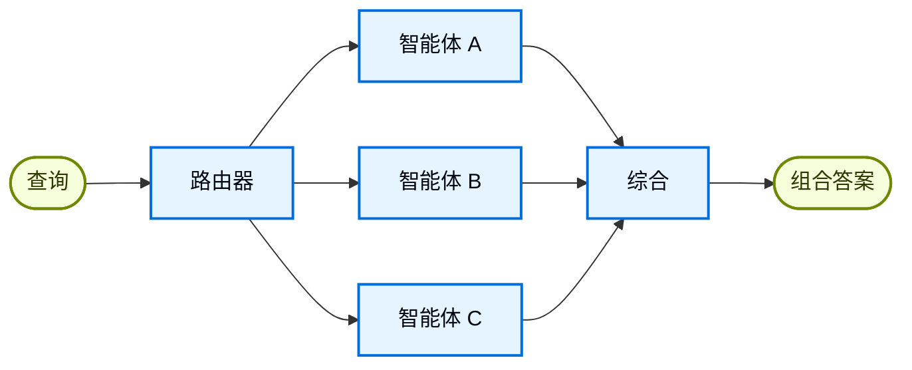

在**路由器**架构中，路由步骤对输入进行分类并导向专门的[智能体](/oss/langchain/agents)。当你有不同的**垂直领域**（各自需要自己的智能体的独立知识域）时，这非常有用。



## 关键特征

* 路由器分解查询
* 零个或多个专门的智能体被并行调用
* 结果被综合成连贯的响应

## 何时使用

当你拥有不同的垂直领域（各自需要自己的智能体的独立知识域），需要并行查询多个来源，并且希望将结果综合成组合响应时，使用路由器模式。

## 基础实现

路由器对查询进行分类并导向合适的智能体。对于单智能体路由使用 [`Command`](/oss/langgraph/graph-api#command)，对于向多个智能体并行分发使用 [`Send`](/oss/langgraph/graph-api#send)。

<Tabs>
<Tab title="单智能体">

使用 `Command` 路由到单个专门的智能体：

:::python
```python
from langgraph.types import Command

def classify_query(query: str) -> str:
    """使用 LLM 对查询进行分类并确定合适的智能体。"""
    # 分类逻辑
    ...

def route_query(state: State) -> Command:
    """基于查询分类路由到合适的智能体。"""
    active_agent = classify_query(state["query"])

    # 路由到选定的智能体
    return Command(goto=active_agent)
```
:::
:::js
```typescript
import { z } from "zod";
import { Command } from "@langchain/langgraph";

const ClassificationResult = z.object({
  query: z.string(),
  agent: z.string(),
});

function classifyQuery(query: string): z.infer<typeof ClassificationResult> {
  // 使用 LLM 对查询进行分类并确定合适的智能体
  // 分类逻辑
  ...
}

function routeQuery(state: z.infer<typeof ClassificationResult>) {
  const classification = classifyQuery(state.query);

  // 路由到选定的智能体
  return new Command({ goto: classification.agent });
}
```
:::

</Tab>
<Tab title="多智能体（并行）">

使用 `Send` 向多个专门的智能体并行分发：

:::python
```python
from typing import TypedDict
from langgraph.types import Send

class ClassificationResult(TypedDict):
    query: str
    agent: str

def classify_query(query: str) -> list[ClassificationResult]:
    """使用 LLM 对查询进行分类并确定要调用的智能体。"""
    # 分类逻辑
    ...

def route_query(state: State):
    """基于查询分类路由到相关智能体。"""
    classifications = classify_query(state["query"])

    # 向选定的智能体并行分发
    return [
        Send(c["agent"], {"query": c["query"]})
        for c in classifications
    ]
```
:::
:::js
```typescript
import { z } from "zod";
import { Command } from "@langchain/langgraph";

const ClassificationResult = z.object({
  query: z.string(),
  agent: z.string(),
});

function classifyQuery(query: string): z.infer<typeof ClassificationResult>[] {
  // 使用 LLM 对查询进行分类并确定合适的智能体
  // 分类逻辑
  ...
}

function routeQuery(state: typeof State.State) {
  const classifications = classifyQuery(state.query);

  // 向选定的智能体并行分发
  return classifications.map(
    (c) => new Send(c.agent, { query: c.query })
  );
}
```
:::

</Tab>
</Tabs>

完整的实现请参见下面的教程。

<Card title="教程：使用路由构建多源知识库" icon="book" href="/oss/langchain/multi-agent/router-knowledge-base">
构建一个并行查询 GitHub、Notion 和 Slack 的路由器，然后将结果综合成连贯的答案。涵盖状态定义、专门的智能体、使用 `Send` 并行执行以及结果综合。
</Card>

## 无状态 vs. 有状态

两种方法：
* [**无状态路由器**](#stateless)独立处理每个请求
* [**有状态路由器**](#stateful)在请求之间维护对话历史

## 无状态

每个请求被独立路由——调用之间没有记忆。对于多轮对话，请参见[有状态路由器](#stateful)。

<Tip>
**路由器 vs. 子智能体**：两种模式都可以将工作分发给多个智能体，但它们的路由决策方式不同：

- **路由器**：一个专门的路由步骤（通常是一个 LLM 调用或基于规则的逻辑），对输入进行分类并分发给智能体。路由器本身通常不维护对话历史或执行多轮编排——它是一个预处理步骤。
- **子智能体**：一个主监督智能体动态地决定在持续的对话中调用哪些[子智能体](/oss/langchain/multi-agent/subagents)。主智能体维护上下文，可以在多轮中调用多个子智能体，并编排复杂的多步骤工作流。

当你拥有清晰的输入类别并想要确定性或轻量级分类时，使用**路由器**。当你需要灵活的、感知对话的编排，由 LLM 根据不断变化的上下文决定下一步做什么时，使用**监督者**。
</Tip>


## 有状态

对于多轮对话，你需要在多次调用间维护上下文。

### 工具包装

最简单的方法：将无状态路由器包装为一个对话智能体可以调用的工具。对话智能体处理记忆和上下文；路由器保持无状态。这避免了在多个并行智能体之间管理对话历史的复杂性。

:::python
```python
@tool
def search_docs(query: str) -> str:
    """跨多个文档源搜索。"""
    result = workflow.invoke({"query": query})  # [!code highlight]
    return result["final_answer"]

# 对话智能体使用路由器作为工具
conversational_agent = create_agent(
    model,
    tools=[search_docs],
    prompt="你是一个有用的助手。使用 search_docs 回答问题。"
)
```
:::
:::js
```typescript
const searchDocs = tool(
  async ({ query }) => {
    const result = await workflow.invoke({ query }); // [!code highlight]
    return result.finalAnswer;
  },
  {
    name: "search_docs",
    description: "Search across multiple documentation sources",
    schema: z.object({
      query: z.string().describe("The search query"),
    }),
  }
);

// 对话智能体使用路由器作为工具
const conversationalAgent = createAgent({
  model,
  tools: [searchDocs],
  systemPrompt: "You are a helpful assistant. Use search_docs to answer questions.",
});
```
:::

### 完整持久化

如果你需要路由器本身维护状态，使用[持久化](/oss/langchain/short-term-memory)来存储消息历史。当路由到智能体时，从状态中获取先前的消息，并有选择地将其包含在智能体的上下文中——这是[上下文工程](/oss/langchain/context-engineering)的一种手段。

<Warning>
**有状态路由器需要自定义历史管理。** 如果路由器在多轮之间切换智能体，当智能体具有不同的语气或提示时，最终用户可能会觉得对话不流畅。使用并行调用时，你需要在路由器级别维护历史（输入和综合输出），并在路由逻辑中利用此历史。请考虑使用[交接模式](/oss/langchain/multi-agent/handoffs)或[子智能体模式](/oss/langchain/multi-agent/subagents)——两者都为多轮对话提供了更清晰的语义。
</Warning>