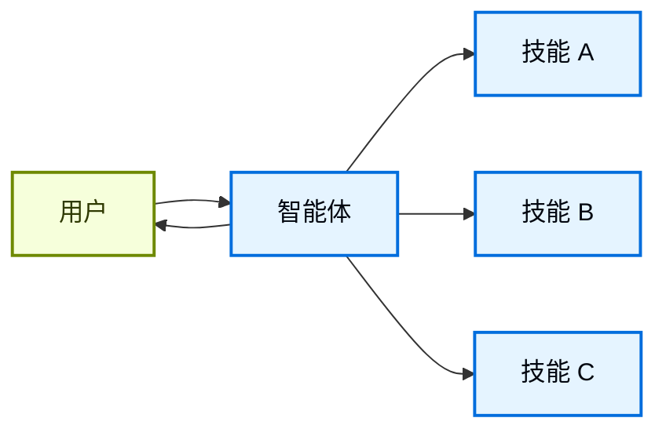

在**技能**架构中，专业化的能力被打包为可调用的"技能"，以增强[智能体](/oss/langchain/agents)的行为。技能主要是提示驱动的专业化，智能体可以按需调用。
如需内置的技能支持，请参阅 [Deep Agents](/oss/deepagents/skills)。

<Tip>
此模式在概念上与 [Agent Skills](https://agentskills.io/) 和 [llms.txt](https://llmstxt.org/)（由 Jeremy Howard 提出）相同，后者使用工具调用来实现文档的渐进式披露。技能模式将渐进式披露应用于专业化的提示词和领域知识，而不仅仅是文档页面。

如需立即可用的技能以提高智能体在 LangChain 生态系统任务上的性能，请参阅 [LangChain Skills](https://github.com/langchain-ai/langchain-skills) 仓库。
</Tip>



## 关键特征

* 提示驱动的专业化：技能主要由专业化的提示词定义
* 渐进式披露：技能根据上下文或用户需求变为可用
* 团队分发：不同团队可以独立开发和维护技能
* 轻量级组合：技能比完整的子智能体更简单
* 资源感知：技能可以引用脚本、模板和其他资源

## 何时使用

当你希望单个[智能体](/oss/langchain/agents)拥有许多可能的专业化能力，不需要在技能之间强制执行特定的约束，或者不同团队需要独立开发能力时，使用技能模式。常见示例包括编码助手（不同语言或任务的技能）、知识库（不同领域的技能）和创意助手（不同格式的技能）。

## 基础实现

:::python
```python
from langchain.tools import tool
from langchain.agents import create_agent

@tool
def load_skill(skill_name: str) -> str:
    """加载专业化的技能提示词。

    可用技能：
    - write_sql: SQL 查询编写专家
    - review_legal_doc: 法律文档审查员

    返回技能的提示词和上下文。
    """
    # 从文件/数据库加载技能内容
    ...

agent = create_agent(
    model="gpt-5.4",
    tools=[load_skill],
    system_prompt=(
        "你是一个有用的助手。"
        "你有两个可用技能："
        "write_sql 和 review_legal_doc。"
        "使用 load_skill 访问它们。"
    ),
)
```
:::
:::js
```typescript
import { tool, createAgent } from "langchain";
import * as z from "zod";

const loadSkill = tool(
  async ({ skillName }) => {
    // 从文件/数据库加载技能内容
    return "";
  },
  {
    name: "load_skill",
    description: `加载专业化的技能。

可用技能：
- write_sql: SQL 查询编写专家
- review_legal_doc: 法律文档审查员

返回技能的提示词和上下文。`,
    schema: z.object({
      skillName: z
        .string()
        .describe("要加载的技能名称")
    })
  }
);

const agent = createAgent({
  model: "gpt-5.4",
  tools: [loadSkill],
  systemPrompt: (
    "你是一个有用的助手。" +
    "你有两个可用技能：" +
    "write_sql 和 review_legal_doc。" +
    "使用 load_skill 访问它们。"
  ),
});
```
:::

完整的实现请参见下面的教程。

<Card
    title="教程：使用按需技能构建 SQL 助手"
    icon="wand"
    href="/oss/langchain/multi-agent/skills-sql-assistant"
    arrow cta="了解更多"
>
    学习如何使用渐进式披露实现技能，智能体按需加载专业化的提示词和模式，而不是提前加载。
</Card>

## 扩展模式

在编写自定义实现时，你可以通过几种方式扩展基础技能模式：

- **动态工具注册**：将渐进式披露与状态管理结合，在技能加载时注册新的[工具](/oss/langchain/tools)。例如，加载"database_admin"技能既可以添加专业化的上下文，也可以注册数据库特定的工具（备份、恢复、迁移）。这使用了在多智能体模式中使用的相同工具和状态机制——工具更新状态以动态改变智能体的能力。

- **层级技能**：技能可以在树状结构中定义其他技能，创建嵌套的专业化。例如，加载"data_science"技能可能会提供子技能，如"pandas_expert"、"visualization"和"statistical_analysis"。每个子技能可以根据需要独立加载，允许对领域知识进行细粒度的渐进式披露。这种层级方法有助于通过将能力组织成逻辑分组来管理大型知识库，这些分组可以被发现并按需加载。

- **资源感知**：虽然每个技能只有一个提示词，但这个提示词可以引用其他资源的位置，并提供智能体何时应使用这些资源的信息。当这些资源变得相关时，智能体将知道这些文件存在，并在需要时将它们读入内存以完成任务。这也遵循了渐进式披露模式，并限制了上下文窗口中的信息量。