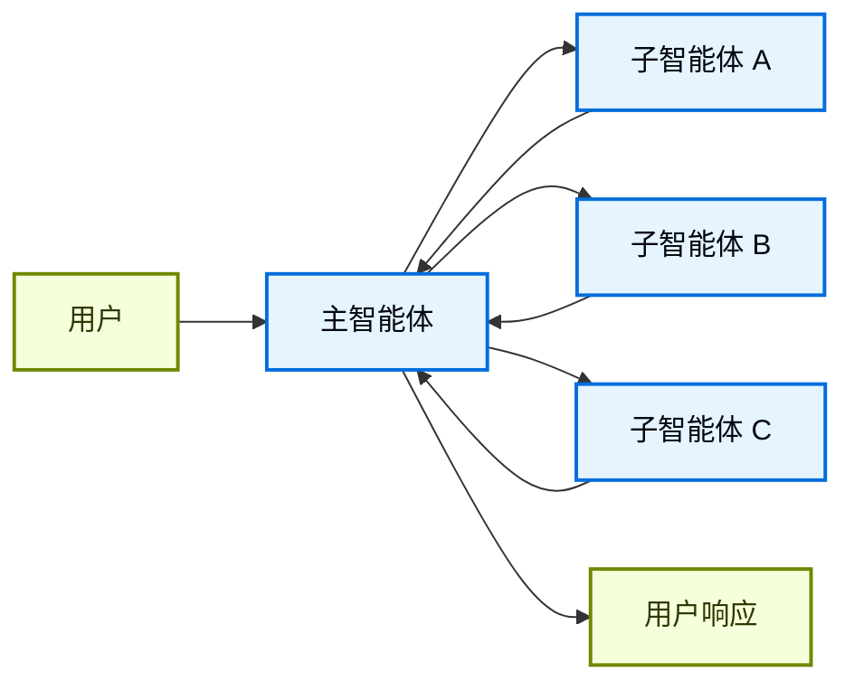
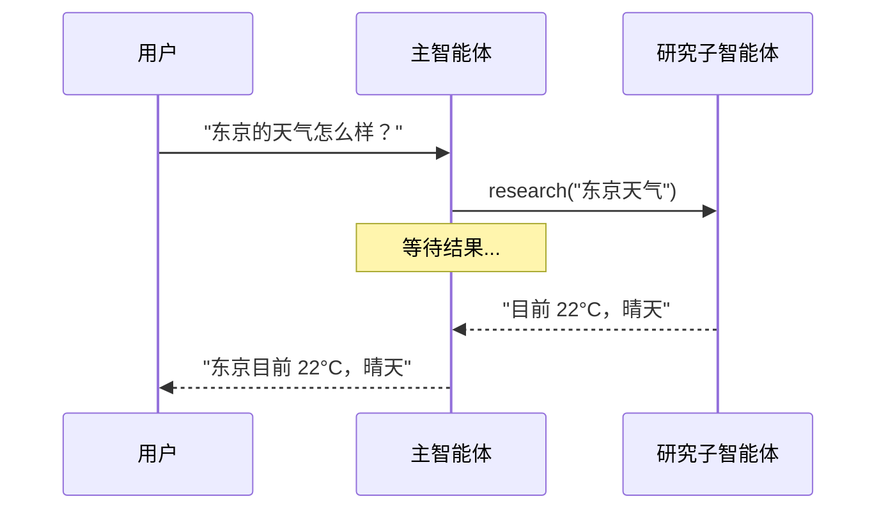
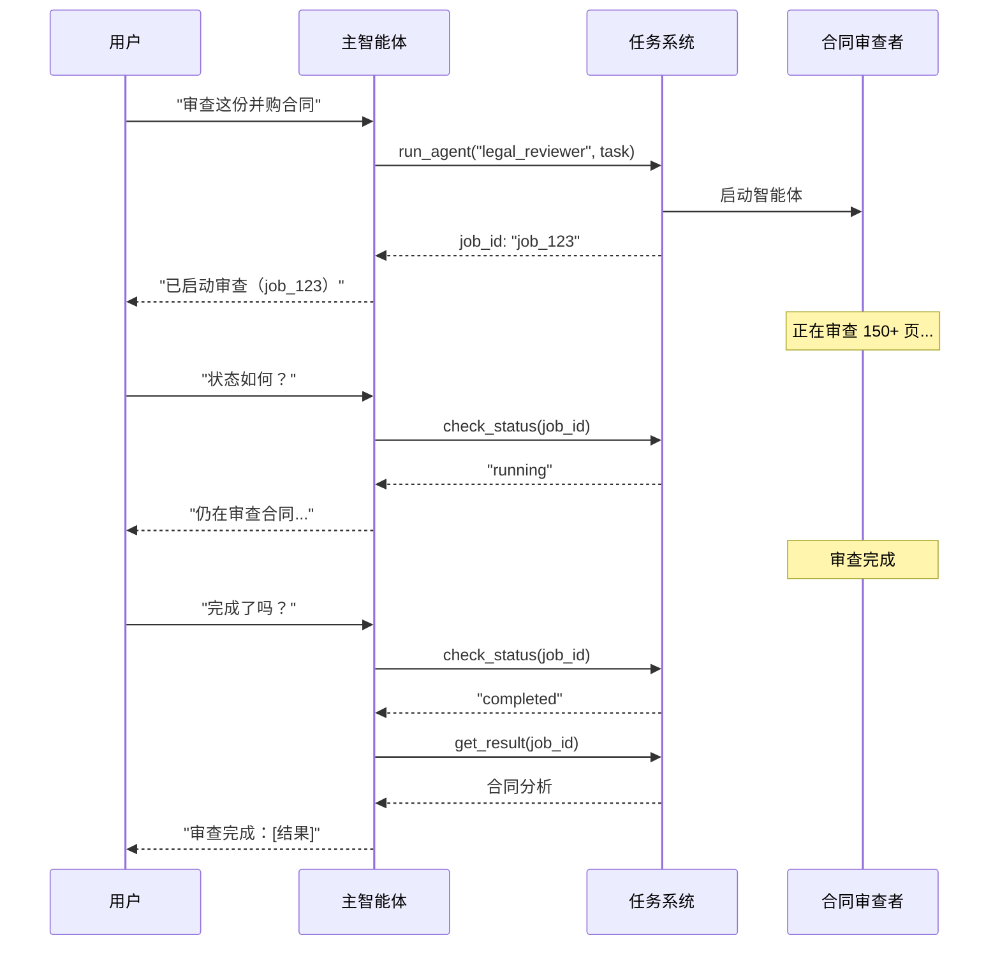
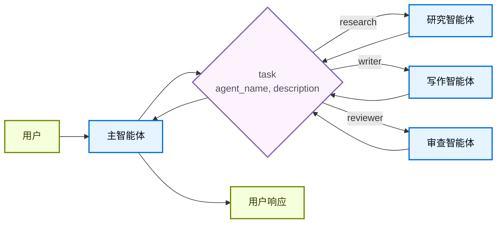

在**子智能体**架构中，中央主[智能体](/oss/langchain/agents)（通常被称为**监督者**）通过将子智能体作为[工具](/oss/langchain/tools)调用来进行协调。主智能体决定调用哪个子智能体、提供什么输入以及如何组合结果。子智能体是无状态的——它们不记住过去的交互，所有对话记忆由主智能体维护。这提供了[上下文](/oss/langchain/context-engineering)隔离：每次子智能体调用都在干净的上下文窗口中工作，防止主对话中的上下文膨胀。

如需内置的子智能体支持，请参阅 [Deep Agents](/oss/deepagents/subagents)。



## 关键特征

* 集中式控制：所有路由都经过主智能体
* 无直接用户交互：子智能体将结果返回给主智能体，而不是用户（但你可以使用子智能体中的 [interrupt](/oss/langgraph/interrupts#pause-using-interrupt) 来允许用户交互）
* 通过工具调用子智能体：子智能体通过工具被调用
* 并行执行：主智能体可以在单个回合中调用多个子智能体

<Note>
**监督者 vs. 路由器**：监督者智能体（本模式）与[路由器](/oss/langchain/multi-agent/router)不同。监督者是一个完整的智能体，维护对话上下文并动态决定在多个回合中调用哪些子智能体。路由器通常是一个单一的分类步骤，将任务分发给智能体，而不维护持续的对话状态。
</Note>

## 何时使用

当你拥有多个不同的领域（如日历、电子邮件、CRM、数据库），子智能体不需要直接与用户对话，或者你想要集中式工作流控制时，使用子智能体模式。对于只有少数几个[工具](/oss/langchain/tools)的简单场景，使用[单一智能体](/oss/langchain/agents)。

<Tip>
**需要在子智能体内与用户交互？** 虽然子智能体通常将结果返回给主智能体而不是直接与用户对话，但你可以在子智能体中使用 [interrupt](/oss/langgraph/interrupts#pause-using-interrupt) 来暂停执行并收集用户输入。当子智能体在继续之前需要澄清或批准时，这非常有用。主智能体仍然是编排者，但子智能体可以在任务执行过程中从用户那里收集信息。
</Tip>

## 基础实现

核心机制是将子智能体包装为主智能体可以调用的工具：

:::python
```python
from langchain.tools import tool
from langchain.agents import create_agent

# 创建子智能体
subagent = create_agent(model="google_genai:gemini-3.5-flash", tools=[...])

# 将其包装为工具
@tool("research", description="研究一个主题并返回结果")
def call_research_agent(query: str):
    result = subagent.invoke({"messages": [{"role": "user", "content": query}]})
    return result["messages"][-1].content

# 主智能体使用子智能体作为工具
main_agent = create_agent(model="google_genai:gemini-3.5-flash", tools=[call_research_agent])
```
:::
:::js
```typescript
import { createAgent, tool } from "langchain";
import { z } from "zod";

// 创建子智能体
const subagent = createAgent({ model: "google_genai:gemini-3.5-flash", tools: [...] });

// 将其包装为工具
const callResearchAgent = tool(
  async ({ query }) => {
    const result = await subagent.invoke({
      messages: [{ role: "user", content: query }]
    });
    return result.messages.at(-1)?.content;
  },
  {
    name: "research",
    description: "Research a topic and return findings",
    schema: z.object({ query: z.string() })
  }
);

// 主智能体使用子智能体作为工具
const mainAgent = createAgent({ model: "google_genai:gemini-3.5-flash", tools: [callResearchAgent] });
```
:::

<Card
    title="教程：使用子智能体构建个人助手"
    icon="sitemap"
    href="/oss/langchain/multi-agent/subagents-personal-assistant"
    arrow cta="了解更多"
>
    学习如何使用子智能体模式构建个人助手，其中中央主智能体（监督者）协调专门的工作智能体。
</Card>

## 设计决策

在实现子智能体模式时，你需要做出几个关键的设计选择。下表总结了各个选项——每个选项在下面的章节中都有详细说明。

| 决策 | 选项 |
|----------|---------|
| [**同步 vs. 异步**](#sync-vs-async) | 同步（阻塞）vs. 异步（后台） |
| [**工具模式**](#tool-patterns) | 每个智能体一个工具 vs. 单一调度工具 |
| [**子智能体规格**](#subagent-specs) | 系统提示枚举 vs. 枚举约束 vs. 基于工具发现（仅限单一调度工具） |
| [**子智能体输入**](#subagent-inputs) | 仅查询 vs. 完整上下文 |
| [**子智能体输出**](#subagent-outputs) | 子智能体结果 vs. 完整对话历史 |

## 同步 vs. 异步

子智能体执行可以是**同步的**（阻塞）或**异步的**（后台）。你的选择取决于主智能体是否需要结果才能继续。

| 模式 | 主智能体行为 | 最适合 | 权衡 |
|------|---------------------|----------|----------|
| **同步** | 等待子智能体完成 | 主智能体需要结果才能继续 | 简单，但会阻塞对话 |
| **异步** | 在子智能体后台运行时继续 | 独立任务，用户不应等待 | 响应式，但更复杂 |

<Tip>
不要与 Python 的 `async`/`await` 混淆。这里的"异步"意味着主智能体启动一个后台任务（通常在单独的进程或服务中）并在不阻塞的情况下继续。
</Tip>

### 同步（默认）

默认情况下，子智能体调用是**同步的**：主智能体等待每个子智能体完成后才继续。当主智能体的下一步操作依赖于子智能体的结果时，使用同步。



**何时使用同步：**
- 主智能体需要子智能体的结果才能制定响应
- 任务有顺序依赖关系（例如，获取数据 → 分析 → 响应）
- 子智能体失败应阻止主智能体的响应

**权衡：**
- 实现简单——只需调用并等待
- 在所有子智能体完成之前，用户看不到响应
- 长时间运行的任务会冻结对话

### 异步

当子智能体的工作是独立的——主智能体不需要结果也能继续与用户对话时，使用**异步执行**。主智能体启动一个后台任务并保持响应式。



**何时使用异步：**
- 子智能体的工作独立于主对话流程
- 用户应该能够在后台工作继续的同时继续聊天
- 你想要并行运行多个独立任务

**三工具模式：**
1. **启动任务**：启动后台任务，返回一个任务 ID
2. **检查状态**：返回当前状态（待处理、运行中、已完成、失败）
3. **获取结果**：检索已完成的结果

**处理任务完成：** 当任务完成时，你的应用程序需要通知用户。一种方法是：显示一个通知，点击后发送一条 `HumanMessage`，内容类似于"检查 job_123 并总结结果。"

## 工具模式

有两种主要方式将子智能体暴露为工具：

| 模式 | 最适合 | 权衡 |
|---------|----------|-----------|
| [**每个智能体一个工具**](#tool-per-agent) | 对每个子智能体的输入/输出进行细粒度控制 | 更多设置，但更多定制化 |
| [**单一调度工具**](#single-dispatch-tool) | 许多智能体、分布式团队、约定优于配置 | 更简单的组合，每个智能体定制化较少 |

### 每个智能体一个工具


关键思想是将子智能体包装为主智能体可以调用的工具：

:::python
```python
from langchain.tools import tool
from langchain.agents import create_agent

# 创建子智能体
subagent = create_agent(model="...", tools=[...])  # [!code highlight]

# 将其包装为工具  # [!code highlight]
@tool("subagent_name", description="subagent_description")  # [!code highlight]
def call_subagent(query: str):  # [!code highlight]
    result = subagent.invoke({"messages": [{"role": "user", "content": query}]})
    return result["messages"][-1].content

# 主智能体使用子智能体作为工具  # [!code highlight]
main_agent = create_agent(model="...", tools=[call_subagent])  # [!code highlight]
```
:::
:::js
```typescript
import { createAgent, tool } from "langchain";
import * as z from "zod";

// 创建子智能体
const subagent = createAgent({...});  // [!code highlight]

// 将其包装为工具  // [!code highlight]
const callSubagent = tool(  // [!code highlight]
  async ({ query }) => {  // [!code highlight]
    const result = await subagent.invoke({
      messages: [{ role: "user", content: query }]
    });
    return result.messages.at(-1)?.text;
  },
  {
    name: "subagent_name",
    description: "subagent_description",
    schema: z.object({
      query: z.string().describe("发送给子智能体的查询")
    })
  }
);

// 主智能体使用子智能体作为工具  // [!code highlight]
const mainAgent = createAgent({ model, tools: [callSubagent] });  // [!code highlight]
```
:::

当主智能体判定任务与子智能体的描述匹配时，它会调用子智能体工具，接收结果，然后继续编排。参见[上下文工程](#context-engineering)以获得细粒度控制。

### 单一调度工具

另一种方法是使用一个单一参数化工具来调用临时子智能体处理独立任务。与[每个智能体一个工具](#tool-per-agent)方法不同（其中每个子智能体被包装为单独的工具），这种方法使用基于约定的单一 `task` 工具：任务描述作为人类消息传递给子智能体，子智能体的最终消息作为工具结果返回。

当你希望将智能体开发分发到多个团队、需要将复杂任务隔离到单独的上下文窗口中、需要一种可扩展的方式来添加新智能体而无需修改协调器、或者更喜欢约定而非定制化时，使用此方法。这种方法以上下文工程中的灵活性换取智能体组合的简单性和强上下文隔离。



**关键特征：**

* 单一任务工具：一个参数化工具，可以按名称调用任何已注册的子智能体
* 基于约定的调用：按名称选择智能体，任务作为人类消息传递，最终消息作为工具结果返回
* 团队分发：不同团队可以独立开发和部署智能体
* 智能体发现：子智能体可以通过系统提示（列出可用的智能体）或通过[渐进式披露](/oss/langchain/multi-agent/skills-sql-assistant)（通过工具按需加载智能体信息）被发现

<Tip>
这种方法的一个有趣方面是，子智能体可能与主智能体具有完全相同的能力。在这种情况下，调用子智能体**实际上主要是为了上下文隔离**——允许复杂的多步骤任务在隔离的上下文窗口中运行，而不会膨胀主智能体的对话历史。子智能体自主完成工作，只返回简洁的摘要，使主线程保持专注和高效。
</Tip>

<Accordion title="带有任务调度器的智能体注册表">

:::python
```python
from langchain.tools import tool
from langchain.agents import create_agent

# 由不同团队开发的子智能体
research_agent = create_agent(
    model="gpt-5.4",
    prompt="You are a research specialist..."
)

writer_agent = create_agent(
    model="gpt-5.4",
    prompt="You are a writing specialist..."
)

# 可用子智能体的注册表
SUBAGENTS = {
    "research": research_agent,
    "writer": writer_agent,
}

@tool
def task(
    agent_name: str,
    description: str
) -> str:
    """为一个任务启动临时子智能体。

    可用智能体：
    - research: 研究和事实查找
    - writer: 内容创建和编辑
    """
    agent = SUBAGENTS[agent_name]
    result = agent.invoke({
        "messages": [
            {"role": "user", "content": description}
        ]
    })
    return result["messages"][-1].content

# 主协调智能体
main_agent = create_agent(
    model="gpt-5.4",
    tools=[task],
    system_prompt=(
        "你协调专业化的子智能体。"
        "可用：research（事实查找），"
        "writer（内容创建）。"
        "使用 task 工具委派工作。"
    ),
)
```
:::
:::js
```typescript
import { tool, createAgent } from "langchain";
import * as z from "zod";

// 由不同团队开发的子智能体
const researchAgent = createAgent({
  model: "gpt-5.4",
  prompt: "You are a research specialist...",
});

const writerAgent = createAgent({
  model: "gpt-5.4",
  prompt: "You are a writing specialist...",
});

// 可用子智能体的注册表
const SUBAGENTS = {
  research: researchAgent,
  writer: writerAgent,
};

const task = tool(
  async ({ agentName, description }) => {
    const agent = SUBAGENTS[agentName];
    const result = await agent.invoke({
      messages: [
        { role: "user", content: description }
      ],
    });
    return result.messages.at(-1)?.content;
  },
  {
    name: "task",
    description: `启动临时子智能体。

可用智能体：
- research: 研究和事实查找
- writer: 内容创建和编辑`,
    schema: z.object({
      agentName: z
        .string()
        .describe("要调用的智能体名称"),
      description: z
        .string()
        .describe("任务描述"),
    }),
  }
);

// 主协调智能体
const mainAgent = createAgent({
  model: "gpt-5.4",
  tools: [task],
  prompt: (
    "你协调专业化的子智能体。" +
    "可用：research（事实查找），" +
    "writer（内容创建）。" +
    "使用 task 工具委派工作。"
  ),
});
```
:::

</Accordion>

## 上下文工程

控制主智能体与其子智能体之间的上下文流动：

| 类别 | 目的 | 影响 |
|----------|---------|---------|
| [**子智能体规格**](#subagent-specs) | 确保在应该调用时调用子智能体 | 主智能体路由决策 |
| [**子智能体输入**](#subagent-inputs) | 确保子智能体能够使用优化后的上下文良好执行 | 子智能体性能 |
| [**子智能体输出**](#subagent-outputs) | 确保监督者能够对子智能体结果采取行动 | 主智能体性能 |

另请参阅我们关于智能体[上下文工程](/oss/langchain/context-engineering)的全面指南。

### 子智能体规格

与子智能体关联的**名称**和**描述**是主智能体知道要调用哪些子智能体的主要方式。这些是提示工程的手段——请谨慎选择。

* **名称**：主智能体引用子智能体的方式。保持清晰和以行动为导向（例如，`research_agent`、`code_reviewer`）。
* **描述**：主智能体了解的子智能体能力。具体说明它处理什么任务以及何时使用它。

对于[单一调度工具](#single-dispatch-tool)设计，你还需要向主智能体提供它可以调用的子智能体的信息。
根据智能体数量以及你的注册表是静态还是动态，你可以通过不同方式提供此信息：

| 方法 | 最适合 | 权衡 |
|--------|----------|----------|
| **系统提示枚举** | 小型、静态的智能体列表（< 10 个） | 简单，但智能体变更时需要更新提示 |
| **枚举约束** | 小型、静态的智能体列表（< 10 个） | 类型安全且明确，但智能体变更时需要修改代码 |
| **基于工具发现** | 大型或动态的智能体注册表 | 灵活且可扩展，但增加了复杂性 |

#### 系统提示枚举

在主智能体的系统提示中直接列出可用智能体。主智能体将智能体列表及其描述作为其指令的一部分。

**何时使用：**
- 你有少量固定的智能体集（< 10 个）
- 智能体注册表很少更改
- 你想要最简单的实现

**示例：**
```python
main_agent = create_agent(
    model="...",
    tools=[task],
    system_prompt=(
        "You coordinate specialized sub-agents. "
        "Available agents:\n"
        "- research: Research and fact-finding\n"
        "- writer: Content creation and editing\n"
        "- reviewer: Code and document review\n"
        "Use the task tool to delegate work."
    ),
)
```

#### 调度工具上的枚举约束

在你的调度工具中为 `agent_name` 参数添加枚举约束。这提供了类型安全，并使可用智能体在工具模式中明确显示。

**何时使用：**
- 你有少量固定的智能体集（< 10 个）
- 你想要类型安全和明确的智能体名称
- 你更喜欢基于模式的验证而非基于提示的指导

**示例：**
```python
from enum import Enum

class AgentName(str, Enum):
    RESEARCH = "research"
    WRITER = "writer"
    REVIEWER = "reviewer"

@tool
def task(
    agent_name: AgentName,  # 枚举约束
    description: str
) -> str:
    """为一个任务启动临时子智能体。"""
    # ...
```

#### 基于工具发现

提供一个单独的工具（例如，`list_agents` 或 `search_agents`），主智能体可以调用该工具来按需发现可用的智能体。这实现了渐进式披露并支持动态注册表。

**何时使用：**
- 你有很多智能体（> 10 个）或一个不断增长中的注册表
- 智能体注册表频繁更改或动态变化
- 你想要减少提示大小和 token 使用量
- 不同团队独立管理不同的智能体

**示例：**
```python
@tool
def list_agents(query: str = "") -> str:
    """列出可用的子智能体，可选择按查询过滤。"""
    agents = search_agent_registry(query)
    return format_agent_list(agents)

@tool
def task(agent_name: str, description: str) -> str:
    """为一个任务启动临时子智能体。"""
    # ...

main_agent = create_agent(
    model="...",
    tools=[task, list_agents],
    system_prompt="使用 list_agents 发现可用子智能体，然后使用 task 调用它们。"
)
```

### 子智能体输入

自定义子智能体接收的上下文以执行其任务。添加不适合在静态提示中捕获的输入——完整消息历史、先前结果或任务元数据——通过从智能体的状态中提取。

:::python
```python 子智能体输入示例 可折叠
from langchain.agents import AgentState
from langchain.tools import tool, ToolRuntime

class CustomState(AgentState):
    example_state_key: str

@tool(
    "subagent1_name",
    description="subagent1_description"
)
def call_subagent1(query: str, runtime: ToolRuntime[None, CustomState]):
    # 应用任何必要的逻辑来转换消息为合适的输入
    subagent_input = some_logic(query, runtime.state["messages"])
    result = subagent1.invoke({
        "messages": subagent_input,
        # 你也可以根据需要在此传递其他状态键。
        # 确保同时在主智能体和子智能体的状态模式中定义它们。
        "example_state_key": runtime.state["example_state_key"]
    })
    return result["messages"][-1].content
```
:::
:::js
```typescript 子智能体输入示例 可折叠
import { createAgent, tool, AgentState, ToolMessage } from "langchain";
import { Command } from "@langchain/langgraph";
import * as z from "zod";

// 通过状态将完整对话历史传递给子智能体的示例
const callSubagent1 = tool(
  async ({query}) => {
    const state = getCurrentTaskInput<AgentState>();
    // 应用任何必要的逻辑来转换消息为合适的输入
    const subAgentInput = someLogic(query, state.messages);
    const result = await subagent1.invoke({
      messages: subAgentInput,
      // 你也可以根据需要在此传递其他状态键。
      // 确保同时在主智能体和子智能体的状态模式中定义它们。
      exampleStateKey: state.exampleStateKey
    });
    return result.messages.at(-1)?.content;
  },
  {
    name: "subagent1_name",
    description: "subagent1_description",
  }
);
```
:::

### 子智能体输出

自定义主智能体接收到的内容，以便它能做出好的决策。两种策略：

1. **提示子智能体**：明确指定应返回什么。一个常见的失败模式是子智能体执行了工具调用或推理，但没有将结果包含在最终消息中——提醒它监督者只看到最终输出。
2. **在代码中格式化**：在返回之前调整或丰富响应。例如，除了最终文本外，还使用 [`Command`](/oss/langgraph/graph-api#command) 传递特定的状态键。

:::python
```python 子智能体输出示例 可折叠
from typing import Annotated
from langchain.agents import AgentState
from langchain.tools import InjectedToolCallId
from langgraph.types import Command


@tool(
    "subagent1_name",
    description="subagent1_description"
)
def call_subagent1(
    query: str,
    tool_call_id: Annotated[str, InjectedToolCallId],
) -> Command:
    result = subagent1.invoke({
        "messages": [{"role": "user", "content": query}]
    })
    return Command(update={
        # 从子智能体传回额外的状态
        "example_state_key": result["example_state_key"],
        "messages": [
            ToolMessage(
                content=result["messages"][-1].content,
                tool_call_id=tool_call_id
            )
        ]
    })
```
:::
:::js
```typescript 子智能体输出示例 可折叠
import { tool, ToolMessage } from "langchain";
import { Command } from "@langchain/langgraph";
import * as z from "zod";

const callSubagent1 = tool(
  async ({ query }, config) => {
    const result = await subagent1.invoke({
      messages: [{ role: "user", content: query }]
    });

    // 返回 Command 以更新多个状态键
    return new Command({
      update: {
        // 从子智能体传回额外的状态
        exampleStateKey: result.exampleStateKey,
        messages: [
          new ToolMessage({
            content: result.messages.at(-1)?.text,
            tool_call_id: config.toolCall?.id!
          })
        ]
      }
    });
  },
  {
    name: "subagent1_name",
    description: "subagent1_description",
    schema: z.object({
      query: z.string().describe("发送给 subagent1 的查询")
    })
  }
);
```
:::

## 检查点与状态检查

默认情况下，子智能体使用**继承的检查点**模式——每次调用以全新状态开始，支持 [interrupt](/oss/langgraph/interrupts#pause-using-interrupt)，并且可以安全地并行运行。如果你需要子智能体在多次调用间维护其自己的持久对话历史，请使用 `checkpointer=True`（延续模式）编译它。有关模式的完整对比，请参阅[子图持久化](/oss/langgraph/use-subgraphs#subgraph-persistence)。

由于子智能体在工具函数内部被调用，LangGraph 无法[静态发现](/oss/langgraph/use-subgraphs#view-subgraph-state)它们。这意味着带 `subgraphs` 的 [`get_state`](/oss/langgraph/use-subgraphs#view-subgraph-state) 不会返回子智能体的状态。如果你需要读取嵌套图的状态（例如，在 [interrupt](/oss/langgraph/interrupts#pause-using-interrupt) 期间），请改为从[节点函数](/oss/langgraph/use-subgraphs#call-a-subgraph-inside-a-node)中的自定义图中调用子智能体。有关每种模式如何影响状态可见性的详细信息，请参阅[子图持久化](/oss/langgraph/use-subgraphs#subgraph-persistence)。